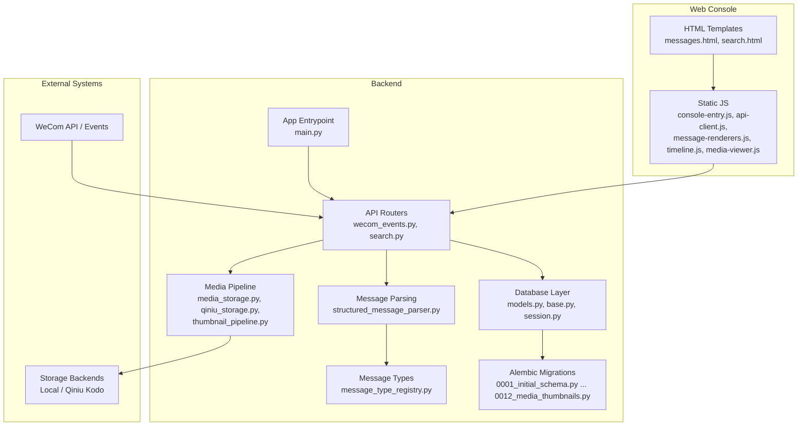
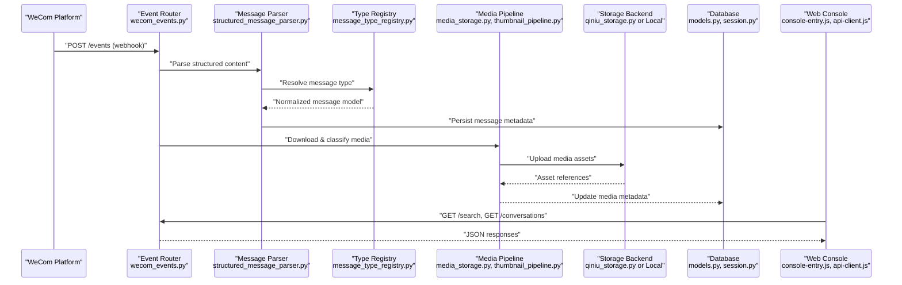
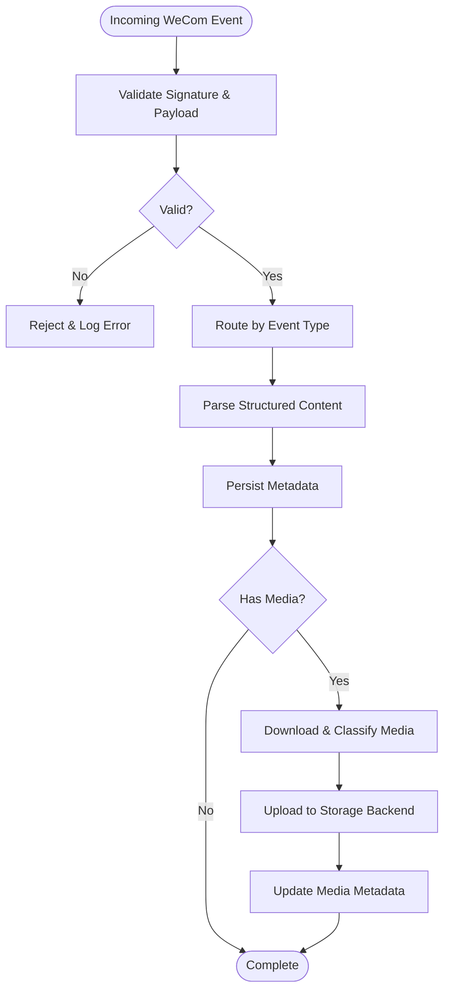
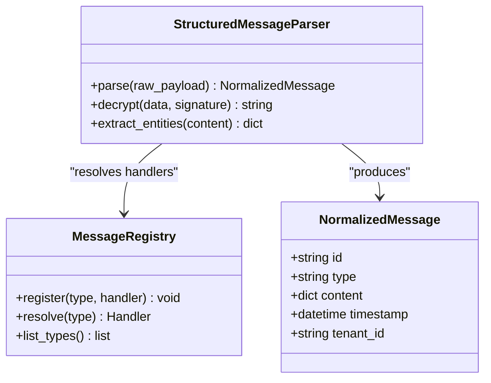
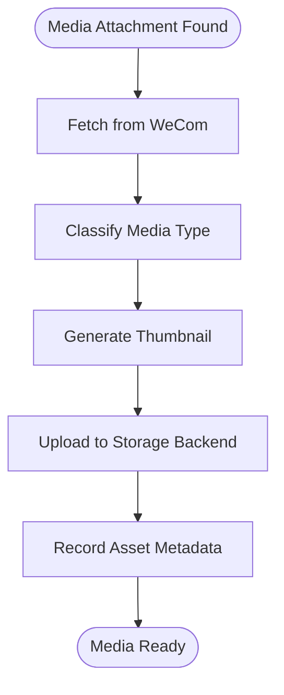
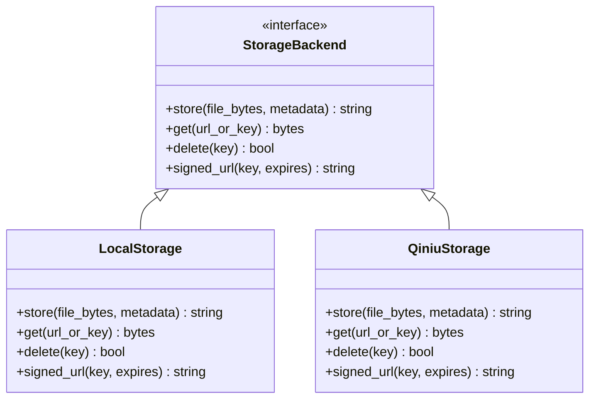
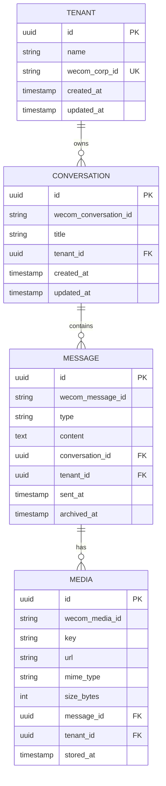
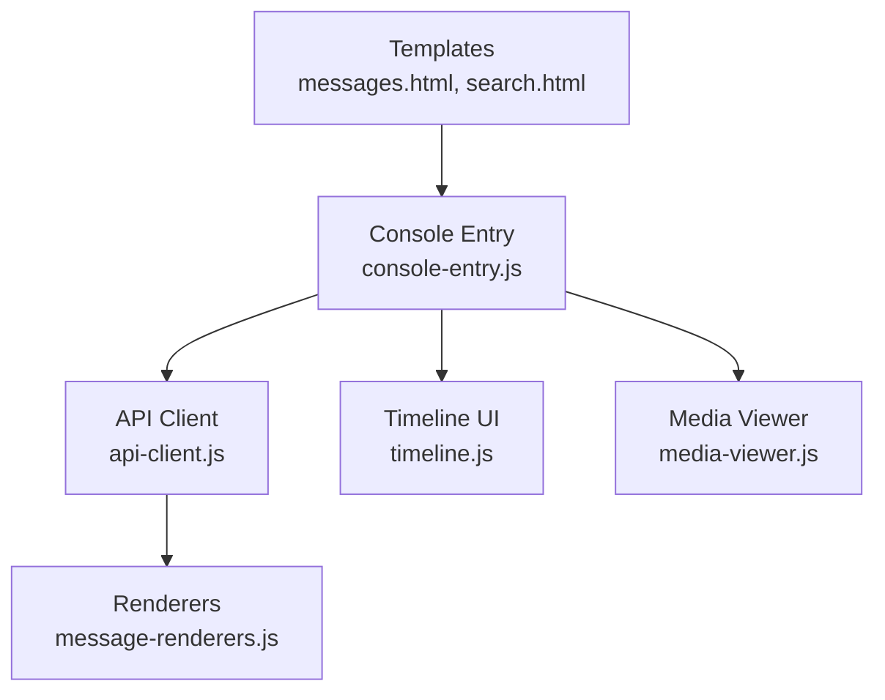
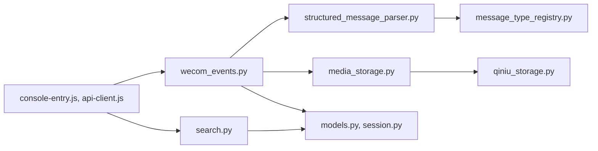

# Project Overview

<cite>
**Referenced Files in This Document**
- [README.md](file://README.md)
- [ARCHITECTURE.md](file://docs/ARCHITECTURE.md)
- [project-overview.md](file://docs/ai/project-overview.md)
- [main.py](file://backend/app/main.py)
- [wecom_events.py](file://backend/app/routers/wecom_events.py)
- [search.py](file://backend/app/routers/search.py)
- [media_storage.py](file://backend/app/media_storage.py)
- [qiniu_storage.py](file://backend/app/qiniu_storage.py)
- [thumbnail_pipeline.py](file://backend/app/thumbnail_pipeline.py)
- [structured_message_parser.py](file://backend/app/structured_message_parser.py)
- [message_type_registry.py](file://backend/app/message_type_registry.py)
- [models.py](file://backend/app/db/models.py)
- [base.py](file://backend/app/db/base.py)
- [session.py](file://backend/app/db/session.py)
- [0001_initial_schema.py](file://backend/alembic/versions/0001_initial_schema.py)
- [0008_structured_message_content.py](file://backend/alembic/versions/0008_structured_message_content.py)
- [0012_media_thumbnails.py](file://backend/alembic/versions/0012_media_thumbnails.py)
- [messages.html](file://backend/app/web/templates/messages.html)
- [search.html](file://backend/app/web/templates/search.html)
- [console-entry.js](file://backend/app/web/static/console/console-entry.js)
- [api-client.js](file://backend/app/web/static/console/api-client.js)
- [message-renderers.js](file://backend/app/web/static/console/message-renderers.js)
- [timeline.js](file://backend/app/web/static/console/timeline.js)
- [media-viewer.js](file://backend/app/web/static/console/media-viewer.js)
- [deploy.yml](file://.github/workflows/deploy.yml)
- [wecom-archive-worker.service](file://deploy/systemd/wecom-archive-worker.service)
- [wecom-archive-media-download.service](file://deploy/systemd/wecom-archive-media-download.service)
</cite>

## Table of Contents
1. Introduction
2. Project Structure
3. Core Components
4. Architecture Overview
5. Detailed Component Analysis
6. Dependency Analysis
7. Performance Considerations
8. Troubleshooting Guide
9. Conclusion

## Introduction
WeCom Archive 365 is an enterprise-grade WeChat Work (WeCom) message archiving and audit solution. It ingests messages from the WeCom platform, normalizes and stores them with rich metadata, provides powerful search and review capabilities, and supports compliance auditing, legal hold, and regulatory retention requirements. The system integrates with WeCom via its APIs, processes structured message content, manages media assets across storage backends, and exposes a web-based console for administrators to monitor, search, and review conversations at scale.

Key objectives:
- Message synchronization from WeCom into a persistent, queryable store
- Media download, classification, thumbnail generation, and secure storage
- Search and timeline interfaces for fast discovery and review
- Compliance-ready features including revocation handling, tenant isolation, and audit trails
- Extensible architecture supporting multiple storage backends and future integrations

**Section sources**
- [README.md](file://README.md)
- [project-overview.md](file://docs/ai/project-overview.md)

## Project Structure
The project follows a modular backend-first design with clear separation between API endpoints, processing pipelines, data models, and web templates/assets. Key areas include:
- Backend application entrypoint and routing
- WeCom event ingestion and SDK integration
- Message parsing and type registry
- Media pipeline (download, classification, thumbnails)
- Storage abstraction and provider implementations
- Database schema migrations and session management
- Web templates and static assets for the admin console
- Deployment automation and systemd services

**Diagram sources**
- [main.py](file://backend/app/main.py)
- [wecom_events.py](file://backend/app/routers/wecom_events.py)
- [search.py](file://backend/app/routers/search.py)
- [structured_message_parser.py](file://backend/app/structured_message_parser.py)
- [message_type_registry.py](file://backend/app/message_type_registry.py)
- [media_storage.py](file://backend/app/media_storage.py)
- [qiniu_storage.py](file://backend/app/qiniu_storage.py)
- [thumbnail_pipeline.py](file://backend/app/thumbnail_pipeline.py)
- [models.py](file://backend/app/db/models.py)
- [base.py](file://backend/app/db/base.py)
- [session.py](file://backend/app/db/session.py)
- [0001_initial_schema.py](file://backend/alembic/versions/0001_initial_schema.py)
- [0008_structured_message_content.py](file://backend/alembic/versions/0008_structured_message_content.py)
- [0012_media_thumbnails.py](file://backend/alembic/versions/0012_media_thumbnails.py)
- [messages.html](file://backend/app/web/templates/messages.html)
- [search.html](file://backend/app/web/templates/search.html)
- [console-entry.js](file://backend/app/web/static/console/console-entry.js)
- [api-client.js](file://backend/app/web/static/console/api-client.js)
- [message-renderers.js](file://backend/app/web/static/console/message-renderers.js)
- [timeline.js](file://backend/app/web/static/console/timeline.js)
- [media-viewer.js](file://backend/app/web/static/console/media-viewer.js)

**Section sources**
- [ARCHITECTURE.md](file://docs/ARCHITECTURE.md)
- [main.py](file://backend/app/main.py)
- [wecom_events.py](file://backend/app/routers/wecom_events.py)
- [search.py](file://backend/app/routers/search.py)
- [media_storage.py](file://backend/app/media_storage.py)
- [qiniu_storage.py](file://backend/app/qiniu_storage.py)
- [thumbnail_pipeline.py](file://backend/app/thumbnail_pipeline.py)
- [structured_message_parser.py](file://backend/app/structured_message_parser.py)
- [message_type_registry.py](file://backend/app/message_type_registry.py)
- [models.py](file://backend/app/db/models.py)
- [base.py](file://backend/app/db/base.py)
- [session.py](file://backend/app/db/session.py)
- [0001_initial_schema.py](file://backend/alembic/versions/0001_initial_schema.py)
- [0008_structured_message_content.py](file://backend/alembic/versions/0008_structured_message_content.py)
- [0012_media_thumbnails.py](file://backend/alembic/versions/0012_media_thumbnails.py)
- [messages.html](file://backend/app/web/templates/messages.html)
- [search.html](file://backend/app/web/templates/search.html)
- [console-entry.js](file://backend/app/web/static/console/console-entry.js)
- [api-client.js](file://backend/app/web/static/console/api-client.js)
- [message-renderers.js](file://backend/app/web/static/console/message-renderers.js)
- [timeline.js](file://backend/app/web/static/console/timeline.js)
- [media-viewer.js](file://backend/app/web/static/console/media-viewer.js)

## Core Components
- WeCom Event Ingestion: Receives webhook events from WeCom, validates payloads, and routes them into the processing pipeline.
- Message Processing: Parses structured message content, maps types via a registry, and persists normalized records.
- Media Pipeline: Downloads media attachments, classifies content, generates thumbnails, and stores assets using pluggable backends.
- Storage Abstraction: Provides a unified interface for local filesystem and object storage providers (e.g., Qiniu Kodo).
- Database Layer: Manages sessions, models, and schema migrations for tenants, conversations, messages, and media metadata.
- Web Console: Renders conversation lists, timelines, search results, and media viewers; communicates with backend APIs via client-side modules.

**Section sources**
- [wecom_events.py](file://backend/app/routers/wecom_events.py)
- [structured_message_parser.py](file://backend/app/structured_message_parser.py)
- [message_type_registry.py](file://backend/app/message_type_registry.py)
- [media_storage.py](file://backend/app/media_storage.py)
- [qiniu_storage.py](file://backend/app/qiniu_storage.py)
- [thumbnail_pipeline.py](file://backend/app/thumbnail_pipeline.py)
- [models.py](file://backend/app/db/models.py)
- [base.py](file://backend/app/db/base.py)
- [session.py](file://backend/app/db/session.py)
- [messages.html](file://backend/app/web/templates/messages.html)
- [search.html](file://backend/app/web/templates/search.html)
- [console-entry.js](file://backend/app/web/static/console/console-entry.js)
- [api-client.js](file://backend/app/web/static/console/api-client.js)
- [message-renderers.js](file://backend/app/web/static/console/message-renderers.js)
- [timeline.js](file://backend/app/web/static/console/timeline.js)
- [media-viewer.js](file://backend/app/web/static/console/media-viewer.js)

## Architecture Overview
The system integrates with WeCom through event-driven ingestion, processes messages into structured forms, and persists them alongside media assets. Administrators interact via a web console that queries the backend APIs for search, timeline, and media viewing.

**Diagram sources**
- [wecom_events.py](file://backend/app/routers/wecom_events.py)
- [structured_message_parser.py](file://backend/app/structured_message_parser.py)
- [message_type_registry.py](file://backend/app/message_type_registry.py)
- [media_storage.py](file://backend/app/media_storage.py)
- [thumbnail_pipeline.py](file://backend/app/thumbnail_pipeline.py)
- [qiniu_storage.py](file://backend/app/qiniu_storage.py)
- [models.py](file://backend/app/db/models.py)
- [session.py](file://backend/app/db/session.py)
- [console-entry.js](file://backend/app/web/static/console/console-entry.js)
- [api-client.js](file://backend/app/web/static/console/api-client.js)

## Detailed Component Analysis

### WeCom Event Ingestion and Routing
- Receives webhook events from WeCom and validates signatures and payloads.
- Routes events to appropriate handlers based on event type and tenant context.
- Coordinates with the parser and media pipeline to ensure consistent state updates.

**Diagram sources**
- [wecom_events.py](file://backend/app/routers/wecom_events.py)
- [structured_message_parser.py](file://backend/app/structured_message_parser.py)
- [media_storage.py](file://backend/app/media_storage.py)
- [qiniu_storage.py](file://backend/app/qiniu_storage.py)

**Section sources**
- [wecom_events.py](file://backend/app/routers/wecom_events.py)

### Message Parsing and Type Registry
- Normalizes diverse message formats into a unified structure.
- Uses a registry to map raw message types to handlers and renderers.
- Supports rich content decryption and structured content extraction.

**Diagram sources**
- [structured_message_parser.py](file://backend/app/structured_message_parser.py)
- [message_type_registry.py](file://backend/app/message_type_registry.py)

**Section sources**
- [structured_message_parser.py](file://backend/app/structured_message_parser.py)
- [message_type_registry.py](file://backend/app/message_type_registry.py)

### Media Pipeline and Thumbnails
- Downloads media attachments referenced in messages.
- Classifies media types and generates thumbnails for efficient browsing.
- Stores assets using a pluggable backend abstraction.

**Diagram sources**
- [media_storage.py](file://backend/app/media_storage.py)
- [thumbnail_pipeline.py](file://backend/app/thumbnail_pipeline.py)
- [qiniu_storage.py](file://backend/app/qiniu_storage.py)

**Section sources**
- [media_storage.py](file://backend/app/media_storage.py)
- [thumbnail_pipeline.py](file://backend/app/thumbnail_pipeline.py)
- [qiniu_storage.py](file://backend/app/qiniu_storage.py)

### Storage Abstraction and Providers
- Defines a common interface for storing and retrieving media assets.
- Implements concrete providers for local filesystem and Qiniu Kodo.
- Ensures tenant-scoped access and secure URL generation.

**Diagram sources**
- [media_storage.py](file://backend/app/media_storage.py)
- [qiniu_storage.py](file://backend/app/qiniu_storage.py)

**Section sources**
- [media_storage.py](file://backend/app/media_storage.py)
- [qiniu_storage.py](file://backend/app/qiniu_storage.py)

### Database Models and Migrations
- Centralized models define entities such as tenants, conversations, messages, and media.
- Alembic migrations evolve the schema over time, ensuring data integrity and backward compatibility.
- Session management abstracts database connectivity and transaction handling.

**Diagram sources**
- [models.py](file://backend/app/db/models.py)
- [0001_initial_schema.py](file://backend/alembic/versions/0001_initial_schema.py)
- [0008_structured_message_content.py](file://backend/alembic/versions/0008_structured_message_content.py)
- [0012_media_thumbnails.py](file://backend/alembic/versions/0012_media_thumbnails.py)

**Section sources**
- [models.py](file://backend/app/db/models.py)
- [base.py](file://backend/app/db/base.py)
- [session.py](file://backend/app/db/session.py)
- [0001_initial_schema.py](file://backend/alembic/versions/0001_initial_schema.py)
- [0008_structured_message_content.py](file://backend/alembic/versions/0008_structured_message_content.py)
- [0012_media_thumbnails.py](file://backend/alembic/versions/0012_media_thumbnails.py)

### Web Console and Client-Side Integration
- HTML templates render conversation lists, timelines, and search pages.
- JavaScript modules handle API calls, rendering, and user interactions.
- The console supports real-time refresh, filtering, and media viewing.

**Diagram sources**
- [messages.html](file://backend/app/web/templates/messages.html)
- [search.html](file://backend/app/web/templates/search.html)
- [console-entry.js](file://backend/app/web/static/console/console-entry.js)
- [api-client.js](file://backend/app/web/static/console/api-client.js)
- [message-renderers.js](file://backend/app/web/static/console/message-renderers.js)
- [timeline.js](file://backend/app/web/static/console/timeline.js)
- [media-viewer.js](file://backend/app/web/static/console/media-viewer.js)

**Section sources**
- [messages.html](file://backend/app/web/templates/messages.html)
- [search.html](file://backend/app/web/templates/search.html)
- [console-entry.js](file://backend/app/web/static/console/console-entry.js)
- [api-client.js](file://backend/app/web/static/console/api-client.js)
- [message-renderers.js](file://backend/app/web/static/console/message-renderers.js)
- [timeline.js](file://backend/app/web/static/console/timeline.js)
- [media-viewer.js](file://backend/app/web/static/console/media-viewer.js)

## Dependency Analysis
The backend orchestrates multiple subsystems with clear boundaries:
- Routers depend on parsers, registries, and storage abstractions.
- Storage providers implement a common interface for pluggability.
- Database layer is isolated behind models and session management.
- Web console depends on API endpoints and renders dynamic content.

**Diagram sources**
- [wecom_events.py](file://backend/app/routers/wecom_events.py)
- [structured_message_parser.py](file://backend/app/structured_message_parser.py)
- [media_storage.py](file://backend/app/media_storage.py)
- [qiniu_storage.py](file://backend/app/qiniu_storage.py)
- [message_type_registry.py](file://backend/app/message_type_registry.py)
- [models.py](file://backend/app/db/models.py)
- [session.py](file://backend/app/db/session.py)
- [search.py](file://backend/app/routers/search.py)
- [console-entry.js](file://backend/app/web/static/console/console-entry.js)
- [api-client.js](file://backend/app/web/static/console/api-client.js)

**Section sources**
- [wecom_events.py](file://backend/app/routers/wecom_events.py)
- [structured_message_parser.py](file://backend/app/structured_message_parser.py)
- [media_storage.py](file://backend/app/media_storage.py)
- [qiniu_storage.py](file://backend/app/qiniu_storage.py)
- [message_type_registry.py](file://backend/app/message_type_registry.py)
- [models.py](file://backend/app/db/models.py)
- [session.py](file://backend/app/db/session.py)
- [search.py](file://backend/app/routers/search.py)
- [console-entry.js](file://backend/app/web/static/console/console-entry.js)
- [api-client.js](file://backend/app/web/static/console/api-client.js)

## Performance Considerations
- Asynchronous processing for media downloads and thumbnail generation to avoid blocking request paths.
- Efficient pagination and filtering in search endpoints to handle large datasets.
- Caching strategies for frequently accessed metadata and signed URLs.
- Tenant-scoped queries to minimize cross-tenant overhead and improve isolation.
- Optimized storage operations with chunked uploads and resumable transfers where applicable.

[No sources needed since this section provides general guidance]

## Troubleshooting Guide
Common issues and resolutions:
- WeCom webhook validation failures: Verify signature algorithms and payload formats.
- Media download errors: Check network reachability and credentials for storage backends.
- Thumbnail generation failures: Ensure image libraries are installed and supported formats are handled.
- Database migration conflicts: Align Alembic heads with deployed schema versions.
- Web console loading issues: Inspect browser console logs and verify API endpoint availability.

Operational aids:
- Health and readiness endpoints for service monitoring.
- Systemd timers and services for scheduled workers and media downloads.
- CI/CD pipeline for automated deployments and validations.

**Section sources**
- [wecom-events.py](file://backend/app/routers/wecom_events.py)
- [media_storage.py](file://backend/app/media_storage.py)
- [thumbnail_pipeline.py](file://backend/app/thumbnail_pipeline.py)
- [0001_initial_schema.py](file://backend/alembic/versions/0001_initial_schema.py)
- [wecom-archive-worker.service](file://deploy/systemd/wecom-archive-worker.service)
- [wecom-archive-media-download.service](file://deploy/systemd/wecom-archive-media-download.service)
- [deploy.yml](file://.github/workflows/deploy.yml)

## Conclusion
WeCom Archive 365 delivers a robust, extensible platform for WeCom message archiving and compliance auditing. Its architecture cleanly separates ingestion, processing, storage, and presentation layers while providing strong tenant isolation and auditability. By integrating seamlessly with WeCom APIs and supporting flexible storage backends, it meets enterprise needs for communication monitoring, legal hold, and regulatory retention. The web console offers intuitive tools for administrators to search, review, and manage archived communications effectively.

[No sources needed since this section summarizes without analyzing specific files]