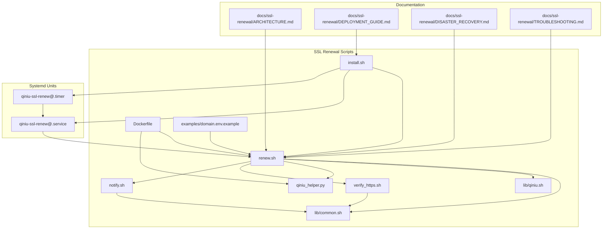
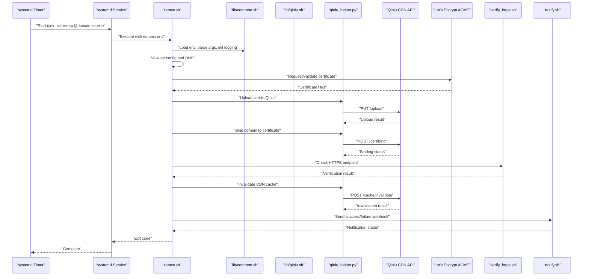
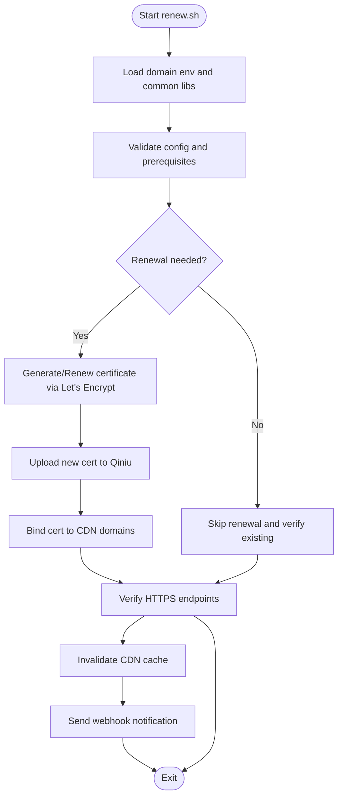
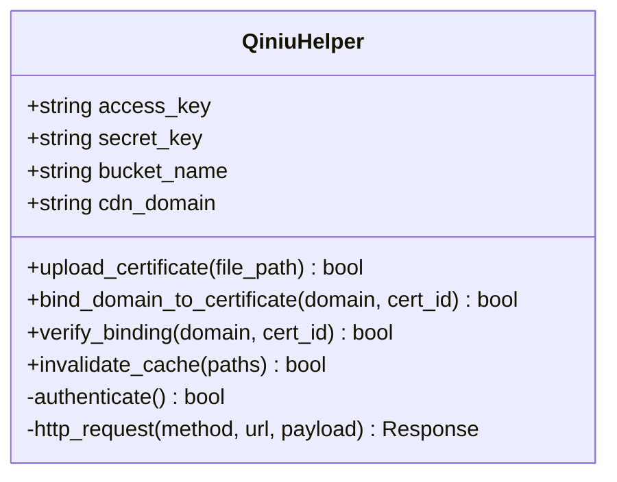
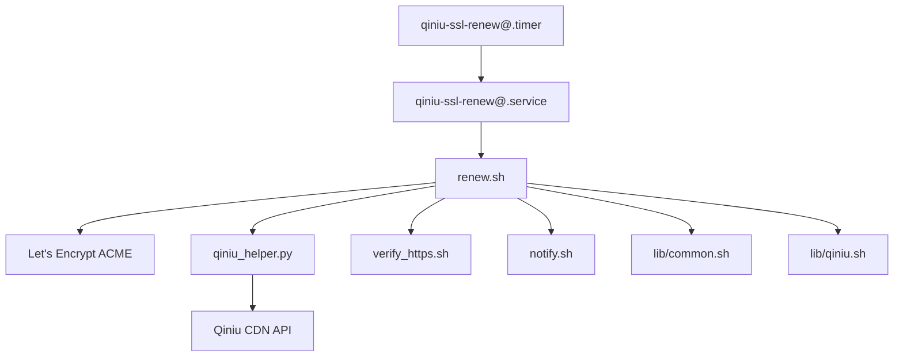

# SSL Certificate Renewal System

<cite>
**Referenced Files in This Document**
- [renew.sh](file://ssl-renew/renew.sh)
- [qiniu_helper.py](file://ssl-renew/qiniu_helper.py)
- [notify.sh](file://ssl-renew/notify.sh)
- [verify_https.sh](file://ssl-renew/verify_https.sh)
- [common.sh](file://ssl-renew/lib/common.sh)
- [qiniu.sh](file://ssl-renew/lib/qiniu.sh)
- [install.sh](file://ssl-renew/install.sh)
- [Dockerfile](file://ssl-renew/Dockerfile)
- [README.md](file://ssl-renew/README.md)
- [domain.env.example](file://ssl-renew/examples/domain.env.example)
- [qiniu-ssl-renew@.service](file://deploy/systemd/qiniu-ssl-renew@.service)
- [qiniu-ssl-renew@.timer](file://deploy/systemd/qiniu-ssl-renew@.timer)
- [ARCHITECTURE.md](file://docs/ssl-renewal/ARCHITECTURE.md)
- [DEPLOYMENT_GUIDE.md](file://docs/ssl-renewal/DEPLOYMENT_GUIDE.md)
- [DISASTER_RECOVERY.md](file://docs/ssl-renewal/DISASTER_RECOVERY.md)
- [TROUBLESHOOTING.md](file://docs/ssl-renewal/TROUBLESHOOTING.md)
</cite>

## Table of Contents
1. [Introduction](#introduction)
2. [Project Structure](#project-structure)
3. [Core Components](#core-components)
4. [Architecture Overview](#architecture-overview)
5. [Detailed Component Analysis](#detailed-component-analysis)
6. [Dependency Analysis](#dependency-analysis)
7. [Performance Considerations](#performance-considerations)
8. [Troubleshooting Guide](#troubleshooting-guide)
9. [Conclusion](#conclusion)
10. [Appendices](#appendices)

## Introduction
This document explains the automated SSL certificate renewal system that integrates Let’s Encrypt for certificate issuance and Qiniu Cloud CDN for hosting and serving certificates. It covers the end-to-end renewal workflow, configuration for domains and webhooks, systemd timer scheduling, error handling and rollback procedures, monitoring, and troubleshooting across multiple domains.

The system is implemented as a set of shell scripts and a Python helper, orchestrated by systemd units to run on a schedule or on demand. It supports dry-run mode, staging environments, idempotent operations, multi-domain certificates, webhook notifications, and HTTPS verification after updates.

## Project Structure
The SSL renewal subsystem lives under ssl-renew with supporting documentation under docs/ssl-renewal and deployment units under deploy/systemd. Key elements:
- Core scripts: renew.sh, verify_https.sh, notify.sh
- Shared libraries: lib/common.sh, lib/qiniu.sh
- Qiniu integration helper: qiniu_helper.py
- Installation and packaging: install.sh, Dockerfile
- Configuration example: examples/domain.env.example
- Documentation: ARCHITECTURE.md, DEPLOYMENT_GUIDE.md, DISASTER_RECOVERY.md, TROUBLESHOOTING.md
- Systemd units: qiniu-ssl-renew@.service, qiniu-ssl-renew@.timer

**Diagram sources**
- [renew.sh](file://ssl-renew/renew.sh)
- [verify_https.sh](file://ssl-renew/verify_https.sh)
- [notify.sh](file://ssl-renew/notify.sh)
- [common.sh](file://ssl-renew/lib/common.sh)
- [qiniu.sh](file://ssl-renew/lib/qiniu.sh)
- [qiniu_helper.py](file://ssl-renew/qiniu_helper.py)
- [install.sh](file://ssl-renew/install.sh)
- [Dockerfile](file://ssl-renew/Dockerfile)
- [domain.env.example](file://ssl-renew/examples/domain.env.example)
- [qiniu-ssl-renew@.service](file://deploy/systemd/qiniu-ssl-renew@.service)
- [qiniu-ssl-renew@.timer](file://deploy/systemd/qiniu-ssl-renew@.timer)
- [ARCHITECTURE.md](file://docs/ssl-renewal/ARCHITECTURE.md)
- [DEPLOYMENT_GUIDE.md](file://docs/ssl-renewal/DEPLOYMENT_GUIDE.md)
- [DISASTER_RECOVERY.md](file://docs/ssl-renewal/DISASTER_RECOVERY.md)
- [TROUBLESHOOTING.md](file://docs/ssl-renewal/TROUBLESHOOTING.md)

**Section sources**
- [renew.sh](file://ssl-renew/renew.sh)
- [qiniu_helper.py](file://ssl-renew/qiniu_helper.py)
- [notify.sh](file://ssl-renew/notify.sh)
- [verify_https.sh](file://ssl-renew/verify_https.sh)
- [common.sh](file://ssl-renew/lib/common.sh)
- [qiniu.sh](file://ssl-renew/lib/qiniu.sh)
- [install.sh](file://ssl-renew/install.sh)
- [Dockerfile](file://ssl-renew/Dockerfile)
- [README.md](file://ssl-renew/README.md)
- [domain.env.example](file://ssl-renew/examples/domain.env.example)
- [qiniu-ssl-renew@.service](file://deploy/systemd/qiniu-ssl-renew@.service)
- [qiniu-ssl-renew@.timer](file://deploy/systemd/qiniu-ssl-renew@.timer)
- [ARCHITECTURE.md](file://docs/ssl-renewal/ARCHITECTURE.md)
- [DEPLOYMENT_GUIDE.md](file://docs/ssl-renewal/DEPLOYMENT_GUIDE.md)
- [DISASTER_RECOVERY.md](file://docs/ssl-renewal/DISASTER_RECOVERY.md)
- [TROUBLESHOOTING.md](file://docs/ssl-renewal/TROUBLESHOOTING.md)

## Core Components
- renew.sh: Orchestrates the full renewal lifecycle including validation, Let’s Encrypt challenge/response, certificate generation, upload to Qiniu, binding/verification, cache invalidation, and notifications. Supports dry-run and staging modes.
- qiniu_helper.py: Provides programmatic interactions with Qiniu APIs for uploading certificates, binding domains, verifying bindings, and invalidating CDN caches.
- verify_https.sh: Validates that HTTPS endpoints are serving valid certificates post-update.
- notify.sh: Sends webhook notifications on success/failure events.
- lib/common.sh: Shared utilities for logging, argument parsing, environment loading, and error handling.
- lib/qiniu.sh: Qiniu-specific helpers for API calls and credential management.
- install.sh: Installs scripts, sets up systemd units, and configures timers.
- systemd units: qiniu-ssl-renew@.service and qiniu-ssl-renew@.timer enable scheduled and per-domain execution.

Key responsibilities:
- Idempotency: Avoid redundant work if certificates are still valid.
- Multi-domain support: Handle SAN certificates covering multiple hostnames.
- Rollback: Restore previous working state on failure.
- Observability: Structured logs and webhook alerts.

**Section sources**
- [renew.sh](file://ssl-renew/renew.sh)
- [qiniu_helper.py](file://ssl-renew/qiniu_helper.py)
- [verify_https.sh](file://ssl-renew/verify_https.sh)
- [notify.sh](file://ssl-renew/notify.sh)
- [common.sh](file://ssl-renew/lib/common.sh)
- [qiniu.sh](file://ssl-renew/lib/qiniu.sh)
- [install.sh](file://ssl-renew/install.sh)
- [qiniu-ssl-renew@.service](file://deploy/systemd/qiniu-ssl-renew@.service)
- [qiniu-ssl-renew@.timer](file://deploy/systemd/qiniu-ssl-renew@.timer)

## Architecture Overview
The system follows a pipeline approach:
1. Load domain configuration from environment file(s).
2. Validate prerequisites (DNS, HTTP challenge path, credentials).
3. Generate or obtain certificates via Let’s Encrypt.
4. Upload new certificates to Qiniu storage.
5. Bind/associate certificates with CDN domains.
6. Verify HTTPS endpoints and invalidate CDN caches.
7. Notify stakeholders via webhooks.
8. Record state and maintain inventory.

**Diagram sources**
- [qiniu-ssl-renew@.timer](file://deploy/systemd/qiniu-ssl-renew@.timer)
- [qiniu-ssl-renew@.service](file://deploy/systemd/qiniu-ssl-renew@.service)
- [renew.sh](file://ssl-renew/renew.sh)
- [common.sh](file://ssl-renew/lib/common.sh)
- [qiniu.sh](file://ssl-renew/lib/qiniu.sh)
- [qiniu_helper.py](file://ssl-renew/qiniu_helper.py)
- [verify_https.sh](file://ssl-renew/verify_https.sh)
- [notify.sh](file://ssl-renew/notify.sh)

## Detailed Component Analysis

### renew.sh: Orchestration and Workflow
Responsibilities:
- Parse arguments and load environment variables from domain-specific env files.
- Validate domain configuration and prerequisites (e.g., DNS records, HTTP challenge directory).
- Determine whether renewal is needed based on certificate expiry and current state.
- Invoke Let’s Encrypt client to generate or renew certificates.
- Coordinate uploads and bindings with Qiniu via qiniu_helper.py.
- Run HTTPS verification and trigger CDN cache invalidation.
- Emit structured logs and send webhook notifications.
- Support dry-run mode and staging environment flags.
- Implement rollback by restoring previous certificate versions on failure.

Operational characteristics:
- Idempotent: Skips unnecessary steps when certificates are still valid.
- Multi-domain: Handles SAN certificates and validates all included domains.
- Error handling: Captures failures at each stage and triggers rollback and notifications.

**Diagram sources**
- [renew.sh](file://ssl-renew/renew.sh)
- [common.sh](file://ssl-renew/lib/common.sh)
- [qiniu_helper.py](file://ssl-renew/qiniu_helper.py)
- [verify_https.sh](file://ssl-renew/verify_https.sh)
- [notify.sh](file://ssl-renew/notify.sh)

**Section sources**
- [renew.sh](file://ssl-renew/renew.sh)
- [common.sh](file://ssl-renew/lib/common.sh)

### qiniu_helper.py: Qiniu Integration
Responsibilities:
- Authenticate with Qiniu using configured credentials.
- Upload certificate files to Qiniu storage buckets.
- Bind uploaded certificates to specified CDN domains.
- Verify domain-certificate bindings.
- Trigger CDN cache invalidation for affected paths.
- Return structured results and exit codes for upstream scripts.

Error handling:
- Retries transient network errors.
- Fails fast on authentication and permission issues.
- Logs detailed context for debugging.

**Diagram sources**
- [qiniu_helper.py](file://ssl-renew/qiniu_helper.py)

**Section sources**
- [qiniu_helper.py](file://ssl-renew/qiniu_helper.py)
- [qiniu.sh](file://ssl-renew/lib/qiniu.sh)

### verify_https.sh: Post-Update Verification
Responsibilities:
- Check that HTTPS endpoints respond with valid certificates.
- Validate certificate chain and hostname matching.
- Report verification results to the orchestrator.

Usage:
- Called after certificate upload and binding to ensure correctness before marking renewal complete.

**Section sources**
- [verify_https.sh](file://ssl-renew/verify_https.sh)

### notify.sh: Webhook Notifications
Responsibilities:
- Send structured webhook payloads on success/failure.
- Include domain, certificate details, and outcome.
- Retry on transient failures and log outcomes.

Configuration:
- Webhook URL and optional headers loaded from environment.

**Section sources**
- [notify.sh](file://ssl-renew/notify.sh)

### lib/common.sh and lib/qiniu.sh: Shared Utilities
- common.sh: Logging, argument parsing, environment loading, error propagation, and utility functions used across scripts.
- qiniu.sh: Qiniu-specific helpers for API calls, credential handling, and request formatting.

**Section sources**
- [common.sh](file://ssl-renew/lib/common.sh)
- [qiniu.sh](file://ssl-renew/lib/qiniu.sh)

### install.sh and Dockerfile: Deployment and Packaging
- install.sh: Installs scripts, creates systemd units, and configures timers for automated execution.
- Dockerfile: Packages the renewal environment for containerized deployments.

**Section sources**
- [install.sh](file://ssl-renew/install.sh)
- [Dockerfile](file://ssl-renew/Dockerfile)

### Systemd Units: Scheduling and Execution
- qiniu-ssl-renew@.service: Defines how renew.sh runs per domain instance.
- qiniu-ssl-renew@.timer: Schedules periodic checks and renewals.

Configuration highlights:
- Timer intervals tuned to balance freshness and rate limits.
- Environment files passed per domain to isolate configurations.

**Section sources**
- [qiniu-ssl-renew@.service](file://deploy/systemd/qiniu-ssl-renew@.service)
- [qiniu-ssl-renew@.timer](file://deploy/systemd/qiniu-ssl-renew@.timer)

## Dependency Analysis
The renewal process depends on:
- Let’s Encrypt ACME service for certificate issuance.
- Qiniu CDN APIs for storage, binding, and cache invalidation.
- Systemd for scheduling and process management.
- Shell utilities and Python runtime for script execution.

**Diagram sources**
- [renew.sh](file://ssl-renew/renew.sh)
- [qiniu_helper.py](file://ssl-renew/qiniu_helper.py)
- [verify_https.sh](file://ssl-renew/verify_https.sh)
- [notify.sh](file://ssl-renew/notify.sh)
- [common.sh](file://ssl-renew/lib/common.sh)
- [qiniu.sh](file://ssl-renew/lib/qiniu.sh)
- [qiniu-ssl-renew@.timer](file://deploy/systemd/qiniu-ssl-renew@.timer)
- [qiniu-ssl-renew@.service](file://deploy/systemd/qiniu-ssl-renew@.service)

**Section sources**
- [renew.sh](file://ssl-renew/renew.sh)
- [qiniu_helper.py](file://ssl-renew/qiniu_helper.py)
- [qiniu-ssl-renew@.timer](file://deploy/systemd/qiniu-ssl-renew@.timer)
- [qiniu-ssl-renew@.service](file://deploy/systemd/qiniu-ssl-renew@.service)

## Performance Considerations
- Batch operations: Group CDN invalidations where possible to reduce API calls.
- Caching: Cache Qiniu responses and token lifetimes to minimize retries.
- Concurrency: Process independent domains concurrently via separate systemd instances.
- Dry-run: Use dry-run mode during testing to avoid unnecessary network requests.
- Rate limiting: Respect Let’s Encrypt rate limits by staggering renewals and avoiding frequent checks.

[No sources needed since this section provides general guidance]

## Troubleshooting Guide
Common issues and resolutions:
- DNS misconfiguration: Ensure TXT/CNAME records for ACME challenges are correct and propagated.
- Qiniu authentication failures: Verify access keys, permissions, and bucket policies.
- HTTPS verification failures: Confirm certificate chain, hostname match, and CDN propagation.
- Cache not invalidated: Re-trigger invalidation and check CDN status dashboards.
- Rate limit exceeded: Back off and retry later; adjust timer intervals.

Debugging steps:
- Inspect logs generated by renew.sh and qiniu_helper.py.
- Run verify_https.sh manually against affected domains.
- Use dry-run mode to validate logic without side effects.
- Review webhook payloads for error details.

Rollback procedures:
- On failure, restore previous certificate versions from backup.
- Re-bind old certificates and re-invalidate caches.
- Notify stakeholders of rollback and investigate root cause.

Monitoring:
- Set up alerting on webhook failures and verification errors.
- Track certificate expiry dates and renewal success rates.
- Maintain an inventory of domains and their certificate states.

**Section sources**
- [TROUBLESHOOTING.md](file://docs/ssl-renewal/TROUBLESHOOTING.md)
- [DISASTER_RECOVERY.md](file://docs/ssl-renewal/DISASTER_RECOVERY.md)
- [verify_https.sh](file://ssl-renew/verify_https.sh)
- [notify.sh](file://ssl-renew/notify.sh)

## Conclusion
The SSL certificate renewal system provides a robust, automated solution for managing certificates across multiple domains using Let’s Encrypt and Qiniu Cloud CDN. With clear separation of concerns, strong error handling, and comprehensive observability, it ensures reliable HTTPS availability. Proper configuration, monitoring, and troubleshooting practices will keep your certificates healthy and your services secure.

[No sources needed since this section summarizes without analyzing specific files]

## Appendices

### Configuration Examples
- Domain setup: Define domain names, DNS challenge paths, and Qiniu credentials in environment files referenced by systemd units. See [domain.env.example](file://ssl-renew/examples/domain.env.example).
- Webhook notifications: Configure webhook URLs and headers in environment variables consumed by notify.sh.
- Monitoring: Integrate webhook outputs with alerting systems and dashboards.

**Section sources**
- [domain.env.example](file://ssl-renew/examples/domain.env.example)
- [notify.sh](file://ssl-renew/notify.sh)

### Systemd Timer Configuration
- Schedule: Adjust timer intervals in qiniu-ssl-renew@.timer to balance renewal frequency and rate limits.
- Per-domain execution: Use @.service templates to run separate instances per domain.
- Logging: Enable persistent logging and review journalctl output for diagnostics.

**Section sources**
- [qiniu-ssl-renew@.timer](file://deploy/systemd/qiniu-ssl-renew@.timer)
- [qiniu-ssl-renew@.service](file://deploy/systemd/qiniu-ssl-renew@.service)

### Maintenance and Inventory
- Certificate inventory: Track domains, certificate IDs, expiry dates, and last renewal timestamps.
- Health checks: Periodically run verify_https.sh for proactive detection of issues.
- Updates: Keep scripts and dependencies updated via install.sh and package managers.

**Section sources**
- [ARCHITECTURE.md](file://docs/ssl-renewal/ARCHITECTURE.md)
- [DEPLOYMENT_GUIDE.md](file://docs/ssl-renewal/DEPLOYMENT_GUIDE.md)