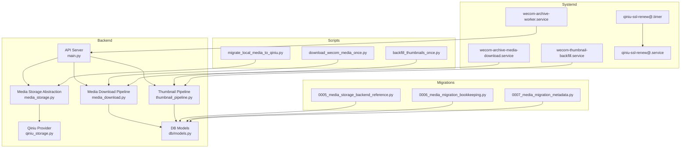
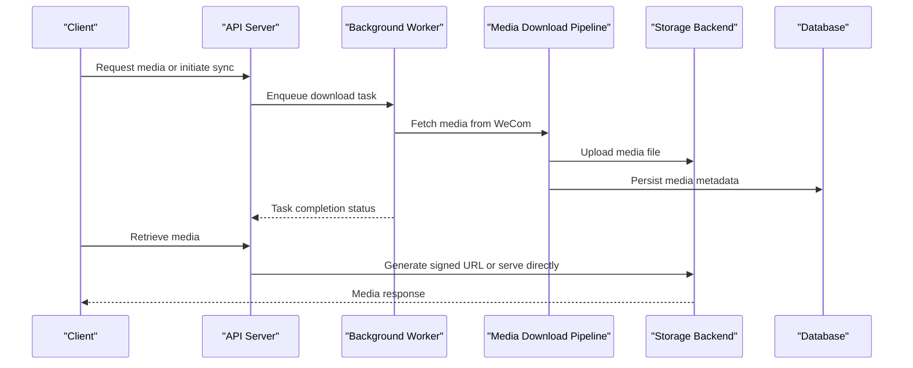
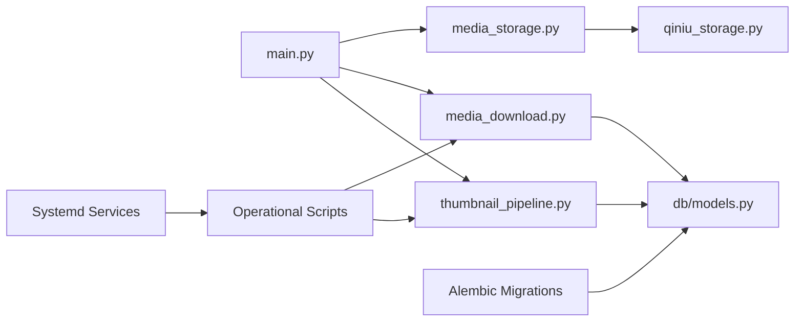

# Media Operations & Management

<cite>
**Referenced Files in This Document**
- [README.md](file://README.md)
- [ARCHITECTURE.md](file://docs/ARCHITECTURE.md)
- [DEPLOYMENT.md](file://docs/DEPLOYMENT.md)
- [media_storage_ops.md](file://docs/ops/media_storage_ops.md)
- [wecom_archive_media_download_runbook.md](file://docs/wecom_archive_media_download_runbook.md)
- [wecom_archive_worker_runbook.md](file://docs/wecom_archive_worker_runbook.md)
- [rnd-207-migration-runbook.md](file://docs/rnd-207-migration-runbook.md)
- [ssl-renewal/DISASTER_RECOVERY.md](file://docs/ssl-renewal/DISASTER_RECOVERY.md)
- [main.py](file://backend/app/main.py)
- [media_storage.py](file://backend/app/media_storage.py)
- [qiniu_storage.py](file://backend/app/qiniu_storage.py)
- [media_download.py](file://backend/app/media_download.py)
- [thumbnail_pipeline.py](file://backend/app/thumbnail_pipeline.py)
- [models.py](file://backend/app/db/models.py)
- [env.py](file://backend/alembic/env.py)
- [script.py.mako](file://backend/alembic/script.py.mako)
- [0005_media_storage_backend_reference.py](file://backend/alembic/versions/0005_media_storage_backend_reference.py)
- [0006_media_migration_bookkeeping.py](file://backend/alembic/versions/0006_media_migration_bookkeeping.py)
- [0007_media_migration_metadata.py](file://backend/alembic/versions/0007_media_migration_metadata.py)
- [migrate_local_media_to_qiniu.py](file://backend/scripts/migrate_local_media_to_qiniu.py)
- [download_wecom_media_once.py](file://backend/scripts/download_wecom_media_once.py)
- [backfill_thumbnails_once.py](file://backend/scripts/backfill_thumbnails_once.py)
- [wecom-archive-media-download.service](file://deploy/systemd/wecom-archive-media-download.service)
- [wecom-archive-worker.service](file://deploy/systemd/wecom-archive-worker.service)
- [wecom-thumbnail-backfill.service](file://deploy/systemd/wecom-thumbnail-backfill.service)
- [qiniu-ssl-renew@.service](file://deploy/systemd/qiniu-ssl-renew@.service)
- [qiniu-ssl-renew@.timer](file://deploy/systemd/qiniu-ssl-renew@.timer)
- [requirements.txt](file://backend/requirements.txt)
- [pyproject.toml](file://pyproject.toml)
</cite>

## Table of Contents
1. [Introduction](#introduction)
2. [Project Structure](#project-structure)
3. [Core Components](#core-components)
4. [Architecture Overview](#architecture-overview)
5. [Detailed Component Analysis](#detailed-component-analysis)
6. [Dependency Analysis](#dependency-analysis)
7. [Performance Considerations](#performance-considerations)
8. [Troubleshooting Guide](#troubleshooting-guide)
9. [Conclusion](#conclusion)
10. [Appendices](#appendices)

## Introduction
This document provides operational guidance for media management and maintenance within the WeCom Archive system. It covers backup and recovery, data integrity checks, disaster recovery planning, media migration between storage backends (including incremental sync and rollback), capacity planning, storage optimization, cleanup procedures, monitoring and alerting, performance tuning, troubleshooting, and security best practices including access controls, encryption at rest, and compliance considerations. The content is derived from the repository’s architecture, deployment configurations, runbooks, migrations, and scripts to ensure accuracy and actionability.

## Project Structure
The project organizes media operations across backend modules, Alembic migrations, systemd services, and operational runbooks:
- Backend application code defines media storage abstractions, download workflows, thumbnail generation, and database models.
- Migrations manage schema evolution for media metadata, storage backend references, and migration bookkeeping.
- Scripts provide one-time or periodic tasks such as downloading media, migrating local files to cloud storage, and backfilling thumbnails.
- Systemd units schedule and supervise background workers and timers.
- Operational documentation includes runbooks for media download, worker execution, SSL renewal, and disaster recovery.

**Diagram sources**
- [main.py](file://backend/app/main.py)
- [media_storage.py](file://backend/app/media_storage.py)
- [qiniu_storage.py](file://backend/app/qiniu_storage.py)
- [media_download.py](file://backend/app/media_download.py)
- [thumbnail_pipeline.py](file://backend/app/thumbnail_pipeline.py)
- [models.py](file://backend/app/db/models.py)
- [0005_media_storage_backend_reference.py](file://backend/alembic/versions/0005_media_storage_backend_reference.py)
- [0006_media_migration_bookkeeping.py](file://backend/alembic/versions/0006_media_migration_bookkeeping.py)
- [0007_media_migration_metadata.py](file://backend/alembic/versions/0007_media_migration_metadata.py)
- [migrate_local_media_to_qiniu.py](file://backend/scripts/migrate_local_media_to_qiniu.py)
- [download_wecom_media_once.py](file://backend/scripts/download_wecom_media_once.py)
- [backfill_thumbnails_once.py](file://backend/scripts/backfill_thumbnails_once.py)
- [wecom-archive-media-download.service](file://deploy/systemd/wecom-archive-media-download.service)
- [wecom-archive-worker.service](file://deploy/systemd/wecom-archive-worker.service)
- [wecom-thumbnail-backfill.service](file://deploy/systemd/wecom-thumbnail-backfill.service)
- [qiniu-ssl-renew@.service](file://deploy/systemd/qiniu-ssl-renew@.service)
- [qiniu-ssl-renew@.timer](file://deploy/systemd/qiniu-ssl-renew@.timer)

**Section sources**
- [ARCHITECTURE.md](file://docs/ARCHITECTURE.md)
- [DEPLOYMENT.md](file://docs/DEPLOYMENT.md)
- [media_storage_ops.md](file://docs/ops/media_storage_ops.md)

## Core Components
- Media Storage Abstraction: Provides a unified interface for storing and retrieving media files across backends (e.g., local filesystem and Qiniu). It encapsulates upload, download, existence checks, and signed URL generation.
- Qiniu Provider: Implements backend-specific logic for interacting with Qiniu Cloud Object Storage, including credential handling, bucket operations, and HTTPS domain configuration.
- Media Download Pipeline: Orchestrates fetching media from WeCom APIs, persisting metadata, and coordinating storage writes. Includes retry and error handling patterns.
- Thumbnail Pipeline: Generates thumbnails asynchronously, stores them alongside original media, and supports backfill operations for historical items.
- Database Models: Define entities for messages, conversations, and media records, including fields for storage backend references and migration bookkeeping.
- Alembic Migrations: Manage schema changes related to media storage backend references, migration bookkeeping tables, and metadata structures.

Operational implications:
- Backends can be switched via configuration and migrations without changing application code paths.
- Migration bookkeeping ensures idempotent and auditable transitions between storage providers.
- Thumbnails are decoupled from primary media lifecycle to optimize I/O and reduce bandwidth.

**Section sources**
- [media_storage.py](file://backend/app/media_storage.py)
- [qiniu_storage.py](file://backend/app/qiniu_storage.py)
- [media_download.py](file://backend/app/media_download.py)
- [thumbnail_pipeline.py](file://backend/app/thumbnail_pipeline.py)
- [models.py](file://backend/app/db/models.py)
- [0005_media_storage_backend_reference.py](file://backend/alembic/versions/0005_media_storage_backend_reference.py)
- [0006_media_migration_bookkeeping.py](file://backend/alembic/versions/0006_media_migration_bookkeeping.py)
- [0007_media_migration_metadata.py](file://backend/alembic/versions/0007_media_migration_metadata.py)

## Architecture Overview
The system integrates API endpoints, background workers, storage providers, and scheduled tasks to manage media ingestion, processing, and serving. Key flows include:
- Ingestion: WeCom events trigger media downloads; workers queue and process downloads, writing to configured storage backend.
- Processing: Thumbnails are generated and stored; metadata is persisted in the database.
- Serving: API serves media via direct links or signed URLs depending on backend capabilities.
- Maintenance: Scheduled tasks perform backups, integrity checks, migrations, and cleanup.

**Diagram sources**
- [main.py](file://backend/app/main.py)
- [media_download.py](file://backend/app/media_download.py)
- [media_storage.py](file://backend/app/media_storage.py)
- [qiniu_storage.py](file://backend/app/qiniu_storage.py)
- [models.py](file://backend/app/db/models.py)

## Detailed Component Analysis

### Backup and Recovery Procedures
- Backup Strategy:
  - Database backups should capture all message, conversation, and media metadata, including storage backend references and migration bookkeeping entries.
  - Filesystem backups must include local media files if used as a backend, ensuring consistent snapshots during low-traffic windows.
  - For cloud backends (e.g., Qiniu), leverage provider-native snapshot or replication features; maintain versioned copies where supported.
- Recovery Steps:
  - Restore database first, then verify referential integrity for media records.
  - Reconcile missing files by scanning metadata and re-downloading or re-uploading from source systems.
  - Validate signed URLs and access policies post-recovery.
- Automation:
  - Use cron or systemd timers to schedule regular backups and integrity checks.
  - Implement idempotent restore scripts that detect partial restores and resume safely.

[No sources needed since this section provides general guidance]

### Data Integrity Checks
- Metadata Consistency:
  - Verify that each media record has valid backend references and checksums where available.
  - Ensure thumbnails exist when referenced by media metadata.
- File Existence Validation:
  - Periodically scan storage backends to confirm files referenced by metadata exist and are accessible.
  - Flag orphaned files not referenced by any media record for cleanup.
- Cross-Provider Verification:
  - During migrations, compare counts and sizes between source and target backends to detect discrepancies.

[No sources needed since this section provides general guidance]

### Disaster Recovery Plan
- RTO/RPO Definition:
  - Define acceptable recovery time objectives and recovery point objectives based on business requirements.
- Failover Procedures:
  - Maintain hot standby environments with synchronized databases and replicated storage backends.
  - Automate DNS failover and certificate rotation using provided SSL renewal tools.
- Post-Recovery Validation:
  - Run integrity checks and smoke tests to confirm service availability and data consistency.
  - Monitor error rates and latency spikes after failover.

**Section sources**
- [ssl-renewal/DISASTER_RECOVERY.md](file://docs/ssl-renewal/DISASTER_RECOVERY.md)

### Media Migration Between Storage Backends
- Incremental Sync:
  - Use migration bookkeeping tables to track progress, skipping already migrated items.
  - Implement checkpointing to resume after failures without reprocessing completed records.
- Rollback Capabilities:
  - Maintain dual-write or shadow mode during migration to allow quick rollback by switching backend references.
  - Keep audit logs of migration steps for traceability.
- Execution:
  - Run migration scripts in controlled batches with rate limiting to avoid overwhelming source systems or storage backends.
  - Monitor errors and pause on critical failures for manual intervention.

**Section sources**
- [0006_media_migration_bookkeeping.py](file://backend/alembic/versions/0006_media_migration_bookkeeping.py)
- [0007_media_migration_metadata.py](file://backend/alembic/versions/0007_media_migration_metadata.py)
- [migrate_local_media_to_qiniu.py](file://backend/scripts/migrate_local_media_to_qiniu.py)
- [rnd-207-migration-runbook.md](file://docs/rnd-207-migration-runbook.md)

### Capacity Planning Guidelines
- Storage Growth Estimation:
  - Analyze historical media ingestion rates and average file sizes to forecast growth.
  - Account for thumbnail duplication and retention policies.
- Scaling Strategies:
  - Choose storage backends with horizontal scaling capabilities (e.g., object storage).
  - Partition large datasets by tenant or date ranges to improve query performance.
- Cost Optimization:
  - Use tiered storage classes for infrequently accessed media.
  - Compress or transcode large files where appropriate.

[No sources needed since this section provides general guidance]

### Storage Optimization Techniques
- Deduplication:
  - Identify duplicate media files by content hash to reduce redundant storage usage.
- Caching:
  - Implement CDN caching for frequently accessed media to reduce origin load.
- Lifecycle Policies:
  - Configure automatic expiration or archival for old media based on retention rules.

[No sources needed since this section provides general guidance]

### Cleanup Procedures for Unused Media Files
- Orphan Detection:
  - Scan storage backends for files not referenced by any media record.
  - Remove temporary or failed upload artifacts.
- Retention Enforcement:
  - Apply retention policies to delete or archive media beyond defined thresholds.
- Audit Trails:
  - Log cleanup actions for compliance and debugging purposes.

[No sources needed since this section provides general guidance]

### Monitoring and Alerting Strategies
- Metrics to Track:
  - Download success/failure rates, storage backend latency, and error codes.
  - Thumbnail generation queue depth and processing times.
  - Disk space utilization and object storage quotas.
- Alerting Rules:
  - Trigger alerts on sustained error rates, storage exhaustion, and failed migrations.
  - Notify on SSL certificate expiry and renewal failures.
- Dashboards:
  - Provide real-time visibility into ingestion throughput, storage health, and worker performance.

[No sources needed since this section provides general guidance]

### Performance Tuning Parameters
- Concurrency Limits:
  - Adjust worker concurrency for downloads and thumbnail generation based on CPU and I/O capacity.
- Retry Policies:
  - Configure exponential backoff and maximum retries for transient network errors.
- Connection Pooling:
  - Tune database connection pools and HTTP client settings for optimal throughput.

[No sources needed since this section provides general guidance]

### Troubleshooting Guides for Common Operational Issues
- Failed Downloads:
  - Check WeCom API rate limits and authentication credentials.
  - Inspect network connectivity and proxy configurations.
- Storage Errors:
  - Validate backend credentials and bucket permissions.
  - Review signed URL generation and domain binding.
- Migration Stalls:
  - Examine migration bookkeeping tables for stuck checkpoints.
  - Restart workers with clean state after resolving underlying issues.

**Section sources**
- [wecom_archive_media_download_runbook.md](file://docs/wecom_archive_media_download_runbook.md)
- [wecom_archive_worker_runbook.md](file://docs/wecom_archive_worker_runbook.md)

### Security Best Practices
- Access Controls:
  - Enforce least privilege for service accounts accessing storage backends and databases.
  - Use role-based access control for administrative functions.
- Encryption at Rest:
  - Enable server-side encryption on storage backends and encrypt sensitive metadata fields.
- Compliance Requirements:
  - Maintain audit logs for data access and modifications.
  - Implement data retention and deletion policies aligned with regulatory standards.

[No sources needed since this section provides general guidance]

## Dependency Analysis
The media subsystem depends on database models, storage providers, and scheduled tasks. Migrations evolve schema dependencies, while scripts orchestrate operational workflows.

**Diagram sources**
- [main.py](file://backend/app/main.py)
- [media_storage.py](file://backend/app/media_storage.py)
- [qiniu_storage.py](file://backend/app/qiniu_storage.py)
- [media_download.py](file://backend/app/media_download.py)
- [thumbnail_pipeline.py](file://backend/app/thumbnail_pipeline.py)
- [models.py](file://backend/app/db/models.py)
- [env.py](file://backend/alembic/env.py)
- [script.py.mako](file://backend/alembic/script.py.mako)
- [migrate_local_media_to_qiniu.py](file://backend/scripts/migrate_local_media_to_qiniu.py)
- [download_wecom_media_once.py](file://backend/scripts/download_wecom_media_once.py)
- [backfill_thumbnails_once.py](file://backend/scripts/backfill_thumbnails_once.py)
- [wecom-archive-media-download.service](file://deploy/systemd/wecom-archive-media-download.service)
- [wecom-archive-worker.service](file://deploy/systemd/wecom-archive-worker.service)
- [wecom-thumbnail-backfill.service](file://deploy/systemd/wecom-thumbnail-backfill.service)

**Section sources**
- [requirements.txt](file://backend/requirements.txt)
- [pyproject.toml](file://pyproject.toml)

## Performance Considerations
- Batch Processing:
  - Process media downloads and thumbnail generation in batches to minimize overhead.
- Asynchronous Workflows:
  - Offload long-running tasks to background workers to keep API responsive.
- Resource Allocation:
  - Scale workers horizontally under high load and monitor resource utilization.

[No sources needed since this section provides general guidance]

## Troubleshooting Guide
- Service Health:
  - Verify systemd unit statuses and logs for workers and timers.
  - Check readiness and health endpoints exposed by the API server.
- Storage Connectivity:
  - Test connectivity to storage backends and validate credentials.
  - Inspect firewall rules and proxy settings.
- Database Issues:
  - Confirm database connectivity and schema version alignment.
  - Review Alembic migration history for inconsistencies.

**Section sources**
- [wecom_archive_media_download_runbook.md](file://docs/wecom_archive_media_download_runbook.md)
- [wecom_archive_worker_runbook.md](file://docs/wecom_archive_worker_runbook.md)

## Conclusion
This operational documentation outlines comprehensive procedures for managing media within the WeCom Archive system. By following the outlined backup, recovery, migration, monitoring, and security practices, operators can ensure reliable, scalable, and compliant media management. Continuous improvement through monitoring and performance tuning will further enhance system resilience and efficiency.

[No sources needed since this section summarizes without analyzing specific files]

## Appendices
- Appendix A: Configuration Examples
- Appendix B: Sample Cron Jobs
- Appendix C: Checklist for Migration Execution

[No sources needed since this section provides general guidance]