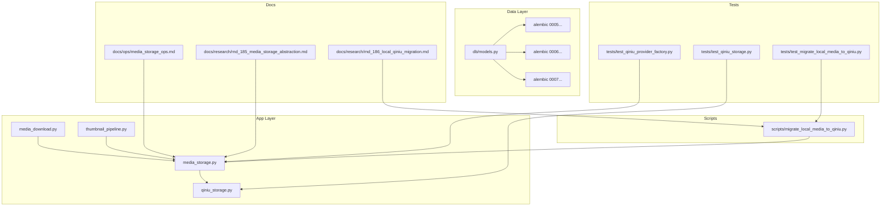
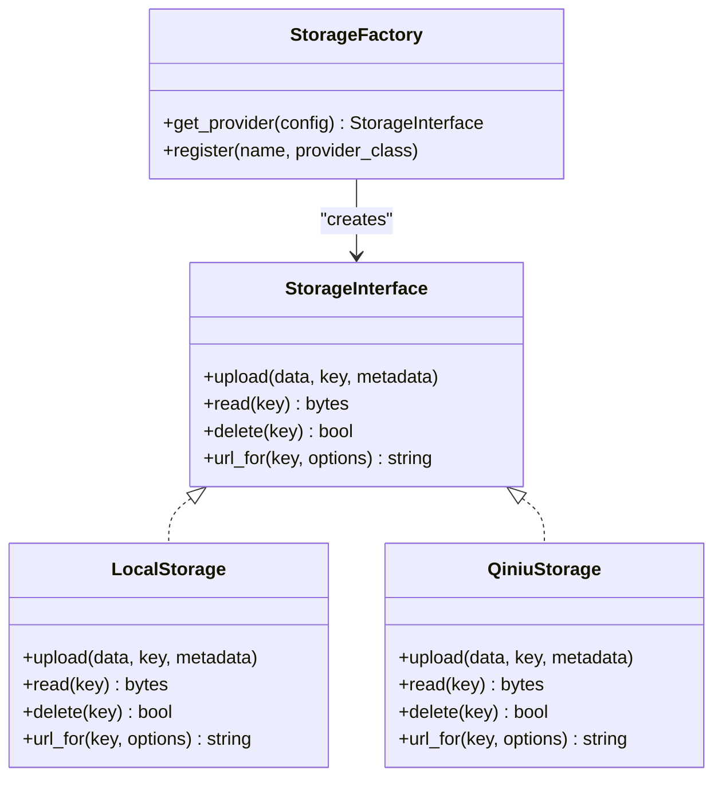
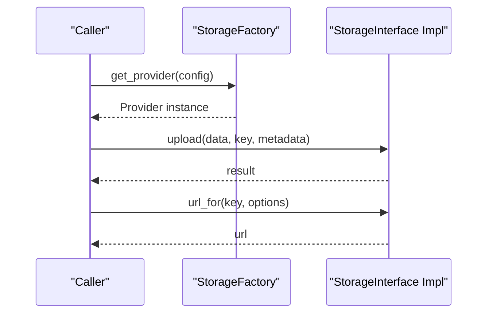
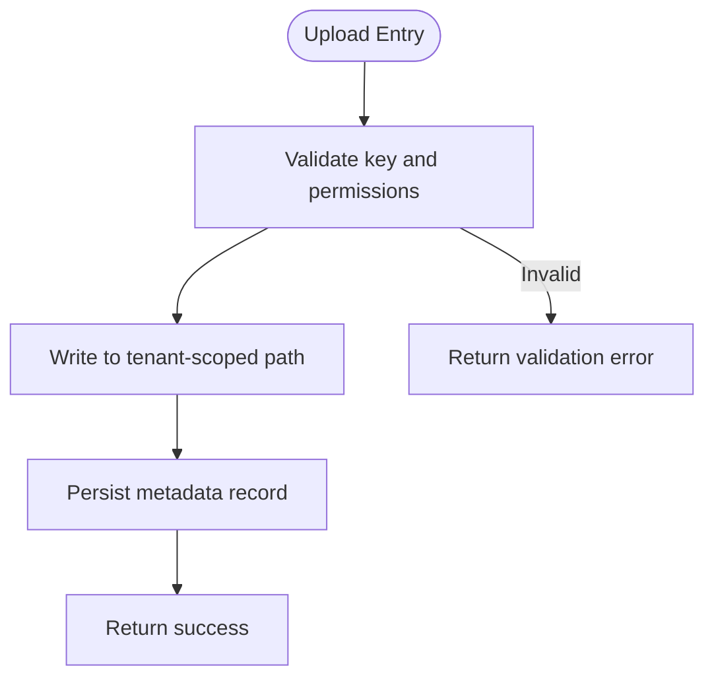
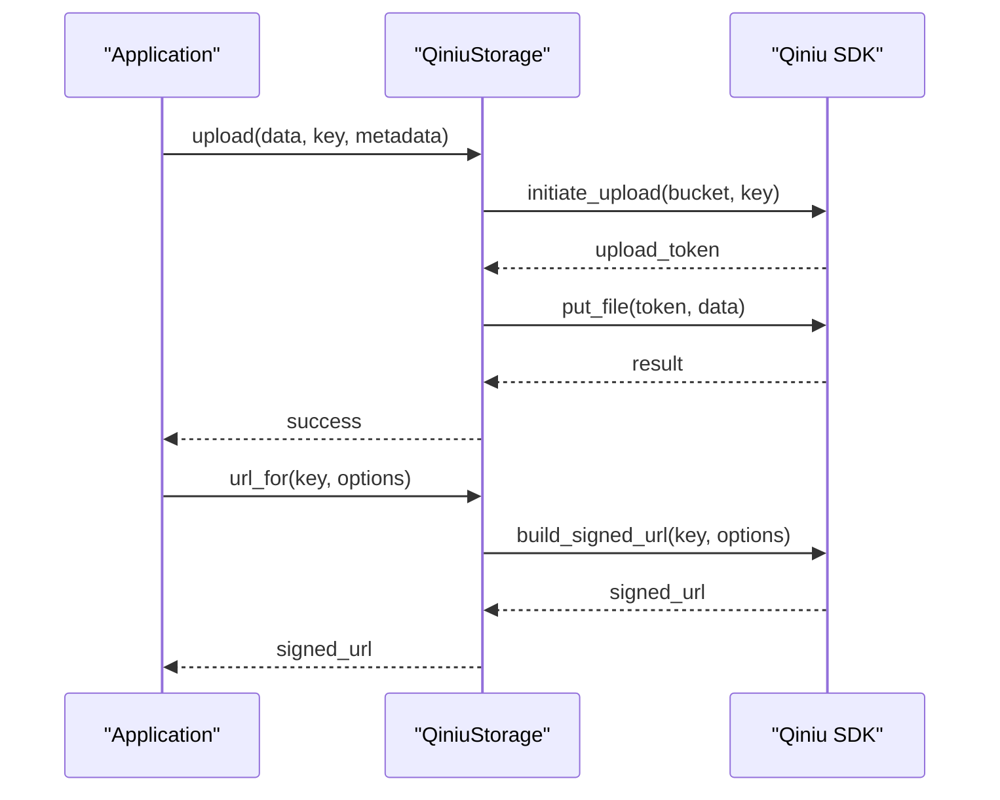
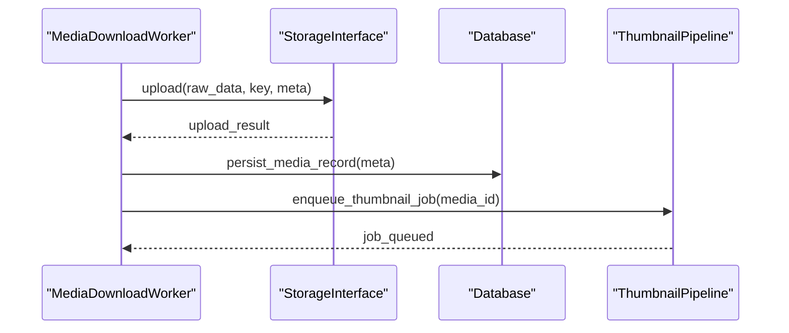
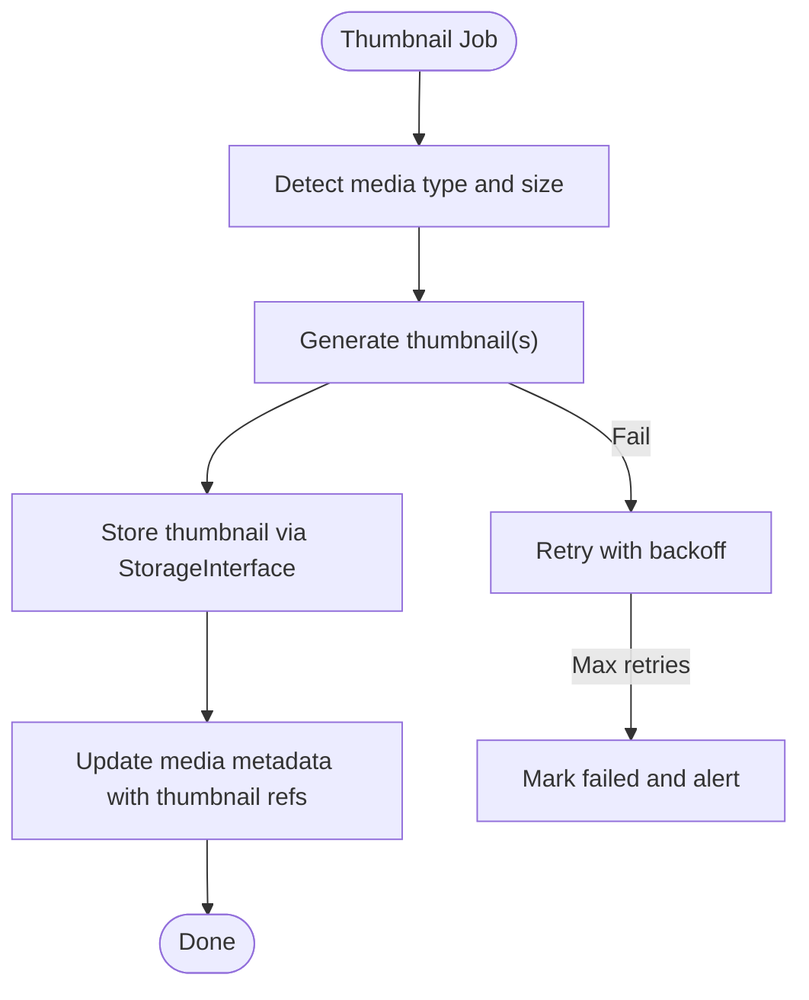
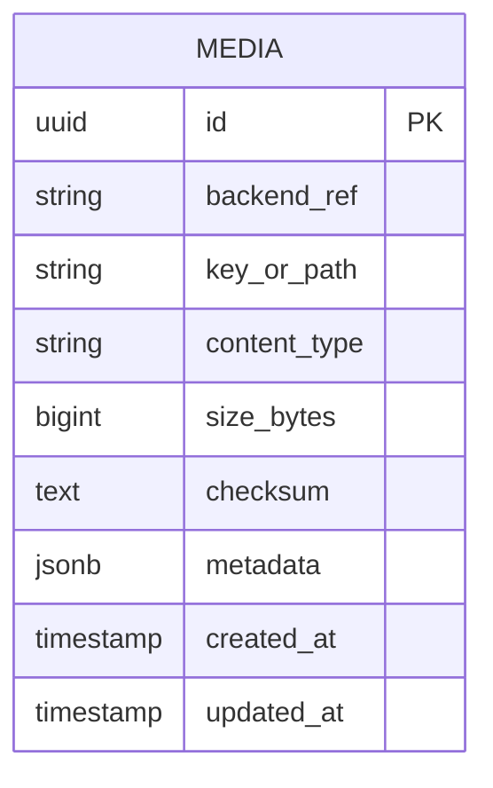
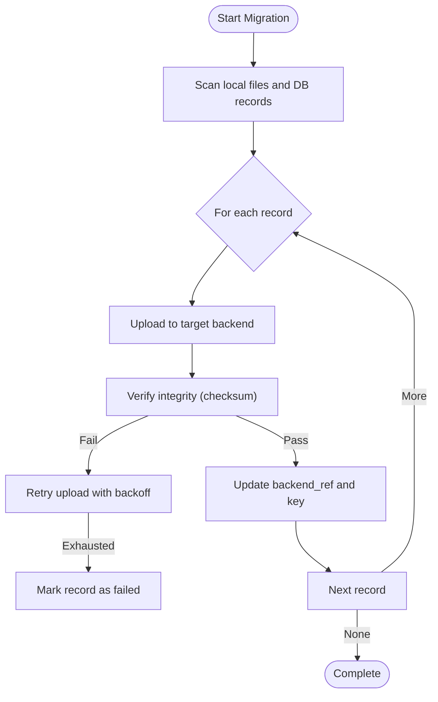
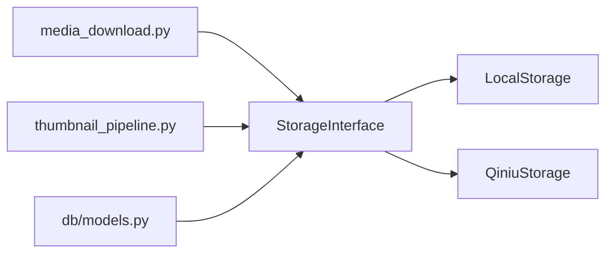

# Storage Backends

<cite>
**Referenced Files in This Document**
- [media_storage.py](file://backend/app/media_storage.py)
- [qiniu_storage.py](file://backend/app/qiniu_storage.py)
- [media_download.py](file://backend/app/media_download.py)
- [thumbnail_pipeline.py](file://backend/app/thumbnail_pipeline.py)
- [models.py](file://backend/app/db/models.py)
- [0005_media_storage_backend_reference.py](file://backend/alembic/versions/0005_media_storage_backend_reference.py)
- [0006_media_migration_bookkeeping.py](file://backend/alembic/versions/0006_media_migration_bookkeeping.py)
- [0007_media_migration_metadata.py](file://backend/alembic/versions/0007_media_migration_metadata.py)
- [migrate_local_media_to_qiniu.py](file://backend/scripts/migrate_local_media_to_qiniu.py)
- [test_qiniu_provider_factory.py](file://backend/tests/test_qiniu_provider_factory.py)
- [test_qiniu_storage.py](file://backend/tests/test_qiniu_storage.py)
- [test_migrate_local_media_to_qiniu.py](file://backend/tests/test_migrate_local_media_to_qiniu.py)
- [ops/media_storage_ops.md](file://docs/ops/media_storage_ops.md)
- [rnd_185_media_storage_abstraction.md](file://docs/research/rnd_185_media_storage_abstraction.md)
- [rnd_186_local_qiniu_migration.md](file://docs/research/rnd_186_local_qiniu_migration.md)
</cite>

## Table of Contents
1. [Introduction](#introduction)
2. [Project Structure](#project-structure)
3. [Core Components](#core-components)
4. [Architecture Overview](#architecture-overview)
5. [Detailed Component Analysis](#detailed-component-analysis)
6. [Dependency Analysis](#dependency-analysis)
7. [Performance Considerations](#performance-considerations)
8. [Troubleshooting Guide](#troubleshooting-guide)
9. [Conclusion](#conclusion)
10. [Appendices](#appendices)

## Introduction
This document explains the storage backend abstraction layer that enables multiple storage providers, including a local filesystem and Qiniu Cloud object storage. It covers interface design, provider registration via a factory pattern, configuration management, media upload workflow, file organization strategies, metadata handling, implementation specifics for each backend, connection pooling, retry mechanisms, error handling patterns, performance characteristics, scalability considerations, and migration procedures between backends.

## Project Structure
The storage abstraction is implemented under the application module with dedicated files for the core interface, provider implementations, and orchestration logic:
- Abstraction and factory: media_storage.py
- Qiniu provider: qiniu_storage.py
- Media download and ingestion: media_download.py
- Thumbnail pipeline integration: thumbnail_pipeline.py
- Data models and migrations: db/models.py and alembic versions
- Migration script: scripts/migrate_local_media_to_qiniu.py
- Tests validating behavior and factory: tests/*
- Operational guidance and research notes: docs/ops and docs/research

**Diagram sources**
- [media_storage.py](file://backend/app/media_storage.py)
- [qiniu_storage.py](file://backend/app/qiniu_storage.py)
- [media_download.py](file://backend/app/media_download.py)
- [thumbnail_pipeline.py](file://backend/app/thumbnail_pipeline.py)
- [models.py](file://backend/app/db/models.py)
- [0005_media_storage_backend_reference.py](file://backend/alembic/versions/0005_media_storage_backend_reference.py)
- [0006_media_migration_bookkeeping.py](file://backend/alembic/versions/0006_media_migration_bookkeeping.py)
- [0007_media_migration_metadata.py](file://backend/alembic/versions/0007_media_migration_metadata.py)
- [migrate_local_media_to_qiniu.py](file://backend/scripts/migrate_local_media_to_qiniu.py)
- [test_qiniu_provider_factory.py](file://backend/tests/test_qiniu_provider_factory.py)
- [test_qiniu_storage.py](file://backend/tests/test_qiniu_storage.py)
- [test_migrate_local_media_to_qiniu.py](file://backend/tests/test_migrate_local_media_to_qiniu.py)
- [ops/media_storage_ops.md](file://docs/ops/media_storage_ops.md)
- [rnd_185_media_storage_abstraction.md](file://docs/research/rnd_185_media_storage_abstraction.md)
- [rnd_186_local_qiniu_migration.md](file://docs/research/rnd_186_local_qiniu_migration.md)

**Section sources**
- [media_storage.py](file://backend/app/media_storage.py)
- [qiniu_storage.py](file://backend/app/qiniu_storage.py)
- [media_download.py](file://backend/app/media_download.py)
- [thumbnail_pipeline.py](file://backend/app/thumbnail_pipeline.py)
- [models.py](file://backend/app/db/models.py)
- [0005_media_storage_backend_reference.py](file://backend/alembic/versions/0005_media_storage_backend_reference.py)
- [0006_media_migration_bookkeeping.py](file://backend/alembic/versions/0006_media_migration_bookkeeping.py)
- [0007_media_migration_metadata.py](file://backend/alembic/versions/0007_media_migration_metadata.py)
- [migrate_local_media_to_qiniu.py](file://backend/scripts/migrate_local_media_to_qiniu.py)
- [test_qiniu_provider_factory.py](file://backend/tests/test_qiniu_provider_factory.py)
- [test_qiniu_storage.py](file://backend/tests/test_qiniu_storage.py)
- [test_migrate_local_media_to_qiniu.py](file://backend/tests/test_migrate_local_media_to_qiniu.py)
- [ops/media_storage_ops.md](file://docs/ops/media_storage_ops.md)
- [rnd_185_media_storage_abstraction.md](file://docs/research/rnd_185_media_storage_abstraction.md)
- [rnd_186_local_qiniu_migration.md](file://docs/research/rnd_186_local_qiniu_migration.md)

## Core Components
- Storage interface and factory: The abstraction defines a common interface for storage operations (upload, read, delete, URL generation) and a factory to resolve providers by name or configuration. Providers implement the same contract so callers remain agnostic of the underlying storage.
- Local filesystem provider: Implements the interface using the local disk, organizing files under tenant-scoped directories and supporting standard file I/O semantics.
- Qiniu Cloud provider: Implements the interface against Qiniu Kodo, handling authentication, chunked uploads, signed URLs, and domain binding.
- Configuration management: Centralized configuration for selecting the active backend, per-provider settings (e.g., bucket, keys, domains), and runtime overrides.
- Metadata model: Database-backed metadata tracks media records, including backend reference, path/key, content type, size, checksums, and thumbnail references.

Key responsibilities:
- Provider selection at startup based on configuration.
- Uniform API for upload/read/delete across providers.
- Tenant isolation through directory or bucket scoping.
- Consistent metadata persistence and retrieval.

**Section sources**
- [media_storage.py](file://backend/app/media_storage.py)
- [qiniu_storage.py](file://backend/app/qiniu_storage.py)
- [models.py](file://backend/app/db/models.py)
- [0005_media_storage_backend_reference.py](file://backend/alembic/versions/0005_media_storage_backend_reference.py)
- [0006_media_migration_bookkeeping.py](file://backend/alembic/versions/0006_media_migration_bookkeeping.py)
- [0007_media_migration_metadata.py](file://backend/alembic/versions/0007_media_migration_metadata.py)

## Architecture Overview
The storage layer follows a provider abstraction with a factory pattern:
- Callers request a storage instance from the factory using configuration.
- The factory returns an implementation (local or Qiniu).
- Media workflows (download, thumbnailing, serving) interact only with the abstract interface.
- Database models store backend-agnostic identifiers and metadata.

**Diagram sources**
- [media_storage.py](file://backend/app/media_storage.py)
- [qiniu_storage.py](file://backend/app/qiniu_storage.py)

**Section sources**
- [media_storage.py](file://backend/app/media_storage.py)
- [qiniu_storage.py](file://backend/app/qiniu_storage.py)

## Detailed Component Analysis

### Storage Interface and Factory
Responsibilities:
- Define a stable contract for storage operations.
- Provide a registry for provider classes keyed by name.
- Resolve the correct provider from configuration and initialize it with provider-specific settings.

Design highlights:
- Single-responsibility provider classes implementing the interface.
- Factory encapsulates provider discovery and instantiation.
- Configuration-driven selection ensures runtime flexibility without code changes.

**Diagram sources**
- [media_storage.py](file://backend/app/media_storage.py)
- [test_qiniu_provider_factory.py](file://backend/tests/test_qiniu_provider_factory.py)

**Section sources**
- [media_storage.py](file://backend/app/media_storage.py)
- [test_qiniu_provider_factory.py](file://backend/tests/test_qiniu_provider_factory.py)

### Local Filesystem Provider
Implementation details:
- Organizes files under tenant-scoped directories to ensure isolation.
- Uses deterministic key naming to avoid collisions and support re-uploads.
- Supports reading/writing/deleting files and generating local URLs for serving.

Operational notes:
- Suitable for development and small-scale deployments.
- Backup and replication must be managed externally.

**Diagram sources**
- [media_storage.py](file://backend/app/media_storage.py)

**Section sources**
- [media_storage.py](file://backend/app/media_storage.py)

### Qiniu Cloud Provider
Implementation details:
- Authenticates using configured credentials and manages token lifetimes.
- Uploads data to a configured bucket with optional chunked transfer for large files.
- Generates signed URLs with configurable expiration and access controls.
- Handles retries and transient errors with exponential backoff.

Operational notes:
- Requires proper domain binding and SSL configuration for HTTPS access.
- Bucket policies should enforce least privilege and appropriate caching headers.

**Diagram sources**
- [qiniu_storage.py](file://backend/app/qiniu_storage.py)
- [test_qiniu_storage.py](file://backend/tests/test_qiniu_storage.py)

**Section sources**
- [qiniu_storage.py](file://backend/app/qiniu_storage.py)
- [test_qiniu_storage.py](file://backend/tests/test_qiniu_storage.py)

### Media Download Workflow
End-to-end flow:
- Ingest raw media from WeCom into the selected storage backend via the interface.
- Persist metadata including backend reference, key/path, content type, size, and checksums.
- Trigger thumbnail generation asynchronously when applicable.

**Diagram sources**
- [media_download.py](file://backend/app/media_download.py)
- [thumbnail_pipeline.py](file://backend/app/thumbnail_pipeline.py)
- [models.py](file://backend/app/db/models.py)

**Section sources**
- [media_download.py](file://backend/app/media_download.py)
- [thumbnail_pipeline.py](file://backend/app/thumbnail_pipeline.py)
- [models.py](file://backend/app/db/models.py)

### Thumbnail Pipeline Integration
Responsibilities:
- Generate thumbnails for supported media types after successful upload.
- Store thumbnail references alongside original media metadata.
- Ensure idempotency and handle failures gracefully.

**Diagram sources**
- [thumbnail_pipeline.py](file://backend/app/thumbnail_pipeline.py)

**Section sources**
- [thumbnail_pipeline.py](file://backend/app/thumbnail_pipeline.py)

### Data Models and Migrations
- Backend reference column added to media records to track which storage backend was used.
- Migration bookkeeping tracks progress and state during backend migrations.
- Structured metadata fields capture additional attributes like checksums and thumbnail references.

**Diagram sources**
- [models.py](file://backend/app/db/models.py)
- [0005_media_storage_backend_reference.py](file://backend/alembic/versions/0005_media_storage_backend_reference.py)
- [0006_media_migration_bookkeeping.py](file://backend/alembic/versions/0006_media_migration_bookkeeping.py)
- [0007_media_migration_metadata.py](file://backend/alembic/versions/0007_media_migration_metadata.py)

**Section sources**
- [models.py](file://backend/app/db/models.py)
- [0005_media_storage_backend_reference.py](file://backend/alembic/versions/0005_media_storage_backend_reference.py)
- [0006_media_migration_bookkeeping.py](file://backend/alembic/versions/0006_media_migration_bookkeeping.py)
- [0007_media_migration_metadata.py](file://backend/alembic/versions/0007_media_migration_metadata.py)

### Migration Between Backends
Migration tooling supports moving media from local filesystem to Qiniu:
- Scans existing local files and corresponding database records.
- Re-uploads content to the target backend while preserving metadata.
- Updates backend references atomically and maintains rollback points.

**Diagram sources**
- [migrate_local_media_to_qiniu.py](file://backend/scripts/migrate_local_media_to_qiniu.py)
- [0006_media_migration_bookkeeping.py](file://backend/alembic/versions/0006_media_migration_bookkeeping.py)

**Section sources**
- [migrate_local_media_to_qiniu.py](file://backend/scripts/migrate_local_media_to_qiniu.py)
- [0006_media_migration_bookkeeping.py](file://backend/alembic/versions/0006_media_migration_bookkeeping.py)
- [test_migrate_local_media_to_qiniu.py](file://backend/tests/test_migrate_local_media_to_qiniu.py)

## Dependency Analysis
The storage abstraction decouples callers from concrete providers:
- media_download and thumbnail_pipeline depend only on the StorageInterface.
- The factory resolves the concrete provider based on configuration.
- Database models provide backend-agnostic identifiers and metadata.

**Diagram sources**
- [media_download.py](file://backend/app/media_download.py)
- [thumbnail_pipeline.py](file://backend/app/thumbnail_pipeline.py)
- [media_storage.py](file://backend/app/media_storage.py)
- [qiniu_storage.py](file://backend/app/qiniu_storage.py)
- [models.py](file://backend/app/db/models.py)

**Section sources**
- [media_download.py](file://backend/app/media_download.py)
- [thumbnail_pipeline.py](file://backend/app/thumbnail_pipeline.py)
- [media_storage.py](file://backend/app/media_storage.py)
- [qiniu_storage.py](file://backend/app/qiniu_storage.py)
- [models.py](file://backend/app/db/models.py)

## Performance Considerations
- Connection pooling: For Qiniu, reuse client instances and manage token refresh efficiently to minimize overhead.
- Chunked uploads: Use chunked transfers for large media to improve reliability and throughput.
- Caching: Leverage CDN/domain caching for signed URLs where appropriate; configure cache-control headers.
- Concurrency: Parallelize uploads and thumbnail generation with bounded concurrency to avoid resource exhaustion.
- I/O locality: For local storage, place files on fast disks and consider RAID or SSDs for high-throughput scenarios.
- Monitoring: Track latency, error rates, and throughput per backend to identify bottlenecks.

[No sources needed since this section provides general guidance]

## Troubleshooting Guide
Common issues and resolutions:
- Authentication failures: Verify provider credentials and token lifetimes; check network egress and firewall rules.
- Permission errors: Ensure bucket policies or filesystem permissions allow read/write operations.
- Upload timeouts: Increase timeouts or enable chunked uploads; inspect network stability.
- Missing thumbnails: Check thumbnail pipeline jobs and logs; verify supported media types and sizes.
- Migration inconsistencies: Review migration bookkeeping tables and reconcile backend references; rerun failed steps.

Operational guidance and runbooks:
- See operational documentation for detailed troubleshooting steps and best practices.

**Section sources**
- [ops/media_storage_ops.md](file://docs/ops/media_storage_ops.md)

## Conclusion
The storage backend abstraction provides a clean, extensible foundation for supporting multiple storage providers. By isolating provider-specific logic behind a unified interface and leveraging a factory for resolution, the system remains flexible and maintainable. With robust metadata tracking, migration tooling, and clear operational guidance, teams can confidently evolve storage backends to meet changing performance and scalability needs.

[No sources needed since this section summarizes without analyzing specific files]

## Appendices

### Configuration Management
- Select the active backend via configuration keys.
- Per-provider settings include credentials, bucket names, domains, and upload options.
- Runtime overrides are supported for testing and dynamic environments.

**Section sources**
- [rnd_185_media_storage_abstraction.md](file://docs/research/rnd_185_media_storage_abstraction.md)

### Migration Procedures
- Use the provided migration script to move media from local storage to Qiniu.
- Follow step-by-step instructions in the research notes for safe transitions and rollback strategies.

**Section sources**
- [rnd_186_local_qiniu_migration.md](file://docs/research/rnd_186_local_qiniu_migration.md)
- [migrate_local_media_to_qiniu.py](file://backend/scripts/migrate_local_media_to_qiniu.py)