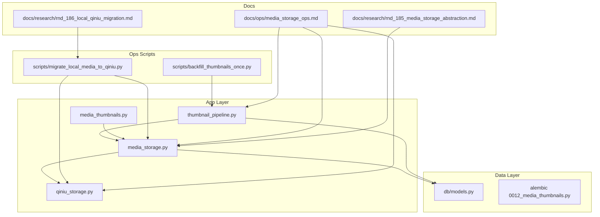
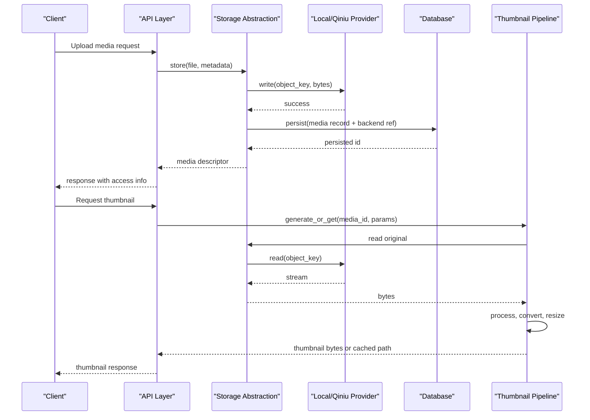
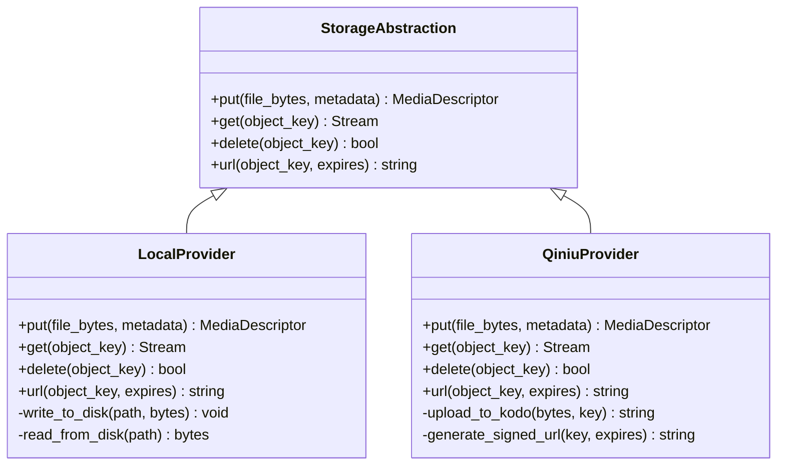
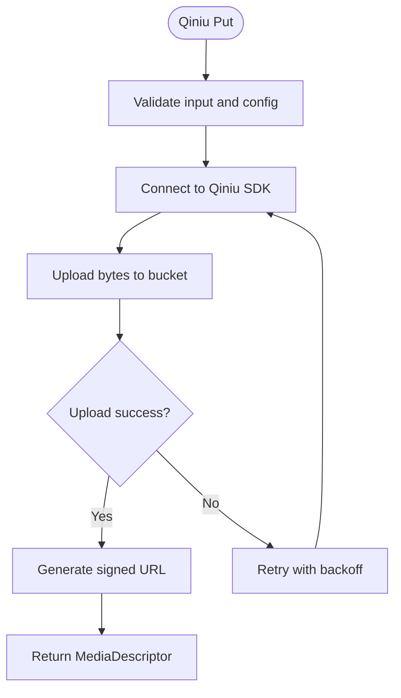
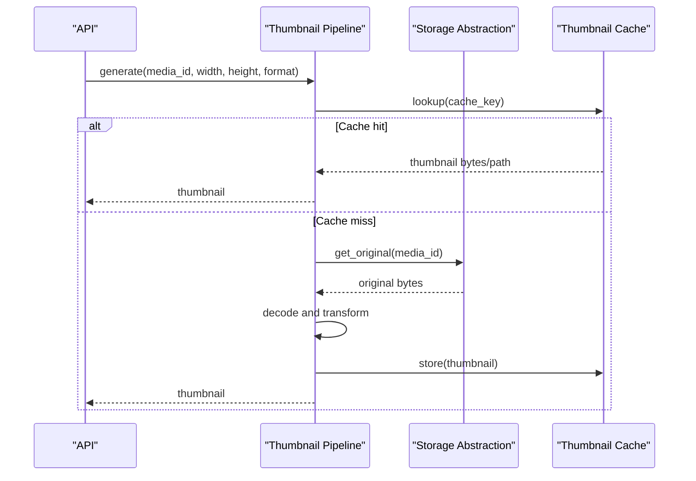
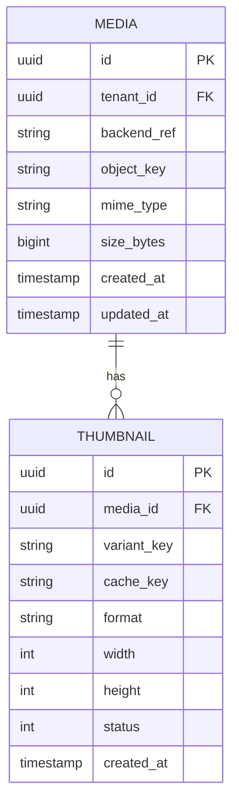
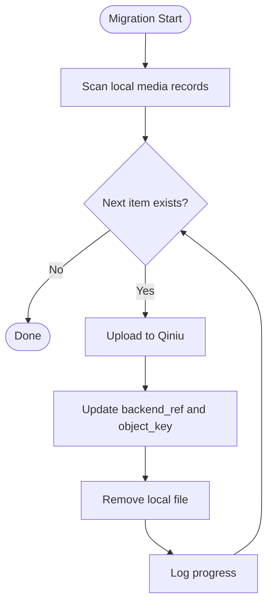
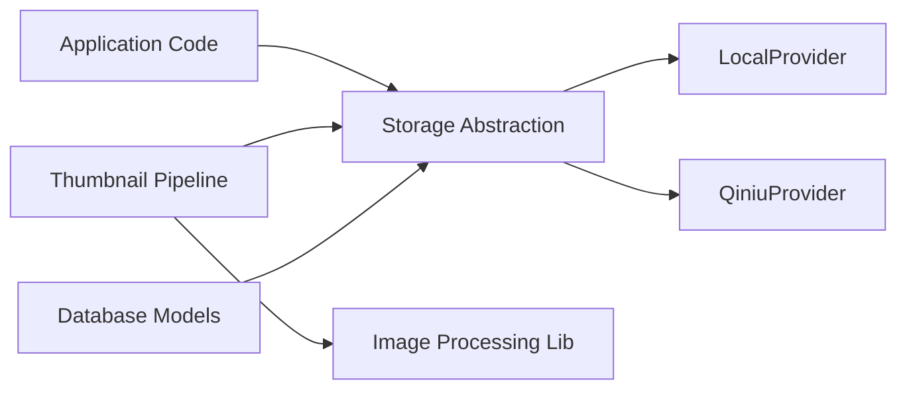

# Storage System

<cite>
**Referenced Files in This Document**
- [media_storage.py](file://backend/app/media_storage.py)
- [qiniu_storage.py](file://backend/app/qiniu_storage.py)
- [thumbnail_pipeline.py](file://backend/app/thumbnail_pipeline.py)
- [media_thumbnails.py](file://backend/app/media_thumbnails.py)
- [models.py](file://backend/app/db/models.py)
- [0012_media_thumbnails.py](file://backend/alembic/versions/0012_media_thumbnails.py)
- [migrate_local_media_to_qiniu.py](file://backend/scripts/migrate_local_media_to_qiniu.py)
- [backfill_thumbnails_once.py](file://backend/scripts/backfill_thumbnails_once.py)
- [ops/media_storage_ops.md](file://docs/ops/media_storage_ops.md)
- [rnd_185_media_storage_abstraction.md](file://docs/research/rnd_185_media_storage_abstraction.md)
- [rnd_186_local_qiniu_migration.md](file://docs/research/rnd_186_local_qiniu_migration.md)
</cite>

## Table of Contents
1. [Introduction](#introduction)
2. [Project Structure](#project-structure)
3. [Core Components](#core-components)
4. [Architecture Overview](#architecture-overview)
5. [Detailed Component Analysis](#detailed-component-analysis)
6. [Dependency Analysis](#dependency-analysis)
7. [Performance Considerations](#performance-considerations)
8. [Troubleshooting Guide](#troubleshooting-guide)
9. [Conclusion](#conclusion)
10. [Appendices](#appendices)

## Introduction
This document describes the storage system architecture, focusing on the abstraction layer that supports multiple backends (local filesystem and Qiniu Cloud object storage), the media upload workflow, file organization strategies, metadata management, thumbnail generation pipeline, configuration options, backup and recovery procedures, data migration between backends, capacity planning guidelines, and security considerations. The goal is to provide both a high-level understanding and detailed technical guidance for operators and developers.

## Project Structure
The storage subsystem spans application modules, database models, Alembic migrations, operational scripts, and documentation:
- Abstraction and providers:
  - Storage abstraction and local provider implementation
  - Qiniu Cloud provider implementation
- Thumbnailing:
  - Thumbnail pipeline orchestration and per-media thumbnail helpers
- Data model and migrations:
  - Media entity and thumbnail fields
  - Migration adding thumbnails and backend references
- Operational scripts:
  - Local-to-Qiniu migration
  - Thumbnail backfill
- Operations guide:
  - Storage operations runbook

**Diagram sources**
- [media_storage.py](file://backend/app/media_storage.py)
- [qiniu_storage.py](file://backend/app/qiniu_storage.py)
- [thumbnail_pipeline.py](file://backend/app/thumbnail_pipeline.py)
- [media_thumbnails.py](file://backend/app/media_thumbnails.py)
- [models.py](file://backend/app/db/models.py)
- [0012_media_thumbnails.py](file://backend/alembic/versions/0012_media_thumbnails.py)
- [migrate_local_media_to_qiniu.py](file://backend/scripts/migrate_local_media_to_qiniu.py)
- [backfill_thumbnails_once.py](file://backend/scripts/backfill_thumbnails_once.py)
- [ops/media_storage_ops.md](file://docs/ops/media_storage_ops.md)
- [rnd_185_media_storage_abstraction.md](file://docs/research/rnd_185_media_storage_abstraction.md)
- [rnd_186_local_qiniu_migration.md](file://docs/research/rnd_186_local_qiniu_migration.md)

**Section sources**
- [media_storage.py](file://backend/app/media_storage.py)
- [qiniu_storage.py](file://backend/app/qiniu_storage.py)
- [thumbnail_pipeline.py](file://backend/app/thumbnail_pipeline.py)
- [media_thumbnails.py](file://backend/app/media_thumbnails.py)
- [models.py](file://backend/app/db/models.py)
- [0012_media_thumbnails.py](file://backend/alembic/versions/0012_media_thumbnails.py)
- [migrate_local_media_to_qiniu.py](file://backend/scripts/migrate_local_media_to_qiniu.py)
- [backfill_thumbnails_once.py](file://backend/scripts/backfill_thumbnails_once.py)
- [ops/media_storage_ops.md](file://docs/ops/media_storage_ops.md)
- [rnd_185_media_storage_abstraction.md](file://docs/research/rnd_185_media_storage_abstraction.md)
- [rnd_186_local_qiniu_migration.md](file://docs/research/rnd_186_local_qiniu_migration.md)

## Core Components
- Storage abstraction layer:
  - Provides a unified interface for storing and retrieving media objects across different backends.
  - Abstracts differences between local filesystem and cloud object storage.
- Local filesystem provider:
  - Implements the storage interface using the local disk with tenant-scoped directories.
- Qiniu Cloud provider:
  - Implements the storage interface using Qiniu Kodo, including signed URL generation and domain binding.
- Thumbnail pipeline:
  - Orchestrates image processing, format conversion, size variants, and caching of generated thumbnails.
- Per-media thumbnail helpers:
  - Utilities to compute thumbnail paths, cache keys, and manage thumbnail lifecycle.
- Data model:
  - Media entities include fields for storage backend reference, object key, and thumbnail metadata.
- Migrations:
  - Adds thumbnail-related columns and indexes to support efficient retrieval and cleanup.
- Operational scripts:
  - Migrates existing local media to Qiniu.
  - Backfills missing thumbnails for historical media.

**Section sources**
- [media_storage.py](file://backend/app/media_storage.py)
- [qiniu_storage.py](file://backend/app/qiniu_storage.py)
- [thumbnail_pipeline.py](file://backend/app/thumbnail_pipeline.py)
- [media_thumbnails.py](file://backend/app/media_thumbnails.py)
- [models.py](file://backend/app/db/models.py)
- [0012_media_thumbnails.py](file://backend/alembic/versions/0012_media_thumbnails.py)
- [migrate_local_media_to_qiniu.py](file://backend/scripts/migrate_local_media_to_qiniu.py)
- [backfill_thumbnails_once.py](file://backend/scripts/backfill_thumbnails_once.py)

## Architecture Overview
The storage system follows a provider-based architecture:
- Application code calls into the storage abstraction to perform read/write operations.
- The abstraction selects the appropriate backend based on configuration or per-entity settings.
- Thumbnails are generated asynchronously or on-demand through a pipeline that caches results.
- Metadata is stored in the relational database, referencing the actual object location in the chosen backend.

**Diagram sources**
- [media_storage.py](file://backend/app/media_storage.py)
- [qiniu_storage.py](file://backend/app/qiniu_storage.py)
- [thumbnail_pipeline.py](file://backend/app/thumbnail_pipeline.py)
- [models.py](file://backend/app/db/models.py)

## Detailed Component Analysis

### Storage Abstraction Layer
- Responsibilities:
  - Define interfaces for put/get/delete operations.
  - Manage tenant scoping and object key naming conventions.
  - Provide helper methods for generating access descriptors (e.g., URLs).
- Backend selection:
  - Configuration-driven selection between local and Qiniu providers.
  - Optional per-entity overrides for multi-backend scenarios.
- Error handling:
  - Normalizes backend-specific errors into consistent exceptions.
  - Retries and timeouts configurable per backend.

**Diagram sources**
- [media_storage.py](file://backend/app/media_storage.py)
- [qiniu_storage.py](file://backend/app/qiniu_storage.py)

**Section sources**
- [media_storage.py](file://backend/app/media_storage.py)
- [qiniu_storage.py](file://backend/app/qiniu_storage.py)

### Qiniu Cloud Provider
- Capabilities:
  - Uploads binary streams to Qiniu Kodo buckets.
  - Generates time-limited signed URLs for secure access.
  - Supports custom domains and HTTPS endpoints.
- Configuration:
  - Bucket name, credentials, domain mapping, and signing parameters.
- Performance:
  - Chunked uploads and connection pooling where applicable.
  - Retry policies for transient network failures.

**Diagram sources**
- [qiniu_storage.py](file://backend/app/qiniu_storage.py)

**Section sources**
- [qiniu_storage.py](file://backend/app/qiniu_storage.py)

### Thumbnail Generation Pipeline
- Workflow:
  - Detect media type and supported formats.
  - Decode original image, apply transformations (resize, crop, rotate).
  - Encode to target format(s) and sizes.
  - Cache results locally or in object storage depending on configuration.
- Caching strategy:
  - Content-based cache keys derived from original hash and transformation parameters.
  - TTL and eviction policies to manage storage growth.
- Error handling:
  - Graceful fallback when processing fails; return original or error indicator.

**Diagram sources**
- [thumbnail_pipeline.py](file://backend/app/thumbnail_pipeline.py)
- [media_thumbnails.py](file://backend/app/media_thumbnails.py)
- [media_storage.py](file://backend/app/media_storage.py)

**Section sources**
- [thumbnail_pipeline.py](file://backend/app/thumbnail_pipeline.py)
- [media_thumbnails.py](file://backend/app/media_thumbnails.py)

### Data Model and Metadata Management
- Media entity:
  - Fields include unique identifier, tenant scope, backend reference, object key, MIME type, size, and timestamps.
  - Thumbnail metadata includes variant identifiers, cache keys, and status flags.
- Indexes and constraints:
  - Optimized queries by tenant, media ID, and thumbnail variant.
  - Integrity constraints ensure referential consistency between media and thumbnails.

**Diagram sources**
- [models.py](file://backend/app/db/models.py)
- [0012_media_thumbnails.py](file://backend/alembic/versions/0012_media_thumbnails.py)

**Section sources**
- [models.py](file://backend/app/db/models.py)
- [0012_media_thumbnails.py](file://backend/alembic/versions/0012_media_thumbnails.py)

### File Organization Strategies
- Tenant isolation:
  - Each tenant’s media resides under a dedicated root directory or bucket prefix.
- Object key naming:
  - Deterministic naming patterns enable reproducible cache keys and easy migration.
- Versioning and deduplication:
  - Optional content hashing to avoid duplicate uploads.
- Cleanup:
  - Orphaned files detection and garbage collection jobs.

**Section sources**
- [media_storage.py](file://backend/app/media_storage.py)
- [qiniu_storage.py](file://backend/app/qiniu_storage.py)

### Backup and Recovery Procedures
- Backup:
  - Periodic snapshots of object storage (Qiniu) and local filesystem backups.
  - Database export including media metadata and thumbnail records.
- Recovery:
  - Restore database first, then restore object storage contents.
  - Rebuild thumbnails if cache is lost using originals.
- Validation:
  - Integrity checks comparing checksums and counts between source and restored state.

**Section sources**
- [ops/media_storage_ops.md](file://docs/ops/media_storage_ops.md)

### Data Migration Between Storage Backends
- Migration script:
  - Iterates over existing local media, uploads to Qiniu, updates backend references, and cleans up local files.
- Idempotency:
  - Skips already migrated items and resumes safely after interruptions.
- Rollback:
  - Maintain dual references during transition; revert by switching provider configuration.

**Diagram sources**
- [migrate_local_media_to_qiniu.py](file://backend/scripts/migrate_local_media_to_qiniu.py)

**Section sources**
- [migrate_local_media_to_qiniu.py](file://backend/scripts/migrate_local_media_to_qiniu.py)
- [rnd_186_local_qiniu_migration.md](file://docs/research/rnd_186_local_qiniu_migration.md)

### Thumbnail Backfill
- Purpose:
  - Generate missing thumbnails for historical media after enabling the pipeline.
- Process:
  - Query media without thumbnails, generate variants, and persist metadata.
- Concurrency:
  - Parallel workers with rate limiting to avoid overwhelming upstream services.

**Section sources**
- [backfill_thumbnails_once.py](file://backend/scripts/backfill_thumbnails_once.py)
- [thumbnail_pipeline.py](file://backend/app/thumbnail_pipeline.py)

## Dependency Analysis
- Coupling:
  - Storage abstraction decouples application logic from backend specifics.
  - Thumbnail pipeline depends on storage abstraction for reading originals and optional caching.
- External dependencies:
  - Qiniu SDK for object storage operations.
  - Image processing libraries for thumbnail generation.
- Potential circular dependencies:
  - Avoid direct imports between providers; use factory or configuration to instantiate providers.

**Diagram sources**
- [media_storage.py](file://backend/app/media_storage.py)
- [qiniu_storage.py](file://backend/app/qiniu_storage.py)
- [thumbnail_pipeline.py](file://backend/app/thumbnail_pipeline.py)
- [models.py](file://backend/app/db/models.py)

**Section sources**
- [media_storage.py](file://backend/app/media_storage.py)
- [qiniu_storage.py](file://backend/app/qiniu_storage.py)
- [thumbnail_pipeline.py](file://backend/app/thumbnail_pipeline.py)
- [models.py](file://backend/app/db/models.py)

## Performance Considerations
- Upload throughput:
  - Use chunked uploads and connection pooling for large files.
  - Enable compression where appropriate for text-heavy payloads.
- Read latency:
  - Prefer CDN-backed domains for Qiniu to reduce latency.
  - Cache thumbnails at edge nodes and application level.
- Concurrency:
  - Limit concurrent workers to balance CPU and I/O usage.
  - Implement backpressure to prevent memory spikes.
- Storage sizing:
  - Monitor growth rates and set alerts for capacity thresholds.
  - Plan retention policies to archive or delete old thumbnails.

[No sources needed since this section provides general guidance]

## Troubleshooting Guide
- Common issues:
  - Authentication failures with Qiniu: verify credentials and bucket permissions.
  - Thumbnail generation failures: check image format support and library versions.
  - Missing thumbnails: run backfill script and inspect logs for skipped items.
- Diagnostics:
  - Health endpoints for storage connectivity and cache status.
  - Metrics for upload/download throughput and error rates.
- Recovery steps:
  - Re-run failed migrations or backfill jobs with resume capability.
  - Purge corrupted cache entries and regenerate thumbnails.

**Section sources**
- [ops/media_storage_ops.md](file://docs/ops/media_storage_ops.md)

## Conclusion
The storage system provides a robust abstraction over multiple backends, enabling seamless scaling and flexibility. The thumbnail pipeline enhances user experience with optimized images while maintaining efficient caching. Operational scripts and migrations facilitate smooth transitions between backends and ensure data integrity. Proper configuration, monitoring, and maintenance are essential for performance and reliability.

[No sources needed since this section summarizes without analyzing specific files]

## Appendices

### Configuration Options
- Storage provider selection:
  - Environment variables or config files to choose local or Qiniu.
- Qiniu settings:
  - Bucket, access key, secret key, domain mapping, and signing parameters.
- Thumbnail pipeline:
  - Supported formats, max dimensions, cache TTL, and worker concurrency.
- Performance tuning:
  - Connection pool sizes, timeouts, retry policies, and CDN settings.

**Section sources**
- [rnd_185_media_storage_abstraction.md](file://docs/research/rnd_185_media_storage_abstraction.md)
- [ops/media_storage_ops.md](file://docs/ops/media_storage_ops.md)

### Security Considerations
- Access controls:
  - Signed URLs with expiration times for secure access.
  - Tenant-scoped isolation to prevent cross-tenant data leakage.
- Encryption:
  - TLS for all external communications.
  - Server-side encryption at rest for object storage.
- Compliance:
  - Audit logging for access and modifications.
  - Data retention and deletion policies aligned with regulations.

**Section sources**
- [qiniu_storage.py](file://backend/app/qiniu_storage.py)
- [media_storage.py](file://backend/app/media_storage.py)