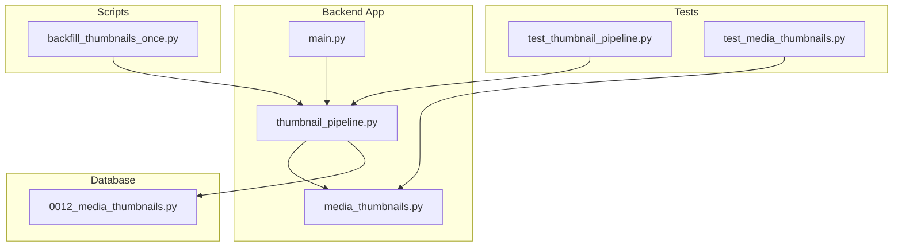
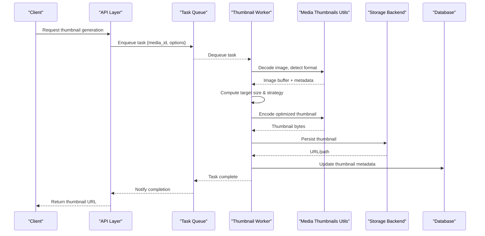
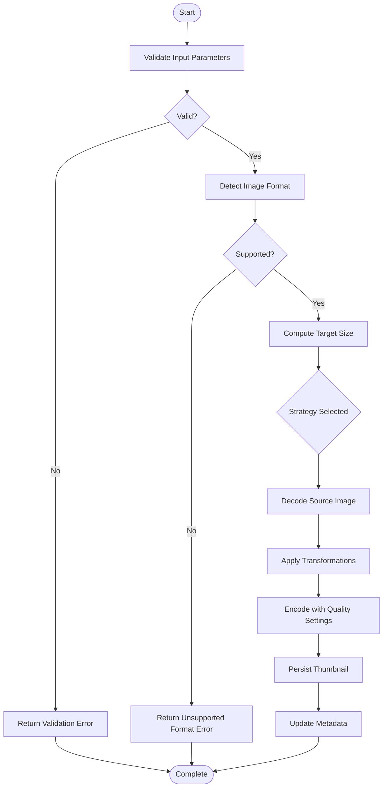
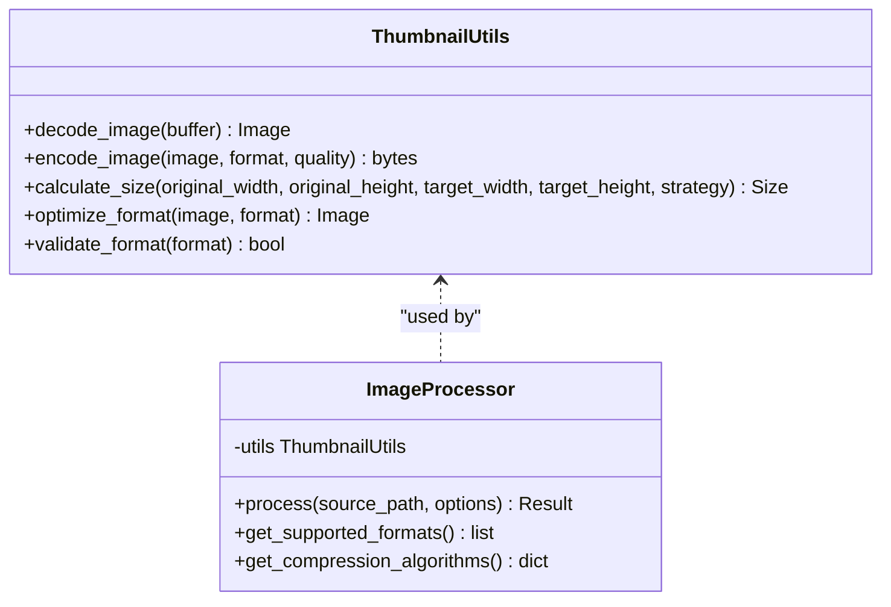
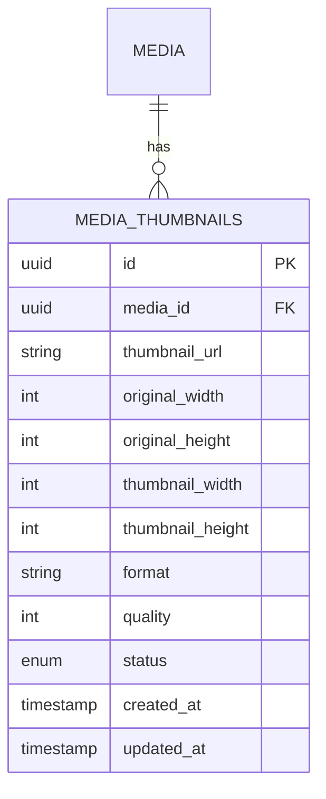
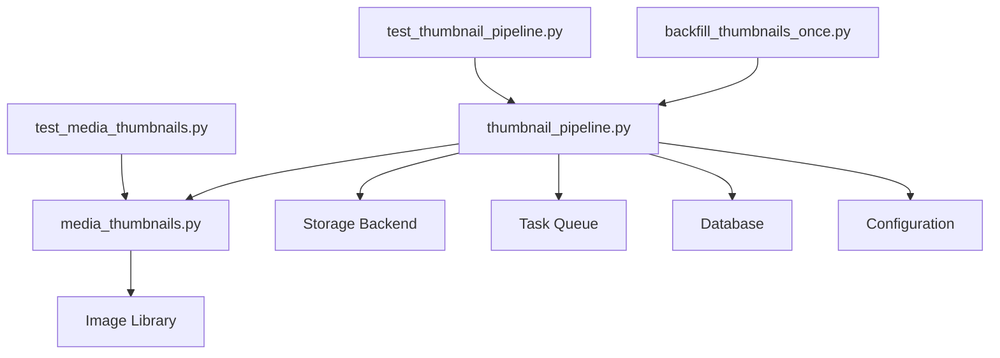

# Thumbnail Generation Pipeline

<cite>
**Referenced Files in This Document**
- [thumbnail_pipeline.py](file://backend/app/thumbnail_pipeline.py)
- [media_thumbnails.py](file://backend/app/media_thumbnails.py)
- [test_thumbnail_pipeline.py](file://backend/tests/test_thumbnail_pipeline.py)
- [test_media_thumbnails.py](file://backend/tests/test_media_thumbnails.py)
- [0012_media_thumbnails.py](file://backend/alembic/versions/0012_media_thumbnails.py)
- [backfill_thumbnails_once.py](file://backend/scripts/backfill_thumbnails_once.py)
- [main.py](file://backend/app/main.py)
</cite>

## Table of Contents
1. [Introduction](#introduction)
2. [Project Structure](#project-structure)
3. [Core Components](#core-components)
4. [Architecture Overview](#architecture-overview)
5. [Detailed Component Analysis](#detailed-component-analysis)
6. [Dependency Analysis](#dependency-analysis)
7. [Performance Considerations](#performance-considerations)
8. [Troubleshooting Guide](#troubleshooting-guide)
9. [Conclusion](#conclusion)
10. [Appendices](#appendices)

## Introduction
This document provides comprehensive documentation for the thumbnail generation pipeline, focusing on image processing workflow, supported formats, compression and quality settings, asynchronous processing model, queue management, error recovery, configuration options, performance optimization, memory management, concurrent processing limits, troubleshooting, and monitoring. The goal is to make the system understandable for both technical and non-technical readers while providing actionable guidance for operations and development.

## Project Structure
The thumbnail pipeline is implemented within the backend application module and integrates with storage backends and database migrations. Key files include:
- Core pipeline logic and orchestration
- Media thumbnail utilities and helpers
- Database schema migration for thumbnails
- Backfill script for historical data
- Tests validating behavior and edge cases
- Application entry point wiring

**Diagram sources**
- [thumbnail_pipeline.py](file://backend/app/thumbnail_pipeline.py)
- [media_thumbnails.py](file://backend/app/media_thumbnails.py)
- [0012_media_thumbnails.py](file://backend/alembic/versions/0012_media_thumbnails.py)
- [backfill_thumbnails_once.py](file://backend/scripts/backfill_thumbnails_once.py)
- [test_thumbnail_pipeline.py](file://backend/tests/test_thumbnail_pipeline.py)
- [test_media_thumbnails.py](file://backend/tests/test_media_thumbnails.py)
- [main.py](file://backend/app/main.py)

**Section sources**
- [thumbnail_pipeline.py](file://backend/app/thumbnail_pipeline.py)
- [media_thumbnails.py](file://backend/app/media_thumbnails.py)
- [0012_media_thumbnails.py](file://backend/alembic/versions/0012_media_thumbnails.py)
- [backfill_thumbnails_once.py](file://backend/scripts/backfill_thumbnails_once.py)
- [test_thumbnail_pipeline.py](file://backend/tests/test_thumbnail_pipeline.py)
- [test_media_thumbnails.py](file://backend/tests/test_media_thumbnails.py)
- [main.py](file://backend/app/main.py)

## Core Components
- Thumbnail Pipeline Orchestrator: Coordinates ingestion, format detection, resizing, quality tuning, and output persistence. It manages task lifecycle, retries, and error propagation.
- Media Thumbnails Utilities: Provides helper functions for image decoding, encoding, size calculations, and format-specific optimizations.
- Migration and Backfill: Ensures database schema supports thumbnail metadata and provides a one-time backfill process for existing media.
- Tests: Validate pipeline behavior across supported formats, size constraints, quality settings, and error scenarios.

Key responsibilities:
- Format detection and validation
- Size optimization (fit, fill, crop strategies)
- Quality adjustment per format
- Asynchronous task execution and queueing
- Error handling and retry policies
- Caching of processed thumbnails
- Configuration-driven dimensions and quality

**Section sources**
- [thumbnail_pipeline.py](file://backend/app/thumbnail_pipeline.py)
- [media_thumbnails.py](file://backend/app/media_thumbnails.py)
- [0012_media_thumbnails.py](file://backend/alembic/versions/0012_media_thumbnails.py)
- [backfill_thumbnails_once.py](file://backend/scripts/backfill_thumbnails_once.py)
- [test_thumbnail_pipeline.py](file://backend/tests/test_thumbnail_pipeline.py)
- [test_media_thumbnails.py](file://backend/tests/test_media_thumbnails.py)

## Architecture Overview
The pipeline follows an asynchronous processing model where tasks are enqueued, executed by workers, and results are persisted. It integrates with storage backends for source images and thumbnail outputs.

**Diagram sources**
- [thumbnail_pipeline.py](file://backend/app/thumbnail_pipeline.py)
- [media_thumbnails.py](file://backend/app/media_thumbnails.py)
- [0012_media_thumbnails.py](file://backend/alembic/versions/0012_media_thumbnails.py)
- [backfill_thumbnails_once.py](file://backend/scripts/backfill_thumbnails_once.py)

## Detailed Component Analysis

### Thumbnail Pipeline Orchestrator
Responsibilities:
- Accepts generation requests and validates parameters
- Detects input format and checks support
- Computes optimal dimensions based on strategy (fit, fill, crop)
- Applies quality adjustments per format
- Manages concurrency limits and worker pool
- Handles retries and error recovery
- Persists results and updates metadata

Processing flow:
1. Input validation and parameter normalization
2. Format detection and capability check
3. Size calculation and strategy selection
4. Decoding and transformation
5. Encoding with quality and compression settings
6. Storage write and metadata update
7. Cleanup and resource release

Error handling:
- Invalid or unsupported formats
- Corrupted or unreadable images
- Out-of-memory conditions
- Storage write failures
- Network timeouts for remote sources

Retry policy:
- Exponential backoff for transient errors
- Dead-letter queue for persistent failures
- Idempotency checks to avoid duplicate work

Caching:
- In-memory cache for recent transformations
- Disk-based cache for frequently accessed thumbnails
- Cache invalidation on source changes

Configuration:
- Dimensions: width, height, aspect ratio constraints
- Quality: per-format quality levels
- Compression: algorithm selection (e.g., JPEG, PNG, WebP)
- Storage: local filesystem or cloud provider paths
- Concurrency: max workers, queue size limits

**Diagram sources**
- [thumbnail_pipeline.py](file://backend/app/thumbnail_pipeline.py)

**Section sources**
- [thumbnail_pipeline.py](file://backend/app/thumbnail_pipeline.py)

### Media Thumbnails Utilities
Responsibilities:
- Image decoding and encoding for multiple formats
- Format-specific optimizations (e.g., progressive JPEG, lossless PNG)
- Size calculation algorithms (aspect ratio preservation, cropping)
- Memory-efficient processing for large images
- Helper functions for common operations

Supported formats:
- JPEG/JPG: Lossy compression, configurable quality
- PNG: Lossless compression, transparency support
- WebP: Modern format with superior compression
- GIF: Animated support with frame optimization
- BMP: Basic support for legacy systems

Compression algorithms:
- JPEG: Quantization tables, subsampling
- PNG: Filtering, zlib compression level
- WebP: Lossy and lossless modes
- GIF: Color palette optimization

Memory management:
- Streaming decode/encode for large images
- Buffer pooling to reduce allocations
- Explicit cleanup after processing

**Diagram sources**
- [media_thumbnails.py](file://backend/app/media_thumbnails.py)

**Section sources**
- [media_thumbnails.py](file://backend/app/media_thumbnails.py)

### Database Schema and Backfill
Schema migration adds thumbnail metadata tracking:
- Thumbnail URLs and paths
- Original and generated dimensions
- Format and quality settings
- Processing status and timestamps

Backfill script:
- Scans existing media records
- Generates missing thumbnails
- Updates metadata incrementally
- Handles partial failures gracefully

**Diagram sources**
- [0012_media_thumbnails.py](file://backend/alembic/versions/0012_media_thumbnails.py)

**Section sources**
- [0012_media_thumbnails.py](file://backend/alembic/versions/0012_media_thumbnails.py)
- [backfill_thumbnails_once.py](file://backend/scripts/backfill_thumbnails_once.py)

### Testing and Validation
Test coverage includes:
- Format detection and validation
- Size calculation accuracy
- Quality setting effects
- Error handling scenarios
- Concurrent processing limits
- Cache hit/miss behavior
- Storage integration tests

**Section sources**
- [test_thumbnail_pipeline.py](file://backend/tests/test_thumbnail_pipeline.py)
- [test_media_thumbnails.py](file://backend/tests/test_media_thumbnails.py)

## Dependency Analysis
The thumbnail pipeline depends on several internal and external components:

**Diagram sources**
- [thumbnail_pipeline.py](file://backend/app/thumbnail_pipeline.py)
- [media_thumbnails.py](file://backend/app/media_thumbnails.py)
- [backfill_thumbnails_once.py](file://backend/scripts/backfill_thumbnails_once.py)
- [test_thumbnail_pipeline.py](file://backend/tests/test_thumbnail_pipeline.py)
- [test_media_thumbnails.py](file://backend/tests/test_media_thumbnails.py)

**Section sources**
- [thumbnail_pipeline.py](file://backend/app/thumbnail_pipeline.py)
- [media_thumbnails.py](file://backend/app/media_thumbnails.py)
- [backfill_thumbnails_once.py](file://backend/scripts/backfill_thumbnails_once.py)
- [test_thumbnail_pipeline.py](file://backend/tests/test_thumbnail_pipeline.py)
- [test_media_thumbnails.py](file://backend/tests/test_media_thumbnails.py)

## Performance Considerations
Optimization techniques:
- Async processing with worker pools
- Memory-mapped file I/O for large images
- Batch processing for multiple thumbnails
- Intelligent caching strategies
- Format-specific optimizations
- Connection pooling for storage backends

Memory management:
- Stream processing to avoid loading entire images
- Buffer reuse and pooling
- Garbage collection tuning
- Memory usage monitoring

Concurrency limits:
- Configurable worker pool size
- Queue depth limits
- Rate limiting for storage operations
- CPU-bound vs I/O-bound task separation

Monitoring:
- Metrics collection for processing times
- Error rate tracking
- Queue length monitoring
- Resource utilization metrics

## Troubleshooting Guide
Common issues and solutions:
- Format detection failures: Verify image headers and library support
- Memory errors: Reduce batch sizes or increase available memory
- Slow processing: Optimize worker pool size and queue configuration
- Storage failures: Check permissions and network connectivity
- Quality issues: Adjust compression settings per format

Debugging steps:
- Enable detailed logging for pipeline stages
- Inspect intermediate image buffers
- Monitor queue lengths and worker utilization
- Review error logs and retry attempts

Health monitoring:
- Endpoint health checks
- Queue depth alerts
- Error rate thresholds
- Processing time SLAs

**Section sources**
- [thumbnail_pipeline.py](file://backend/app/thumbnail_pipeline.py)
- [media_thumbnails.py](file://backend/app/media_thumbnails.py)

## Conclusion
The thumbnail generation pipeline provides a robust, scalable solution for image processing with comprehensive format support, quality control, and performance optimization. Its asynchronous architecture ensures efficient processing under load, while extensive error handling and monitoring capabilities maintain reliability in production environments.

## Appendices

### Configuration Options
- Thumbnail dimensions: width, height, aspect ratio constraints
- Quality settings: per-format quality levels (1-100)
- Compression algorithms: JPEG, PNG, WebP, GIF
- Storage locations: local paths or cloud provider configurations
- Concurrency limits: worker pool size, queue depth
- Cache settings: memory and disk cache configuration

### Supported Formats
- JPEG/JPG: Lossy compression, best for photos
- PNG: Lossless compression, transparency support
- WebP: Modern format with superior compression ratios
- GIF: Animated images with frame optimization
- BMP: Legacy format support

### Error Recovery Strategies
- Automatic retries with exponential backoff
- Dead-letter queues for failed tasks
- Idempotent processing to prevent duplicates
- Graceful degradation when resources are limited