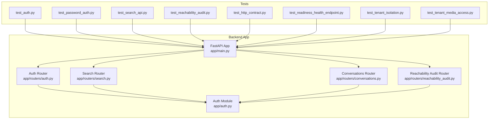
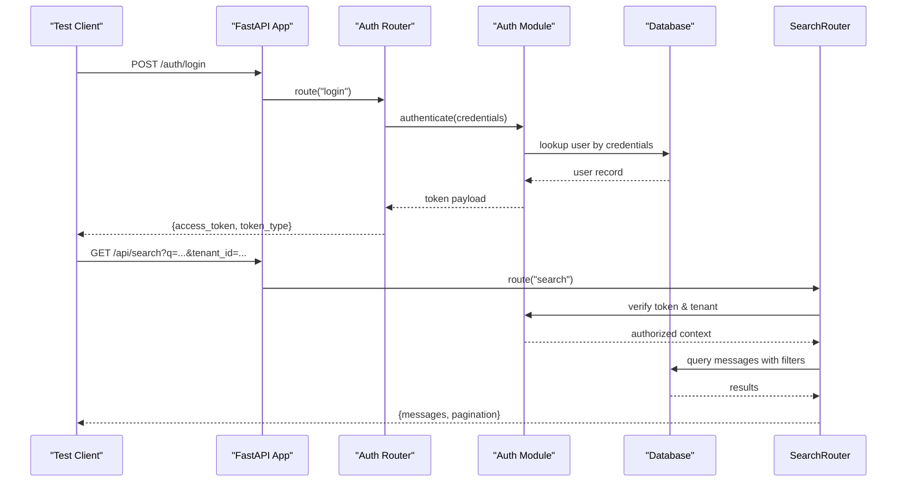
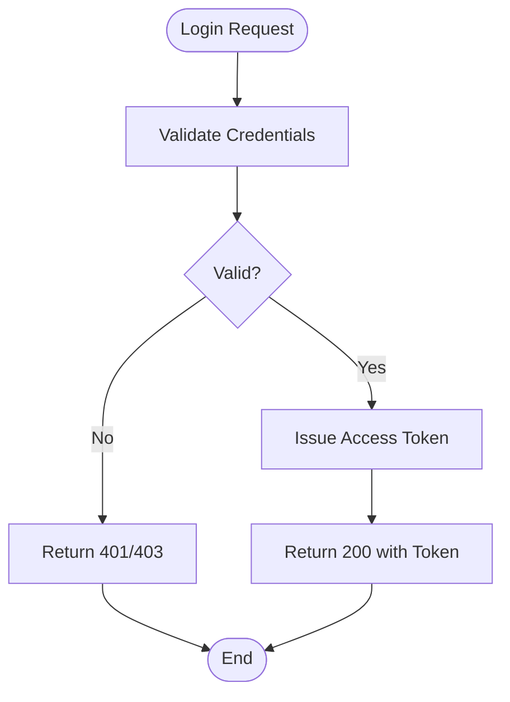
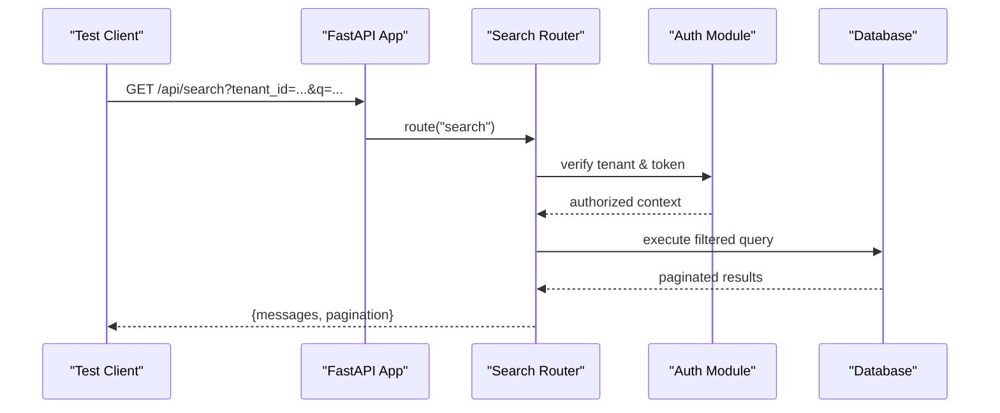
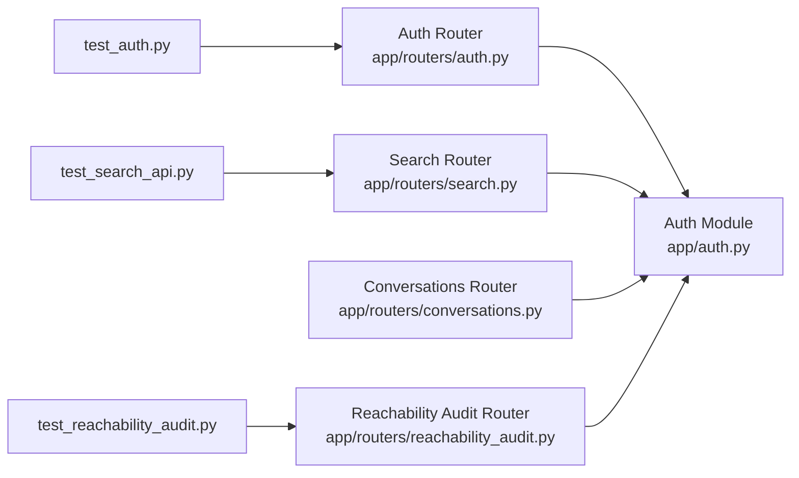

# API Integration Testing

<cite>
**Referenced Files in This Document**
- [main.py](file://backend/app/main.py)
- [auth.py](file://backend/app/auth.py)
- [auth.py](file://backend/app/routers/auth.py)
- [search.py](file://backend/app/routers/search.py)
- [conversations.py](file://backend/app/routers/conversations.py)
- [reachability_audit.py](file://backend/app/routers/reachability_audit.py)
- [test_auth.py](file://backend/tests/test_auth.py)
- [test_password_auth.py](file://backend/tests/test_password_auth.py)
- [test_search_api.py](file://backend/tests/test_search_api.py)
- [test_reachability_audit.py](file://backend/tests/test_reachability_audit.py)
- [test_rnd_230_search_filters.py](file://backend/tests/test_rnd_230_search_filters.py)
- [test_rnd_230_search_page_participants_js.py](file://backend/tests/test_rnd_230_search_page_participants_js.py)
- [test_rnd_228_search_scalability.py](file://backend/tests/test_rnd_228_search_scalability.py)
- [test_http_contract.py](file://backend/tests/test_http_contract.py)
- [test_readiness_health_endpoint.py](file://backend/tests/test_readiness_health_endpoint.py)
- [test_tenant_isolation.py](file://backend/tests/test_tenant_isolation.py)
- [test_tenant_media_access.py](file://backend/tests/test_tenant_media_access.py)
- [test_wecom_sdk_media.py](file://backend/tests/test_wecom_sdk_media.py)
- [API.md](file://docs/API.md)
</cite>

## Table of Contents
1. [Introduction](#introduction)
2. [Project Structure](#project-structure)
3. [Core Components](#core-components)
4. [Architecture Overview](#architecture-overview)
5. [Detailed Component Analysis](#detailed-component-analysis)
6. [Dependency Analysis](#dependency-analysis)
7. [Performance Considerations](#performance-considerations)
8. [Troubleshooting Guide](#troubleshooting-guide)
9. [Conclusion](#conclusion)
10. [Appendices](#appendices)

## Introduction
This document provides comprehensive guidance for API integration testing across the backend services. It focuses on end-to-end HTTP endpoint testing, authentication flow validation, and contract testing. You will learn how to test RESTful APIs (POST/GET/PUT/DELETE), validate request/response payloads, verify status codes, and assert error handling scenarios. The guide includes examples for authentication endpoints, message retrieval APIs, search functionality, and audit endpoints. It also covers test data setup, mock responses, and assertion strategies for complex API interactions.

## Project Structure
The backend exposes HTTP endpoints via FastAPI routers under app/routers. Authentication logic is implemented in app/auth.py and router-level auth handlers are defined in app/routers/auth.py. Search, conversations, and reachability audit features are exposed through dedicated routers. Tests live under backend/tests and demonstrate patterns for end-to-end HTTP calls, contract assertions, and tenant isolation checks.

**Diagram sources**
- [main.py](file://backend/app/main.py)
- [auth.py](file://backend/app/auth.py)
- [auth.py](file://backend/app/routers/auth.py)
- [search.py](file://backend/app/routers/search.py)
- [conversations.py](file://backend/app/routers/conversations.py)
- [reachability_audit.py](file://backend/app/routers/reachability_audit.py)
- [test_auth.py](file://backend/tests/test_auth.py)
- [test_password_auth.py](file://backend/tests/test_password_auth.py)
- [test_search_api.py](file://backend/tests/test_search_api.py)
- [test_reachability_audit.py](file://backend/tests/test_reachability_audit.py)
- [test_http_contract.py](file://backend/tests/test_http_contract.py)
- [test_readiness_health_endpoint.py](file://backend/tests/test_readiness_health_endpoint.py)
- [test_tenant_isolation.py](file://backend/tests/test_tenant_isolation.py)
- [test_tenant_media_access.py](file://backend/tests/test_tenant_media_access.py)

**Section sources**
- [main.py](file://backend/app/main.py)
- [auth.py](file://backend/app/auth.py)
- [auth.py](file://backend/app/routers/auth.py)
- [search.py](file://backend/app/routers/search.py)
- [conversations.py](file://backend/app/routers/conversations.py)
- [reachability_audit.py](file://backend/app/routers/reachability_audit.py)
- [test_auth.py](file://backend/tests/test_auth.py)
- [test_password_auth.py](file://backend/tests/test_password_auth.py)
- [test_search_api.py](file://backend/tests/test_search_api.py)
- [test_reachability_audit.py](file://backend/tests/test_reachability_audit.py)
- [test_http_contract.py](file://backend/tests/test_http_contract.py)
- [test_readiness_health_endpoint.py](file://backend/tests/test_readiness_health_endpoint.py)
- [test_tenant_isolation.py](file://backend/tests/test_tenant_isolation.py)
- [test_tenant_media_access.py](file://backend/tests/test_tenant_media_access.py)

## Core Components
- FastAPI application entrypoint registers routers and middleware.
- Authentication module provides token-based access control and user context extraction.
- Routers implement REST endpoints:
  - Authentication endpoints for login and token issuance.
  - Search endpoints for querying messages with filters and pagination.
  - Conversations endpoints for retrieving conversation metadata and participants.
  - Reachability audit endpoints for auditing message delivery states.
- Tests exercise these endpoints using an in-process client or HTTP client, asserting status codes, response schemas, and business rules such as tenant isolation.

Key responsibilities:
- Endpoint routing and request validation.
- Authentication and authorization enforcement.
- Data retrieval and transformation.
- Error handling and consistent response formats.

**Section sources**
- [main.py](file://backend/app/main.py)
- [auth.py](file://backend/app/auth.py)
- [auth.py](file://backend/app/routers/auth.py)
- [search.py](file://backend/app/routers/search.py)
- [conversations.py](file://backend/app/routers/conversations.py)
- [reachability_audit.py](file://backend/app/routers/reachability_audit.py)

## Architecture Overview
The system follows a layered architecture:
- Presentation layer: FastAPI routers expose HTTP endpoints.
- Security layer: Authentication module validates tokens and enforces tenant scoping.
- Business layer: Routers orchestrate domain operations (search, conversations, audit).
- Data layer: Database models and migrations manage persistence.

Integration tests interact directly with the FastAPI application to simulate real HTTP requests and validate end-to-end behavior.

**Diagram sources**
- [main.py](file://backend/app/main.py)
- [auth.py](file://backend/app/routers/auth.py)
- [auth.py](file://backend/app/auth.py)
- [search.py](file://backend/app/routers/search.py)

## Detailed Component Analysis

### Authentication Endpoints
Authentication endpoints handle credential verification and token issuance. Tests cover successful logins, invalid credentials, and closed-failure modes when authentication is disabled.

Testing strategy:
- Send POST requests with valid and invalid payloads.
- Assert status codes (e.g., 200 for success, 401/403 for failures).
- Validate response schema fields (token type, expiration, user info).
- Verify that subsequent requests require valid tokens.

**Diagram sources**
- [auth.py](file://backend/app/routers/auth.py)
- [auth.py](file://backend/app/auth.py)

**Section sources**
- [test_auth.py](file://backend/tests/test_auth.py)
- [test_password_auth.py](file://backend/tests/test_password_auth.py)
- [test_rnd216_web_shims.py](file://backend/tests/_rnd216_web_shims.py)
- [auth.py](file://backend/app/routers/auth.py)
- [auth.py](file://backend/app/auth.py)

### Search API
Search endpoints support filtering, pagination, and tenant-scoped queries. Tests validate query parameters, result shapes, and performance characteristics.

Testing strategy:
- Construct GET requests with various query parameters (keywords, date ranges, participant filters).
- Assert correct status codes and non-empty result sets where applicable.
- Validate pagination fields (page, size, total).
- Ensure tenant isolation by verifying results belong to the specified tenant.

**Diagram sources**
- [search.py](file://backend/app/routers/search.py)
- [auth.py](file://backend/app/auth.py)

**Section sources**
- [test_search_api.py](file://backend/tests/test_search_api.py)
- [test_rnd_230_search_filters.py](file://backend/tests/test_rnd_230_search_filters.py)
- [test_rnd_230_search_page_participants_js.py](file://backend/tests/test_rnd_230_search_page_participants_js.py)
- [test_rnd_228_search_scalability.py](file://backend/tests/test_rnd_228_search_scalability.py)
- [search.py](file://backend/app/routers/search.py)
- [auth.py](file://backend/app/auth.py)

### Conversations API
Conversations endpoints retrieve conversation metadata and participant lists. Tests ensure proper tenant scoping and accurate participant information.

Testing strategy:
- Send GET requests for specific conversation IDs.
- Assert presence of required fields (conversation ID, title, participants).
- Validate that only authorized tenants can access conversations.

**Section sources**
- [conversations.py](file://backend/app/routers/conversations.py)
- [test_tenant_isolation.py](file://backend/tests/test_tenant_isolation.py)

### Reachability Audit Endpoints
Reachability audit endpoints provide audit trails for message delivery states. Tests verify correctness of audit records and filtering capabilities.

Testing strategy:
- Query audit endpoints with filters (date range, message ID).
- Assert status codes and expected audit entries.
- Validate consistency between audit records and source events.

**Section sources**
- [reachability_audit.py](file://backend/app/routers/reachability_audit.py)
- [test_reachability_audit.py](file://backend/tests/test_reachability_audit.py)

### Contract Testing
Contract tests ensure stable HTTP interfaces and response schemas. They validate status codes, headers, and JSON structures across endpoints.

Testing strategy:
- Define expected response schemas for each endpoint.
- Assert exact field presence and types.
- Check content-type headers and error response formats.

**Section sources**
- [test_http_contract.py](file://backend/tests/test_http_contract.py)
- [API.md](file://docs/API.md)

### Health and Readiness Endpoints
Health and readiness endpoints indicate service availability. Tests confirm that the application responds correctly to health checks.

Testing strategy:
- Send GET requests to health/readiness paths.
- Assert 200 status and expected JSON structure.

**Section sources**
- [test_readiness_health_endpoint.py](file://backend/tests/test_readiness_health_endpoint.py)

### Tenant Isolation and Media Access
Tenant isolation tests verify that data access is scoped per tenant. Media access tests ensure secure media retrieval with proper authorization.

Testing strategy:
- Create multiple tenants and users.
- Attempt cross-tenant data access and assert failures.
- Validate signed URL generation and access windows for media.

**Section sources**
- [test_tenant_isolation.py](file://backend/tests/test_tenant_isolation.py)
- [test_tenant_media_access.py](file://backend/tests/test_tenant_media_access.py)
- [test_wecom_sdk_media.py](file://backend/tests/test_wecom_sdk_media.py)

## Dependency Analysis
The following diagram illustrates dependencies between routers and the authentication module, along with test coverage.

**Diagram sources**
- [auth.py](file://backend/app/auth.py)
- [auth.py](file://backend/app/routers/auth.py)
- [search.py](file://backend/app/routers/search.py)
- [conversations.py](file://backend/app/routers/conversations.py)
- [reachability_audit.py](file://backend/app/routers/reachability_audit.py)
- [test_auth.py](file://backend/tests/test_auth.py)
- [test_search_api.py](file://backend/tests/test_search_api.py)
- [test_reachability_audit.py](file://backend/tests/test_reachability_audit.py)

**Section sources**
- [auth.py](file://backend/app/auth.py)
- [auth.py](file://backend/app/routers/auth.py)
- [search.py](file://backend/app/routers/search.py)
- [conversations.py](file://backend/app/routers/conversations.py)
- [reachability_audit.py](file://backend/app/routers/reachability_audit.py)
- [test_auth.py](file://backend/tests/test_auth.py)
- [test_search_api.py](file://backend/tests/test_search_api.py)
- [test_reachability_audit.py](file://backend/tests/test_reachability_audit.py)

## Performance Considerations
- Use efficient query construction in search endpoints to minimize database load.
- Implement pagination to limit result sizes and improve response times.
- Cache frequently accessed data where appropriate (e.g., tenant configurations).
- Monitor latency and throughput during integration tests to detect regressions.

[No sources needed since this section provides general guidance]

## Troubleshooting Guide
Common issues and resolutions:
- Authentication failures: Verify credentials and token issuance logic; check closed-failure modes.
- Search result mismatches: Inspect query parameters and filter logic; validate tenant scoping.
- Contract violations: Compare actual responses against expected schemas; update tests if API changes intentionally.
- Health check failures: Ensure all dependencies (database, caches) are available and healthy.

**Section sources**
- [test_auth.py](file://backend/tests/test_auth.py)
- [test_password_auth.py](file://backend/tests/test_password_auth.py)
- [test_search_api.py](file://backend/tests/test_search_api.py)
- [test_http_contract.py](file://backend/tests/test_http_contract.py)
- [test_readiness_health_endpoint.py](file://backend/tests/test_readiness_health_endpoint.py)

## Conclusion
This guide outlines best practices for API integration testing, covering authentication flows, search functionality, conversation retrieval, and audit endpoints. By leveraging the provided test patterns and assertion strategies, you can ensure robust, reliable, and maintainable API integrations. Focus on clear contracts, tenant isolation, and performance considerations to deliver high-quality services.

[No sources needed since this section summarizes without analyzing specific files]

## Appendices
- API documentation reference: [API.md](file://docs/API.md)
- Additional test examples: explore files under backend/tests for comprehensive coverage patterns.