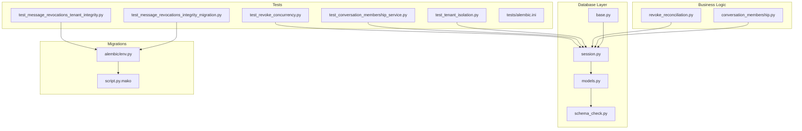
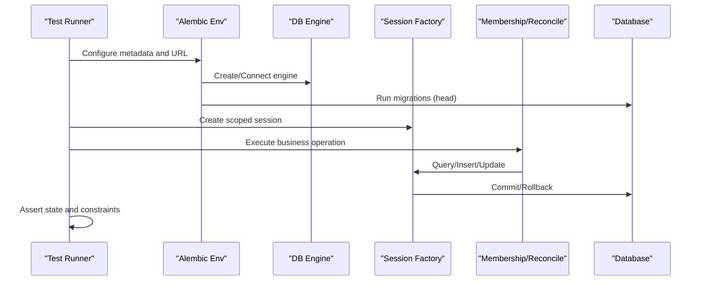
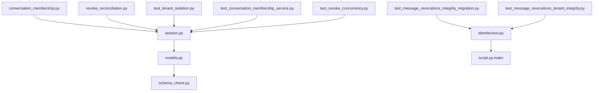

# Database Integration Testing

<cite>
**Referenced Files in This Document**
- [alembic/env.py](file://backend/alembic/env.py)
- [alembic/script.py.mako](file://backend/alembic/script.py.mako)
- [app/db/base.py](file://backend/app/db/base.py)
- [app/db/session.py](file://backend/app/db/session.py)
- [app/db/models.py](file://backend/app/db/models.py)
- [app/db/schema_check.py](file://backend/app/db/schema_check.py)
- [app/conversation_membership.py](file://backend/app/conversation_membership.py)
- [app/revoke_reconciliation.py](file://backend/app/revoke_reconciliation.py)
- [scripts/check_message_revocations_integrity.py](file://backend/scripts/check_message_revocations_integrity.py)
- [tests/test_tenant_isolation.py](file://backend/tests/test_tenant_isolation.py)
- [tests/test_conversation_membership_service.py](file://backend/tests/test_conversation_membership_service.py)
- [tests/test_message_revocations_integrity_migration.py](file://backend/tests/test_message_revocations_integrity_migration.py)
- [tests/test_message_revocations_tenant_integrity.py](file://backend/tests/test_message_revocations_tenant_integrity.py)
- [tests/test_revoke_concurrency.py](file://backend/tests/test_revoke_concurrency.py)
- [tests/alembic.ini](file://backend/tests/alembic.ini)
- [tests/requirements.txt](file://backend/tests/requirements.txt)
</cite>

## Table of Contents
1. [Introduction](#introduction)
2. [Project Structure](#project-structure)
3. [Core Components](#core-components)
4. [Architecture Overview](#architecture-overview)
5. [Detailed Component Analysis](#detailed-component-analysis)
6. [Dependency Analysis](#dependency-analysis)
7. [Performance Considerations](#performance-considerations)
8. [Troubleshooting Guide](#troubleshooting-guide)
9. [Conclusion](#conclusion)
10. [Appendices](#appendices)

## Introduction
This document provides a comprehensive guide to database integration testing for the project, focusing on transactional behavior, concurrent access scenarios, and data consistency validation. It explains how to set up test databases, manage fixtures, simulate real-world operations, and validate tenant isolation, conversation membership management, message revocation integrity, and migration scripts. It also covers connection pooling strategies, transaction rollback approaches, and performance testing techniques for database-heavy workloads.

## Project Structure
The database layer is implemented with SQLAlchemy and Alembic migrations. Tests are organized under backend/tests and include dedicated tests for tenant isolation, conversation membership, message revocation integrity, concurrency, and migrations. The Alembic configuration and environment setup are located under backend/alembic.

**Diagram sources**
- [app/db/base.py](file://backend/app/db/base.py)
- [app/db/session.py](file://backend/app/db/session.py)
- [app/db/models.py](file://backend/app/db/models.py)
- [app/db/schema_check.py](file://backend/app/db/schema_check.py)
- [app/conversation_membership.py](file://backend/app/conversation_membership.py)
- [app/revoke_reconciliation.py](file://backend/app/revoke_reconciliation.py)
- [alembic/env.py](file://backend/alembic/env.py)
- [alembic/script.py.mako](file://backend/alembic/script.py.mako)
- [tests/test_tenant_isolation.py](file://backend/tests/test_tenant_isolation.py)
- [tests/test_conversation_membership_service.py](file://backend/tests/test_conversation_membership_service.py)
- [tests/test_message_revocations_integrity_migration.py](file://backend/tests/test_message_revocations_integrity_migration.py)
- [tests/test_message_revocations_tenant_integrity.py](file://backend/tests/test_message_revocations_tenant_integrity.py)
- [tests/test_revoke_concurrency.py](file://backend/tests/test_revoke_concurrency.py)
- [tests/alembic.ini](file://backend/tests/alembic.ini)

**Section sources**
- [alembic/env.py](file://backend/alembic/env.py)
- [alembic/script.py.mako](file://backend/alembic/script.py.mako)
- [app/db/base.py](file://backend/app/db/base.py)
- [app/db/session.py](file://backend/app/db/session.py)
- [app/db/models.py](file://backend/app/db/models.py)
- [app/db/schema_check.py](file://backend/app/db/schema_check.py)
- [app/conversation_membership.py](file://backend/app/conversation_membership.py)
- [app/revoke_reconciliation.py](file://backend/app/revoke_reconciliation.py)
- [tests/test_tenant_isolation.py](file://backend/tests/test_tenant_isolation.py)
- [tests/test_conversation_membership_service.py](file://backend/tests/test_conversation_membership_service.py)
- [tests/test_message_revocations_integrity_migration.py](file://backend/tests/test_message_revocations_integrity_migration.py)
- [tests/test_message_revocations_tenant_integrity.py](file://backend/tests/test_message_revocations_tenant_integrity.py)
- [tests/test_revoke_concurrency.py](file://backend/tests/test_revoke_concurrency.py)
- [tests/alembic.ini](file://backend/tests/alembic.ini)

## Core Components
- Database session management: Centralized session factory and engine configuration ensure consistent connections across tests and application code.
- Model definitions: Declarative models define entities such as tenants, conversations, memberships, messages, and revocations.
- Migration environment: Alembic environment configures metadata and runs migrations within isolated test contexts.
- Business services: Conversation membership and revoke reconciliation implement core business logic that interacts with the database.

Key responsibilities:
- Provide reusable session scopes for tests (per-test or per-function).
- Ensure schema readiness via Alembic before running tests.
- Enforce tenant scoping at query boundaries.
- Validate constraints and integrity rules through assertions and helper utilities.

**Section sources**
- [app/db/session.py](file://backend/app/db/session.py)
- [app/db/models.py](file://backend/app/db/models.py)
- [alembic/env.py](file://backend/alembic/env.py)
- [app/conversation_membership.py](file://backend/app/conversation_membership.py)
- [app/revoke_reconciliation.py](file://backend/app/revoke_reconciliation.py)

## Architecture Overview
The integration testing architecture centers around an isolated test database, Alembic-managed schema, and session-scoped transactions. Tests bootstrap the database, run migrations, create fixtures, execute operations, and assert outcomes while ensuring isolation between tenants and correctness of revocation semantics.

**Diagram sources**
- [alembic/env.py](file://backend/alembic/env.py)
- [alembic/script.py.mako](file://backend/alembic/script.py.mako)
- [app/db/session.py](file://backend/app/db/session.py)
- [app/conversation_membership.py](file://backend/app/conversation_membership.py)
- [app/revoke_reconciliation.py](file://backend/app/revoke_reconciliation.py)

## Detailed Component Analysis

### Database Session and Connection Pooling
- Session factory encapsulates engine creation, connection parameters, and session scoping.
- Connection pooling is configured via engine arguments; tests should use short-lived sessions to avoid pool exhaustion.
- For concurrent tests, isolate engines per process or use separate databases to prevent contention.

Recommendations:
- Use per-test session scope to guarantee clean state.
- Tune pool size and timeouts based on test concurrency levels.
- Avoid long-running transactions in tests to reduce lock contention.

**Section sources**
- [app/db/session.py](file://backend/app/db/session.py)

### Models and Tenant Scoping
- Models define relationships among tenants, conversations, members, messages, and revocations.
- Tenant scoping should be enforced at query boundaries to ensure isolation.
- Use explicit filters by tenant_id in all queries to prevent cross-tenant data leakage.

Best practices:
- Centralize tenant filtering in repository or service layers.
- Add unit-level assertions verifying tenant isolation in tests.

**Section sources**
- [app/db/models.py](file://backend/app/db/models.py)
- [tests/test_tenant_isolation.py](file://backend/tests/test_tenant_isolation.py)

### Alembic Migration Environment
- The Alembic environment sets up metadata, engine URL, and runs migrations against the test database.
- Tests should invoke Alembic upgrade to head before asserting schema-dependent behavior.
- Use alembic.ini in tests to override configuration for test environments.

Operational steps:
- Configure test database URL in alembic.ini or environment variables.
- Run migrations prior to test execution.
- Verify schema version matches expected head.

**Section sources**
- [alembic/env.py](file://backend/alembic/env.py)
- [alembic/script.py.mako](file://backend/alembic/script.py.mako)
- [tests/alembic.ini](file://backend/tests/alembic.ini)

### Conversation Membership Management
- The membership service handles adding/removing participants and validating membership constraints.
- Tests should cover edge cases like duplicate memberships, invalid roles, and cascading updates.
- Ensure atomicity of membership changes within transactions.

Validation patterns:
- Assert membership counts before and after operations.
- Verify referential integrity and constraint enforcement.

**Section sources**
- [app/conversation_membership.py](file://backend/app/conversation_membership.py)
- [tests/test_conversation_membership_service.py](file://backend/tests/test_conversation_membership_service.py)

### Message Revocation Integrity
- Revocation logic ensures messages can be revoked consistently and associations are maintained.
- Integrity checks verify that revocations align with message states and tenant boundaries.
- Scripts and tests validate revocation consistency across datasets.

Testing approach:
- Simulate message creation followed by revocation.
- Assert revocation records exist and message state reflects revocation.
- Run integrity checks post-operation to confirm no inconsistencies.

**Section sources**
- [app/revoke_reconciliation.py](file://backend/app/revoke_reconciliation.py)
- [scripts/check_message_revocations_integrity.py](file://backend/scripts/check_message_revocations_integrity.py)
- [tests/test_message_revocations_integrity_migration.py](file://backend/tests/test_message_revocations_integrity_migration.py)
- [tests/test_message_revocations_tenant_integrity.py](file://backend/tests/test_message_revocations_tenant_integrity.py)

### Concurrency and Transaction Rollbacks
- Concurrent revocation tests simulate simultaneous operations to detect race conditions.
- Transactions must roll back cleanly on failures to maintain consistency.
- Use explicit transaction boundaries and error handling to ensure atomicity.

Concurrency strategies:
- Use separate sessions per thread/process.
- Employ retry logic for transient conflicts.
- Validate final state after concurrent operations complete.

**Section sources**
- [tests/test_revoke_concurrency.py](file://backend/tests/test_revoke_concurrency.py)

### Data Consistency Validation
- Schema checks enforce structural integrity and constraints.
- Custom validators and assertion helpers ensure business rules hold.
- Post-migration verification confirms schema readiness and data validity.

Validation techniques:
- Run schema checks before and after migrations.
- Assert foreign key constraints and unique indexes.
- Use integrity scripts to scan for anomalies.

**Section sources**
- [app/db/schema_check.py](file://backend/app/db/schema_check.py)
- [scripts/check_message_revocations_integrity.py](file://backend/scripts/check_message_revocations_integrity.py)

## Dependency Analysis
The following diagram illustrates dependencies between core components used in integration testing.

**Diagram sources**
- [app/db/session.py](file://backend/app/db/session.py)
- [app/db/models.py](file://backend/app/db/models.py)
- [app/db/schema_check.py](file://backend/app/db/schema_check.py)
- [app/conversation_membership.py](file://backend/app/conversation_membership.py)
- [app/revoke_reconciliation.py](file://backend/app/revoke_reconciliation.py)
- [alembic/env.py](file://backend/alembic/env.py)
- [alembic/script.py.mako](file://backend/alembic/script.py.mako)
- [tests/test_tenant_isolation.py](file://backend/tests/test_tenant_isolation.py)
- [tests/test_conversation_membership_service.py](file://backend/tests/test_conversation_membership_service.py)
- [tests/test_message_revocations_integrity_migration.py](file://backend/tests/test_message_revocations_integrity_migration.py)
- [tests/test_message_revocations_tenant_integrity.py](file://backend/tests/test_message_revocations_tenant_integrity.py)
- [tests/test_revoke_concurrency.py](file://backend/tests/test_revoke_concurrency.py)

**Section sources**
- [app/db/session.py](file://backend/app/db/session.py)
- [app/db/models.py](file://backend/app/db/models.py)
- [app/db/schema_check.py](file://backend/app/db/schema_check.py)
- [app/conversation_membership.py](file://backend/app/conversation_membership.py)
- [app/revoke_reconciliation.py](file://backend/app/revoke_reconciliation.py)
- [alembic/env.py](file://backend/alembic/env.py)
- [alembic/script.py.mako](file://backend/alembic/script.py.mako)
- [tests/test_tenant_isolation.py](file://backend/tests/test_tenant_isolation.py)
- [tests/test_conversation_membership_service.py](file://backend/tests/test_conversation_membership_service.py)
- [tests/test_message_revocations_integrity_migration.py](file://backend/tests/test_message_revocations_integrity_migration.py)
- [tests/test_message_revocations_tenant_integrity.py](file://backend/tests/test_message_revocations_tenant_integrity.py)
- [tests/test_revoke_concurrency.py](file://backend/tests/test_revoke_concurrency.py)

## Performance Considerations
- Connection pooling: Adjust pool size and max overflow to match test concurrency. Monitor pool utilization during heavy test suites.
- Transaction boundaries: Keep transactions short to minimize lock duration and deadlocks.
- Batch operations: Use bulk inserts/updates where appropriate to reduce round trips.
- Indexing: Ensure indexes support common query patterns in tests to reflect production performance characteristics.
- Isolation level: Choose appropriate isolation levels to balance consistency and throughput.

[No sources needed since this section provides general guidance]

## Troubleshooting Guide
Common issues and resolutions:
- Migration failures: Verify Alembic env configuration and database URL. Ensure migrations are applied to head before tests.
- Session leaks: Confirm sessions are closed or rolled back after each test.
- Tenant isolation breaches: Audit queries for missing tenant filters.
- Constraint violations: Inspect model definitions and foreign key constraints.
- Concurrency conflicts: Implement retries and validate final state after concurrent operations.

Diagnostic steps:
- Enable SQL logging to inspect generated queries.
- Run integrity checks post-migration and post-operation.
- Use schema checks to validate structure and constraints.

**Section sources**
- [alembic/env.py](file://backend/alembic/env.py)
- [app/db/schema_check.py](file://backend/app/db/schema_check.py)
- [scripts/check_message_revocations_integrity.py](file://backend/scripts/check_message_revocations_integrity.py)

## Conclusion
Effective database integration testing requires careful setup of isolated test databases, robust session management, and comprehensive coverage of transactional and concurrent scenarios. By leveraging Alembic for schema evolution, enforcing tenant isolation, and validating revocation integrity, teams can ensure data consistency and reliability. Adopting best practices for connection pooling, transaction boundaries, and performance tuning will further strengthen test stability and fidelity.

[No sources needed since this section summarizes without analyzing specific files]

## Appendices

### Setting Up Test Databases
- Configure Alembic test settings in alembic.ini or environment variables.
- Initialize the test database and apply migrations to head.
- Use per-test session scopes to maintain isolation.

**Section sources**
- [tests/alembic.ini](file://backend/tests/alembic.ini)
- [alembic/env.py](file://backend/alembic/env.py)

### Managing Test Fixtures
- Create deterministic fixtures for tenants, conversations, members, and messages.
- Use fixtures to seed baseline data required by tests.
- Clean up fixtures after each test to prevent state leakage.

**Section sources**
- [app/db/models.py](file://backend/app/db/models.py)
- [tests/test_tenant_isolation.py](file://backend/tests/test_tenant_isolation.py)

### Simulating Real-World Operations
- Replicate user workflows: create conversations, add members, send messages, revoke messages.
- Validate intermediate states and final outcomes.
- Introduce controlled failures to test rollback behavior.

**Section sources**
- [app/conversation_membership.py](file://backend/app/conversation_membership.py)
- [app/revoke_reconciliation.py](file://backend/app/revoke_reconciliation.py)

### Testing Tenant Isolation
- Assert that queries return only data belonging to the active tenant.
- Cross-tenant operations should fail or be filtered appropriately.
- Validate constraints preventing accidental data sharing.

**Section sources**
- [tests/test_tenant_isolation.py](file://backend/tests/test_tenant_isolation.py)

### Conversation Membership Management Tests
- Cover add/remove member flows and role assignments.
- Validate uniqueness constraints and cascade behaviors.
- Ensure atomic updates within transactions.

**Section sources**
- [tests/test_conversation_membership_service.py](file://backend/tests/test_conversation_membership_service.py)

### Message Revocation Integrity Tests
- Simulate message creation and revocation sequences.
- Assert revocation records and message state transitions.
- Run integrity checks to confirm no inconsistencies.

**Section sources**
- [tests/test_message_revocations_integrity_migration.py](file://backend/tests/test_message_revocations_integrity_migration.py)
- [tests/test_message_revocations_tenant_integrity.py](file://backend/tests/test_message_revocations_tenant_integrity.py)

### Concurrency and Rollback Strategies
- Use concurrent threads/processes to simulate real load.
- Implement retry logic for transient conflicts.
- Validate final state after concurrent operations complete.

**Section sources**
- [tests/test_revoke_concurrency.py](file://backend/tests/test_revoke_concurrency.py)

### Migration Scripts Testing
- Apply migrations in test environment and verify schema changes.
- Validate backward compatibility and idempotency.
- Use integrity scripts to check data consistency post-migration.

**Section sources**
- [alembic/env.py](file://backend/alembic/env.py)
- [scripts/check_message_revocations_integrity.py](file://backend/scripts/check_message_revocations_integrity.py)

### Connection Pooling and Performance Testing
- Tune pool size and timeouts based on test concurrency.
- Monitor pool metrics and adjust configurations accordingly.
- Use batch operations and indexing to improve performance.

**Section sources**
- [app/db/session.py](file://backend/app/db/session.py)