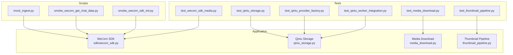
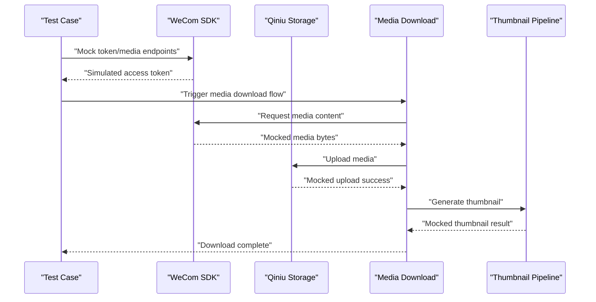
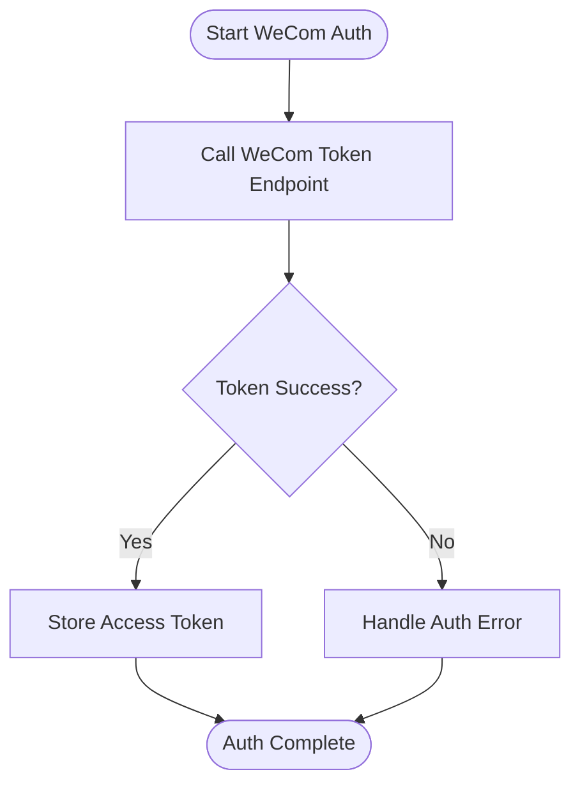
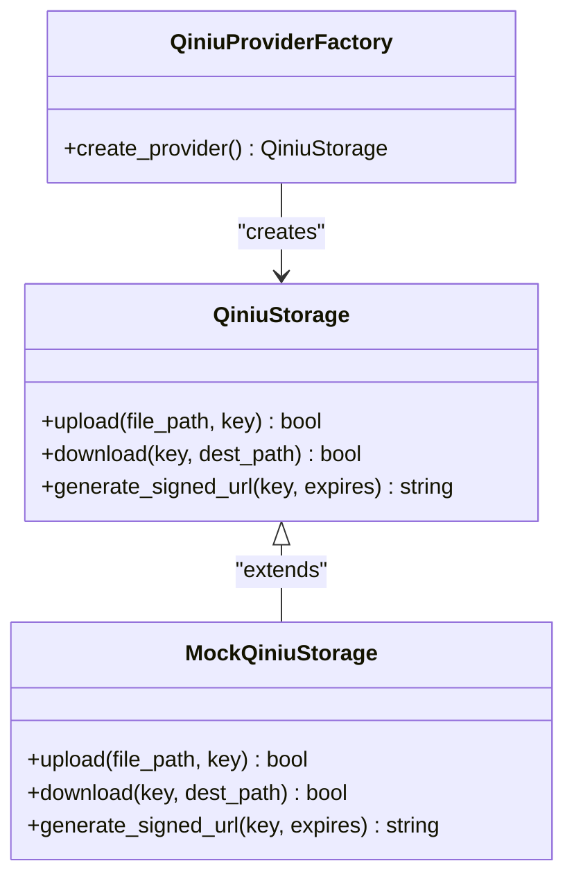
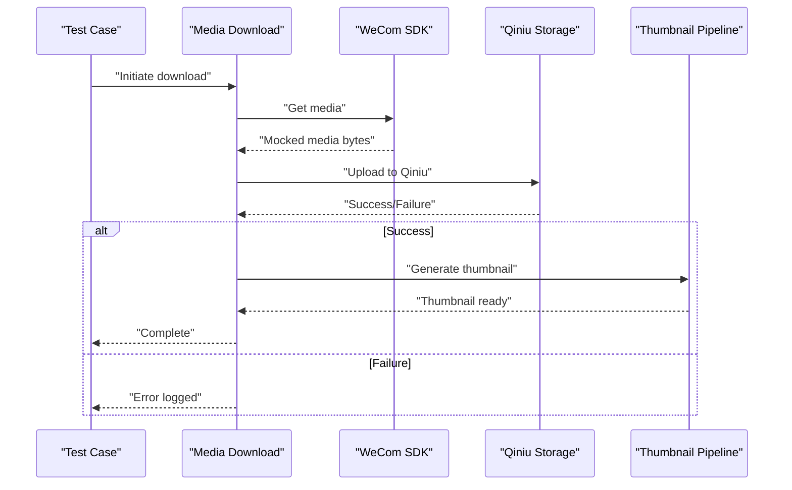
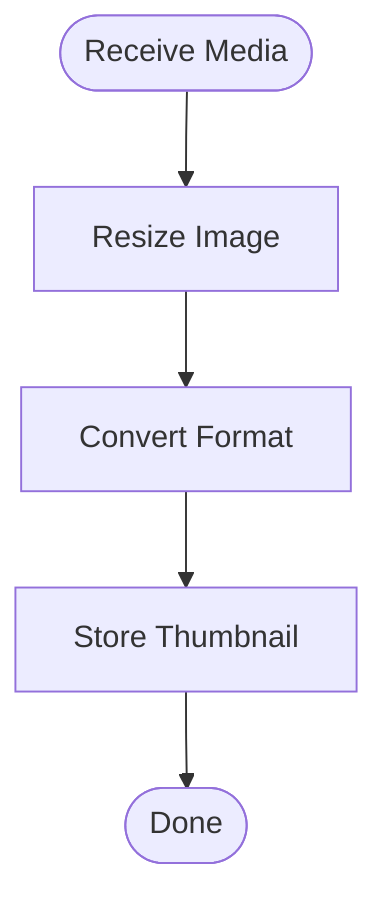
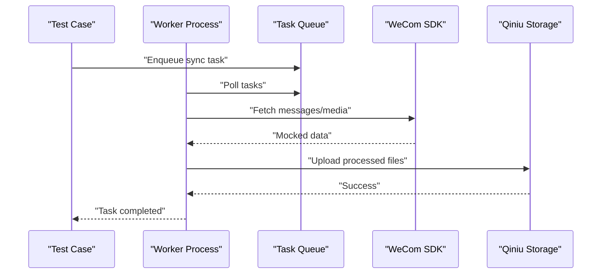
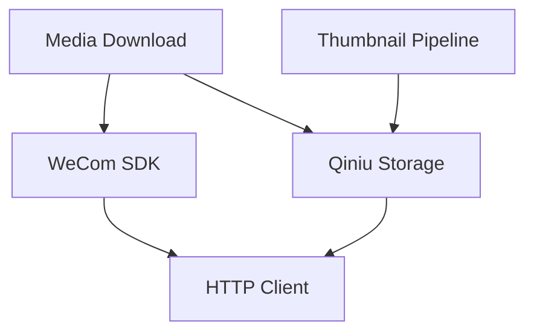

# External Service Mocking

<cite>
**Referenced Files in This Document**
- [wecom_sdk.py](file://backend/app/sdk/wecom_sdk.py)
- [qiniu_storage.py](file://backend/app/qiniu_storage.py)
- [media_download.py](file://backend/app/media_download.py)
- [thumbnail_pipeline.py](file://backend/app/thumbnail_pipeline.py)
- [test_wecom_sdk_media.py](file://backend/tests/test_wecom_sdk_media.py)
- [test_qiniu_storage.py](file://backend/tests/test_qiniu_storage.py)
- [test_qiniu_provider_factory.py](file://backend/tests/test_qiniu_provider_factory.py)
- [test_qiniu_worker_integration.py](file://backend/tests/test_qiniu_worker_integration.py)
- [test_qiniu_https_domain.py](file://backend/tests/test_qiniu_https_domain.py)
- [test_media_download.py](file://backend/tests/test_media_download.py)
- [test_thumbnail_pipeline.py](file://backend/tests/test_thumbnail_pipeline.py)
- [mock_ingest.py](file://backend/scripts/mock_ingest.py)
- [smoke_wecom_get_chat_data.py](file://backend/scripts/smoke_wecom_get_chat_data.py)
- [smoke_wecom_sdk_init.py](file://backend/scripts/smoke_wecom_sdk_init.py)
</cite>

## Table of Contents
1. [Introduction](#introduction)
2. [Project Structure](#project-structure)
3. [Core Components](#core-components)
4. [Architecture Overview](#architecture-overview)
5. [Detailed Component Analysis](#detailed-component-analysis)
6. [Dependency Analysis](#dependency-analysis)
7. [Performance Considerations](#performance-considerations)
8. [Troubleshooting Guide](#troubleshooting-guide)
9. [Conclusion](#conclusion)

## Introduction
This document explains how to mock external services for WeCom SDK and Qiniu storage integration testing within the project. It covers HTTP request mocking, simulating API responses, handling authentication flows, and testing error scenarios such as rate limiting, timeouts, and network failures. It also provides guidance for mocking media download operations from WeCom, file upload/download with Qiniu, worker processes, and provider factories used by the application.

## Project Structure
The relevant code for external service interactions and their tests is primarily located under backend/app and backend/tests:
- WeCom SDK integration: backend/app/sdk/wecom_sdk.py
- Qiniu storage integration: backend/app/qiniu_storage.py
- Media download orchestration: backend/app/media_download.py
- Thumbnail pipeline: backend/app/thumbnail_pipeline.py
- Tests for WeCom SDK media: backend/tests/test_wecom_sdk_media.py
- Tests for Qiniu storage and providers: backend/tests/test_qiniu_storage.py, test_qiniu_provider_factory.py, test_qiniu_https_domain.py
- Worker integration tests: backend/tests/test_qiniu_worker_integration.py
- Media download tests: backend/tests/test_media_download.py
- Thumbnail pipeline tests: backend/tests/test_thumbnail_pipeline.py
- Utility scripts for smoke tests and mocks: backend/scripts/mock_ingest.py, smoke_wecom_get_chat_data.py, smoke_wecom_sdk_init.py

**Diagram sources**
- [wecom_sdk.py](file://backend/app/sdk/wecom_sdk.py)
- [qiniu_storage.py](file://backend/app/qiniu_storage.py)
- [media_download.py](file://backend/app/media_download.py)
- [thumbnail_pipeline.py](file://backend/app/thumbnail_pipeline.py)
- [test_wecom_sdk_media.py](file://backend/tests/test_wecom_sdk_media.py)
- [test_qiniu_storage.py](file://backend/tests/test_qiniu_storage.py)
- [test_qiniu_provider_factory.py](file://backend/tests/test_qiniu_provider_factory.py)
- [test_qiniu_worker_integration.py](file://backend/tests/test_qiniu_worker_integration.py)
- [test_media_download.py](file://backend/tests/test_media_download.py)
- [test_thumbnail_pipeline.py](file://backend/tests/test_thumbnail_pipeline.py)
- [mock_ingest.py](file://backend/scripts/mock_ingest.py)
- [smoke_wecom_get_chat_data.py](file://backend/scripts/smoke_wecom_get_chat_data.py)
- [smoke_wecom_sdk_init.py](file://backend/scripts/smoke_wecom_sdk_init.py)

**Section sources**
- [wecom_sdk.py](file://backend/app/sdk/wecom_sdk.py)
- [qiniu_storage.py](file://backend/app/qiniu_storage.py)
- [media_download.py](file://backend/app/media_download.py)
- [thumbnail_pipeline.py](file://backend/app/thumbnail_pipeline.py)
- [test_wecom_sdk_media.py](file://backend/tests/test_wecom_sdk_media.py)
- [test_qiniu_storage.py](file://backend/tests/test_qiniu_storage.py)
- [test_qiniu_provider_factory.py](file://backend/tests/test_qiniu_provider_factory.py)
- [test_qiniu_worker_integration.py](file://backend/tests/test_qiniu_worker_integration.py)
- [test_media_download.py](file://backend/tests/test_media_download.py)
- [test_thumbnail_pipeline.py](file://backend/tests/test_thumbnail_pipeline.py)
- [mock_ingest.py](file://backend/scripts/mock_ingest.py)
- [smoke_wecom_get_chat_data.py](file://backend/scripts/smoke_wecom_get_chat_data.py)
- [smoke_wecom_sdk_init.py](file://backend/scripts/smoke_wecom_sdk_init.py)

## Core Components
- WeCom SDK: Provides methods to interact with WeCom APIs (e.g., token acquisition, media download). For testing, you can replace or wrap its HTTP calls to simulate responses and errors.
- Qiniu Storage: Implements upload/download operations and signed URL generation. Tests should mock HTTP requests to Qiniu endpoints and simulate success/failure paths.
- Media Download: Orchestrates fetching media from WeCom and storing it via storage backends. Testing focuses on mocking WeCom media endpoints and storage operations.
- Thumbnail Pipeline: Processes thumbnails after media download. Tests should mock image processing steps and storage writes.

Key patterns for mocking:
- Replace HTTP clients with test doubles that return predefined responses or raise exceptions.
- Use environment variables or configuration flags to switch between real and mocked endpoints.
- Inject mock providers into factory functions to control behavior deterministically.

**Section sources**
- [wecom_sdk.py](file://backend/app/sdk/wecom_sdk.py)
- [qiniu_storage.py](file://backend/app/qiniu_storage.py)
- [media_download.py](file://backend/app/media_download.py)
- [thumbnail_pipeline.py](file://backend/app/thumbnail_pipeline.py)

## Architecture Overview
The system integrates WeCom SDK for message and media retrieval and Qiniu storage for persistent media management. Tests isolate these integrations by mocking HTTP calls and simulating various response scenarios.

**Diagram sources**
- [wecom_sdk.py](file://backend/app/sdk/wecom_sdk.py)
- [qiniu_storage.py](file://backend/app/qiniu_storage.py)
- [media_download.py](file://backend/app/media_download.py)
- [thumbnail_pipeline.py](file://backend/app/thumbnail_pipeline.py)

## Detailed Component Analysis

### WeCom SDK Mocking
- Authentication Flow: Mock token acquisition by intercepting HTTP requests to WeCom auth endpoints. Return valid tokens or simulate failures (e.g., invalid credentials).
- Media Download: Intercept media download requests and return predefined binary data or simulate network errors.
- Rate Limiting: Simulate 429 responses and verify retry/backoff logic.
- Timeouts: Force socket timeouts to validate error handling and logging.

**Diagram sources**
- [wecom_sdk.py](file://backend/app/sdk/wecom_sdk.py)

**Section sources**
- [wecom_sdk.py](file://backend/app/sdk/wecom_sdk.py)
- [test_wecom_sdk_media.py](file://backend/tests/test_wecom_sdk_media.py)
- [smoke_wecom_get_chat_data.py](file://backend/scripts/smoke_wecom_get_chat_data.py)
- [smoke_wecom_sdk_init.py](file://backend/scripts/smoke_wecom_sdk_init.py)

### Qiniu Storage Mocking
- Upload/Download: Mock HTTP calls to Qiniu upload and download endpoints. Return success responses or simulate failures (e.g., 500 errors, network unreachable).
- Signed URLs: Mock signed URL generation and expiration behavior.
- Provider Factory: Inject mock providers to control upload/download outcomes deterministically.
- HTTPS Domain: Validate domain configuration and certificate handling by mocking TLS handshake.

**Diagram sources**
- [qiniu_storage.py](file://backend/app/qiniu_storage.py)
- [test_qiniu_provider_factory.py](file://backend/tests/test_qiniu_provider_factory.py)

**Section sources**
- [qiniu_storage.py](file://backend/app/qiniu_storage.py)
- [test_qiniu_storage.py](file://backend/tests/test_qiniu_storage.py)
- [test_qiniu_provider_factory.py](file://backend/tests/test_qiniu_provider_factory.py)
- [test_qiniu_https_domain.py](file://backend/tests/test_qiniu_https_domain.py)

### Media Download Orchestration
- Workflow: Fetch media from WeCom, store via Qiniu, generate thumbnails.
- Mocking Strategy: Mock WeCom media endpoints and Qiniu storage operations. Simulate partial downloads and retries.
- Error Handling: Test scenarios where WeCom returns errors or Qiniu upload fails.

**Diagram sources**
- [media_download.py](file://backend/app/media_download.py)
- [wecom_sdk.py](file://backend/app/sdk/wecom_sdk.py)
- [qiniu_storage.py](file://backend/app/qiniu_storage.py)
- [thumbnail_pipeline.py](file://backend/app/thumbnail_pipeline.py)

**Section sources**
- [media_download.py](file://backend/app/media_download.py)
- [test_media_download.py](file://backend/tests/test_media_download.py)

### Thumbnail Pipeline
- Processing: Accepts downloaded media, generates thumbnails, stores results.
- Mocking: Mock image processing libraries and storage writes. Simulate large images and failure cases.

**Diagram sources**
- [thumbnail_pipeline.py](file://backend/app/thumbnail_pipeline.py)

**Section sources**
- [thumbnail_pipeline.py](file://backend/app/thumbnail_pipeline.py)
- [test_thumbnail_pipeline.py](file://backend/tests/test_thumbnail_pipeline.py)

### Worker Processes
- Purpose: Background tasks for syncing, downloading, and processing media.
- Mocking: Simulate task queues and external service calls. Test idempotency and retry logic.

**Diagram sources**
- [test_qiniu_worker_integration.py](file://backend/tests/test_qiniu_worker_integration.py)

**Section sources**
- [test_qiniu_worker_integration.py](file://backend/tests/test_qiniu_worker_integration.py)

## Dependency Analysis
External dependencies include WeCom SDK and Qiniu storage. Tests isolate these by mocking HTTP clients and injecting test doubles.

**Diagram sources**
- [wecom_sdk.py](file://backend/app/sdk/wecom_sdk.py)
- [qiniu_storage.py](file://backend/app/qiniu_storage.py)
- [media_download.py](file://backend/app/media_download.py)
- [thumbnail_pipeline.py](file://backend/app/thumbnail_pipeline.py)

**Section sources**
- [wecom_sdk.py](file://backend/app/sdk/wecom_sdk.py)
- [qiniu_storage.py](file://backend/app/qiniu_storage.py)
- [media_download.py](file://backend/app/media_download.py)
- [thumbnail_pipeline.py](file://backend/app/thumbnail_pipeline.py)

## Performance Considerations
- Avoid unnecessary I/O in tests by using fast mocks.
- Simulate high-latency scenarios to validate timeout handling.
- Test concurrency limits and retry mechanisms under load.

[No sources needed since this section provides general guidance]

## Troubleshooting Guide
Common issues and resolutions:
- Authentication Failures: Verify mocked token responses match expected formats.
- Network Errors: Ensure mocks simulate realistic error codes and messages.
- Rate Limiting: Confirm retry logic respects backoff strategies.
- Timeout Handling: Validate that timeouts are caught and logged appropriately.

**Section sources**
- [test_wecom_sdk_media.py](file://backend/tests/test_wecom_sdk_media.py)
- [test_qiniu_storage.py](file://backend/tests/test_qiniu_storage.py)
- [test_media_download.py](file://backend/tests/test_media_download.py)

## Conclusion
Effective mocking of WeCom SDK and Qiniu storage enables robust integration testing. By simulating API responses, handling errors, and validating workflows, tests ensure reliability and resilience in production environments.

[No sources needed since this section summarizes without analyzing specific files]