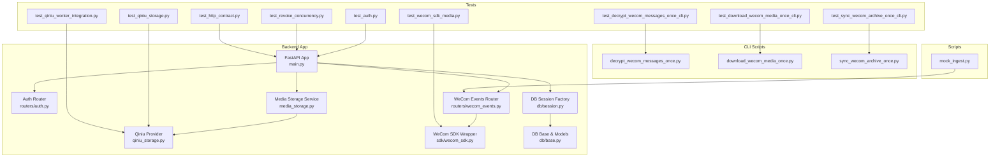
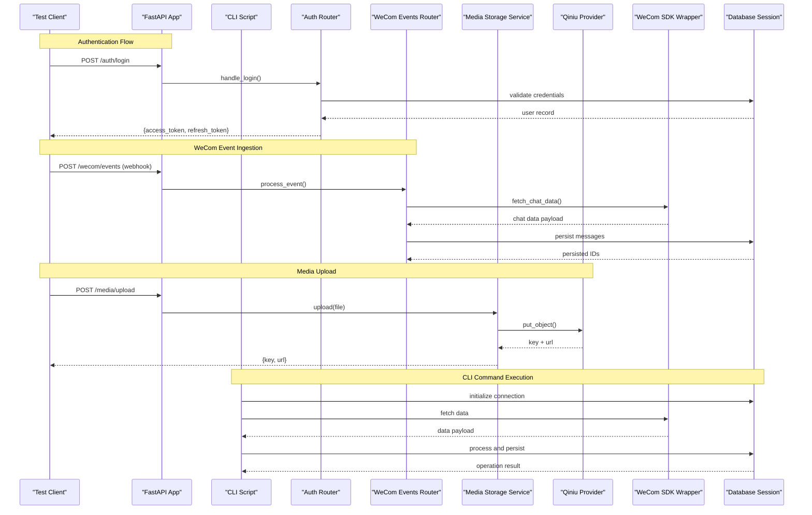
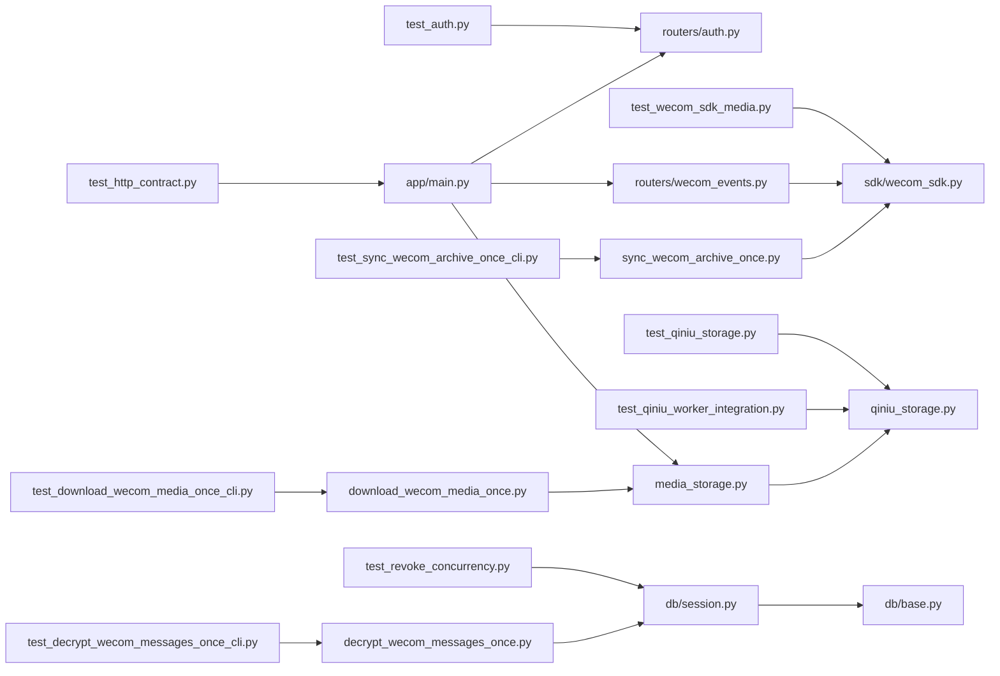

# Integration Testing

<cite>
**Referenced Files in This Document**
- [backend/app/main.py](file://backend/app/main.py)
- [backend/app/auth.py](file://backend/app/auth.py)
- [backend/app/routers/auth.py](file://backend/app/routers/auth.py)
- [backend/app/routers/wecom_events.py](file://backend/app/routers/wecom_events.py)
- [backend/app/media_storage.py](file://backend/app/media_storage.py)
- [backend/app/qiniu_storage.py](file://backend/app/qiniu_storage.py)
- [backend/app/sdk/wecom_sdk.py](file://backend/app/sdk/wecom_sdk.py)
- [backend/app/db/base.py](file://backend/app/db/base.py)
- [backend/app/db/session.py](file://backend/app/db/session.py)
- [backend/tests/test_auth.py](file://backend/tests/test_auth.py)
- [backend/tests/test_wecom_sdk_media.py](file://backend/tests/test_wecom_sdk_media.py)
- [backend/tests/test_qiniu_storage.py](file://backend/tests/test_qiniu_storage.py)
- [backend/tests/test_qiniu_worker_integration.py](file://backend/tests/test_qiniu_worker_integration.py)
- [backend/tests/test_revoke_concurrency.py](file://backend/tests/test_revoke_concurrency.py)
- [backend/tests/test_http_contract.py](file://backend/tests/test_http_contract.py)
- [backend/tests/alembic.ini](file://backend/tests/alembic.ini)
- [backend/tests/requirements.txt](file://backend/tests/requirements.txt)
- [backend/scripts/mock_ingest.py](file://backend/scripts/mock_ingest.py)
- [backend/tests/test_decrypt_wecom_messages_once_cli.py](file://backend/tests/test_decrypt_wecom_messages_once_cli.py)
- [backend/tests/test_download_wecom_media_once_cli.py](file://backend/tests/test_download_wecom_media_once_cli.py)
- [backend/tests/test_sync_wecom_archive_once_cli.py](file://backend/tests/test_sync_wecom_archive_once_cli.py)
- [backend/scripts/decrypt_wecom_messages_once.py](file://backend/scripts/decrypt_wecom_messages_once.py)
- [backend/scripts/download_wecom_media_once.py](file://backend/scripts/download_wecom_media_once.py)
- [backend/scripts/sync_wecom_archive_once.py](file://backend/scripts/sync_wecom_archive_once.py)
</cite>

## Update Summary
**Changes Made**
- Added comprehensive CLI integration testing section covering decrypt, download, and sync commands
- Updated test scenarios to include end-to-end CLI command validation
- Enhanced external service mocking strategy for CLI operations
- Added new sections for CLI-specific testing patterns and best practices

## Table of Contents
1. [Introduction](#introduction)
2. [Project Structure](#project-structure)
3. [Core Components](#core-components)
4. [Architecture Overview](#architecture-overview)
5. [Detailed Component Analysis](#detailed-component-analysis)
6. [CLI Integration Testing](#cli-integration-testing)
7. [Dependency Analysis](#dependency-analysis)
8. [Performance Considerations](#performance-considerations)
9. [Troubleshooting Guide](#troubleshooting-guide)
10. [Conclusion](#conclusion)
11. [Appendices](#appendices)

## Introduction
This document provides a comprehensive guide to integration testing for the WeCom Archive system. It covers end-to-end API testing, database integration tests, external service mocking (WeCom SDK and Qiniu storage), and CLI command integration testing. You will learn how to set up test databases, mock external APIs, simulate real-world usage patterns, and author robust tests for authentication flows, message processing pipelines, media storage operations, WeCom interactions, and CLI commands including decrypt, download, and sync operations. The guide also includes examples of contract testing, error scenario testing, concurrent operation testing, and end-to-end CLI workflow validation, along with environment configuration, data seeding, and cleanup procedures.

## Project Structure
The backend is a FastAPI application with modular routers, an ORM-backed database layer, and integrations with WeCom and Qiniu. Tests are organized under backend/tests and include unit, integration, contract tests, and CLI integration tests. Alembic migrations manage schema evolution, and scripts support test data generation, smoke checks, and CLI command execution.

**Diagram sources**
- [backend/app/main.py](file://backend/app/main.py)
- [backend/app/routers/auth.py](file://backend/app/routers/auth.py)
- [backend/app/routers/wecom_events.py](file://backend/app/routers/wecom_events.py)
- [backend/app/media_storage.py](file://backend/app/media_storage.py)
- [backend/app/qiniu_storage.py](file://backend/app/qiniu_storage.py)
- [backend/app/sdk/wecom_sdk.py](file://backend/app/sdk/wecom_sdk.py)
- [backend/app/db/base.py](file://backend/app/db/base.py)
- [backend/app/db/session.py](file://backend/app/db/session.py)
- [backend/tests/test_auth.py](file://backend/tests/test_auth.py)
- [backend/tests/test_wecom_sdk_media.py](file://backend/tests/test_wecom_sdk_media.py)
- [backend/tests/test_qiniu_storage.py](file://backend/tests/test_qiniu_storage.py)
- [backend/tests/test_qiniu_worker_integration.py](file://backend/tests/test_qiniu_worker_integration.py)
- [backend/tests/test_revoke_concurrency.py](file://backend/tests/test_revoke_concurrency.py)
- [backend/tests/test_http_contract.py](file://backend/tests/test_http_contract.py)
- [backend/tests/test_decrypt_wecom_messages_once_cli.py](file://backend/tests/test_decrypt_wecom_messages_once_cli.py)
- [backend/tests/test_download_wecom_media_once_cli.py](file://backend/tests/test_download_wecom_media_once_cli.py)
- [backend/tests/test_sync_wecom_archive_once_cli.py](file://backend/tests/test_sync_wecom_archive_once_cli.py)
- [backend/scripts/decrypt_wecom_messages_once.py](file://backend/scripts/decrypt_wecom_messages_once.py)
- [backend/scripts/download_wecom_media_once.py](file://backend/scripts/download_wecom_media_once.py)
- [backend/scripts/sync_wecom_archive_once.py](file://backend/scripts/sync_wecom_archive_once.py)
- [backend/scripts/mock_ingest.py](file://backend/scripts/mock_ingest.py)

**Section sources**
- [backend/app/main.py](file://backend/app/main.py)
- [backend/tests/requirements.txt](file://backend/tests/requirements.txt)

## Core Components
- FastAPI Application: Central entry point that mounts routers and configures middleware, lifespan events, and dependency injection.
- Authentication Router: Handles login, token issuance, and session management.
- WeCom Events Router: Receives and processes incoming WeCom webhook events, including messages and media callbacks.
- Media Storage Service: Abstracts storage backends; currently supports local and Qiniu Kodo.
- Qiniu Provider: Implements upload, download, and signed URL generation against Qiniu APIs.
- WeCom SDK Wrapper: Encapsulates calls to WeCom APIs for chat data retrieval and media handling.
- Database Layer: SQLAlchemy base and session factory used by routers and services.
- CLI Scripts: Standalone commands for decrypting messages, downloading media, and syncing WeCom archives.

Key responsibilities:
- Routers expose HTTP endpoints and orchestrate business logic via services.
- Services encapsulate domain logic and coordinate external integrations.
- Providers implement pluggable storage backends.
- SDK wrapper isolates third-party API specifics.
- CLI scripts provide command-line interfaces for batch operations and maintenance tasks.

**Section sources**
- [backend/app/main.py](file://backend/app/main.py)
- [backend/app/routers/auth.py](file://backend/app/routers/auth.py)
- [backend/app/routers/wecom_events.py](file://backend/app/routers/wecom_events.py)
- [backend/app/media_storage.py](file://backend/app/media_storage.py)
- [backend/app/qiniu_storage.py](file://backend/app/qiniu_storage.py)
- [backend/app/sdk/wecom_sdk.py](file://backend/app/sdk/wecom_sdk.py)
- [backend/app/db/base.py](file://backend/app/db/base.py)
- [backend/app/db/session.py](file://backend/app/db/session.py)

## Architecture Overview
Integration tests exercise the full stack: HTTP endpoints, database transactions, external services, and CLI commands. The following diagram shows typical request flows during authentication, WeCom event ingestion, media operations, and CLI command execution.

**Diagram sources**
- [backend/app/routers/auth.py](file://backend/app/routers/auth.py)
- [backend/app/routers/wecom_events.py](file://backend/app/routers/wecom_events.py)
- [backend/app/media_storage.py](file://backend/app/media_storage.py)
- [backend/app/qiniu_storage.py](file://backend/app/qiniu_storage.py)
- [backend/app/sdk/wecom_sdk.py](file://backend/app/sdk/wecom_sdk.py)
- [backend/app/db/session.py](file://backend/app/db/session.py)
- [backend/scripts/decrypt_wecom_messages_once.py](file://backend/scripts/decrypt_wecom_messages_once.py)
- [backend/scripts/download_wecom_media_once.py](file://backend/scripts/download_wecom_media_once.py)
- [backend/scripts/sync_wecom_archive_once.py](file://backend/scripts/sync_wecom_archive_once.py)

## Detailed Component Analysis

### Authentication Flow Integration Tests
Focus areas:
- Login success and failure paths
- Token issuance and validation
- Tenant isolation and authorization boundaries
- Error responses for invalid payloads or credentials

Recommended scenarios:
- Valid login returns tokens and sets expected headers
- Invalid credentials return appropriate error codes
- Expired or missing tokens yield unauthorized responses
- Multi-tenant requests enforce tenant scoping

Setup tips:
- Use an in-memory or ephemeral test database
- Seed minimal users and tenants before each test
- Reset state after each test to ensure isolation

**Section sources**
- [backend/tests/test_auth.py](file://backend/tests/test_auth.py)
- [backend/app/routers/auth.py](file://backend/app/routers/auth.py)
- [backend/app/auth.py](file://backend/app/auth.py)

### WeCom Events Processing Pipeline
Focus areas:
- Webhook signature verification
- Message parsing and persistence
- Media callback handling and download triggers
- Idempotency and duplicate event handling

Recommended scenarios:
- Valid event payload persists messages and associates media keys
- Malformed payloads return validation errors
- Duplicate events do not create duplicates
- Failed downloads trigger retries or fallbacks

Mocking guidance:
- Mock WeCom SDK methods to return deterministic payloads
- Simulate network failures to verify retry behavior
- Assert database state changes post-processing

**Section sources**
- [backend/tests/test_wecom_sdk_media.py](file://backend/tests/test_wecom_sdk_media.py)
- [backend/app/routers/wecom_events.py](file://backend/app/routers/wecom_events.py)
- [backend/app/sdk/wecom_sdk.py](file://backend/app/sdk/wecom_sdk.py)

### Media Storage Operations (Local and Qiniu)
Focus areas:
- Upload flow to Qiniu and local storage
- Signed URL generation and access control
- Thumbnail pipeline integration
- Backend selection based on tenant configuration

Recommended scenarios:
- Successful upload returns key and URL
- Large file uploads handle chunking or timeouts
- Signed URLs respect expiration and permissions
- Fallback to local storage when Qiniu is unavailable

Mocking guidance:
- Mock Qiniu provider to avoid real network calls
- Validate storage backend selection logic
- Verify metadata persistence alongside media records

**Section sources**
- [backend/tests/test_qiniu_storage.py](file://backend/tests/test_qiniu_storage.py)
- [backend/tests/test_qiniu_worker_integration.py](file://backend/tests/test_qiniu_worker_integration.py)
- [backend/app/media_storage.py](file://backend/app/media_storage.py)
- [backend/app/qiniu_storage.py](file://backend/app/qiniu_storage.py)

### Contract Testing for HTTP Endpoints
Focus areas:
- Endpoint schemas and response shapes
- Status code correctness across success and error paths
- Header expectations (e.g., CORS, cache-control)
- Payload validation and sanitization

Recommended scenarios:
- GET endpoints return 200 with correct schema
- POST endpoints validate required fields and return 422 on errors
- DELETE endpoints remove resources and return 204
- Rate limiting and auth middleware enforced consistently

**Section sources**
- [backend/tests/test_http_contract.py](file://backend/tests/test_http_contract.py)
- [backend/app/main.py](file://backend/app/main.py)

### Concurrent Operation Testing
Focus areas:
- Race conditions in revoke operations
- Transaction isolation and consistency
- Locking strategies and idempotent writes

Recommended scenarios:
- Concurrent revocations produce consistent final state
- No duplicate entries or lost updates
- Timeouts and retries handled gracefully under load

Implementation tips:
- Use threads or async tasks to simulate concurrency
- Assert final database state deterministically
- Capture logs for deadlock or contention analysis

**Section sources**
- [backend/tests/test_revoke_concurrency.py](file://backend/tests/test_revoke_concurrency.py)
- [backend/app/db/session.py](file://backend/app/db/session.py)

### Data Seeding and Cleanup Procedures
Seeding:
- Create tenants, users, and initial configurations
- Populate sample messages and media descriptors
- Pre-seed WeCom contact mappings if needed

Cleanup:
- Truncate tables or drop/recreate test database per suite
- Clear uploaded files or mock storage buckets
- Reset SDK client states and caches

Best practices:
- Use fixtures to isolate test data
- Ensure idempotent setup and teardown
- Avoid shared mutable state between tests

**Section sources**
- [backend/tests/alembic.ini](file://backend/tests/alembic.ini)
- [backend/app/db/base.py](file://backend/app/db/base.py)
- [backend/app/db/session.py](file://backend/app/db/session.py)

### External Service Mocking Strategy
WeCom SDK:
- Mock chat data retrieval and media download endpoints
- Simulate rate limits and transient failures
- Validate error propagation and retry logic

Qiniu Storage:
- Mock object upload, deletion, and signed URL generation
- Simulate quota exceeded and network errors
- Verify backend selection and fallback behavior

General guidelines:
- Replace real clients with test doubles at initialization
- Assert method call counts and arguments where necessary
- Keep mocks deterministic and fast

**Section sources**
- [backend/app/sdk/wecom_sdk.py](file://backend/app/sdk/wecom_sdk.py)
- [backend/app/qiniu_storage.py](file://backend/app/qiniu_storage.py)
- [backend/tests/test_wecom_sdk_media.py](file://backend/tests/test_wecom_sdk_media.py)
- [backend/tests/test_qiniu_storage.py](file://backend/tests/test_qiniu_storage.py)

### Real-World Usage Simulation
Use the mock ingest script to simulate realistic WeCom event streams and media callbacks. Combine with seeded data to exercise full pipelines from ingestion to storage and retrieval.

**Section sources**
- [backend/scripts/mock_ingest.py](file://backend/scripts/mock_ingest.py)
- [backend/app/routers/wecom_events.py](file://backend/app/routers/wecom_events.py)

## CLI Integration Testing

### CLI Command Overview
The WeCom Archive system includes three primary CLI commands for batch operations:
- **decrypt**: Decrypts WeCom message content using configured encryption keys
- **download**: Downloads media files from WeCom to local or cloud storage
- **sync**: Synchronizes WeCom archive data with the local database

Each command follows consistent patterns for configuration, error handling, and progress reporting.

### Decrypt Command Integration Tests
Focus areas:
- Command-line argument parsing and validation
- Encryption key configuration and loading
- Batch decryption of stored messages
- Progress tracking and error reporting
- Database state validation post-decryption

Recommended scenarios:
- Valid configuration decrypts all pending messages successfully
- Missing or invalid encryption keys return appropriate error codes
- Partial failures report specific message IDs and continue processing
- Database integrity maintained throughout batch operations

Testing approach:
- Use subprocess to execute CLI commands with test configurations
- Mock WeCom SDK calls to return deterministic encrypted content
- Validate database state before and after command execution
- Assert log output contains expected progress indicators

**Section sources**
- [backend/tests/test_decrypt_wecom_messages_once_cli.py](file://backend/tests/test_decrypt_wecom_messages_once_cli.py)
- [backend/scripts/decrypt_wecom_messages_once.py](file://backend/scripts/decrypt_wecom_messages_once.py)

### Download Command Integration Tests
Focus areas:
- Media download configuration and queue management
- Storage backend selection (local vs Qiniu)
- Retry logic for failed downloads
- Progress tracking and resume capabilities
- File integrity verification

Recommended scenarios:
- Successful download to configured storage backend
- Automatic retry on transient network failures
- Proper handling of missing or corrupted media
- Correct metadata association with downloaded files

Testing approach:
- Configure test storage backends with mock implementations
- Simulate various network conditions and failure scenarios
- Validate file existence and integrity post-download
- Assert database records reflect download status accurately

**Section sources**
- [backend/tests/test_download_wecom_media_once_cli.py](file://backend/tests/test_download_wecom_media_once_cli.py)
- [backend/scripts/download_wecom_media_once.py](file://backend/scripts/download_wecom_media_once.py)

### Sync Command Integration Tests
Focus areas:
- WeCom API synchronization and pagination handling
- Incremental sync vs full sync modes
- Conflict resolution and data reconciliation
- Performance optimization for large datasets
- Rollback capabilities for failed operations

Recommended scenarios:
- Incremental sync updates only changed conversations
- Full sync handles complete dataset synchronization
- Network interruptions allow resuming from checkpoint
- Data consistency maintained across sync operations

Testing approach:
- Mock WeCom SDK responses with varying dataset sizes
- Simulate network failures mid-synchronization
- Validate database state reflects expected sync results
- Test rollback functionality for failed operations

**Section sources**
- [backend/tests/test_sync_wecom_archive_once_cli.py](file://backend/tests/test_sync_wecom_archive_once_cli.py)
- [backend/scripts/sync_wecom_archive_once.py](file://backend/scripts/sync_wecom_archive_once.py)

### CLI Testing Best Practices
Environment Configuration:
- Use temporary directories for test file operations
- Isolate database connections per test case
- Configure logging levels for detailed test output
- Set appropriate timeout values for long-running operations

Error Handling Validation:
- Test invalid command-line arguments and options
- Validate proper error messages and exit codes
- Ensure graceful degradation when dependencies fail
- Confirm resource cleanup on abnormal termination

Performance Testing:
- Benchmark CLI commands with large datasets
- Monitor memory usage during batch operations
- Validate concurrent operation safety
- Test interrupt and resume functionality

**Section sources**
- [backend/tests/test_decrypt_wecom_messages_once_cli.py](file://backend/tests/test_decrypt_wecom_messages_once_cli.py)
- [backend/tests/test_download_wecom_media_once_cli.py](file://backend/tests/test_download_wecom_media_once_cli.py)
- [backend/tests/test_sync_wecom_archive_once_cli.py](file://backend/tests/test_sync_wecom_archive_once_cli.py)

## Dependency Analysis
The integration surface spans routers, services, providers, database layer, and CLI commands. Tests should minimize coupling by mocking external dependencies while validating internal contracts.

**Diagram sources**
- [backend/tests/test_auth.py](file://backend/tests/test_auth.py)
- [backend/tests/test_wecom_sdk_media.py](file://backend/tests/test_wecom_sdk_media.py)
- [backend/tests/test_qiniu_storage.py](file://backend/tests/test_qiniu_storage.py)
- [backend/tests/test_qiniu_worker_integration.py](file://backend/tests/test_qiniu_worker_integration.py)
- [backend/tests/test_revoke_concurrency.py](file://backend/tests/test_revoke_concurrency.py)
- [backend/tests/test_http_contract.py](file://backend/tests/test_http_contract.py)
- [backend/tests/test_decrypt_wecom_messages_once_cli.py](file://backend/tests/test_decrypt_wecom_messages_once_cli.py)
- [backend/tests/test_download_wecom_media_once_cli.py](file://backend/tests/test_download_wecom_media_once_cli.py)
- [backend/tests/test_sync_wecom_archive_once_cli.py](file://backend/tests/test_sync_wecom_archive_once_cli.py)
- [backend/app/main.py](file://backend/app/main.py)
- [backend/app/routers/auth.py](file://backend/app/routers/auth.py)
- [backend/app/routers/wecom_events.py](file://backend/app/routers/wecom_events.py)
- [backend/app/media_storage.py](file://backend/app/media_storage.py)
- [backend/app/qiniu_storage.py](file://backend/app/qiniu_storage.py)
- [backend/app/sdk/wecom_sdk.py](file://backend/app/sdk/wecom_sdk.py)
- [backend/app/db/base.py](file://backend/app/db/base.py)
- [backend/app/db/session.py](file://backend/app/db/session.py)
- [backend/scripts/decrypt_wecom_messages_once.py](file://backend/scripts/decrypt_wecom_messages_once.py)
- [backend/scripts/download_wecom_media_once.py](file://backend/scripts/download_wecom_media_once.py)
- [backend/scripts/sync_wecom_archive_once.py](file://backend/scripts/sync_wecom_archive_once.py)

**Section sources**
- [backend/app/main.py](file://backend/app/main.py)
- [backend/app/db/base.py](file://backend/app/db/base.py)
- [backend/app/db/session.py](file://backend/app/db/session.py)

## Performance Considerations
- Prefer in-memory databases for speed during integration tests.
- Batch seed operations to reduce setup time.
- Mock slow external calls to keep suites responsive.
- Use connection pooling and short-lived sessions in tests.
- Profile concurrent tests to identify contention hotspots.
- Optimize CLI test execution by parallelizing independent operations.
- Monitor memory usage during large dataset processing in CLI tests.

## Troubleshooting Guide
Common issues and resolutions:
- Database migration mismatches: Align test alembic configuration with current head.
- Flaky WeCom SDK tests: Stabilize mocks and assert exact call sequences.
- Qiniu upload failures: Verify mocked responses match expected signatures.
- Concurrency deadlocks: Introduce explicit locks or idempotency keys.
- Environment variable misconfiguration: Centralize test settings and validate at startup.
- CLI command failures: Verify configuration files and environment variables in test context.
- Database connection issues: Ensure proper connection string formatting for test databases.
- File permission problems: Set appropriate permissions for test directories and files.

**Section sources**
- [backend/tests/alembic.ini](file://backend/tests/alembic.ini)
- [backend/tests/test_wecom_sdk_media.py](file://backend/tests/test_wecom_sdk_media.py)
- [backend/tests/test_qiniu_storage.py](file://backend/tests/test_qiniu_storage.py)
- [backend/tests/test_revoke_concurrency.py](file://backend/tests/test_revoke_concurrency.py)

## Conclusion
A robust integration testing strategy ensures reliability across authentication, message processing, media storage, external integrations, and CLI operations. By combining contract tests, mocked external services, carefully designed database fixtures, and comprehensive CLI command validation, you can confidently validate end-to-end workflows and catch regressions early. Adopt clear environment configuration, deterministic seeding, thorough cleanup, and systematic CLI testing to maintain fast and stable test suites that cover both API and command-line interfaces.

## Appendices

### Test Environment Configuration
- Set database URLs for test instances.
- Configure mock endpoints for WeCom and Qiniu.
- Define feature flags for test-only behaviors.
- Ensure secrets are injected securely into test runs.
- Configure CLI command parameters for test scenarios.
- Set up temporary directories for file operations.

### Example Scenarios Checklist
- Authentication: valid/invalid logins, token refresh, tenant scoping
- WeCom events: valid payloads, malformed inputs, duplicates, media callbacks
- Media storage: upload success/failure, signed URLs, thumbnail generation
- Contracts: status codes, schemas, headers, error bodies
- Concurrency: race conditions, idempotency, transaction integrity
- CLI commands: argument validation, error handling, progress tracking, data integrity

### CLI Testing Framework Setup
- Install test dependencies and CLI tools
- Configure test database connections
- Set up mock services for external dependencies
- Prepare test data fixtures for CLI operations
- Establish cleanup procedures for test artifacts

[No sources needed since this section provides general guidance]