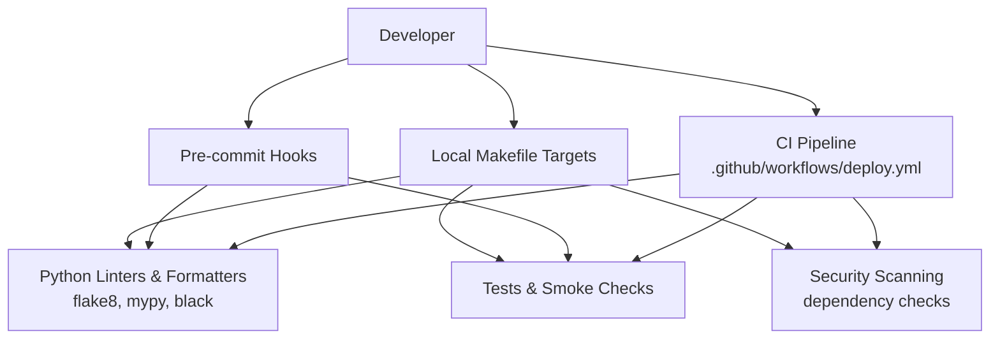
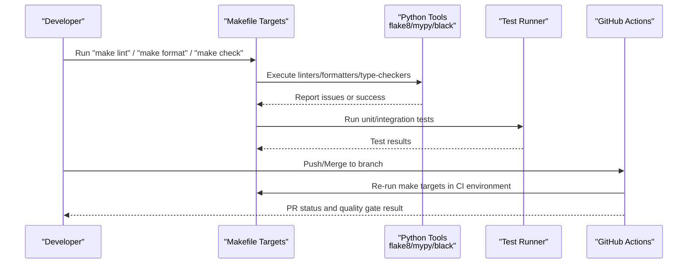
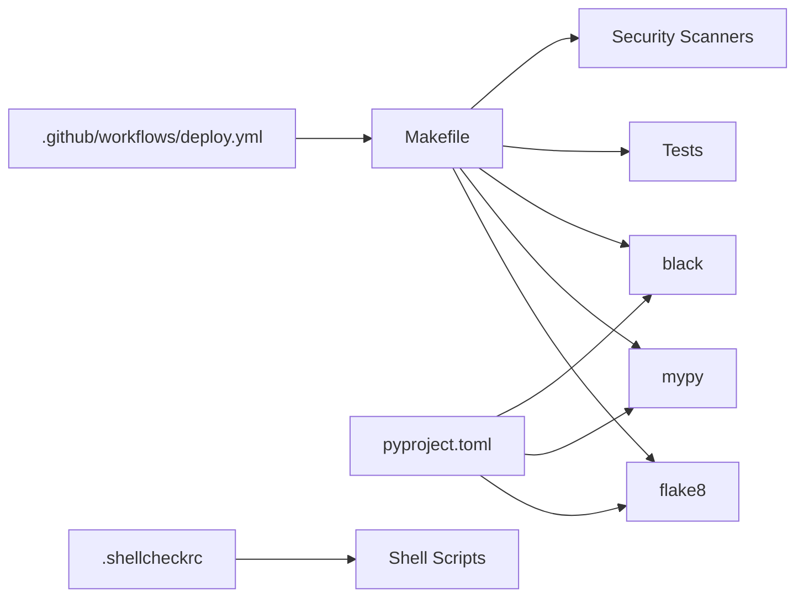

# Quality Assurance

<cite>
**Referenced Files in This Document**
- [Makefile](file://Makefile)
- [pyproject.toml](file://pyproject.toml)
- [backend/requirements.txt](file://backend/requirements.txt)
- [.github/workflows/deploy.yml](file://.github/workflows/deploy.yml)
- [scripts/deploy_server.sh](file://scripts/deploy_server.sh)
- [ssl-renew/.shellcheckrc](file://ssl-renew/.shellcheckrc)
- [ssl-renew/requirements-dev.txt](file://ssl-renew/requirements-dev.txt)
- [ssl-renew/requirements.txt](file://ssl-renew/requirements.txt)
</cite>

## Table of Contents
1. [Introduction](#introduction)
2. [Project Structure](#project-structure)
3. [Core Components](#core-components)
4. [Architecture Overview](#architecture-overview)
5. [Detailed Component Analysis](#detailed-component-analysis)
6. [Dependency Analysis](#dependency-analysis)
7. [Performance Considerations](#performance-considerations)
8. [Troubleshooting Guide](#troubleshooting-guide)
9. [Conclusion](#conclusion)

## Introduction
This document describes the quality assurance processes for the project, focusing on code linting, static analysis, formatting, automated checks, and continuous integration gates. It explains how Python quality tools are configured and invoked via Makefile targets, outlines pre-commit and CI practices, and covers security scanning, dependency vulnerability checking, and performance profiling integrated into the development workflow.

## Project Structure
Quality-related configuration and automation are primarily located in:
- Root-level build and QA orchestration (Makefile)
- Python tool configuration (pyproject.toml)
- Dependency manifests for backend and auxiliary components
- CI pipeline definition (.github/workflows/deploy.yml)
- Shell scripts with shellcheck configuration

[No sources needed since this diagram shows conceptual workflow, not actual code structure]

**Section sources**
- [Makefile](file://Makefile)
- [pyproject.toml](file://pyproject.toml)
- [backend/requirements.txt](file://backend/requirements.txt)
- [.github/workflows/deploy.yml](file://.github/workflows/deploy.yml)
- [ssl-renew/.shellcheckrc](file://ssl-renew/.shellcheckrc)

## Core Components
- Makefile targets: Central entry points to run linting, type checking, formatting, tests, and other QA tasks consistently across environments.
- pyproject.toml: Declarative configuration for Python tools such as flake8, mypy, and black, ensuring consistent rules and behavior.
- Requirements files: Pin dependencies for runtime and development, enabling reproducible scans and checks.
- CI workflow: Executes quality checks on push/merge to enforce standards before deployment.
- Shellcheck configuration: Enforces shell script quality in auxiliary tooling.

**Section sources**
- [Makefile](file://Makefile)
- [pyproject.toml](file://pyproject.toml)
- [backend/requirements.txt](file://backend/requirements.txt)
- [.github/workflows/deploy.yml](file://.github/workflows/deploy.yml)
- [ssl-renew/.shellcheckrc](file://ssl-renew/.shellcheckrc)

## Architecture Overview
The QA architecture combines local developer workflows with CI enforcement:
- Developers run Makefile targets locally to format, lint, and type-check code before committing.
- Pre-commit hooks can be configured to enforce checks automatically on commit.
- CI runs the same checks to gate merges and deployments.
- Security scanning and dependency checks are integrated into both local and CI flows.

**Diagram sources**
- [Makefile](file://Makefile)
- [.github/workflows/deploy.yml](file://.github/workflows/deploy.yml)

**Section sources**
- [Makefile](file://Makefile)
- [.github/workflows/deploy.yml](file://.github/workflows/deploy.yml)

## Detailed Component Analysis

### Makefile Targets for Quality Assurance
The Makefile provides unified commands to:
- Format code using black
- Lint code using flake8
- Perform static type checking using mypy
- Run tests and smoke checks
- Execute security and dependency scans
- Validate shell scripts with shellcheck

These targets ensure consistency across local development and CI.

**Section sources**
- [Makefile](file://Makefile)

### Python Tool Configuration (pyproject.toml)
pyproject.toml centralizes configuration for:
- flake8: style and complexity rules
- mypy: strictness levels, ignored modules, and type checking options
- black: line length, target Python versions, and formatting behavior

This ensures all developers and CI use identical rules.

**Section sources**
- [pyproject.toml](file://pyproject.toml)

### Dependencies and Reproducibility
- backend/requirements.txt: Defines runtime and development dependencies for the backend service.
- ssl-renew/requirements.txt and requirements-dev.txt: Define dependencies for SSL renewal utilities and dev-only tools.

Pinned dependencies enable deterministic scans and checks.

**Section sources**
- [backend/requirements.txt](file://backend/requirements.txt)
- [ssl-renew/requirements.txt](file://ssl-renew/requirements.txt)
- [ssl-renew/requirements-dev.txt](file://ssl-renew/requirements-dev.txt)

### CI Quality Gates (.github/workflows/deploy.yml)
The CI workflow enforces:
- Running Makefile targets for linting, formatting, and type checking
- Executing tests and smoke checks
- Performing dependency and security scans
- Blocking merges when quality gates fail

This ensures only compliant code reaches production.

**Section sources**
- [.github/workflows/deploy.yml](file://.github/workflows/deploy.yml)

### Shell Script Quality (shellcheck)
Shell scripts under ssl-renew are validated using shellcheck with a dedicated configuration file to enforce best practices and catch common pitfalls.

**Section sources**
- [ssl-renew/.shellcheckrc](file://ssl-renew/.shellcheckrc)

### Deployment Scripts and QA Integration
Deployment scripts integrate QA steps to validate environment readiness and perform basic checks before deploying services.

**Section sources**
- [scripts/deploy_server.sh](file://scripts/deploy_server.sh)

## Dependency Analysis
Quality tools and their relationships:
- Makefile orchestrates execution of flake8, mypy, black, tests, and scanners.
- pyproject.toml configures tool behavior uniformly.
- CI re-runs the same targets to enforce standards.
- Shellcheck validates shell scripts independently.

**Diagram sources**
- [Makefile](file://Makefile)
- [pyproject.toml](file://pyproject.toml)
- [.github/workflows/deploy.yml](file://.github/workflows/deploy.yml)
- [ssl-renew/.shellcheckrc](file://ssl-renew/.shellcheckrc)

**Section sources**
- [Makefile](file://Makefile)
- [pyproject.toml](file://pyproject.toml)
- [.github/workflows/deploy.yml](file://.github/workflows/deploy.yml)
- [ssl-renew/.shellcheckrc](file://ssl-renew/.shellcheckrc)

## Performance Considerations
- Prefer incremental checks where possible (e.g., running mypy on changed files).
- Cache dependency installations in CI to speed up scans.
- Use parallel execution for independent checks (lint, type check, tests).
- Profile critical paths with Python profilers during development to identify bottlenecks before release.

[No sources needed since this section provides general guidance]

## Troubleshooting Guide
Common issues and resolutions:
- Linting failures: Review flake8 output and adjust code or configuration as needed.
- Type errors: Address mypy-reported mismatches; consider adding type hints or adjusting mypy settings.
- Formatting differences: Run black to auto-format; ensure editor integrates black on save.
- CI gating: Inspect CI logs for failed targets; reproduce locally using Makefile commands.
- Dependency scan alerts: Update vulnerable packages or add exceptions with justification.
- Shellcheck warnings: Fix script issues per shellcheck recommendations.

**Section sources**
- [Makefile](file://Makefile)
- [pyproject.toml](file://pyproject.toml)
- [.github/workflows/deploy.yml](file://.github/workflows/deploy.yml)
- [ssl-renew/.shellcheckrc](file://ssl-renew/.shellcheckrc)

## Conclusion
The project’s quality assurance is built around consistent tooling and automation:
- Makefile targets unify local and CI checks.
- pyproject.toml standardizes Python tool configurations.
- CI enforces quality gates to protect main branches.
- Shellcheck ensures robust shell scripting.
Adhering to these practices improves code quality, reduces defects, and accelerates safe delivery.

[No sources needed since this section summarizes without analyzing specific files]