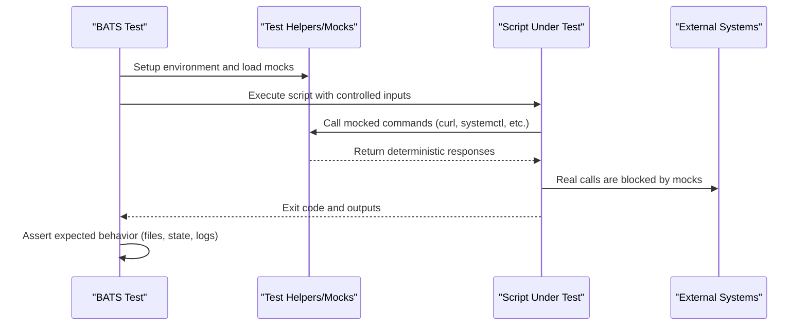
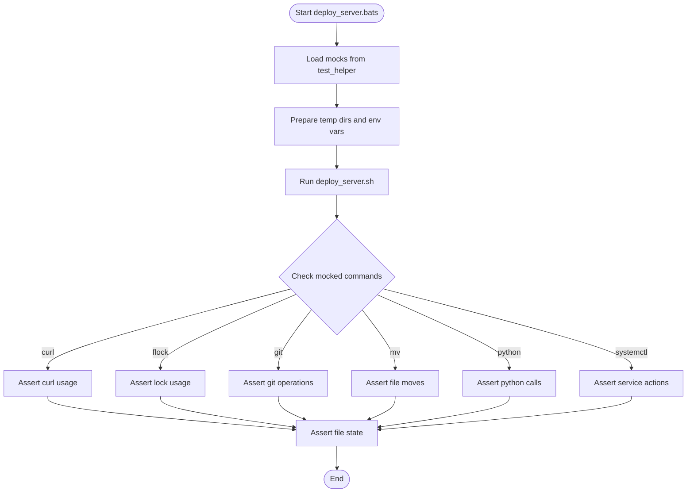
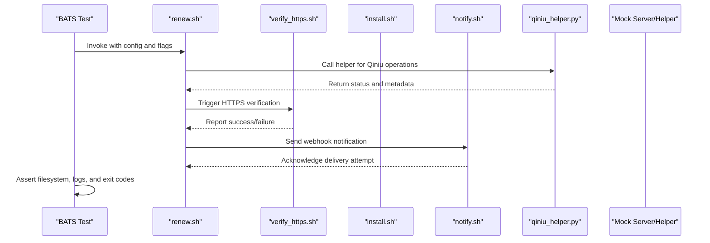
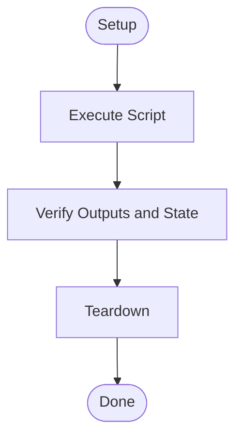
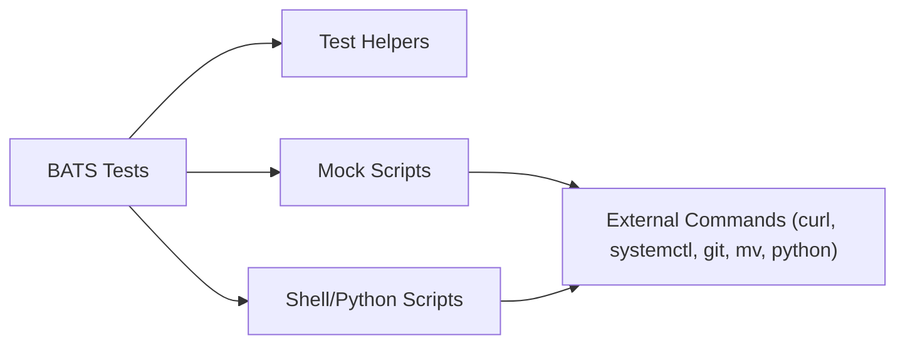

# Shell Script Testing

<cite>
**Referenced Files in This Document**
- [deploy_server.sh](file://scripts/deploy_server.sh)
- [deploy_server.bats](file://scripts/tests/deploy_server.bats)
- [common.bash](file://scripts/tests/test_helper/common.bash)
- [mock_curl.sh](file://scripts/tests/test_helper/mock_curl.sh)
- [mock_flock.sh](file://scripts/tests/test_helper/mock_flock.sh)
- [mock_git.sh](file://scripts/tests/test_helper/mock_git.sh)
- [mock_mv.sh](file://scripts/tests/test_helper/mock_mv.sh)
- [mock_python.sh](file://scripts/tests/test_helper/mock_python.sh)
- [mock_systemctl.sh](file://scripts/tests/test_helper/mock_systemctl.sh)
- [renew.sh](file://ssl-renew/renew.sh)
- [verify_https.sh](file://ssl-renew/verify_https.sh)
- [install.sh](file://ssl-renew/install.sh)
- [notify.sh](file://ssl-renew/notify.sh)
- [qiniu_helper.py](file://ssl-renew/qiniu_helper.py)
- [01_config_and_validation.bats](file://ssl-renew/tests/01_config_and_validation.bats)
- [02_dry_run.bats](file://ssl-renew/tests/02_dry_run.bats)
- [03_staging.bats](file://ssl-renew/tests/03_staging.bats)
- [04_qiniu_upload.bats](file://ssl-renew/tests/04_qiniu_upload.bats)
- [05_qiniu_bind_and_verify.bats](file://ssl-renew/tests/05_qiniu_bind_and_verify.bats)
- [06_verify_https.bats](file://ssl-renew/tests/06_verify_https.bats)
- [07_notify_webhook.bats](file://ssl-renew/tests/07_notify_webhook.bats)
- [08_idempotency_and_multi_domain.bats](file://ssl-renew/tests/08_idempotency_and_multi_domain.bats)
- [09_integration_mock.bats](file://ssl-renew/tests/09_integration_mock.bats)
- [10_systemd_units.bats](file://ssl-renew/tests/10_systemd_units.bats)
- [11_qiniu_helper_argv_safety.bats](file://ssl-renew/tests/11_qiniu_helper_argv_safety.bats)
- [test_helper/common.bash](file://ssl-renew/tests/test_helper/common.bash)
- [test_helper/mock_curl.sh](file://ssl-renew/tests/test_helper/mock_curl.sh)
- [test_helper/mock_qiniu_helper.py](file://ssl-renew/tests/test_helper/mock_qiniu_helper.py)
- [test_helper/mock_server.py](file://ssl-renew/tests/test_helper/mock_server.py)
- [.shellcheckrc](file://ssl-renew/.shellcheckrc)
- [systemd_static_check.sh](file://ssl-renew/tests/systemd_static_check.sh)
</cite>

## Table of Contents
1. [Introduction](#introduction)
2. [Project Structure](#project-structure)
3. [Core Components](#core-components)
4. [Architecture Overview](#architecture-overview)
5. [Detailed Component Analysis](#detailed-component-analysis)
6. [Dependency Analysis](#dependency-analysis)
7. [Performance Considerations](#performance-considerations)
8. [Troubleshooting Guide](#troubleshooting-guide)
9. [Conclusion](#conclusion)
10. [Appendices](#appendices)

## Introduction
This document explains how to write effective BATS (Bash Automated Testing System) tests for shell-based deployment scripts, SSL renewal processes, and system automation tasks within the repository. It covers test organization, mocking strategies for system commands, validating behavior across environments, and integrating static analysis with shellcheck. You will learn how to structure tests for file operations, process management, and network interactions, as well as techniques for managing test data and debugging failures.

## Project Structure
The repository contains two primary areas where shell testing is implemented:
- Deployment script tests under scripts/tests
- SSL renewal tests under ssl-renew/tests

Key elements:
- BATS test files (.bats) define test suites for each major workflow or concern.
- Test helpers live under test_helper directories and provide shared setup, mocks, and utilities.
- Shell scripts being tested include deploy_server.sh, renew.sh, verify_https.sh, install.sh, notify.sh, and qiniu_helper.py (Python helper invoked by shell).

```mermaid
graph TB
subgraph "Deployment Tests"
A["scripts/tests/deploy_server.bats"]
H["scripts/tests/test_helper/common.bash"]
M1["scripts/tests/test_helper/mock_curl.sh"]
M2["scripts/tests/test_helper/mock_flock.sh"]
M3["scripts/tests/test_helper/mock_git.sh"]
M4["scripts/tests/test_helper/mock_mv.sh"]
M5["scripts/tests/test_helper/mock_python.sh"]
M6["scripts/tests/test_helper/mock_systemctl.sh"]
end
subgraph "SSL Renewal Tests"
B["ssl-renew/tests/*.bats"]
C["ssl-renew/tests/test_helper/common.bash"]
N1["ssl-renew/tests/test_helper/mock_curl.sh"]
N2["ssl-renew/tests/test_helper/mock_qiniu_helper.py"]
N3["ssl-renew/tests/test_helper/mock_server.py"]
end
subgraph "Scripts Under Test"
S1["scripts/deploy_server.sh"]
S2["ssl-renew/renew.sh"]
S3["ssl-renew/verify_https.sh"]
S4["ssl-renew/install.sh"]
S5["ssl-renew/notify.sh"]
S6["ssl-renew/qiniu_helper.py"]
end
A --> H
A --> M1
A --> M2
A --> M3
A --> M4
A --> M5
A --> M6
B --> C
B --> N1
B --> N2
B --> N3
A --> S1
B --> S2
B --> S3
B --> S4
B --> S5
B --> S6
```

**Diagram sources**
- [deploy_server.bats](file://scripts/tests/deploy_server.bats)
- [common.bash](file://scripts/tests/test_helper/common.bash)
- [mock_curl.sh](file://scripts/tests/test_helper/mock_curl.sh)
- [mock_flock.sh](file://scripts/tests/test_helper/mock_flock.sh)
- [mock_git.sh](file://scripts/tests/test_helper/mock_git.sh)
- [mock_mv.sh](file://scripts/tests/test_helper/mock_mv.sh)
- [mock_python.sh](file://scripts/tests/test_helper/mock_python.sh)
- [mock_systemctl.sh](file://scripts/tests/test_helper/mock_systemctl.sh)
- [01_config_and_validation.bats](file://ssl-renew/tests/01_config_and_validation.bats)
- [test_helper/common.bash](file://ssl-renew/tests/test_helper/common.bash)
- [test_helper/mock_curl.sh](file://ssl-renew/tests/test_helper/mock_curl.sh)
- [test_helper/mock_qiniu_helper.py](file://ssl-renew/tests/test_helper/mock_qiniu_helper.py)
- [test_helper/mock_server.py](file://ssl-renew/tests/test_helper/mock_server.py)
- [deploy_server.sh](file://scripts/deploy_server.sh)
- [renew.sh](file://ssl-renew/renew.sh)
- [verify_https.sh](file://ssl-renew/verify_https.sh)
- [install.sh](file://ssl-renew/install.sh)
- [notify.sh](file://ssl-renew/notify.sh)
- [qiniu_helper.py](file://ssl-renew/qiniu_helper.py)

**Section sources**
- [deploy_server.bats](file://scripts/tests/deploy_server.bats)
- [01_config_and_validation.bats](file://ssl-renew/tests/01_config_and_validation.bats)

## Core Components
- BATS test suites: Each .bats file represents a cohesive set of tests for a specific area (e.g., configuration validation, dry-run behavior, staging, Qiniu upload/bind, HTTPS verification, webhook notifications, idempotency, systemd units, argument safety).
- Test helpers: Shared functions and environment setup are centralized in common.bash; mocks replace external commands like curl, flock, git, mv, python, systemctl to ensure deterministic execution.
- Scripts under test:
  - Deployment: deploy_server.sh orchestrates deployment steps.
  - SSL renewal: renew.sh drives certificate lifecycle; verify_https.sh validates HTTPS endpoints; install.sh provisions services; notify.sh sends notifications; qiniu_helper.py assists with cloud storage operations.

Best practices demonstrated in this codebase:
- Isolate side effects using mocks and temporary directories.
- Validate exit codes, output, and filesystem state changes.
- Use explicit assertions on command invocations via mocked binaries.
- Keep tests focused and independent; avoid coupling between test cases.

**Section sources**
- [deploy_server.sh](file://scripts/deploy_server.sh)
- [renew.sh](file://ssl-renew/renew.sh)
- [verify_https.sh](file://ssl-renew/verify_https.sh)
- [install.sh](file://ssl-renew/install.sh)
- [notify.sh](file://ssl-renew/notify.sh)
- [qiniu_helper.py](file://ssl-renew/qiniu_helper.py)

## Architecture Overview
The testing architecture separates concerns into three layers:
- Test layer: BATS test files define scenarios and assertions.
- Helper/mocks layer: Common utilities and mock implementations isolate external dependencies.
- Target layer: Shell and Python scripts implement real logic that is exercised by tests.

[No sources needed since this diagram shows conceptual workflow, not actual code structure]

## Detailed Component Analysis

### Deployment Script Testing (deploy_server.sh)
Focus areas:
- Command orchestration and dependency checks
- File operations and service management
- Network interactions during deployment

Mocking strategy:
- Replace curl, flock, git, mv, python, systemctl with deterministic stubs that record invocations and return controlled outputs.
- Use common.bash to prepare temporary directories and environment variables.

Validation approach:
- Assert correct sequence of commands executed via mocks.
- Verify created/updated files and permissions.
- Confirm service states through mocked systemctl responses.

**Diagram sources**
- [deploy_server.bats](file://scripts/tests/deploy_server.bats)
- [common.bash](file://scripts/tests/test_helper/common.bash)
- [mock_curl.sh](file://scripts/tests/test_helper/mock_curl.sh)
- [mock_flock.sh](file://scripts/tests/test_helper/mock_flock.sh)
- [mock_git.sh](file://scripts/tests/test_helper/mock_git.sh)
- [mock_mv.sh](file://scripts/tests/test_helper/mock_mv.sh)
- [mock_python.sh](file://scripts/tests/test_helper/mock_python.sh)
- [mock_systemctl.sh](file://scripts/tests/test_helper/mock_systemctl.sh)
- [deploy_server.sh](file://scripts/deploy_server.sh)

**Section sources**
- [deploy_server.bats](file://scripts/tests/deploy_server.bats)
- [common.bash](file://scripts/tests/test_helper/common.bash)
- [mock_curl.sh](file://scripts/tests/test_helper/mock_curl.sh)
- [mock_flock.sh](file://scripts/tests/test_helper/mock_flock.sh)
- [mock_git.sh](file://scripts/tests/test_helper/mock_git.sh)
- [mock_mv.sh](file://scripts/tests/test_helper/mock_mv.sh)
- [mock_python.sh](file://scripts/tests/test_helper/mock_python.sh)
- [mock_systemctl.sh](file://scripts/tests/test_helper/mock_systemctl.sh)
- [deploy_server.sh](file://scripts/deploy_server.sh)

### SSL Renewal Testing (renew.sh, verify_https.sh, install.sh, notify.sh, qiniu_helper.py)
Focus areas:
- Configuration validation and dry-run behavior
- Staging workflows and multi-domain handling
- Qiniu upload, binding, and verification
- HTTPS endpoint verification and webhook notifications
- Idempotency and integration flows with mocked services

Test suite breakdown:
- 01_config_and_validation.bats: Validates configuration parsing and error conditions.
- 02_dry_run.bats: Ensures no side effects during dry-run mode.
- 03_staging.bats: Exercises staging-specific paths.
- 04_qiniu_upload.bats: Mocks Qiniu uploads and verifies artifacts.
- 05_qiniu_bind_and_verify.bats: Confirms binding and verification steps.
- 06_verify_https.bats: Uses verify_https.sh to assert HTTPS correctness.
- 07_notify_webhook.bats: Validates notification payloads and delivery attempts.
- 08_idempotency_and_multi_domain.bats: Checks repeated runs and multiple domains.
- 09_integration_mock.bats: End-to-end flow with mocked server and helper.
- 10_systemd_units.bats: Verifies systemd unit installation and timers.
- 11_qiniu_helper_argv_safety.bats: Ensures safe argument handling in qiniu_helper.py.

**Diagram sources**
- [renew.sh](file://ssl-renew/renew.sh)
- [verify_https.sh](file://ssl-renew/verify_https.sh)
- [install.sh](file://ssl-renew/install.sh)
- [notify.sh](file://ssl-renew/notify.sh)
- [qiniu_helper.py](file://ssl-renew/qiniu_helper.py)
- [test_helper/mock_server.py](file://ssl-renew/tests/test_helper/mock_server.py)
- [test_helper/mock_qiniu_helper.py](file://ssl-renew/tests/test_helper/mock_qiniu_helper.py)

**Section sources**
- [01_config_and_validation.bats](file://ssl-renew/tests/01_config_and_validation.bats)
- [02_dry_run.bats](file://ssl-renew/tests/02_dry_run.bats)
- [03_staging.bats](file://ssl-renew/tests/03_staging.bats)
- [04_qiniu_upload.bats](file://ssl-renew/tests/04_qiniu_upload.bats)
- [05_qiniu_bind_and_verify.bats](file://ssl-renew/tests/05_qiniu_bind_and_verify.bats)
- [06_verify_https.bats](file://ssl-renew/tests/06_verify_https.bats)
- [07_notify_webhook.bats](file://ssl-renew/tests/07_notify_webhook.bats)
- [08_idempotency_and_multi_domain.bats](file://ssl-renew/tests/08_idempotency_and_multi_domain.bats)
- [09_integration_mock.bats](file://ssl-renew/tests/09_integration_mock.bats)
- [10_systemd_units.bats](file://ssl-renew/tests/10_systemd_units.bats)
- [11_qiniu_helper_argv_safety.bats](file://ssl-renew/tests/11_qiniu_helper_argv_safety.bats)
- [renew.sh](file://ssl-renew/renew.sh)
- [verify_https.sh](file://ssl-renew/verify_https.sh)
- [install.sh](file://ssl-renew/install.sh)
- [notify.sh](file://ssl-renew/notify.sh)
- [qiniu_helper.py](file://ssl-renew/qiniu_helper.py)

### Conceptual Overview
A typical BATS test follows these phases:
- Setup: Initialize environment, create temporary directories, load mocks.
- Execution: Run the target script with controlled inputs.
- Verification: Assert exit codes, stdout/stderr, file changes, and mocked command invocations.
- Teardown: Clean up temporary resources.

[No sources needed since this diagram shows conceptual workflow, not actual code structure]

## Dependency Analysis
BATS tests depend on:
- Test helpers for shared functionality and mocks
- External command replacements to ensure deterministic behavior
- Scripts under test for core logic

**Diagram sources**
- [deploy_server.bats](file://scripts/tests/deploy_server.bats)
- [common.bash](file://scripts/tests/test_helper/common.bash)
- [mock_curl.sh](file://scripts/tests/test_helper/mock_curl.sh)
- [mock_systemctl.sh](file://scripts/tests/test_helper/mock_systemctl.sh)
- [mock_git.sh](file://scripts/tests/test_helper/mock_git.sh)
- [mock_mv.sh](file://scripts/tests/test_helper/mock_mv.sh)
- [mock_python.sh](file://scripts/tests/test_helper/mock_python.sh)
- [renew.sh](file://ssl-renew/renew.sh)
- [verify_https.sh](file://ssl-renew/verify_https.sh)
- [install.sh](file://ssl-renew/install.sh)
- [notify.sh](file://ssl-renew/notify.sh)
- [qiniu_helper.py](file://ssl-renew/qiniu_helper.py)

**Section sources**
- [deploy_server.bats](file://scripts/tests/deploy_server.bats)
- [01_config_and_validation.bats](file://ssl-renew/tests/01_config_and_validation.bats)

## Performance Considerations
- Prefer lightweight mocks over spawning real processes to reduce test runtime.
- Reuse temporary directories efficiently and clean them up promptly.
- Avoid heavy network calls; use mock servers when HTTP interactions are necessary.
- Parallelize independent BATS suites if supported by your CI runner.

[No sources needed since this section provides general guidance]

## Troubleshooting Guide
Common issues and remedies:
- Flaky tests due to timing: Use explicit waits or polling in mocks; avoid sleep-based synchronization.
- Permission errors in temp directories: Ensure proper ownership and umask settings in setup.
- Mock misbehavior: Inspect recorded invocations and return values; validate PATH ordering so mocks take precedence.
- Shellcheck warnings: Configure .shellcheckrc and integrate checks into CI to catch issues early.
- Debugging failures: Capture stdout/stderr, log intermediate states, and print assertion contexts.

Static analysis integration:
- The project includes .shellcheckrc for consistent shellcheck rules.
- A dedicated static check script exists for systemd units to complement shellcheck coverage.

**Section sources**
- [.shellcheckrc](file://ssl-renew/.shellcheckrc)
- [systemd_static_check.sh](file://ssl-renew/tests/systemd_static_check.sh)

## Conclusion
This repository demonstrates robust BATS-based testing for shell scripts and automation tasks. By centralizing helpers, employing comprehensive mocks, and structuring tests around clear responsibilities, the suites achieve reliability and maintainability. Integrating shellcheck and systematic debugging practices further strengthens confidence in deployment and SSL renewal workflows.

[No sources needed since this section summarizes without analyzing specific files]

## Appendices
- Tips for writing effective BATS tests:
  - Keep each test focused on a single scenario.
  - Use descriptive test names that reflect expected behavior.
  - Assert both positive and negative cases.
  - Leverage mocks to simulate edge conditions and error paths.
- Managing test data:
  - Create isolated temporary directories per test.
  - Seed fixtures deterministically and clean up after execution.
- Environment validation:
  - Assert required tools and versions at test startup.
  - Fail fast when prerequisites are missing.

[No sources needed since this section provides general guidance]