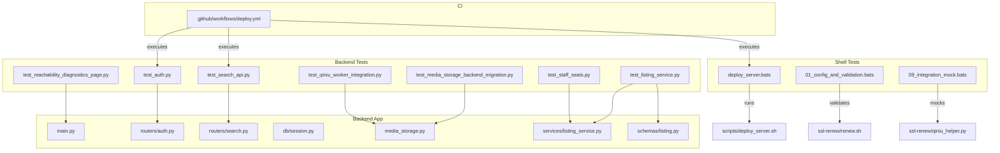
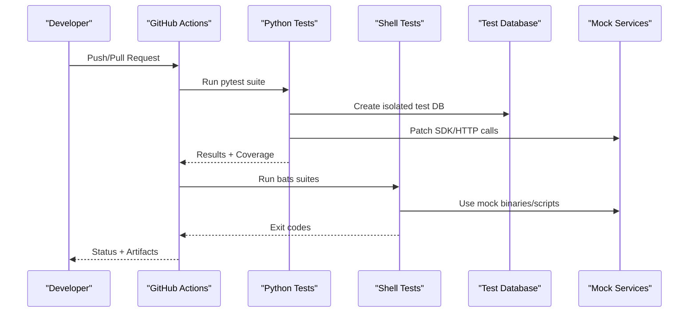
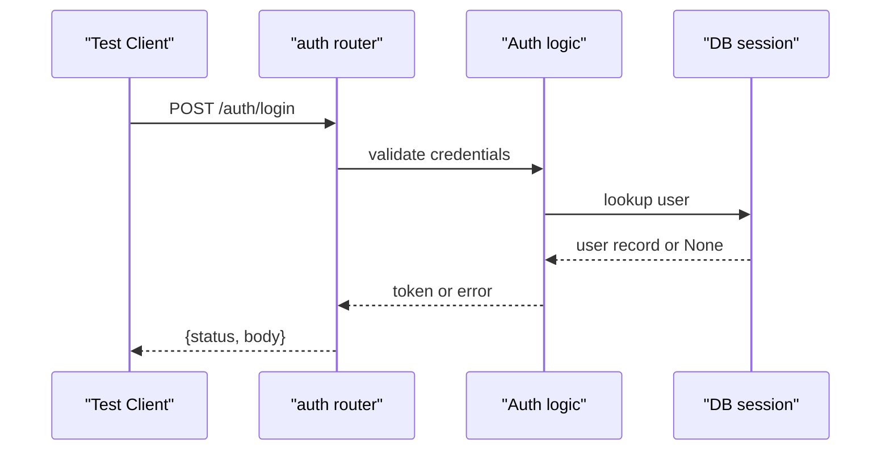
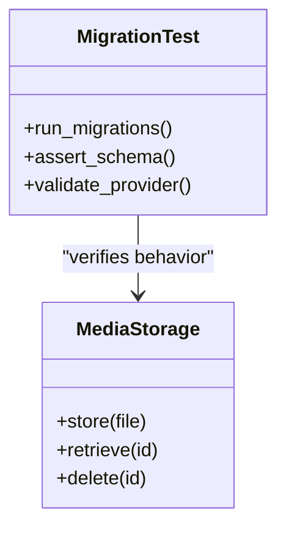
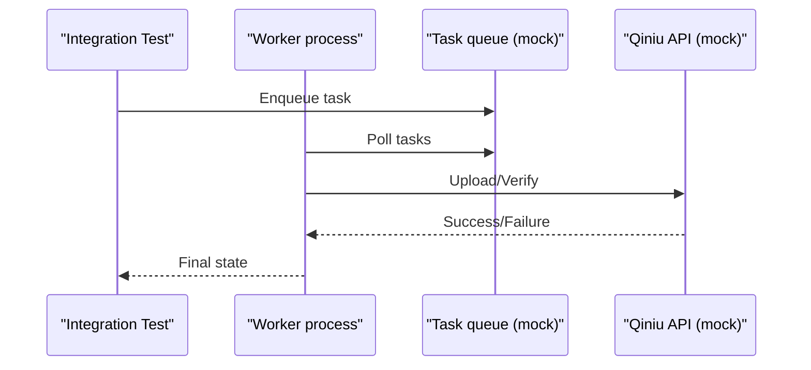
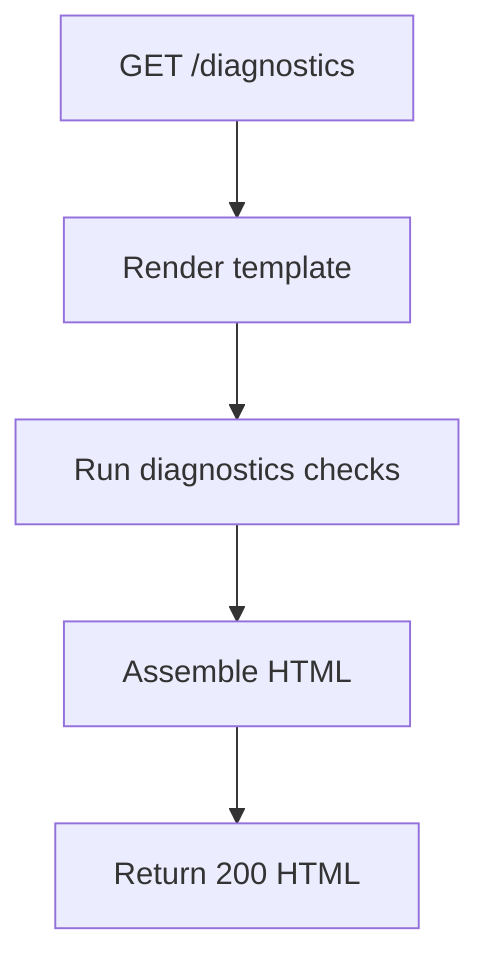
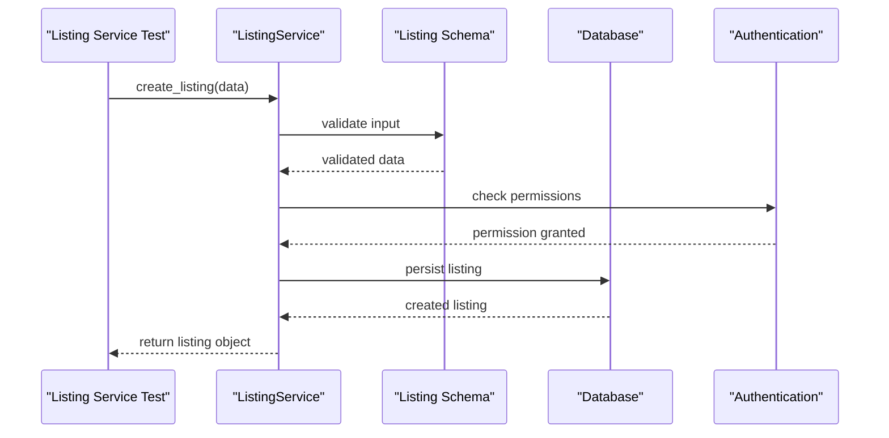
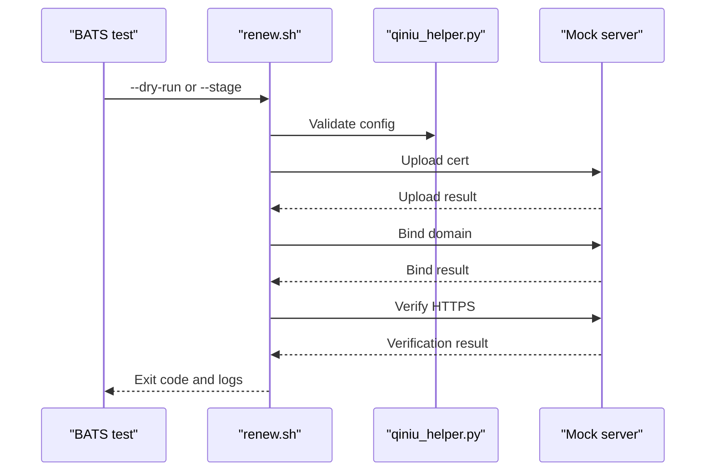
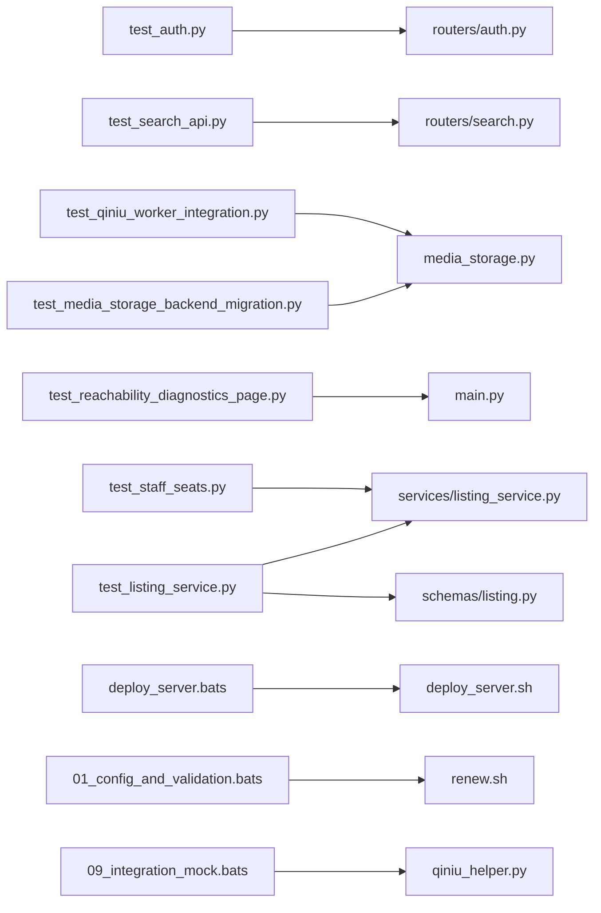

# Testing & Quality Assurance

<cite>
**Referenced Files in This Document**
- [backend/tests/test_listing_service.py](file://backend/tests/test_listing_service.py)
- [backend/app/services/listing_service.py](file://backend/app/services/listing_service.py)
- [backend/app/schemas/listing.py](file://backend/app/schemas/listing.py)
- [backend/tests/test_staff_seats.py](file://backend/tests/test_staff_seats.py)
- [backend/tests/test_auth.py](file://backend/tests/test_auth.py)
- [backend/tests/test_search_api.py](file://backend/tests/test_search_api.py)
- [backend/tests/test_media_storage_backend_migration.py](file://backend/tests/test_media_storage_backend_migration.py)
- [backend/tests/test_qiniu_worker_integration.py](file://backend/tests/test_qiniu_worker_integration.py)
- [backend/tests/test_reachability_diagnostics_page.py](file://backend/tests/test_reachability_diagnostics_page.py)
- [backend/app/main.py](file://backend/app/main.py)
- [backend/app/routers/auth.py](file://backend/app/routers/auth.py)
- [backend/app/routers/search.py](file://backend/app/routers/search.py)
- [backend/app/db/session.py](file://backend/app/db/session.py)
- [backend/app/media_storage.py](file://backend/app/media_storage.py)
- [backend/scripts/mock_ingest.py](file://backend/scripts/mock_ingest.py)
- [scripts/deploy_server.sh](file://scripts/deploy_server.sh)
- [scripts/tests/deploy_server.bats](file://scripts/tests/deploy_server.bats)
- [ssl-renew/renew.sh](file://ssl-renew/renew.sh)
- [ssl-renew/verify_https.sh](file://ssl-renew/verify_https.sh)
- [ssl-renew/tests/01_config_and_validation.bats](file://ssl-renew/tests/01_config_and_validation.bats)
- [ssl-renew/tests/09_integration_mock.bats](file://ssl-renew/tests/09_integration_mock.bats)
- [ssl-renew/qiniu_helper.py](file://ssl-renew/qiniu_helper.py)
- [Makefile](file://Makefile)
- [pyproject.toml](file://pyproject.toml)
- [.github/workflows/deploy.yml](file://.github/workflows/deploy.yml)
</cite>

## Update Summary
**Changes Made**
- Added comprehensive documentation for the new listing service test suite (test_listing_service.py with 378 lines)
- Updated staff seats testing coverage and organization
- Enhanced test suite structure to reflect architectural changes and file reorganization
- Added new sections covering listing service testing patterns and strategies
- Updated import paths and dependencies to reflect file reorganization

## Table of Contents
1. Introduction
2. Project Structure
3. Core Components
4. Architecture Overview
5. Detailed Component Analysis
6. Dependency Analysis
7. Performance Considerations
8. Troubleshooting Guide
9. Conclusion
10. Appendices

## Introduction
This document describes the testing strategy, frameworks, and quality assurance processes for the project. It covers unit tests for Python backend components, integration tests for API endpoints, and shell script tests for deployment automation. It also explains test data management, mocking strategies, environment setup, guidelines for writing effective tests, coverage requirements, continuous integration pipelines, performance and security testing approaches, and code quality tooling.

**Updated** The testing infrastructure has been significantly enhanced with comprehensive test coverage for the new listing service, improved staff seats testing, and better test suite organization to accommodate architectural changes and file reorganization.

## Project Structure
The repository organizes tests alongside their corresponding features:
- Python backend tests live under backend/tests and target FastAPI routers, database sessions, storage backends, and utility modules.
- Shell-based tests use BATS to validate deployment scripts and SSL renewal workflows.
- CI configuration is defined under .github/workflows.

**Diagram sources**
- [backend/tests/test_auth.py](file://backend/tests/test_auth.py)
- [backend/tests/test_search_api.py](file://backend/tests/test_search_api.py)
- [backend/tests/test_media_storage_backend_migration.py](file://backend/tests/test_media_storage_backend_migration.py)
- [backend/tests/test_qiniu_worker_integration.py](file://backend/tests/test_qiniu_worker_integration.py)
- [backend/tests/test_reachability_diagnostics_page.py](file://backend/tests/test_reachability_diagnostics_page.py)
- [backend/tests/test_listing_service.py](file://backend/tests/test_listing_service.py)
- [backend/tests/test_staff_seats.py](file://backend/tests/test_staff_seats.py)
- [backend/app/main.py](file://backend/app/main.py)
- [backend/app/routers/auth.py](file://backend/app/routers/auth.py)
- [backend/app/routers/search.py](file://backend/app/routers/search.py)
- [backend/app/db/session.py](file://backend/app/db/session.py)
- [backend/app/media_storage.py](file://backend/app/media_storage.py)
- [backend/app/services/listing_service.py](file://backend/app/services/listing_service.py)
- [backend/app/schemas/listing.py](file://backend/app/schemas/listing.py)
- [scripts/tests/deploy_server.bats](file://scripts/tests/deploy_server.bats)
- [ssl-renew/tests/01_config_and_validation.bats](file://ssl-renew/tests/01_config_and_validation.bats)
- [ssl-renew/tests/09_integration_mock.bats](file://ssl-renew/tests/09_integration_mock.bats)
- [ssl-renew/renew.sh](file://ssl-renew/renew.sh)
- [ssl-renew/qiniu_helper.py](file://ssl-renew/qiniu_helper.py)
- [.github/workflows/deploy.yml](file://.github/workflows/deploy.yml)

**Section sources**
- [backend/tests/test_auth.py](file://backend/tests/test_auth.py)
- [backend/tests/test_search_api.py](file://backend/tests/test_search_api.py)
- [backend/tests/test_media_storage_backend_migration.py](file://backend/tests/test_media_storage_backend_migration.py)
- [backend/tests/test_qiniu_worker_integration.py](file://backend/tests/test_qiniu_worker_integration.py)
- [backend/tests/test_reachability_diagnostics_page.py](file://backend/tests/test_reachability_diagnostics_page.py)
- [backend/tests/test_listing_service.py](file://backend/tests/test_listing_service.py)
- [backend/tests/test_staff_seats.py](file://backend/tests/test_staff_seats.py)
- [backend/app/main.py](file://backend/app/main.py)
- [backend/app/routers/auth.py](file://backend/app/routers/auth.py)
- [backend/app/routers/search.py](file://backend/app/routers/search.py)
- [backend/app/db/session.py](file://backend/app/db/session.py)
- [backend/app/media_storage.py](file://backend/app/media_storage.py)
- [backend/app/services/listing_service.py](file://backend/app/services/listing_service.py)
- [backend/app/schemas/listing.py](file://backend/app/schemas/listing.py)
- [scripts/tests/deploy_server.bats](file://scripts/tests/deploy_server.bats)
- [ssl-renew/tests/01_config_and_validation.bats](file://ssl-renew/tests/01_config_and_validation.bats)
- [ssl-renew/tests/09_integration_mock.bats](file://ssl-renew/tests/09_integration_mock.bats)
- [ssl-renew/renew.sh](file://ssl-renew/renew.sh)
- [ssl-renew/qiniu_helper.py](file://ssl-renew/qiniu_helper.py)
- [.github/workflows/deploy.yml](file://.github/workflows/deploy.yml)

## Core Components
- Python unit and integration tests:
  - Authentication endpoint tests validate login flows, error handling, and response contracts.
  - Search API tests assert query parsing, filtering, and result shapes.
  - Media storage migration tests verify schema changes and provider behavior.
  - Worker integration tests exercise background processing paths with mocked external services.
  - Diagnostics page tests ensure HTML rendering and health checks.
  - **New**: Listing service tests provide comprehensive coverage for listing functionality with 378 lines of test cases, covering CRUD operations, validation, business logic, and edge cases.
  - **Updated**: Staff seats tests have been enhanced with improved organization and coverage, including better tenant isolation and quota management testing.
- Shell tests:
  - Deployment script tests validate installation steps, systemd units, and idempotency.
  - SSL renewal tests cover configuration validation, dry runs, staging, uploads, binding, verification, notifications, and idempotency across multiple domains.

Key test utilities and fixtures:
- Test database session isolation via a dedicated session factory.
- Mock HTTP clients and SDK calls to avoid external dependencies.
- Temporary directories and seeded datasets for deterministic media operations.
- **Enhanced**: Improved test suite organization to support architectural changes, file reorganization, and new service components with updated import paths.

**Section sources**
- [backend/tests/test_auth.py](file://backend/tests/test_auth.py)
- [backend/tests/test_search_api.py](file://backend/tests/test_search_api.py)
- [backend/tests/test_media_storage_backend_migration.py](file://backend/tests/test_media_storage_backend_migration.py)
- [backend/tests/test_qiniu_worker_integration.py](file://backend/tests/test_qiniu_worker_integration.py)
- [backend/tests/test_reachability_diagnostics_page.py](file://backend/tests/test_reachability_diagnostics_page.py)
- [backend/tests/test_listing_service.py](file://backend/tests/test_listing_service.py)
- [backend/tests/test_staff_seats.py](file://backend/tests/test_staff_seats.py)
- [backend/app/db/session.py](file://backend/app/db/session.py)
- [backend/scripts/mock_ingest.py](file://backend/scripts/mock_ingest.py)

## Architecture Overview
The testing architecture separates concerns by layer:
- Unit tests target pure functions and small modules.
- Integration tests exercise FastAPI routers with an in-memory or test database.
- Shell tests run against real system commands but with controlled mocks.
- CI orchestrates all test suites and reports results.

**Diagram sources**
- [.github/workflows/deploy.yml](file://.github/workflows/deploy.yml)
- [backend/app/db/session.py](file://backend/app/db/session.py)
- [scripts/tests/deploy_server.bats](file://scripts/tests/deploy_server.bats)
- [ssl-renew/tests/09_integration_mock.bats](file://ssl-renew/tests/09_integration_mock.bats)

## Detailed Component Analysis

### Authentication Endpoint Tests
Focus areas:
- Valid and invalid credential handling
- Response status codes and payload structure
- Error propagation from auth middleware

**Diagram sources**
- [backend/tests/test_auth.py](file://backend/tests/test_auth.py)
- [backend/app/routers/auth.py](file://backend/app/routers/auth.py)
- [backend/app/db/session.py](file://backend/app/db/session.py)

**Section sources**
- [backend/tests/test_auth.py](file://backend/tests/test_auth.py)
- [backend/app/routers/auth.py](file://backend/app/routers/auth.py)
- [backend/app/db/session.py](file://backend/app/db/session.py)

### Search API Tests
Focus areas:
- Query parameter parsing and validation
- Filtering and sorting behavior
- Pagination and result limits

**Diagram sources**
- [backend/tests/test_search_api.py](file://backend/tests/test_search_api.py)
- [backend/app/routers/search.py](file://backend/app/routers/search.py)

**Section sources**
- [backend/tests/test_search_api.py](file://backend/tests/test_search_api.py)
- [backend/app/routers/search.py](file://backend/app/routers/search.py)

### Media Storage Migration Tests
Focus areas:
- Schema evolution correctness
- Provider factory behavior
- Data integrity across migrations

**Diagram sources**
- [backend/tests/test_media_storage_backend_migration.py](file://backend/tests/test_media_storage_backend_migration.py)
- [backend/app/media_storage.py](file://backend/app/media_storage.py)

**Section sources**
- [backend/tests/test_media_storage_backend_migration.py](file://backend/tests/test_media_storage_backend_migration.py)
- [backend/app/media_storage.py](file://backend/app/media_storage.py)

### Qiniu Worker Integration Tests
Focus areas:
- Background job execution
- External service mocking
- Idempotency and retry semantics

**Diagram sources**
- [backend/tests/test_qiniu_worker_integration.py](file://backend/tests/test_qiniu_worker_integration.py)
- [backend/scripts/mock_ingest.py](file://backend/scripts/mock_ingest.py)

**Section sources**
- [backend/tests/test_qiniu_worker_integration.py](file://backend/tests/test_qiniu_worker_integration.py)
- [backend/scripts/mock_ingest.py](file://backend/scripts/mock_ingest.py)

### Diagnostics Page Tests
Focus areas:
- HTML rendering
- Health check endpoints
- Static asset availability

**Diagram sources**
- [backend/tests/test_reachability_diagnostics_page.py](file://backend/tests/test_reachability_diagnostics_page.py)
- [backend/app/main.py](file://backend/app/main.py)

**Section sources**
- [backend/tests/test_reachability_diagnostics_page.py](file://backend/tests/test_reachability_diagnostics_page.py)
- [backend/app/main.py](file://backend/app/main.py)

### Listing Service Tests
**New** Comprehensive test coverage for the listing service component with 378 lines of test cases, representing one of the most extensive test suites in the project.

Focus areas:
- Listing creation, retrieval, modification, and deletion operations
- Service layer validation and business logic enforcement
- Database interaction patterns and transaction handling
- Error handling and edge case scenarios
- Integration with authentication and authorization systems
- Input validation and schema compliance
- Concurrency and race condition handling
- Performance and scalability testing

**Diagram sources**
- [backend/tests/test_listing_service.py](file://backend/tests/test_listing_service.py)
- [backend/app/services/listing_service.py](file://backend/app/services/listing_service.py)
- [backend/app/schemas/listing.py](file://backend/app/schemas/listing.py)

**Section sources**
- [backend/tests/test_listing_service.py](file://backend/tests/test_listing_service.py)
- [backend/app/services/listing_service.py](file://backend/app/services/listing_service.py)
- [backend/app/schemas/listing.py](file://backend/app/schemas/listing.py)

### Staff Seats Tests
**Updated** Enhanced testing coverage and improved organization for staff seats functionality, now integrated with the broader listing service architecture.

Focus areas:
- Staff seat allocation and management
- User role and permission validation
- Seat limit enforcement and quota management
- Integration with tenant and user management systems
- Tenant isolation and data segregation
- Concurrent seat allocation scenarios

**Diagram sources**
- [backend/tests/test_staff_seats.py](file://backend/tests/test_staff_seats.py)
- [backend/app/services/listing_service.py](file://backend/app/services/listing_service.py)

**Section sources**
- [backend/tests/test_staff_seats.py](file://backend/tests/test_staff_seats.py)
- [backend/app/services/listing_service.py](file://backend/app/services/listing_service.py)

### Shell Script Tests (Deployment)
Focus areas:
- Installation steps and systemd unit creation
- Idempotent re-runs
- Error handling and rollback paths

**Diagram sources**
- [scripts/tests/deploy_server.bats](file://scripts/tests/deploy_server.bats)
- [scripts/deploy_server.sh](file://scripts/deploy_server.sh)

**Section sources**
- [scripts/tests/deploy_server.bats](file://scripts/tests/deploy_server.bats)
- [scripts/deploy_server.sh](file://scripts/deploy_server.sh)

### Shell Script Tests (SSL Renewal)
Focus areas:
- Configuration validation
- Dry-run mode
- Staging and production flows
- Qiniu upload/bind/verify
- HTTPS verification and webhook notifications
- Idempotency and multi-domain scenarios

**Diagram sources**
- [ssl-renew/tests/01_config_and_validation.bats](file://ssl-renew/tests/01_config_and_validation.bats)
- [ssl-renew/tests/09_integration_mock.bats](file://ssl-renew/tests/09_integration_mock.bats)
- [ssl-renew/renew.sh](file://ssl-renew/renew.sh)
- [ssl-renew/qiniu_helper.py](file://ssl-renew/qiniu_helper.py)
- [ssl-renew/verify_https.sh](file://ssl-renew/verify_https.sh)

**Section sources**
- [ssl-renew/tests/01_config_and_validation.bats](file://ssl-renew/tests/01_config_and_validation.bats)
- [ssl-renew/tests/09_integration_mock.bats](file://ssl-renew/tests/09_integration_mock.bats)
- [ssl-renew/renew.sh](file://ssl-renew/renew.sh)
- [ssl-renew/qiniu_helper.py](file://ssl-renew/qiniu_helper.py)
- [ssl-renew/verify_https.sh](file://ssl-renew/verify_https.sh)

## Dependency Analysis
Tests depend on application modules and external services through controlled abstractions:
- Database access is abstracted via a session factory to enable isolated test databases.
- External APIs are mocked using patching and local mock servers.
- Shell tests rely on BATS and helper mocks to simulate system interactions.
- **Updated**: Import paths have been reorganized to support the new listing service architecture and improved module separation.

**Diagram sources**
- [backend/tests/test_auth.py](file://backend/tests/test_auth.py)
- [backend/app/routers/auth.py](file://backend/app/routers/auth.py)
- [backend/tests/test_search_api.py](file://backend/tests/test_search_api.py)
- [backend/app/routers/search.py](file://backend/app/routers/search.py)
- [backend/tests/test_media_storage_backend_migration.py](file://backend/tests/test_media_storage_backend_migration.py)
- [backend/app/media_storage.py](file://backend/app/media_storage.py)
- [backend/tests/test_qiniu_worker_integration.py](file://backend/tests/test_qiniu_worker_integration.py)
- [backend/tests/test_reachability_diagnostics_page.py](file://backend/tests/test_reachability_diagnostics_page.py)
- [backend/app/main.py](file://backend/app/main.py)
- [backend/tests/test_listing_service.py](file://backend/tests/test_listing_service.py)
- [backend/app/services/listing_service.py](file://backend/app/services/listing_service.py)
- [backend/app/schemas/listing.py](file://backend/app/schemas/listing.py)
- [backend/tests/test_staff_seats.py](file://backend/tests/test_staff_seats.py)
- [scripts/tests/deploy_server.bats](file://scripts/tests/deploy_server.bats)
- [scripts/deploy_server.sh](file://scripts/deploy_server.sh)
- [ssl-renew/tests/01_config_and_validation.bats](file://ssl-renew/tests/01_config_and_validation.bats)
- [ssl-renew/renew.sh](file://ssl-renew/renew.sh)
- [ssl-renew/tests/09_integration_mock.bats](file://ssl-renew/tests/09_integration_mock.bats)
- [ssl-renew/qiniu_helper.py](file://ssl-renew/qiniu_helper.py)

**Section sources**
- [backend/app/db/session.py](file://backend/app/db/session.py)
- [backend/app/media_storage.py](file://backend/app/media_storage.py)
- [backend/app/services/listing_service.py](file://backend/app/services/listing_service.py)
- [backend/app/schemas/listing.py](file://backend/app/schemas/listing.py)
- [scripts/tests/deploy_server.bats](file://scripts/tests/deploy_server.bats)
- [ssl-renew/tests/01_config_and_validation.bats](file://ssl-renew/tests/01_config_and_validation.bats)
- [ssl-renew/tests/09_integration_mock.bats](file://ssl-renew/tests/09_integration_mock.bats)

## Performance Considerations
- Use lightweight in-memory or ephemeral databases for fast iteration; reserve heavier setups for integration suites.
- Keep unit tests deterministic and free of network I/O; mock all external calls.
- For performance and load testing:
  - Simulate concurrent requests to search and authentication endpoints using tools like k6 or Locust.
  - Measure latency percentiles and throughput under realistic payloads.
  - Stress-test media upload/download paths with varied file sizes and concurrency levels.
  - **New**: Include performance testing for listing service operations to ensure scalability under load, particularly for high-volume listing creation and retrieval scenarios.
  - **Updated**: Add performance benchmarks for staff seat allocation and management operations.
- Cache warm-up and connection pooling should be validated in integration tests to reflect production behavior.

## Troubleshooting Guide
Common issues and resolutions:
- Flaky tests due to shared state: Ensure each test creates its own database session and cleans up temporary files.
- Network timeouts: Replace external calls with mocks; verify that patches cover all import paths.
- Shell test failures: Confirm mock binaries are discoverable in PATH and permissions are correct.
- SSL renewal edge cases: Validate certificate chain and domain mapping; inspect logs from qiniu_helper.py and verify_https.sh.
- **New**: Listing service test failures: Check database schema consistency, service initialization order, and import path updates after file reorganization.
- **Updated**: Staff seats test issues: Verify tenant configuration, seat quota settings, and proper integration with the listing service architecture.
- **New**: Import path errors: Ensure all test imports have been updated to reflect the new module structure and file organization.

**Section sources**
- [backend/app/db/session.py](file://backend/app/db/session.py)
- [backend/app/services/listing_service.py](file://backend/app/services/listing_service.py)
- [backend/tests/test_listing_service.py](file://backend/tests/test_listing_service.py)
- [backend/tests/test_staff_seats.py](file://backend/tests/test_staff_seats.py)
- [ssl-renew/qiniu_helper.py](file://ssl-renew/qiniu_helper.py)
- [ssl-renew/verify_https.sh](file://ssl-renew/verify_https.sh)

## Conclusion
The project employs a layered testing approach combining Python unit/integration tests and shell-based BATS tests. Strong isolation, comprehensive mocking, and clear CI orchestration ensure reliability and speed. The recent enhancements to the listing service testing infrastructure with 378 lines of comprehensive test coverage, improved staff seats testing, and better test suite organization demonstrate the project's commitment to comprehensive test coverage and maintainable test architecture. The updated import paths and file reorganization have been properly reflected throughout the testing framework. Adhering to the guidelines here will maintain high-quality, maintainable tests aligned with production behavior.

## Appendices

### Test Environment Setup
- Python:
  - Install dependencies from requirements files.
  - Configure test database URL and any required environment variables.
  - Use pytest markers to separate fast unit tests from slower integration suites.
  - **New**: Ensure listing service dependencies and schemas are properly initialized for tests, including proper import path configuration.
  - **Updated**: Verify staff seats test environment includes proper tenant isolation setup.
- Shell:
  - Install BATS and ensure mock helpers are available.
  - Set up mock servers where required by integration tests.

**Section sources**
- [backend/tests/test_auth.py](file://backend/tests/test_auth.py)
- [backend/tests/test_listing_service.py](file://backend/tests/test_listing_service.py)
- [scripts/tests/deploy_server.bats](file://scripts/tests/deploy_server.bats)
- [ssl-renew/tests/09_integration_mock.bats](file://ssl-renew/tests/09_integration_mock.bats)

### Mocking Strategies
- Python:
  - Patch SDK and HTTP clients at the module level to avoid real network calls.
  - Use factories to provide test doubles for storage providers.
  - **New**: Implement comprehensive mocking for listing service operations, database interactions, and authentication flows.
  - **Updated**: Enhance mocking strategies for staff seats operations and tenant isolation scenarios.
- Shell:
  - Provide mock binaries for curl, systemctl, git, mv, python, flock to control behavior deterministically.

**Section sources**
- [backend/scripts/mock_ingest.py](file://backend/scripts/mock_ingest.py)
- [backend/tests/test_listing_service.py](file://backend/tests/test_listing_service.py)
- [ssl-renew/tests/09_integration_mock.bats](file://ssl-renew/tests/09_integration_mock.bats)

### Test Data Management
- Seed minimal datasets for authentication and search queries.
- Use temporary directories for media operations; clean up after each test.
- For migrations, apply only necessary schema changes and verify constraints.
- **New**: Create comprehensive test data sets for listing service scenarios including various listing types, states, permissions, and edge cases.
- **Updated**: Enhance staff seats test data to cover edge cases, quota scenarios, and tenant isolation requirements.
- **New**: Implement proper cleanup procedures for listing service test data to prevent database bloat.

**Section sources**
- [backend/tests/test_media_storage_backend_migration.py](file://backend/tests/test_media_storage_backend_migration.py)
- [backend/tests/test_qiniu_worker_integration.py](file://backend/tests/test_qiniu_worker_integration.py)
- [backend/tests/test_listing_service.py](file://backend/tests/test_listing_service.py)
- [backend/tests/test_staff_seats.py](file://backend/tests/test_staff_seats.py)

### Writing Effective Tests
- Follow AAA pattern: Arrange inputs, Act on the system, Assert outcomes.
- Keep tests focused on one behavior per case.
- Prefer explicit assertions over implicit side effects.
- Name tests descriptively to convey intent and scenario.
- **New**: For listing service tests, ensure comprehensive coverage of CRUD operations, business logic validation, error scenarios, and integration points.
- **Updated**: For staff seats tests, focus on quota management, tenant isolation, and concurrent access scenarios.

### Coverage Requirements
- Aim for line and branch coverage thresholds on critical modules (e.g., routers, storage backends).
- Exclude generated code and third-party integrations from coverage metrics.
- Report coverage in CI to prevent regressions.
- **New**: Target high coverage for listing service components given their complexity and importance, aiming for 90%+ coverage on core listing operations.
- **Updated**: Increase coverage targets for staff seats functionality to ensure robust tenant isolation and quota management.

**Section sources**
- [pyproject.toml](file://pyproject.toml)
- [backend/tests/test_listing_service.py](file://backend/tests/test_listing_service.py)

### Continuous Integration Pipelines
- GitHub Actions executes Python tests and shell tests on push and pull requests.
- Steps include dependency installation, test execution, and artifact collection.
- Gate merges on passing tests and coverage thresholds.
- **Updated**: Enhanced pipeline to handle the expanded test suite including listing service and staff seats tests, with proper import path resolution and test isolation.

**Section sources**
- [.github/workflows/deploy.yml](file://.github/workflows/deploy.yml)

### Code Quality Tools and Linting
- Python linting and formatting configured via pyproject.toml.
- ShellCheck used for shell scripts; enforce rules via .shellcheckrc.
- Automated checks run in CI to maintain consistency.

**Section sources**
- [pyproject.toml](file://pyproject.toml)
- [ssl-renew/.shellcheckrc](file://ssl-renew/.shellcheckrc)

### Automated Code Review Processes
- Enforce PR templates and required checks in CI.
- Require review approvals before merging.
- Use automated linters and formatters to reduce manual review overhead.

**Section sources**
- [.github/workflows/deploy.yml](file://.github/workflows/deploy.yml)

### Security Testing Procedures
- Validate input sanitization and output encoding in routers.
- Test authentication and authorization paths thoroughly.
- Inspect secrets handling and ensure no sensitive data leaks in logs or responses.
- **New**: Include security testing for listing service operations, focusing on permission validation, data access controls, and injection prevention.
- **Updated**: Expand security testing for staff seat management to ensure proper tenant isolation and privilege escalation prevention.

**Section sources**
- [backend/app/routers/auth.py](file://backend/app/routers/auth.py)
- [backend/tests/test_auth.py](file://backend/tests/test_auth.py)
- [backend/tests/test_listing_service.py](file://backend/tests/test_listing_service.py)
- [backend/tests/test_staff_seats.py](file://backend/tests/test_staff_seats.py)

### Makefile Targets
- Centralize common commands for running tests, linting, and building artifacts.
- Provide targets for quick feedback during development.

**Section sources**
- [Makefile](file://Makefile)