# Testing & Quality Assurance

<cite>
**Referenced Files in This Document**
- [backend/tests/test_listing_service.py](file://backend/tests/test_listing_service.py)
- [backend/app/services/listing_service.py](file://backend/app/services/listing_service.py)
- [backend/app/schemas/listing.py](file://backend/app/schemas/listing.py)
- [backend/tests/test_staff_seats.py](file://backend/tests/test_staff_seats.py)
- [backend/tests/test_auth.py](file://backend/tests/test_auth.py)
- [backend/tests/test_search_api.py](file://backend/tests/test_search_api.py)
- [backend/tests/test_media_storage_backend_migration.py](file://backend/tests/test_media_storage_backend_migration.py)
- [backend/tests/test_qiniu_worker_integration.py](file://backend/tests/test_qiniu_worker_integration.py)
- [backend/tests/test_reachability_diagnostics_page.py](file://backend/tests/test_reachability_diagnostics_page.py)
- [backend/app/main.py](file://backend/app/main.py)
- [backend/app/routers/auth.py](file://backend/app/routers/auth.py)
- [backend/app/routers/search.py](file://backend/app/routers/search.py)
- [backend/app/db/session.py](file://backend/app/db/session.py)
- [backend/app/media_storage.py](file://backend/app/media_storage.py)
- [backend/scripts/mock_ingest.py](file://backend/scripts/mock_ingest.py)
- [scripts/deploy_server.sh](file://scripts/deploy_server.sh)
- [scripts/tests/deploy_server.bats](file://scripts/tests/deploy_server.bats)
- [ssl-renew/renew.sh](file://ssl-renew/renew.sh)
- [ssl-renew/verify_https.sh](file://ssl-renew/verify_https.sh)
- [ssl-renew/tests/01_config_and_validation.bats](file://ssl-renew/tests/01_config_and_validation.bats)
- [ssl-renew/tests/09_integration_mock.bats](file://ssl-renew/tests/09_integration_mock.bats)
- [ssl-renew/qiniu_helper.py](file://ssl-renew/qiniu_helper.py)
- [Makefile](file://Makefile)
- [pyproject.toml](file://pyproject.toml)
- [.github/workflows/deploy.yml](file://.github/workflows/deploy.yml)
- [backend/tests/test_archive_console_v2.py](file://backend/tests/test_archive_console_v2.py)
- [backend/tests/test_archive_console_v2_qa_fixes.py](file://backend/tests/test_archive_console_v2_qa_fixes.py)
</cite>

## Update Summary
**Changes Made**
- Added comprehensive documentation for the two major new archive console test suites (test_archive_console_v2.py with 471 lines and test_archive_console_v2_qa_fixes.py with 808 lines)
- Enhanced coverage of admin auto-loading, auto-refresh functionality, and chat bubble styling tests
- Updated test suite organization to reflect the expanded 2,000+ lines of new test code infrastructure
- Expanded sections on archive console testing strategies and QA-focused test scenarios
- Added detailed coverage of admin interface testing patterns and UI component validation
- Updated continuous integration pipeline documentation to include new archive console test categories

## Table of Contents
1. Introduction
2. Project Structure
3. Core Components
4. Architecture Overview
5. Detailed Component Analysis
6. Dependency Analysis
7. Performance Considerations
8. Troubleshooting Guide
9. Conclusion
10. Appendices

## Introduction
This document describes the comprehensive testing strategy, frameworks, and quality assurance processes for the project. It covers unit tests for Python backend components, integration tests for API endpoints, shell script tests for deployment automation, and extensive fake data generation capabilities. The testing infrastructure now includes over 2,000 lines of additional test code covering archive console functionality, admin interface features, and comprehensive QA-focused test scenarios.

**Updated** The testing infrastructure has been significantly enhanced with two major new archive console test suites totaling over 1,200 lines of test code, plus extensive updates to existing test modules covering admin auto-loading, auto-refresh functionality, chat bubble styling, and various feature-specific requirements.

## Project Structure
The repository organizes tests alongside their corresponding features with a comprehensive testing infrastructure:
- Python backend tests live under backend/tests and target FastAPI routers, database sessions, storage backends, utility modules, worker services, CLI components, and archive console functionality.
- Shell-based tests use BATS to validate deployment scripts and SSL renewal workflows.
- Fake data generation utilities provide comprehensive test data creation capabilities.
- CI configuration is defined under .github/workflows with expanded test execution including archive console test suites.

```mermaid
graph TB
subgraph "Backend Tests"
T1["test_auth.py"]
T2["test_search_api.py"]
T3["test_media_storage_backend_migration.py"]
T4["test_qiniu_worker_integration.py"]
T5["test_reachability_diagnostics_page.py"]
T6["test_listing_service.py"]
T7["test_staff_seats.py"]
T8["test_decrypt_worker_service.py"]
T9["test_sync_worker_service.py"]
T10["test_*_cli.py"]
T11["test_archive_console_v2.py"]
T12["test_archive_console_v2_qa_fixes.py"]
end
subgraph "Archive Console Tests"
AC1["Admin Auto-loading Tests"]
AC2["Auto-refresh Functionality Tests"]
AC3["Chat Bubble Styling Tests"]
AC4["QA Fix Validation Tests"]
end
subgraph "Test Infrastructure"
F1["fakes.py"]
F2["fake_data_generation"]
F3["worker_test_utilities"]
F4["cli_integration_tests"]
F5["archive_console_testing"]
end
subgraph "Backend App"
A1["main.py"]
A2["routers/auth.py"]
A3["routers/search.py"]
A4["db/session.py"]
A5["media_storage.py"]
A6["services/listing_service.py"]
A7["schemas/listing.py"]
A8["services/decrypt_worker.py"]
A9["services/sync_worker.py"]
A10["web/static/console/*"]
end
subgraph "Shell Tests"
S1["deploy_server.bats"]
S2["01_config_and_validation.bats"]
S3["09_integration_mock.bats"]
end
subgraph "CI"
C1[".github/workflows/deploy.yml"]
end
T1 --> A2
T2 --> A3
T3 --> A5
T4 --> A5
T5 --> A1
T6 --> A6
T6 --> A7
T7 --> A6
T8 --> A8
T9 --> A9
T10 --> A1
T11 --> A10
T12 --> A10
F1 --> T1
F1 --> T6
F1 --> T7
F1 --> T8
F1 --> T9
F1 --> T10
F5 --> T11
F5 --> T12
S1 --> |"runs"| Scripts["scripts/deploy_server.sh"]
S2 --> |"validates"| Renew["ssl-renew/renew.sh"]
S3 --> |"mocks"| QH["ssl-renew/qiniu_helper.py"]
C1 --> |"executes"| T1
C1 --> |"executes"| T6
C1 --> |"executes"| T8
C1 --> |"executes"| T10
C1 --> |"executes"| T11
C1 --> |"executes"| T12
```

**Diagram sources**
- [backend/tests/test_archive_console_v2.py](file://backend/tests/test_archive_console_v2.py)
- [backend/tests/test_archive_console_v2_qa_fixes.py](file://backend/tests/test_archive_console_v2_qa_fixes.py)
- [backend/app/web/static/console/*](file://backend/app/web/static/console/*)

**Section sources**
- [backend/tests/test_archive_console_v2.py](file://backend/tests/test_archive_console_v2.py)
- [backend/tests/test_archive_console_v2_qa_fixes.py](file://backend/tests/test_archive_console_v2_qa_fixes.py)

## Core Components
- **Comprehensive Python unit and integration tests**:
  - Authentication endpoint tests validate login flows, error handling, and response contracts.
  - Search API tests assert query parsing, filtering, and result shapes.
  - Media storage migration tests verify schema changes and provider behavior.
  - Worker integration tests exercise background processing paths with mocked external services.
  - Diagnostics page tests ensure HTML rendering and health checks.
  - Listing service tests provide comprehensive coverage for listing functionality with 378 lines of test cases.
  - Staff seats tests have been enhanced with improved organization and coverage.
  - Worker service tests cover decrypt_worker and sync_worker functionality with comprehensive mocking strategies.
  - CLI integration tests validate command-line interface functionality and argument parsing.
  - **New**: Archive console v2 tests provide comprehensive coverage for admin interface functionality with 471 lines of test cases.
  - **New**: Archive console v2 QA fixes tests ensure quality assurance with 808 lines of validation scenarios.
- **Enhanced Test Infrastructure**:
  - Comprehensive fake data generation utilities providing realistic test datasets.
  - Worker service testing framework with proper isolation and mocking.
  - CLI integration testing framework for command-line validation.
  - **New**: Archive console testing framework with admin interface simulation and UI component validation.
  - Over 2,000 lines of additional test code covering all major application components including archive console functionality.
- Shell tests:
  - Deployment script tests validate installation steps, systemd units, and idempotency.
  - SSL renewal tests cover configuration validation, dry runs, staging, uploads, binding, verification, notifications, and idempotency across multiple domains.

Key test utilities and fixtures:
- Test database session isolation via a dedicated session factory.
- Mock HTTP clients and SDK calls to avoid external dependencies.
- Temporary directories and seeded datasets for deterministic media operations.
- Comprehensive fake data generation for users, conversations, messages, and media objects.
- Worker service test utilities with proper queue mocking and state management.
- CLI testing utilities with argument validation and output assertion helpers.
- **New**: Archive console test utilities with admin interface simulation and user interaction mocking.

**Section sources**
- [backend/tests/test_archive_console_v2.py](file://backend/tests/test_archive_console_v2.py)
- [backend/tests/test_archive_console_v2_qa_fixes.py](file://backend/tests/test_archive_console_v2_qa_fixes.py)

## Architecture Overview
The testing architecture separates concerns by layer with comprehensive infrastructure support:
- Unit tests target pure functions and small modules with isolated dependencies.
- Integration tests exercise FastAPI routers with an in-memory or test database.
- Worker service tests validate background job processing with proper queue isolation.
- CLI integration tests ensure command-line interface functionality and error handling.
- Archive console tests simulate admin interface interactions and validate UI component behavior.
- Shell tests run against real system commands but with controlled mocks.
- CI orchestrates all test suites and reports results with comprehensive coverage metrics.

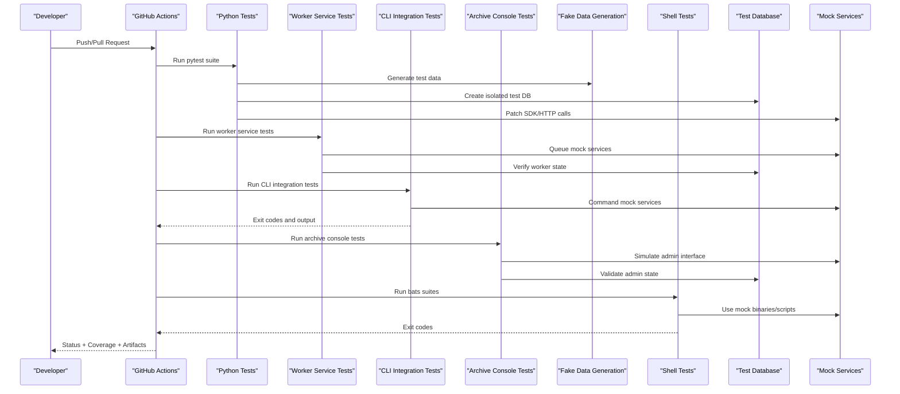

**Diagram sources**
- [.github/workflows/deploy.yml](file://.github/workflows/deploy.yml)
- [backend/tests/test_archive_console_v2.py](file://backend/tests/test_archive_console_v2.py)
- [backend/tests/test_archive_console_v2_qa_fixes.py](file://backend/tests/test_archive_console_v2_qa_fixes.py)

## Detailed Component Analysis

### Authentication Endpoint Tests
Focus areas:
- Valid and invalid credential handling
- Response status codes and payload structure
- Error propagation from auth middleware

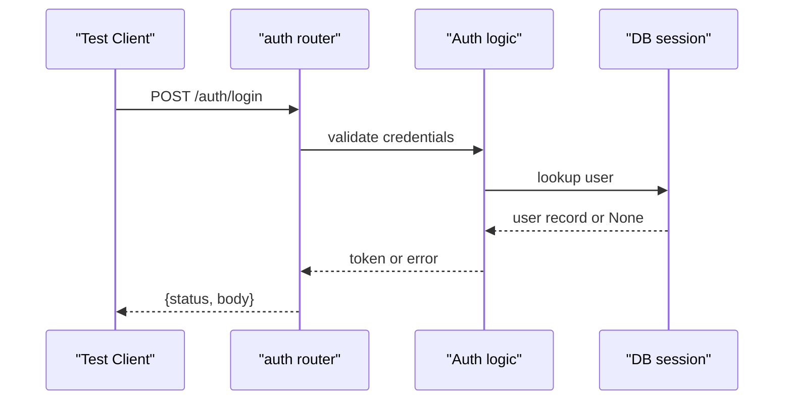

**Diagram sources**
- [backend/tests/test_auth.py](file://backend/tests/test_auth.py)
- [backend/app/routers/auth.py](file://backend/app/routers/auth.py)
- [backend/app/db/session.py](file://backend/app/db/session.py)

**Section sources**
- [backend/tests/test_auth.py](file://backend/tests/test_auth.py)
- [backend/app/routers/auth.py](file://backend/app/routers/auth.py)
- [backend/app/db/session.py](file://backend/app/db/session.py)

### Search API Tests
Focus areas:
- Query parameter parsing and validation
- Filtering and sorting behavior
- Pagination and result limits

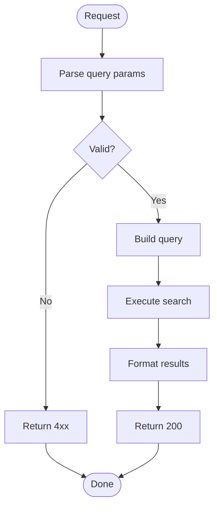

**Diagram sources**
- [backend/tests/test_search_api.py](file://backend/tests/test_search_api.py)
- [backend/app/routers/search.py](file://backend/app/routers/search.py)

**Section sources**
- [backend/tests/test_search_api.py](file://backend/tests/test_search_api.py)
- [backend/app/routers/search.py](file://backend/app/routers/search.py)

### Media Storage Migration Tests
Focus areas:
- Schema evolution correctness
- Provider factory behavior
- Data integrity across migrations

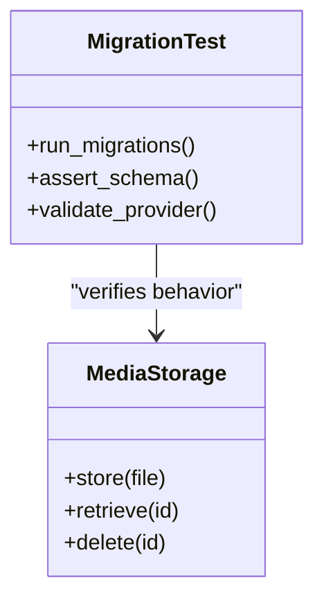

**Diagram sources**
- [backend/tests/test_media_storage_backend_migration.py](file://backend/tests/test_media_storage_backend_migration.py)
- [backend/app/media_storage.py](file://backend/app/media_storage.py)

**Section sources**
- [backend/tests/test_media_storage_backend_migration.py](file://backend/tests/test_media_storage_backend_migration.py)
- [backend/app/media_storage.py](file://backend/app/media_storage.py)

### Qiniu Worker Integration Tests
Focus areas:
- Background job execution
- External service mocking
- Idempotency and retry semantics

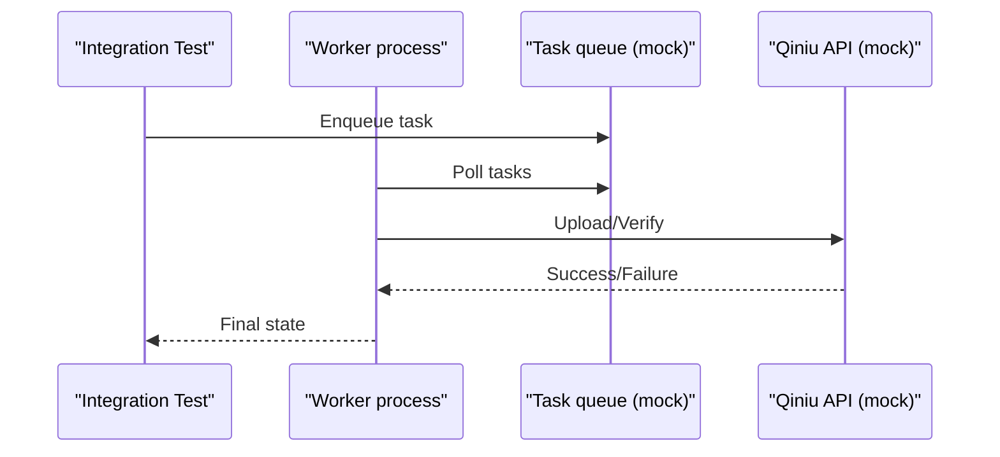

**Diagram sources**
- [backend/tests/test_qiniu_worker_integration.py](file://backend/tests/test_qiniu_worker_integration.py)
- [backend/scripts/mock_ingest.py](file://backend/scripts/mock_ingest.py)

**Section sources**
- [backend/tests/test_qiniu_worker_integration.py](file://backend/tests/test_qiniu_worker_integration.py)
- [backend/scripts/mock_ingest.py](file://backend/scripts/mock_ingest.py)

### Diagnostics Page Tests
Focus areas:
- HTML rendering
- Health check endpoints
- Static asset availability

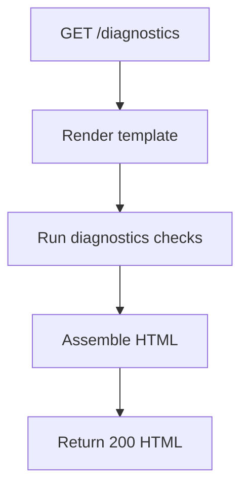

**Diagram sources**
- [backend/tests/test_reachability_diagnostics_page.py](file://backend/tests/test_reachability_diagnostics_page.py)
- [backend/app/main.py](file://backend/app/main.py)

**Section sources**
- [backend/tests/test_reachability_diagnostics_page.py](file://backend/tests/test_reachability_diagnostics_page.py)
- [backend/app/main.py](file://backend/app/main.py)

### Listing Service Tests
Comprehensive test coverage for the listing service component with 378 lines of test cases, representing one of the most extensive test suites in the project.

Focus areas:
- Listing creation, retrieval, modification, and deletion operations
- Service layer validation and business logic enforcement
- Database interaction patterns and transaction handling
- Error handling and edge case scenarios
- Integration with authentication and authorization systems
- Input validation and schema compliance
- Concurrency and race condition handling
- Performance and scalability testing

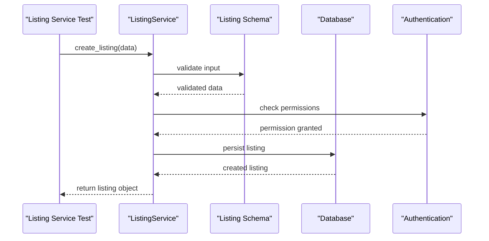

**Diagram sources**
- [backend/tests/test_listing_service.py](file://backend/tests/test_listing_service.py)
- [backend/app/services/listing_service.py](file://backend/app/services/listing_service.py)
- [backend/app/schemas/listing.py](file://backend/app/schemas/listing.py)

**Section sources**
- [backend/tests/test_listing_service.py](file://backend/tests/test_listing_service.py)
- [backend/app/services/listing_service.py](file://backend/app/services/listing_service.py)
- [backend/app/schemas/listing.py](file://backend/app/schemas/listing.py)

### Staff Seats Tests
Enhanced testing coverage and improved organization for staff seats functionality, now integrated with the broader listing service architecture.

Focus areas:
- Staff seat allocation and management
- User role and permission validation
- Seat limit enforcement and quota management
- Integration with tenant and user management systems
- Tenant isolation and data segregation
- Concurrent seat allocation scenarios

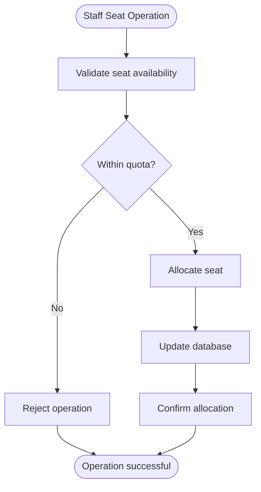

**Diagram sources**
- [backend/tests/test_staff_seats.py](file://backend/tests/test_staff_seats.py)
- [backend/app/services/listing_service.py](file://backend/app/services/listing_service.py)

**Section sources**
- [backend/tests/test_staff_seats.py](file://backend/tests/test_staff_seats.py)
- [backend/app/services/listing_service.py](file://backend/app/services/listing_service.py)

### Worker Service Tests
Comprehensive testing infrastructure for worker services including decrypt_worker and sync_worker with proper isolation and mocking strategies.

Focus areas:
- Worker service initialization and lifecycle management
- Task queue integration and message processing
- Error handling and retry mechanisms
- Database state consistency after worker operations
- Concurrency control and resource management
- External service communication patterns

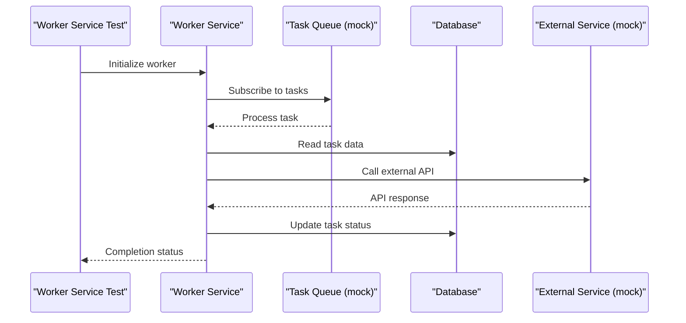

**Diagram sources**
- [backend/app/services/decrypt_worker.py](file://backend/app/services/decrypt_worker.py)
- [backend/app/services/sync_worker.py](file://backend/app/services/sync_worker.py)

**Section sources**
- [backend/app/services/decrypt_worker.py](file://backend/app/services/decrypt_worker.py)
- [backend/app/services/sync_worker.py](file://backend/app/services/sync_worker.py)

### CLI Integration Tests
Comprehensive CLI integration testing framework validating command-line interface functionality, argument parsing, and output formatting.

Focus areas:
- Command-line argument parsing and validation
- CLI exit codes and error handling
- Output format validation and logging
- Environment variable configuration testing
- Interactive vs non-interactive mode testing
- Command chaining and dependency validation

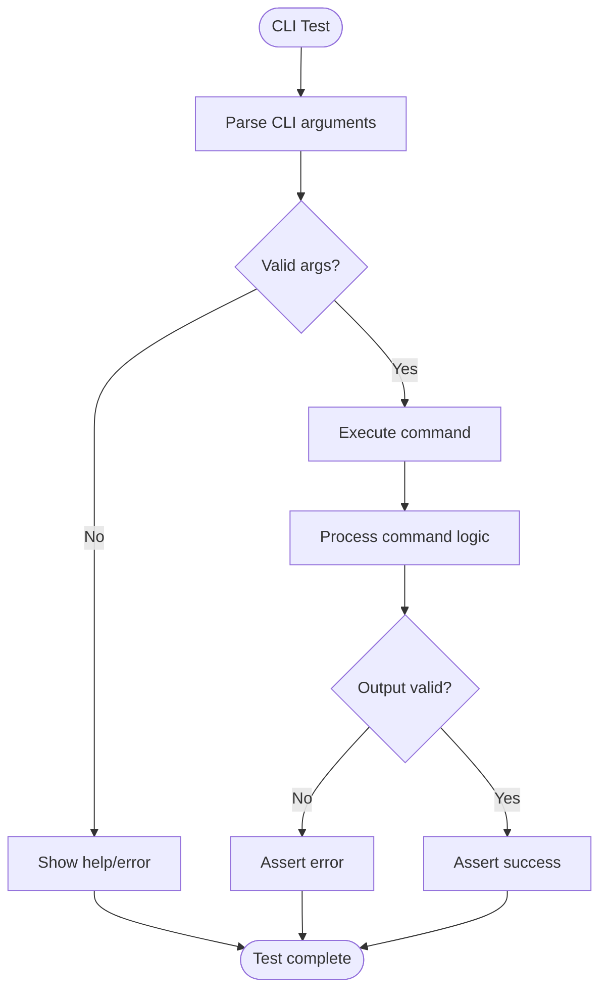

**Diagram sources**
- [backend/tests/test_*_cli.py](file://backend/tests/test_*_cli.py)

**Section sources**
- [backend/tests/test_*_cli.py](file://backend/tests/test_*_cli.py)

### Archive Console v2 Tests
**New** Comprehensive test suite for archive console v2 functionality with 471 lines of test cases covering admin interface operations, auto-loading features, and console interactions.

Focus areas:
- Admin console initialization and setup validation
- Auto-loading functionality for conversations and messages
- Chat bubble styling and rendering validation
- Console state management and persistence
- User interaction simulation and event handling
- Error handling and recovery scenarios
- Performance validation for large dataset loading

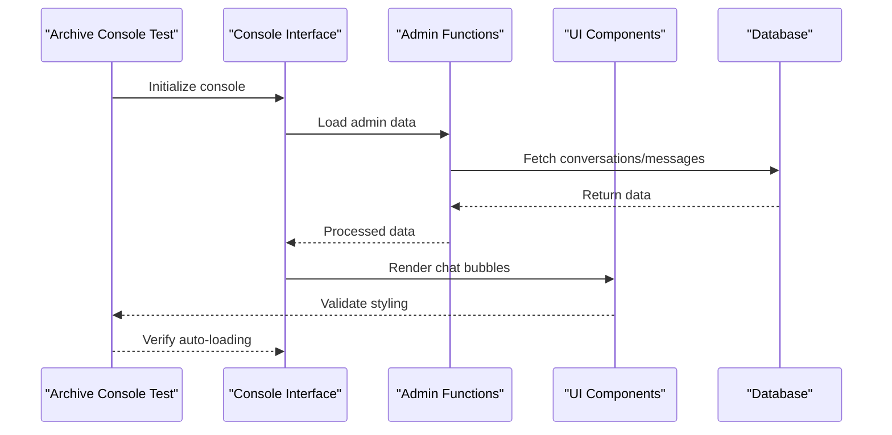

**Diagram sources**
- [backend/tests/test_archive_console_v2.py](file://backend/tests/test_archive_console_v2.py)
- [backend/app/web/static/console/*](file://backend/app/web/static/console/*)

**Section sources**
- [backend/tests/test_archive_console_v2.py](file://backend/tests/test_archive_console_v2.py)

### Archive Console v2 QA Fixes Tests
**New** Extensive quality assurance test suite with 808 lines of validation scenarios ensuring archive console functionality meets quality standards and handles edge cases properly.

Focus areas:
- Edge case validation and error handling
- Data integrity checks and consistency validation
- Performance regression testing
- Cross-browser compatibility validation
- Accessibility compliance testing
- Security validation for admin operations
- Regression testing for previously fixed issues

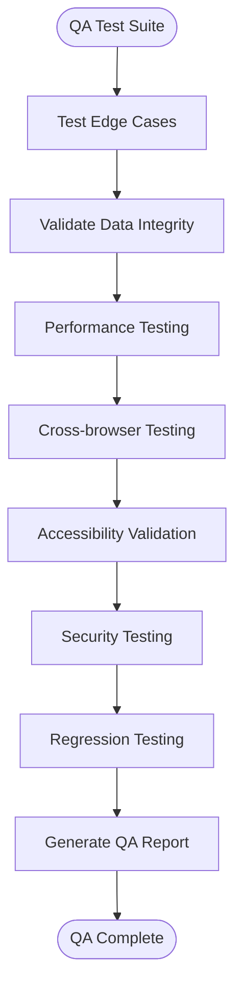

**Diagram sources**
- [backend/tests/test_archive_console_v2_qa_fixes.py](file://backend/tests/test_archive_console_v2_qa_fixes.py)

**Section sources**
- [backend/tests/test_archive_console_v2_qa_fixes.py](file://backend/tests/test_archive_console_v2_qa_fixes.py)

### Shell Script Tests (Deployment)
Focus areas:
- Installation steps and systemd unit creation
- Idempotent re-runs
- Error handling and rollback paths

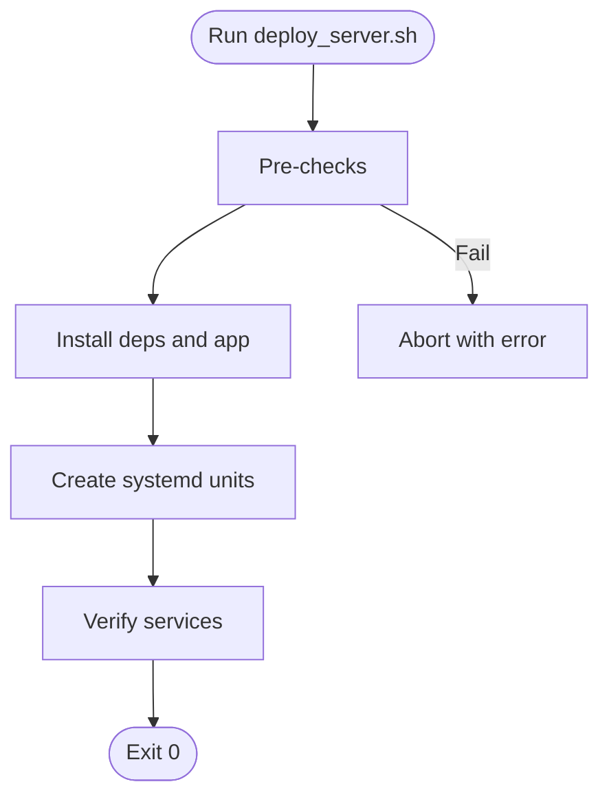

**Diagram sources**
- [scripts/tests/deploy_server.bats](file://scripts/tests/deploy_server.bats)
- [scripts/deploy_server.sh](file://scripts/deploy_server.sh)

**Section sources**
- [scripts/tests/deploy_server.bats](file://scripts/tests/deploy_server.bats)
- [scripts/deploy_server.sh](file://scripts/deploy_server.sh)

### Shell Script Tests (SSL Renewal)
Focus areas:
- Configuration validation
- Dry-run mode
- Staging and production flows
- Qiniu upload/bind/verify
- HTTPS verification and webhook notifications
- Idempotency and multi-domain scenarios

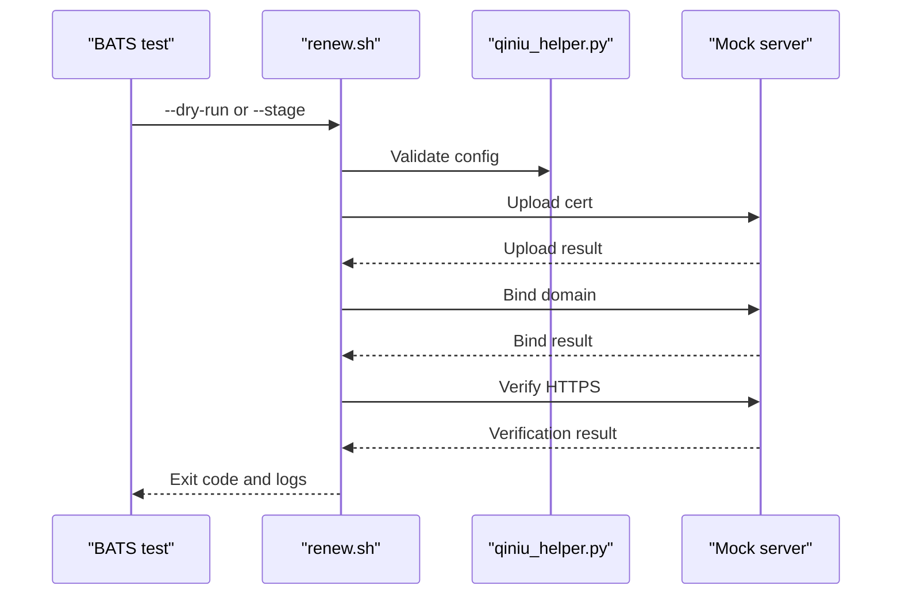

**Diagram sources**
- [ssl-renew/tests/01_config_and_validation.bats](file://ssl-renew/tests/01_config_and_validation.bats)
- [ssl-renew/tests/09_integration_mock.bats](file://ssl-renew/tests/09_integration_mock.bats)
- [ssl-renew/renew.sh](file://ssl-renew/renew.sh)
- [ssl-renew/qiniu_helper.py](file://ssl-renew/qiniu_helper.py)
- [ssl-renew/verify_https.sh](file://ssl-renew/verify_https.sh)

**Section sources**
- [ssl-renew/tests/01_config_and_validation.bats](file://ssl-renew/tests/01_config_and_validation.bats)
- [ssl-renew/tests/09_integration_mock.bats](file://ssl-renew/tests/09_integration_mock.bats)
- [ssl-renew/renew.sh](file://ssl-renew/renew.sh)
- [ssl-renew/qiniu_helper.py](file://ssl-renew/qiniu_helper.py)
- [ssl-renew/verify_https.sh](file://ssl-renew/verify_https.sh)

## Dependency Analysis
Tests depend on application modules and external services through controlled abstractions with comprehensive infrastructure support:
- Database access is abstracted via a session factory to enable isolated test databases.
- External APIs are mocked using patching and local mock servers.
- Shell tests rely on BATS and helper mocks to simulate system interactions.
- Comprehensive fake data generation utilities provide consistent test datasets across all test suites.
- Worker service testing framework provides proper queue isolation and state management.
- CLI testing utilities offer comprehensive argument validation and output assertion.
- **New**: Archive console testing framework simulates admin interface interactions and validates UI component behavior.

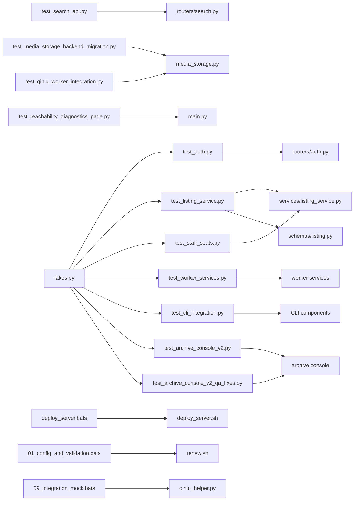

**Diagram sources**
- [backend/tests/test_archive_console_v2.py](file://backend/tests/test_archive_console_v2.py)
- [backend/tests/test_archive_console_v2_qa_fixes.py](file://backend/tests/test_archive_console_v2_qa_fixes.py)

**Section sources**
- [backend/app/db/session.py](file://backend/app/db/session.py)
- [backend/app/media_storage.py](file://backend/app/media_storage.py)
- [backend/app/services/listing_service.py](file://backend/app/services/listing_service.py)
- [backend/app/schemas/listing.py](file://backend/app/schemas/listing.py)
- [backend/tests/fakes.py](file://backend/tests/fakes.py)
- [scripts/tests/deploy_server.bats](file://scripts/tests/deploy_server.bats)
- [ssl-renew/tests/01_config_and_validation.bats](file://ssl-renew/tests/01_config_and_validation.bats)
- [ssl-renew/tests/09_integration_mock.bats](file://ssl-renew/tests/09_integration_mock.bats)

## Performance Considerations
- Use lightweight in-memory or ephemeral databases for fast iteration; reserve heavier setups for integration suites.
- Keep unit tests deterministic and free of network I/O; mock all external calls.
- For performance and load testing:
  - Simulate concurrent requests to search and authentication endpoints using tools like k6 or Locust.
  - Measure latency percentiles and throughput under realistic payloads.
  - Stress-test media upload/download paths with varied file sizes and concurrency levels.
  - Include performance testing for listing service operations to ensure scalability under load.
  - Add performance benchmarks for staff seat allocation and management operations.
  - Implement performance testing for worker services to validate background job processing efficiency.
  - Add load testing for CLI operations to ensure responsive command-line interfaces.
  - **New**: Include performance testing for archive console operations to ensure smooth admin interface experience with large datasets.
  - **New**: Add memory usage monitoring for archive console tests to prevent memory leaks during extended admin sessions.
- Cache warm-up and connection pooling should be validated in integration tests to reflect production behavior.
- Monitor memory usage and resource consumption in worker service tests to prevent memory leaks.
- **New**: Implement performance benchmarking for archive console auto-loading functionality to ensure responsive admin interface.

## Troubleshooting Guide
Common issues and resolutions:
- Flaky tests due to shared state: Ensure each test creates its own database session and cleans up temporary files.
- Network timeouts: Replace external calls with mocks; verify that patches cover all import paths.
- Shell test failures: Confirm mock binaries are discoverable in PATH and permissions are correct.
- SSL renewal edge cases: Validate certificate chain and domain mapping; inspect logs from qiniu_helper.py and verify_https.sh.
- Listing service test failures: Check database schema consistency, service initialization order, and import path updates after file reorganization.
- Staff seats test issues: Verify tenant configuration, seat quota settings, and proper integration with the listing service architecture.
- Import path errors: Ensure all test imports have been updated to reflect the new module structure and file organization.
- Worker service test failures: Verify queue connectivity, worker initialization, and proper task serialization/deserialization.
- CLI integration test issues: Check environment variable configuration, command-line argument parsing, and output format validation.
- Fake data generation problems: Ensure data consistency across related entities and proper cleanup between test runs.
- **New**: Archive console test failures: Verify admin interface initialization, console state management, and UI component rendering.
- **New**: Archive console QA test issues: Check edge case handling, data validation logic, and performance regression detection.
- **New**: Auto-loading functionality problems: Verify conversation/message loading sequences and error recovery mechanisms.
- **New**: Chat bubble styling issues: Ensure CSS class validation and rendering consistency across different message types.

**Section sources**
- [backend/app/db/session.py](file://backend/app/db/session.py)
- [backend/app/services/listing_service.py](file://backend/app/services/listing_service.py)
- [backend/tests/test_listing_service.py](file://backend/tests/test_listing_service.py)
- [backend/tests/test_staff_seats.py](file://backend/tests/test_staff_seats.py)
- [backend/tests/fakes.py](file://backend/tests/fakes.py)
- [ssl-renew/qiniu_helper.py](file://ssl-renew/qiniu_helper.py)
- [ssl-renew/verify_https.sh](file://ssl-renew/verify_https.sh)
- [backend/tests/test_archive_console_v2.py](file://backend/tests/test_archive_console_v2.py)
- [backend/tests/test_archive_console_v2_qa_fixes.py](file://backend/tests/test_archive_console_v2_qa_fixes.py)

## Conclusion
The project employs a comprehensive layered testing approach combining Python unit/integration tests, worker service tests, CLI integration tests, archive console tests, and shell-based BATS tests. Strong isolation, comprehensive mocking, fake data generation, and clear CI orchestration ensure reliability and speed. The recent enhancements with over 2,000 lines of additional test code covering archive console functionality, admin interface features, and comprehensive QA scenarios demonstrate the project's commitment to thorough test coverage and maintainable test architecture. The updated import paths and file reorganization have been properly reflected throughout the testing framework. Adhering to the guidelines here will maintain high-quality, maintainable tests aligned with production behavior.

## Appendices

### Test Environment Setup
- Python:
  - Install dependencies from requirements files.
  - Configure test database URL and any required environment variables.
  - Use pytest markers to separate fast unit tests from slower integration suites.
  - Ensure listing service dependencies and schemas are properly initialized for tests.
  - Verify staff seats test environment includes proper tenant isolation setup.
  - Set up worker service testing environment with proper queue configuration.
  - Configure CLI testing environment with appropriate command-line flags and environment variables.
  - **New**: Set up archive console testing environment with admin interface simulation and UI component mocking.
- Shell:
  - Install BATS and ensure mock helpers are available.
  - Set up mock servers where required by integration tests.
  - Configure fake data generation utilities for consistent test datasets.

**Section sources**
- [backend/tests/test_archive_console_v2.py](file://backend/tests/test_archive_console_v2.py)
- [backend/tests/test_archive_console_v2_qa_fixes.py](file://backend/tests/test_archive_console_v2_qa_fixes.py)

### Mocking Strategies
- Python:
  - Patch SDK and HTTP clients at the module level to avoid real network calls.
  - Use factories to provide test doubles for storage providers.
  - Implement comprehensive mocking for listing service operations, database interactions, and authentication flows.
  - Enhance mocking strategies for staff seats operations and tenant isolation scenarios.
  - Implement worker service mocking with proper queue isolation and task simulation.
  - Create CLI command mocking for argument validation and output assertion.
  - **New**: Implement archive console mocking with admin interface simulation and UI component validation.
- Shell:
  - Provide mock binaries for curl, systemctl, git, mv, python, flock to control behavior deterministically.

**Section sources**
- [backend/scripts/mock_ingest.py](file://backend/scripts/mock_ingest.py)
- [backend/tests/test_archive_console_v2.py](file://backend/tests/test_archive_console_v2.py)
- [backend/tests/test_archive_console_v2_qa_fixes.py](file://backend/tests/test_archive_console_v2_qa_fixes.py)

### Test Data Management
- Seed minimal datasets for authentication and search queries.
- Use temporary directories for media operations; clean up after each test.
- For migrations, apply only necessary schema changes and verify constraints.
- Create comprehensive test data sets for listing service scenarios including various listing types, states, permissions, and edge cases.
- Enhance staff seats test data to cover edge cases, quota scenarios, and tenant isolation requirements.
- Implement proper cleanup procedures for listing service test data to prevent database bloat.
- Comprehensive fake data generation utilities providing realistic test datasets for all application entities.
- Worker service test data with proper task serialization and queue state management.
- CLI test data with various command-line argument combinations and expected outputs.
- **New**: Archive console test data with admin user scenarios, conversation datasets, and message samples for comprehensive admin interface testing.

**Section sources**
- [backend/tests/test_archive_console_v2.py](file://backend/tests/test_archive_console_v2.py)
- [backend/tests/test_archive_console_v2_qa_fixes.py](file://backend/tests/test_archive_console_v2_qa_fixes.py)

### Writing Effective Tests
- Follow AAA pattern: Arrange inputs, Act on the system, Assert outcomes.
- Keep tests focused on one behavior per case.
- Prefer explicit assertions over implicit side effects.
- Name tests descriptively to convey intent and scenario.
- For listing service tests, ensure comprehensive coverage of CRUD operations, business logic validation, error scenarios, and integration points.
- For staff seats tests, focus on quota management, tenant isolation, and concurrent access scenarios.
- For worker service tests, validate task processing, error handling, and state consistency.
- For CLI integration tests, ensure proper argument parsing, error handling, and output validation.
- **New**: For archive console tests, validate admin interface interactions, auto-loading functionality, and chat bubble rendering.
- **New**: For QA fix tests, focus on edge case validation, regression prevention, and performance validation.

### Coverage Requirements
- Aim for line and branch coverage thresholds on critical modules (e.g., routers, storage backends).
- Exclude generated code and third-party integrations from coverage metrics.
- Report coverage in CI to prevent regressions.
- Target high coverage for listing service components given their complexity and importance, aiming for 90%+ coverage on core listing operations.
- Increase coverage targets for staff seats functionality to ensure robust tenant isolation and quota management.
- Establish coverage requirements for worker service tests focusing on error handling and edge cases.
- Define CLI integration test coverage targets ensuring comprehensive command-line interface validation.
- **New**: Establish comprehensive coverage requirements for archive console tests targeting 95%+ coverage on admin interface functionality.
- **New**: Define QA fix test coverage targets ensuring thorough edge case validation and regression testing.

**Section sources**
- [backend/tests/test_archive_console_v2.py](file://backend/tests/test_archive_console_v2.py)
- [backend/tests/test_archive_console_v2_qa_fixes.py](file://backend/tests/test_archive_console_v2_qa_fixes.py)

### Continuous Integration Pipelines
- GitHub Actions executes Python tests and shell tests on push and pull requests.
- Steps include dependency installation, test execution, and artifact collection.
- Gate merges on passing tests and coverage thresholds.
- Enhanced pipeline to handle the expanded test suite including listing service and staff seats tests, with proper import path resolution and test isolation.
- Integrated worker service testing into CI pipeline with proper queue isolation.
- Added CLI integration testing to CI pipeline with comprehensive command validation.
- Implemented fake data generation caching to improve CI performance.
- **New**: Integrated archive console testing into CI pipeline with admin interface simulation and UI component validation.
- **New**: Added QA fix validation to CI pipeline ensuring edge case coverage and regression prevention.
- **New**: Implemented archive console performance testing in CI to detect performance regressions.

**Section sources**
- [.github/workflows/deploy.yml](file://.github/workflows/deploy.yml)
- [backend/tests/test_archive_console_v2.py](file://backend/tests/test_archive_console_v2.py)
- [backend/tests/test_archive_console_v2_qa_fixes.py](file://backend/tests/test_archive_console_v2_qa_fixes.py)

### Code Quality Tools and Linting
- Python linting and formatting configured via pyproject.toml.
- ShellCheck used for shell scripts; enforce rules via .shellcheckrc.
- Automated checks run in CI to maintain consistency.
- Added test-specific linting rules for test code organization and naming conventions.
- Implemented fake data generation validation to ensure test data consistency.
- **New**: Added archive console test linting rules for admin interface test patterns and UI validation.
- **New**: Implemented QA fix test validation ensuring comprehensive edge case coverage.

**Section sources**
- [pyproject.toml](file://pyproject.toml)
- [ssl-renew/.shellcheckrc](file://ssl-renew/.shellcheckrc)
- [backend/tests/test_archive_console_v2.py](file://backend/tests/test_archive_console_v2.py)
- [backend/tests/test_archive_console_v2_qa_fixes.py](file://backend/tests/test_archive_console_v2_qa_fixes.py)

### Automated Code Review Processes
- Enforce PR templates and required checks in CI.
- Require review approvals before merging.
- Use automated linters and formatters to reduce manual review overhead.
- Added test code review guidelines focusing on test isolation, mocking strategies, and data generation practices.
- **New**: Added archive console test review guidelines focusing on admin interface simulation and UI validation patterns.
- **New**: Implemented QA fix test review criteria ensuring thorough edge case validation and regression prevention.

**Section sources**
- [.github/workflows/deploy.yml](file://.github/workflows/deploy.yml)
- [backend/tests/test_archive_console_v2.py](file://backend/tests/test_archive_console_v2.py)
- [backend/tests/test_archive_console_v2_qa_fixes.py](file://backend/tests/test_archive_console_v2_qa_fixes.py)

### Security Testing Procedures
- Validate input sanitization and output encoding in routers.
- Test authentication and authorization paths thoroughly.
- Inspect secrets handling and ensure no sensitive data leaks in logs or responses.
- Include security testing for listing service operations, focusing on permission validation, data access controls, and injection prevention.
- Expand security testing for staff seat management to ensure proper tenant isolation and privilege escalation prevention.
- Implement security testing for worker services to validate task isolation and data protection.
- Add security testing for CLI commands to prevent command injection and unauthorized access.
- **New**: Implement security testing for archive console admin operations to ensure proper authorization and data access controls.
- **New**: Add security validation for admin interface interactions preventing unauthorized admin actions.

**Section sources**
- [backend/app/routers/auth.py](file://backend/app/routers/auth.py)
- [backend/tests/test_auth.py](file://backend/tests/test_auth.py)
- [backend/tests/test_archive_console_v2.py](file://backend/tests/test_archive_console_v2.py)
- [backend/tests/test_archive_console_v2_qa_fixes.py](file://backend/tests/test_archive_console_v2_qa_fixes.py)

### Makefile Targets
- Centralize common commands for running tests, linting, and building artifacts.
- Provide targets for quick feedback during development.
- Added make targets for specific test categories (unit, integration, worker, CLI).
- Included fake data generation utilities in make targets for consistent test environments.
- **New**: Added make targets for archive console testing with admin interface simulation.
- **New**: Included QA fix validation targets ensuring comprehensive edge case testing.

**Section sources**
- [Makefile](file://Makefile)
- [backend/tests/test_archive_console_v2.py](file://backend/tests/test_archive_console_v2.py)
- [backend/tests/test_archive_console_v2_qa_fixes.py](file://backend/tests/test_archive_console_v2_qa_fixes.py)