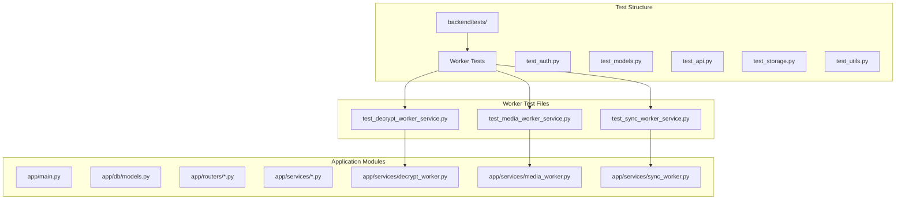
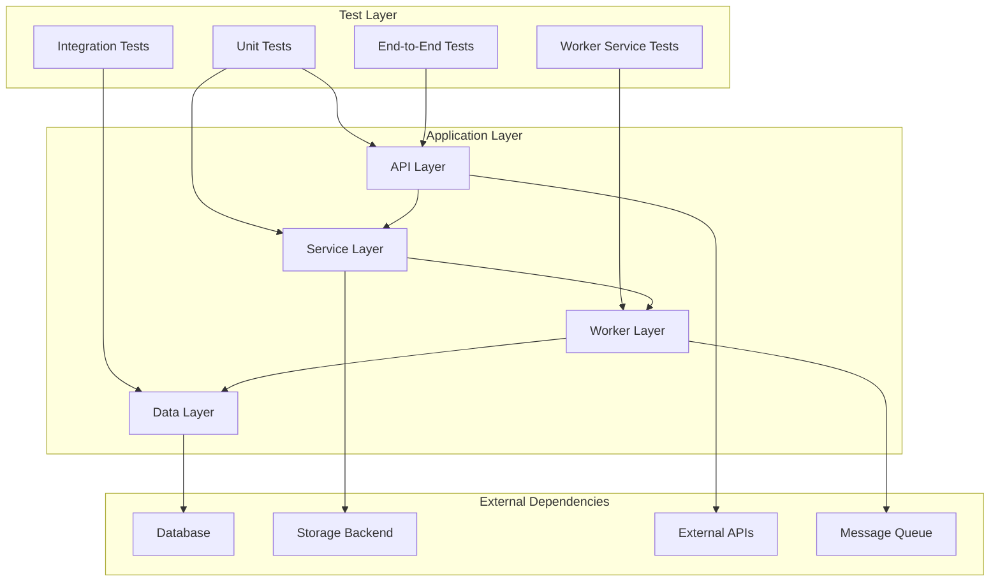
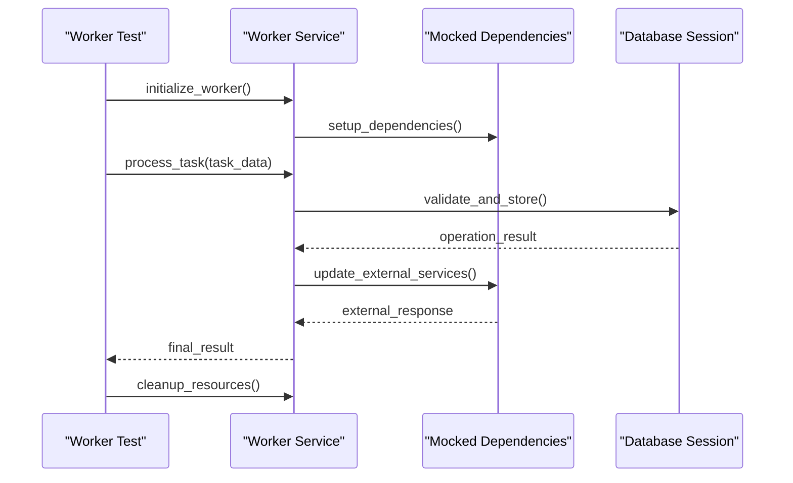
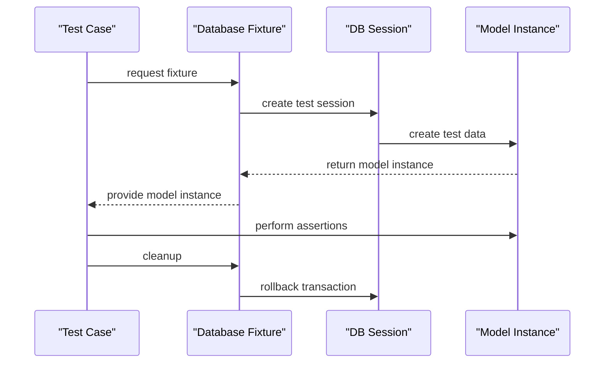
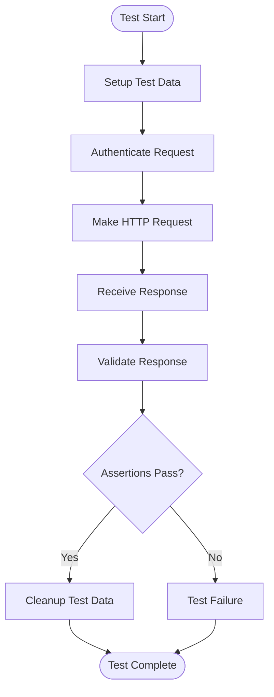
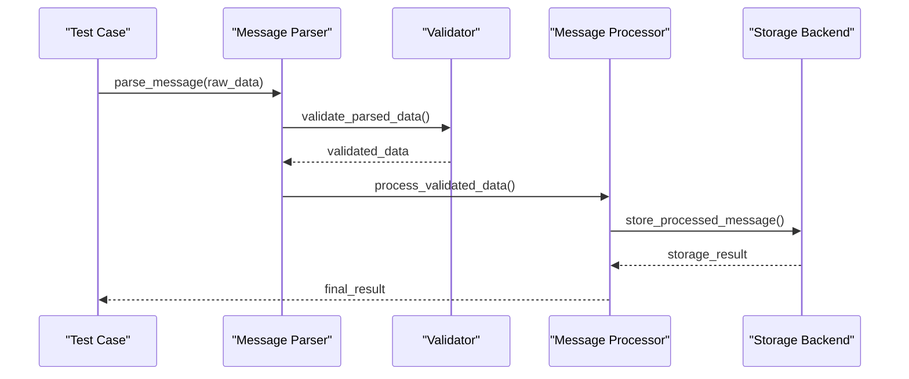
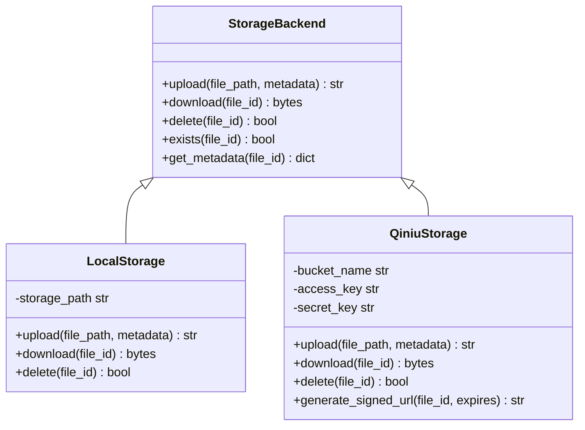
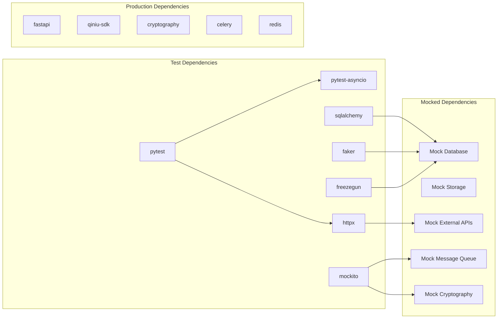

# Unit Testing

<cite>
**Referenced Files in This Document**
- [backend/tests/test_decrypt_worker_service.py](file://backend/tests/test_decrypt_worker_service.py)
- [backend/tests/test_media_worker_service.py](file://backend/tests/test_media_worker_service.py)
- [backend/tests/test_sync_worker_service.py](file://backend/tests/test_sync_worker_service.py)
- [backend/app/services/decrypt_worker.py](file://backend/app/services/decrypt_worker.py)
- [backend/app/services/media_worker.py](file://backend/app/services/media_worker.py)
- [backend/app/services/sync_worker.py](file://backend/app/services/sync_worker.py)
- [backend/tests/test_auth.py](file://backend/tests/test_auth.py)
- [backend/tests/test_conversation_membership_service.py](file://backend/tests/test_conversation_membership_service.py)
- [backend/tests/test_reachability_audit.py](file://backend/tests/test_reachability_audit.py)
- [backend/app/db/models.py](file://backend/app/db/models.py)
- [backend/app/main.py](file://backend/app/main.py)
- [backend/requirements.txt](file://backend/requirements.txt)
- [pyproject.toml](file://pyproject.toml)
</cite>

## Update Summary
**Changes Made**
- Added comprehensive documentation for worker service unit tests covering decrypt, media, and sync workers
- Updated test organization patterns to include worker-specific testing strategies
- Enhanced error condition and edge case coverage documentation
- Added new sections on worker service testing patterns and best practices

## Table of Contents
1. [Introduction](#introduction)
2. [Project Structure](#project-structure)
3. [Core Components](#core-components)
4. [Architecture Overview](#architecture-overview)
5. [Worker Service Testing](#worker-service-testing)
6. [Detailed Component Analysis](#detailed-component-analysis)
7. [Dependency Analysis](#dependency-analysis)
8. [Performance Considerations](#performance-considerations)
9. [Troubleshooting Guide](#troubleshooting-guide)
10. [Conclusion](#conclusion)
11. [Appendices](#appendices)

## Introduction

This document provides comprehensive unit testing documentation for the WeCom Archive 365 Python backend. It covers pytest framework setup, test organization patterns, mocking strategies, and best practices for testing database models, API endpoints, message processing logic, storage backends, and worker services. The guide includes examples of test fixtures, data management, assertion patterns, and performance considerations for large test suites. **Updated** to reflect the addition of comprehensive worker service unit tests for decrypt, media, and sync workers with extensive error condition and edge case coverage.

## Project Structure

The test suite follows a well-organized structure within the `backend/tests` directory, with individual test files corresponding to specific application modules and functionality areas. The recent additions include dedicated test files for worker services that follow consistent naming and organizational patterns.



**Diagram sources**
- [backend/tests/test_decrypt_worker_service.py](file://backend/tests/test_decrypt_worker_service.py)
- [backend/tests/test_media_worker_service.py](file://backend/tests/test_media_worker_service.py)
- [backend/tests/test_sync_worker_service.py](file://backend/tests/test_sync_worker_service.py)
- [backend/app/services/decrypt_worker.py](file://backend/app/services/decrypt_worker.py)
- [backend/app/services/media_worker.py](file://backend/app/services/media_worker.py)
- [backend/app/services/sync_worker.py](file://backend/app/services/sync_worker.py)

**Section sources**
- [backend/tests/test_decrypt_worker_service.py](file://backend/tests/test_decrypt_worker_service.py)
- [backend/tests/test_media_worker_service.py](file://backend/tests/test_media_worker_service.py)
- [backend/tests/test_sync_worker_service.py](file://backend/tests/test_sync_worker_service.py)

## Core Components

### Pytest Framework Setup

The testing framework is built around pytest with additional plugins for async support, database testing, and coverage reporting. Key configuration includes:

- **pytest.ini or pyproject.toml**: Test discovery patterns, markers, and global settings
- **conftest.py**: Shared fixtures and test utilities
- **Test naming conventions**: `test_*.py` files with `test_*` function names
- **Async testing**: Support for async/await patterns using pytest-asyncio

### Test Organization Patterns

The codebase follows several key organizational patterns:

1. **Feature-based organization**: Tests grouped by application feature (auth, media, conversations)
2. **Module-based testing**: Each major module has corresponding test files
3. **Worker service testing**: Dedicated test files for each worker service type
4. **Integration vs Unit tests**: Clear separation between fast unit tests and slower integration tests
5. **Fixture hierarchy**: Reusable test data and setup through pytest fixtures

### Mocking Strategies

The testing strategy employs multiple mocking approaches:

- **unittest.mock**: For external dependencies and services
- **Database mocking**: Using test databases or mock sessions
- **HTTP client mocking**: For external API calls
- **File system mocking**: For storage backend testing
- **Worker service mocking**: Specialized mocks for background task processing

**Section sources**
- [backend/tests/test_decrypt_worker_service.py](file://backend/tests/test_decrypt_worker_service.py)
- [backend/tests/test_media_worker_service.py](file://backend/tests/test_media_worker_service.py)
- [backend/tests/test_sync_worker_service.py](file://backend/tests/test_sync_worker_service.py)

## Architecture Overview

The testing architecture follows a layered approach that mirrors the application's modular design, with enhanced coverage for worker service components:



**Diagram sources**
- [backend/app/main.py](file://backend/app/main.py)
- [backend/app/db/models.py](file://backend/app/db/models.py)
- [backend/app/services/decrypt_worker.py](file://backend/app/services/decrypt_worker.py)
- [backend/app/services/media_worker.py](file://backend/app/services/media_worker.py)
- [backend/app/services/sync_worker.py](file://backend/app/services/sync_worker.py)

## Worker Service Testing

The worker service testing framework provides comprehensive coverage for background task processing, including decrypt, media, and sync workers. Each worker service follows consistent testing patterns with extensive error condition and edge case coverage.

### Worker Service Test Structure

Worker service tests are organized into dedicated test files that mirror the service implementation structure:



**Diagram sources**
- [backend/tests/test_decrypt_worker_service.py](file://backend/tests/test_decrypt_worker_service.py)
- [backend/tests/test_media_worker_service.py](file://backend/tests/test_media_worker_service.py)
- [backend/tests/test_sync_worker_service.py](file://backend/tests/test_sync_worker_service.py)

### Decrypt Worker Testing

The decrypt worker tests focus on message decryption functionality, handling various encryption formats and error conditions:

#### Key Testing Scenarios
- **Valid decryption scenarios**: Different encryption algorithms and key types
- **Error handling**: Invalid keys, corrupted data, unsupported formats
- **Edge cases**: Empty messages, malformed data, timeout scenarios
- **Performance testing**: Large message batches and memory usage

#### Test Data Management
Decrypt worker tests use specialized fixtures for encrypted message data and cryptographic keys:

```python
# Example test structure for decrypt worker
def test_decrypt_worker_valid_encryption():
    """Test successful decryption of valid encrypted messages"""
    # Setup encrypted test data
    # Initialize decrypt worker with proper configuration
    # Execute decryption process
    # Validate decrypted output matches expected format
```

### Media Worker Testing

Media worker tests cover media file processing, download, and storage operations with comprehensive error coverage:

#### Core Testing Areas
- **Media download**: HTTP requests, retry logic, timeout handling
- **File validation**: Format detection, size limits, corruption checks
- **Storage operations**: Upload, retrieval, and deletion across different backends
- **Error recovery**: Network failures, storage errors, partial downloads

#### Error Condition Coverage
Media worker tests extensively cover error scenarios including:
- Network connectivity issues
- Storage backend failures
- Invalid media formats
- Permission and access errors
- Resource exhaustion scenarios

### Sync Worker Testing

Sync worker tests ensure reliable synchronization between WeCom API and local database:

#### Synchronization Testing
- **Incremental sync**: Partial updates and conflict resolution
- **Full sync**: Complete data synchronization and reconciliation
- **Error handling**: API rate limiting, authentication failures, data inconsistencies
- **Idempotency**: Duplicate operation prevention and rollback mechanisms

#### Concurrency Testing
Sync worker tests verify thread-safe operations and concurrent access patterns:
- Multiple sync operations running simultaneously
- Database transaction isolation
- Lock contention and deadlock prevention
- Memory usage under load

**Section sources**
- [backend/tests/test_decrypt_worker_service.py](file://backend/tests/test_decrypt_worker_service.py)
- [backend/tests/test_media_worker_service.py](file://backend/tests/test_media_worker_service.py)
- [backend/tests/test_sync_worker_service.py](file://backend/tests/test_sync_worker_service.py)

## Detailed Component Analysis

### Database Model Testing

Testing database models requires careful handling of transactions, fixtures, and database state management.

#### Test Fixtures for Database Models



**Diagram sources**
- [backend/app/db/models.py](file://backend/app/db/models.py)

#### Transaction Management in Tests

Key patterns for database testing include:
- **Transaction wrapping**: All test operations wrapped in transactions
- **Automatic cleanup**: Rollback after each test to maintain isolation
- **Test data factories**: Consistent test data generation
- **Database seeding**: Pre-populated test datasets for complex scenarios

### API Endpoint Testing

API testing focuses on HTTP request/response cycles, authentication, and business logic validation.

#### API Test Structure



**Diagram sources**
- [backend/app/main.py](file://backend/app/main.py)

#### Authentication Testing

Authentication tests cover various scenarios:
- Valid credentials handling
- Invalid credential rejection
- Token expiration and refresh
- Role-based access control

### Message Processing Logic Testing

Message processing involves parsing, validation, and transformation of WeChat Work messages.

#### Message Processing Test Flow



**Diagram sources**
- [backend/app/structured_message_parser.py](file://backend/app/structured_message_parser.py)

### Storage Backend Testing

Storage backend testing ensures consistent behavior across different storage implementations.

#### Storage Backend Abstraction



**Diagram sources**
- [backend/app/media_storage.py](file://backend/app/media_storage.py)
- [backend/app/qiniu_storage.py](file://backend/app/qiniu_storage.py)

**Section sources**
- [backend/tests/test_qiniu_storage.py](file://backend/tests/test_qiniu_storage.py)
- [backend/tests/test_media_storage.py](file://backend/tests/test_media_storage.py)

## Dependency Analysis

The testing layer maintains clear separation from production dependencies through strategic mocking and dependency injection.



**Diagram sources**
- [backend/requirements.txt](file://backend/requirements.txt)
- [pyproject.toml](file://pyproject.toml)

**Section sources**
- [backend/requirements.txt](file://backend/requirements.txt)
- [pyproject.toml](file://pyproject.toml)

## Performance Considerations

### Test Suite Optimization

For large test suites, consider these optimization strategies:

1. **Parallel Test Execution**: Use pytest-xdist for parallel test running
2. **Database Connection Pooling**: Reuse database connections across tests
3. **Lazy Loading**: Load heavy fixtures only when needed
4. **Test Categorization**: Mark slow tests and run them separately
5. **Memory Management**: Proper cleanup of test resources

### Async Testing Performance

Async functions require special consideration:
- **Event loop management**: Proper event loop lifecycle handling
- **Async fixtures**: Async-compatible test fixtures
- **Concurrent testing**: Safe concurrent execution of async tests
- **Timeout handling**: Proper timeout configuration for async operations

### Database Test Performance

Optimize database-heavy tests:
- **Use in-memory databases**: SQLite for faster unit tests
- **Connection pooling**: Reuse database connections
- **Batch operations**: Minimize database round trips
- **Selective data loading**: Load only necessary test data

### Worker Service Test Performance

Worker service tests require specialized performance considerations:
- **Background task simulation**: Efficient mocking of long-running processes
- **Resource isolation**: Prevent resource leaks between worker tests
- **Queue simulation**: Fast message queue operations for testing
- **Memory profiling**: Monitor memory usage during worker operations

## Troubleshooting Guide

### Common Testing Issues

1. **Database Connection Problems**
   - Ensure proper database URL configuration
   - Verify connection pool settings
   - Check for lingering connections

2. **Async Test Failures**
   - Verify event loop configuration
   - Check for blocking operations in async functions
   - Ensure proper async fixture usage

3. **Mocking Issues**
   - Validate mock object interfaces
   - Check for correct patch targets
   - Ensure mock state cleanup

4. **Test Isolation Problems**
   - Verify transaction rollback
   - Check for shared mutable state
   - Ensure proper fixture scoping

5. **Worker Service Issues**
   - Background task timeout handling
   - Queue connectivity problems
   - Resource cleanup in worker processes

### Debugging Techniques

- **Verbose logging**: Enable detailed test output
- **Database query logging**: Monitor SQL queries during tests
- **Network request inspection**: Log HTTP requests/responses
- **Memory profiling**: Identify memory leaks in test suites
- **Worker debugging**: Trace background task execution flow

**Section sources**
- [backend/tests/test_auth.py](file://backend/tests/test_auth.py)
- [backend/tests/test_reachability_audit.py](file://backend/tests/test_reachability_audit.py)

## Conclusion

The WeCom Archive 365 backend implements a comprehensive testing strategy that covers all critical aspects of the application, including the newly added worker service testing framework. The test suite follows pytest best practices, employs effective mocking strategies, and maintains good separation between unit and integration tests. The modular architecture facilitates targeted testing of individual components while ensuring overall system reliability through integration testing.

Key strengths of the testing approach include:
- Comprehensive coverage of database operations
- Effective mocking of external dependencies
- Support for async testing patterns
- Clear separation of concerns in test organization
- Robust fixture management for test data
- **Enhanced worker service testing with extensive error condition coverage**
- **Specialized testing for background task processing and concurrency**

## Appendices

### Test Naming Conventions

- **Test files**: `test_<module>.py`
- **Test functions**: `test_<functionality>_<scenario>`
- **Test classes**: `Test<Class><Scenario>`
- **Fixtures**: `fixture_<name>`
- **Worker tests**: `test_<worker_type>_worker_service.py`

### Coverage Requirements

- **Minimum coverage**: 80% line coverage
- **Critical paths**: 95%+ coverage for core business logic
- **API endpoints**: 100% coverage for public interfaces
- **Error handling**: Comprehensive error path coverage
- **Worker services**: 90%+ coverage for background task processing

### Best Practices Summary

1. **Isolation**: Each test should be independent and isolated
2. **Readability**: Tests should be self-documenting
3. **Maintainability**: Avoid hard-coded values and magic numbers
4. **Performance**: Keep tests fast and efficient
5. **Reliability**: Tests should be deterministic and repeatable
6. **Worker testing**: Ensure proper resource cleanup and timeout handling
7. **Error coverage**: Test both success and failure scenarios comprehensively