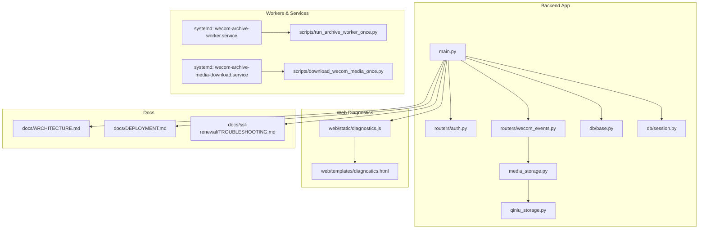
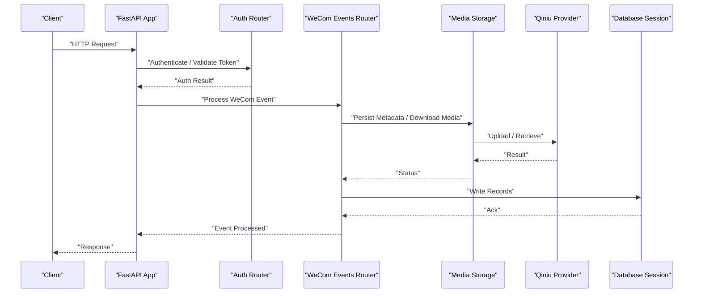
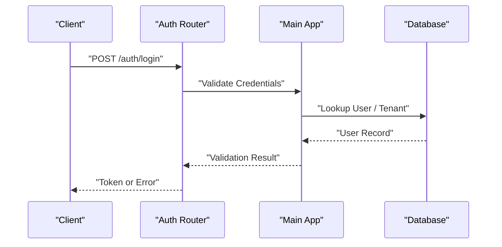
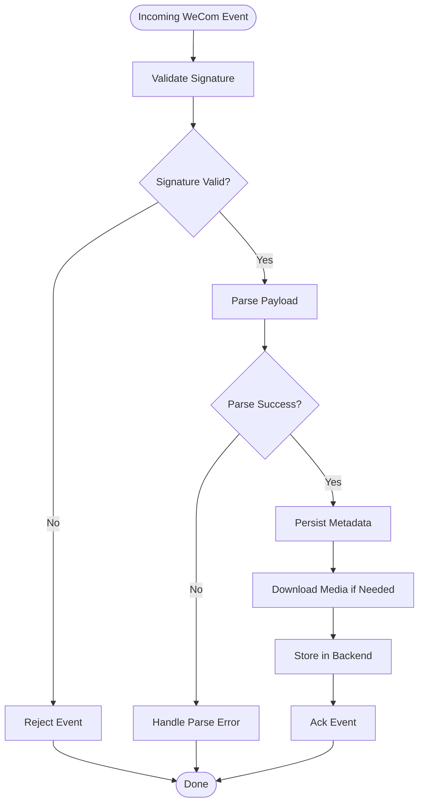
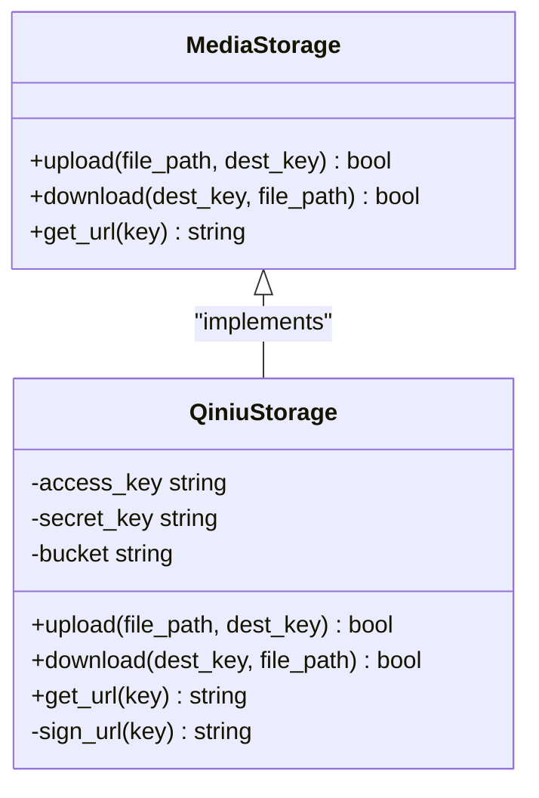
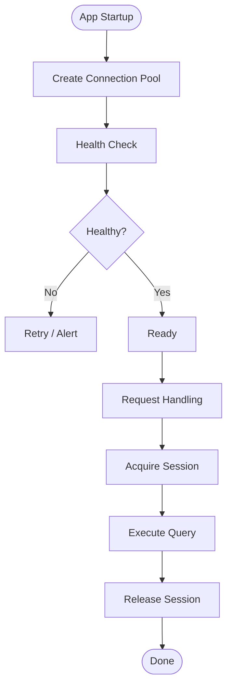
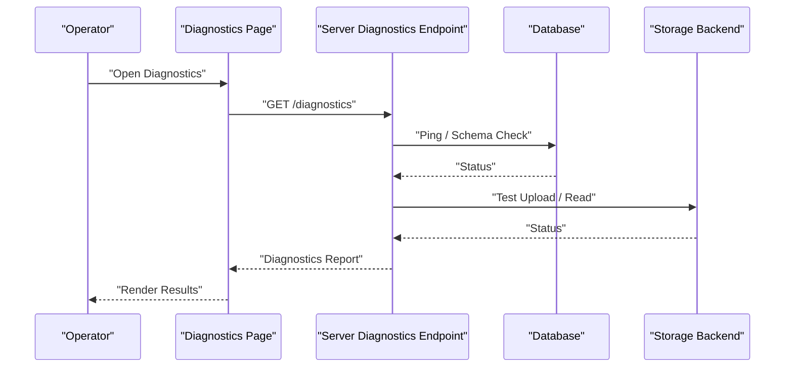
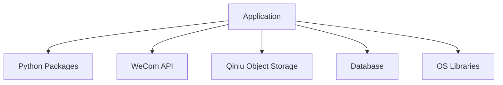

# Troubleshooting & FAQ

<cite>
**Referenced Files in This Document**
- [backend/app/main.py](file://backend/app/main.py)
- [backend/app/auth.py](file://backend/app/auth.py)
- [backend/app/routers/auth.py](file://backend/app/routers/auth.py)
- [backend/app/routers/wecom_events.py](file://backend/app/routers/wecom_events.py)
- [backend/app/media_storage.py](file://backend/app/media_storage.py)
- [backend/app/qiniu_storage.py](file://backend/app/qiniu_storage.py)
- [backend/app/db/base.py](file://backend/app/db/base.py)
- [backend/app/db/session.py](file://backend/app/db/session.py)
- [backend/app/web/static/diagnostics.js](file://backend/app/web/static/diagnostics.js)
- [backend/app/web/templates/diagnostics.html](file://backend/app/web/templates/diagnostics.html)
- [backend/scripts/run_archive_worker_once.py](file://backend/scripts/run_archive_worker_once.py)
- [backend/scripts/download_wecom_media_once.py](file://backend/scripts/download_wecom_media_once.py)
- [backend/requirements.txt](file://backend/requirements.txt)
- [deploy/systemd/wecom-archive-worker.service](file://deploy/systemd/wecom-archive-worker.service)
- [deploy/systemd/wecom-archive-media-download.service](file://deploy/systemd/wecom-archive-media-download.service)
- [docs/ssl-renewal/TROUBLESHOOTING.md](file://docs/ssl-renewal/TROUBLESHOOTING.md)
- [docs/ARCHITECTURE.md](file://docs/ARCHITECTURE.md)
- [docs/DEPLOYMENT.md](file://docs/DEPLOYMENT.md)
- [scripts/deploy_server.sh](file://scripts/deploy_server.sh)
</cite>

## Table of Contents
1. [Introduction](#introduction)
2. [Project Structure](#project-structure)
3. [Core Components](#core-components)
4. [Architecture Overview](#architecture-overview)
5. [Detailed Component Analysis](#detailed-component-analysis)
6. [Dependency Analysis](#dependency-analysis)
7. [Performance Considerations](#performance-considerations)
8. [Troubleshooting Guide](#troubleshooting-guide)
9. [Conclusion](#conclusion)
10. [Appendices](#appendices)

## Introduction
This document provides a comprehensive troubleshooting and FAQ guide for the WeCom Archive system. It focuses on diagnosing message processing failures, storage connectivity issues, and authentication problems. It also includes log analysis guidance, debugging techniques, performance profiling methods, known issues with workarounds, system limitations, upgrade considerations, and escalation procedures.

## Project Structure
The system is organized into a backend application (FastAPI-based), database migrations (Alembic), web templates and static assets, deployment scripts, and operational runbooks. Key areas relevant to troubleshooting include:
- Application entrypoint and routing
- Authentication and authorization
- WeCom event ingestion
- Media storage backends (local and Qiniu)
- Database session management
- Web diagnostics UI
- Systemd services for workers and media download
- SSL renewal utilities

**Diagram sources**
- [backend/app/main.py](file://backend/app/main.py)
- [backend/app/routers/auth.py](file://backend/app/routers/auth.py)
- [backend/app/routers/wecom_events.py](file://backend/app/routers/wecom_events.py)
- [backend/app/media_storage.py](file://backend/app/media_storage.py)
- [backend/app/qiniu_storage.py](file://backend/app/qiniu_storage.py)
- [backend/app/db/base.py](file://backend/app/db/base.py)
- [backend/app/db/session.py](file://backend/app/db/session.py)
- [backend/app/web/static/diagnostics.js](file://backend/app/web/static/diagnostics.js)
- [backend/app/web/templates/diagnostics.html](file://backend/app/web/templates/diagnostics.html)
- [deploy/systemd/wecom-archive-worker.service](file://deploy/systemd/wecom-archive-worker.service)
- [deploy/systemd/wecom-archive-media-download.service](file://deploy/systemd/wecom-archive-media-download.service)
- [backend/scripts/run_archive_worker_once.py](file://backend/scripts/run_archive_worker_once.py)
- [backend/scripts/download_wecom_media_once.py](file://backend/scripts/download_wecom_media_once.py)
- [docs/ARCHITECTURE.md](file://docs/ARCHITECTURE.md)
- [docs/DEPLOYMENT.md](file://docs/DEPLOYMENT.md)
- [docs/ssl-renewal/TROUBLESHOOTING.md](file://docs/ssl-renewal/TROUBLESHOOTING.md)

**Section sources**
- [docs/ARCHITECTURE.md](file://docs/ARCHITECTURE.md)
- [docs/DEPLOYMENT.md](file://docs/DEPLOYMENT.md)

## Core Components
- Application Entrypoint: Initializes middleware, routes, and lifecycle hooks; exposes health and diagnostics endpoints.
- Authentication Router: Handles login, token issuance, and session validation.
- WeCom Events Router: Ingests events from WeCom, validates payloads, and triggers downstream processing.
- Media Storage Abstraction: Provides unified access to local filesystem and Qiniu object storage.
- Qiniu Provider: Implements signing, upload, and retrieval flows specific to Qiniu.
- Database Layer: Manages sessions, connection pooling, and schema operations via Alembic.
- Web Diagnostics: Client-side diagnostics that query server endpoints and render status.
- Workers and Services: Systemd units running background tasks for archive processing and media downloads.

**Section sources**
- [backend/app/main.py](file://backend/app/main.py)
- [backend/app/routers/auth.py](file://backend/app/routers/auth.py)
- [backend/app/routers/wecom_events.py](file://backend/app/routers/wecom_events.py)
- [backend/app/media_storage.py](file://backend/app/media_storage.py)
- [backend/app/qiniu_storage.py](file://backend/app/qiniu_storage.py)
- [backend/app/db/base.py](file://backend/app/db/base.py)
- [backend/app/db/session.py](file://backend/app/db/session.py)
- [backend/app/web/static/diagnostics.js](file://backend/app/web/static/diagnostics.js)
- [backend/app/web/templates/diagnostics.html](file://backend/app/web/templates/diagnostics.html)
- [deploy/systemd/wecom-archive-worker.service](file://deploy/systemd/wecom-archive-worker.service)
- [deploy/systemd/wecom-archive-media-download.service](file://deploy/systemd/wecom-archive-media-download.service)

## Architecture Overview
The system follows a layered architecture:
- HTTP layer (FastAPI) handles requests and responses.
- Business logic routers process domain-specific workflows.
- Storage abstraction decouples media handling from providers.
- Database layer manages persistence and migrations.
- Background workers execute long-running tasks via systemd timers/services.
- Web diagnostics provide real-time visibility into system health.

**Diagram sources**
- [backend/app/main.py](file://backend/app/main.py)
- [backend/app/routers/auth.py](file://backend/app/routers/auth.py)
- [backend/app/routers/wecom_events.py](file://backend/app/routers/wecom_events.py)
- [backend/app/media_storage.py](file://backend/app/media_storage.py)
- [backend/app/qiniu_storage.py](file://backend/app/qiniu_storage.py)
- [backend/app/db/session.py](file://backend/app/db/session.py)

## Detailed Component Analysis

### Authentication Flow
Authentication involves validating credentials, issuing tokens, and enforcing access controls across routes. Common failure points include invalid credentials, misconfigured secrets, and expired tokens.

**Diagram sources**
- [backend/app/routers/auth.py](file://backend/app/routers/auth.py)
- [backend/app/main.py](file://backend/app/main.py)
- [backend/app/db/session.py](file://backend/app/db/session.py)

**Section sources**
- [backend/app/routers/auth.py](file://backend/app/routers/auth.py)
- [backend/app/main.py](file://backend/app/main.py)

### WeCom Event Processing
Event ingestion validates signatures, parses payloads, and triggers media downloads and metadata persistence. Failures often stem from signature mismatches, malformed payloads, or downstream storage errors.

**Diagram sources**
- [backend/app/routers/wecom_events.py](file://backend/app/routers/wecom_events.py)
- [backend/app/media_storage.py](file://backend/app/media_storage.py)
- [backend/app/qiniu_storage.py](file://backend/app/qiniu_storage.py)

**Section sources**
- [backend/app/routers/wecom_events.py](file://backend/app/routers/wecom_events.py)
- [backend/app/media_storage.py](file://backend/app/media_storage.py)
- [backend/app/qiniu_storage.py](file://backend/app/qiniu_storage.py)

### Media Storage Abstraction
The storage abstraction supports multiple backends. Local storage writes to disk; Qiniu provider handles signed URLs and uploads. Connectivity and permission issues are common.

**Diagram sources**
- [backend/app/media_storage.py](file://backend/app/media_storage.py)
- [backend/app/qiniu_storage.py](file://backend/app/qiniu_storage.py)

**Section sources**
- [backend/app/media_storage.py](file://backend/app/media_storage.py)
- [backend/app/qiniu_storage.py](file://backend/app/qiniu_storage.py)

### Database Session Management
Database sessions manage connections and transactions. Connection pool exhaustion and migration drift can cause failures.

**Diagram sources**
- [backend/app/db/base.py](file://backend/app/db/base.py)
- [backend/app/db/session.py](file://backend/app/db/session.py)

**Section sources**
- [backend/app/db/base.py](file://backend/app/db/base.py)
- [backend/app/db/session.py](file://backend/app/db/session.py)

### Web Diagnostics
Diagnostics page queries server endpoints and renders status. Useful for quick checks of auth, storage, and DB connectivity.

**Diagram sources**
- [backend/app/web/static/diagnostics.js](file://backend/app/web/static/diagnostics.js)
- [backend/app/web/templates/diagnostics.html](file://backend/app/web/templates/diagnostics.html)
- [backend/app/main.py](file://backend/app/main.py)

**Section sources**
- [backend/app/web/static/diagnostics.js](file://backend/app/web/static/diagnostics.js)
- [backend/app/web/templates/diagnostics.html](file://backend/app/web/templates/diagnostics.html)
- [backend/app/main.py](file://backend/app/main.py)

## Dependency Analysis
Key runtime dependencies include Python packages defined in requirements, system libraries for SSL, and external services like WeCom and Qiniu. Misconfigurations in environment variables or missing dependencies lead to startup or runtime failures.

**Diagram sources**
- [backend/requirements.txt](file://backend/requirements.txt)
- [backend/app/main.py](file://backend/app/main.py)

**Section sources**
- [backend/requirements.txt](file://backend/requirements.txt)

## Performance Considerations
- Connection Pooling: Ensure adequate pool sizes for DB and external APIs.
- Caching: Cache frequently accessed metadata and signed URLs where appropriate.
- Concurrency: Tune worker processes and threads for I/O-bound tasks.
- Backpressure: Implement retries with exponential backoff for transient failures.
- Profiling: Use built-in metrics and logging to identify bottlenecks.

[No sources needed since this section provides general guidance]

## Troubleshooting Guide

### Message Processing Failures
Symptoms:
- Events rejected due to signature mismatch
- Parsing errors for structured messages
- Missing media after event acknowledgment

Diagnostic Steps:
- Verify WeCom webhook configuration and secret settings.
- Inspect event payload structure and required fields.
- Check storage backend availability and permissions.
- Review worker logs for retry behavior and error traces.

Resolution Strategies:
- Re-sync contact display names and tenant configurations.
- Backfill missing sequences or revoke associations using provided scripts.
- Validate media download pipelines and re-run once-off jobs.

Log Analysis:
- Focus on event ingestion logs, parsing exceptions, and storage operation outcomes.
- Correlate timestamps between WeCom callbacks and internal processing.

Debugging Techniques:
- Enable verbose logging for event handlers.
- Use diagnostics page to validate connectivity and state.
- Reproduce failures locally with mock payloads.

Known Issues & Workarounds:
- Structured content decryption edge cases: ensure correct key derivation and padding.
- Large media files causing timeouts: chunked uploads and resumable transfers.

Upgrade Considerations:
- Apply Alembic migrations before upgrading.
- Validate schema changes impact existing data.

**Section sources**
- [backend/app/routers/wecom_events.py](file://backend/app/routers/wecom_events.py)
- [backend/scripts/backfill_missing_seqs_once.py](file://backend/scripts/backfill_missing_seqs_once.py)
- [backend/scripts/backfill_revoke_associations_once.py](file://backend/scripts/backfill_revoke_associations_once.py)
- [backend/scripts/decrypt_wecom_messages_once.py](file://backend/scripts/decrypt_wecom_messages_once.py)
- [backend/app/web/static/diagnostics.js](file://backend/app/web/static/diagnostics.js)

### Storage Connectivity Issues
Symptoms:
- Upload failures to Qiniu
- Signed URL generation errors
- Disk space exhaustion on local storage

Diagnostic Steps:
- Validate Qiniu credentials, bucket policies, and network reachability.
- Check local filesystem permissions and available disk space.
- Test storage endpoints independently.

Resolution Strategies:
- Rotate keys and regenerate signed URLs.
- Migrate to Qiniu if local storage is insufficient.
- Implement cleanup jobs for orphaned files.

Log Analysis:
- Monitor storage backend logs for HTTP errors and rate limits.
- Track upload durations and failure rates.

Debugging Techniques:
- Use curl or CLI tools to test Qiniu API directly.
- Enable debug mode for storage client libraries.

Known Issues & Workarounds:
- SSL certificate mismatches: verify CA chain and domain bindings.
- Rate limiting: implement throttling and retries.

Upgrade Considerations:
- Update storage SDK versions and validate compatibility.
- Review migration scripts for data consistency.

**Section sources**
- [backend/app/media_storage.py](file://backend/app/media_storage.py)
- [backend/app/qiniu_storage.py](file://backend/app/qiniu_storage.py)
- [docs/ssl-renewal/TROUBLESHOOTING.md](file://docs/ssl-renewal/TROUBLESHOOTING.md)

### Authentication Problems
Symptoms:
- Login failures with valid credentials
- Token expiration or invalidation
- Authorization denied for tenants

Diagnostic Steps:
- Confirm environment variables for secrets and JWT configuration.
- Validate user records and tenant mappings.
- Check session store and cookie settings.

Resolution Strategies:
- Reset passwords and reissue tokens.
- Refresh tenant configurations and sync contacts.
- Clear stale sessions and restart services.

Log Analysis:
- Inspect auth router logs for credential validation results.
- Track token issuance and revocation events.

Debugging Techniques:
- Use diagnostics endpoint to test auth flow.
- Simulate login requests with test accounts.

Known Issues & Workarounds:
- Clock skew affecting token validity: synchronize time sources.
- Cross-origin restrictions: configure CORS appropriately.

Upgrade Considerations:
- Review security patches and dependency updates.
- Validate migration impacts on user roles and permissions.

**Section sources**
- [backend/app/routers/auth.py](file://backend/app/routers/auth.py)
- [backend/app/main.py](file://backend/app/main.py)
- [backend/app/web/static/diagnostics.js](file://backend/app/web/static/diagnostics.js)

### Log Analysis Guides
- Centralize logs using a logging framework and rotate files regularly.
- Include correlation IDs in request/response cycles.
- Tag logs by component (auth, events, storage, db).
- Use structured logging formats for easier parsing.

**Section sources**
- [backend/app/main.py](file://backend/app/main.py)
- [backend/app/routers/wecom_events.py](file://backend/app/routers/wecom_events.py)
- [backend/app/media_storage.py](file://backend/app/media_storage.py)

### Debugging Techniques
- Enable debug mode in development environments.
- Use breakpoints and step-through debugging in IDEs.
- Instrument critical paths with timing metrics.
- Capture network traces for external API calls.

**Section sources**
- [backend/app/web/static/diagnostics.js](file://backend/app/web/static/diagnostics.js)
- [backend/app/main.py](file://backend/app/main.py)

### Performance Profiling Methods
- Profile CPU usage with built-in profilers.
- Measure memory consumption over time.
- Analyze database query execution plans.
- Monitor external API latency and error rates.

[No sources needed since this section provides general guidance]

### Known Issues & Workarounds
- Decryption segmentation faults: ensure correct library versions and input sanitization.
- Thumbnail generation failures: validate image formats and fallback strategies.
- Search scalability limits: paginate results and optimize indexes.

**Section sources**
- [docs/RND-208-decryptdata-sigsegv.md](file://docs/RND-208-decryptdata-sigsegv.md)
- [backend/app/media_thumbnails.py](file://backend/app/media_thumbnails.py)
- [backend/app/routers/search.py](file://backend/app/routers/search.py)

### System Limitations
- Maximum concurrent workers constrained by hardware resources.
- Storage backend quotas and rate limits.
- Database connection pool size limits.

[No sources needed since this section provides general guidance]

### Upgrade Considerations
- Backup databases and storage before upgrades.
- Test migrations in staging environments.
- Rollback plans for failed deployments.

**Section sources**
- [docs/DEPLOYMENT.md](file://docs/DEPLOYMENT.md)
- [backend/alembic.ini](file://backend/alembic.ini)

### Escalation Procedures
- Tier 1: Operator-level diagnostics and basic fixes.
- Tier 2: Engineering team for code-level issues.
- Tier 3: Vendor support for external services (WeCom, Qiniu).

[No sources needed since this section provides general guidance]

### Support Resources & Community Channels
- Official documentation and runbooks.
- Issue trackers and community forums.
- Vendor support portals for third-party integrations.

**Section sources**
- [docs/ARCHITECTURE.md](file://docs/ARCHITECTURE.md)
- [docs/DEPLOYMENT.md](file://docs/DEPLOYMENT.md)

## Conclusion
This troubleshooting guide consolidates diagnostic procedures, resolution strategies, and best practices for operating the WeCom Archive system. By following the outlined steps and leveraging the provided tools and references, operators can efficiently resolve common issues and maintain system reliability.

[No sources needed since this section summarizes without analyzing specific files]

## Appendices

### FAQ

#### Deployment
- How do I deploy the application? Follow the deployment guide and use the provided scripts.
- What are the prerequisites? Ensure Python dependencies, system libraries, and external service credentials are configured.

**Section sources**
- [docs/DEPLOYMENT.md](file://docs/DEPLOYMENT.md)
- [scripts/deploy_server.sh](file://scripts/deploy_server.sh)

#### Configuration
- Where are environment variables set? Configure them in service files or environment loaders.
- How do I switch storage backends? Update configuration and validate connectivity.

**Section sources**
- [deploy/systemd/wecom-archive-worker.service](file://deploy/systemd/wecom-archive-worker.service)
- [deploy/systemd/wecom-archive-media-download.service](file://deploy/systemd/wecom-archive-media-download.service)
- [backend/app/media_storage.py](file://backend/app/media_storage.py)

#### Usage Patterns
- How do I run workers manually? Use the provided once-off scripts for testing.
- How do I verify system health? Access the diagnostics page and endpoints.

**Section sources**
- [backend/scripts/run_archive_worker_once.py](file://backend/scripts/run_archive_worker_once.py)
- [backend/scripts/download_wecom_media_once.py](file://backend/scripts/download_wecom_media_once.py)
- [backend/app/web/static/diagnostics.js](file://backend/app/web/static/diagnostics.js)