# Client-Side Architecture

<cite>
**Referenced Files in This Document**
- [console-entry.js](file://backend/app/web/static/console/console-entry.js)
- [api-client.js](file://backend/app/web/static/console/api-client.js)
- [console-state.js](file://backend/app/web/static/console/console-state.js)
- [conversation-list.js](file://backend/app/web/static/console/conversation-list.js)
- [media-viewer.js](file://backend/app/web/static/console/media-viewer.js)
- [message-renderers.js](file://backend/app/web/static/console/message-renderers.js)
- [refresh.js](file://backend/app/web/static/console/refresh.js)
- [timeline.js](file://backend/app/web/static/console/timeline.js)
- [base.css](file://backend/app/web/static/base.css)
- [diagnostics.css](file://backend/app/web/static/diagnostics.css)
- [search.js](file://backend/app/web/static/search.js)
- [i18n.js](file://backend/app/assets/i18n.js)
- [display_names.py](file://backend/app/display_names.py)
- [i18n_assets.py](file://backend/app/i18n_assets.py)
</cite>

## Table of Contents
1. [Introduction](#introduction)
2. [Project Structure](#project-structure)
3. [Core Components](#core-components)
4. [Architecture Overview](#architecture-overview)
5. [Detailed Component Analysis](#detailed-component-analysis)
6. [Dependency Analysis](#dependency-analysis)
7. [Performance Considerations](#performance-considerations)
8. [Troubleshooting Guide](#troubleshooting-guide)
9. [Conclusion](#conclusion)
10. [Appendices](#appendices)

## Introduction
This document explains the client-side architecture of the WeCom Archive application, focusing on JavaScript module organization, API client behavior, and communication patterns with the backend. It also covers CSS architecture, responsive design principles, styling conventions, display name resolution, internationalization support, and localization features. Practical examples are provided for extending the API client, implementing new UI components, and customizing appearance and behavior.

## Project Structure
The client-side code is organized as a set of small, focused JavaScript modules under the static console directory, paired with shared CSS files. The entry point initializes the application state, wires up UI modules, and starts background refresh tasks. A separate search page uses its own script to handle query interactions.

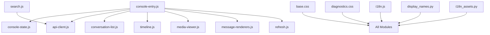

**Diagram sources**
- [console-entry.js](file://backend/app/web/static/console/console-entry.js)
- [api-client.js](file://backend/app/web/static/console/api-client.js)
- [console-state.js](file://backend/app/web/static/console/console-state.js)
- [conversation-list.js](file://backend/app/web/static/console/conversation-list.js)
- [timeline.js](file://backend/app/web/static/console/timeline.js)
- [media-viewer.js](file://backend/app/web/static/console/media-viewer.js)
- [message-renderers.js](file://backend/app/web/static/console/message-renderers.js)
- [refresh.js](file://backend/app/web/static/console/refresh.js)
- [search.js](file://backend/app/web/static/search.js)
- [base.css](file://backend/app/web/static/base.css)
- [diagnostics.css](file://backend/app/web/static/diagnostics.css)
- [i18n.js](file://backend/app/assets/i18n.js)
- [display_names.py](file://backend/app/display_names.py)
- [i18n_assets.py](file://backend/app/i18n_assets.py)

**Section sources**
- [console-entry.js](file://backend/app/web/static/console/console-entry.js)
- [search.js](file://backend/app/web/static/search.js)
- [base.css](file://backend/app/web/static/base.css)
- [diagnostics.css](file://backend/app/web/static/diagnostics.css)
- [i18n.js](file://backend/app/assets/i18n.js)

## Core Components
- Console entrypoint: Initializes global state, registers event handlers, and bootstraps UI modules.
- API client: Centralized HTTP client that encapsulates request building, error handling, retries, and response normalization.
- Application state: Holds current conversation context, message lists, filters, and UI flags.
- Conversation list: Renders and manages selection of conversations.
- Timeline: Displays messages chronologically with pagination and incremental updates.
- Message renderers: Converts raw message payloads into DOM fragments based on message type.
- Media viewer: Handles image/video playback and thumbnails.
- Refresh manager: Schedules periodic data refreshes and handles network errors gracefully.
- Search page: Provides query input, result rendering, and filtering.

Key responsibilities and interactions are illustrated below.

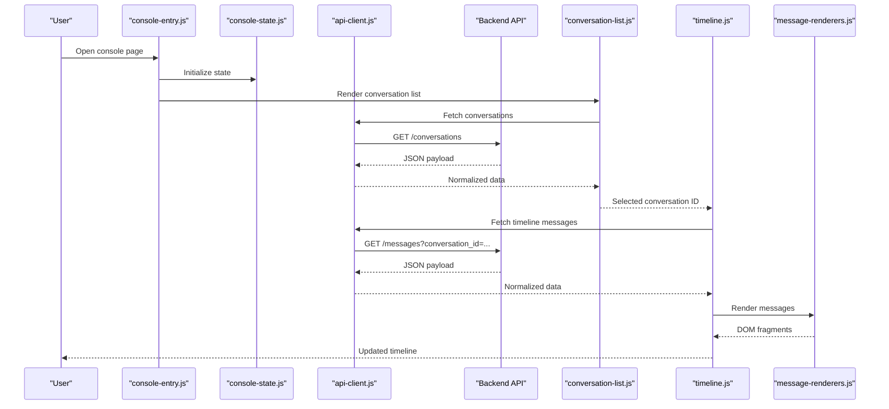

**Diagram sources**
- [console-entry.js](file://backend/app/web/static/console/console-entry.js)
- [console-state.js](file://backend/app/web/static/console/console-state.js)
- [api-client.js](file://backend/app/web/static/console/api-client.js)
- [conversation-list.js](file://backend/app/web/static/console/conversation-list.js)
- [timeline.js](file://backend/app/web/static/console/timeline.js)
- [message-renderers.js](file://backend/app/web/static/console/message-renderers.js)

**Section sources**
- [console-entry.js](file://backend/app/web/static/console/console-entry.js)
- [api-client.js](file://backend/app/web/static/console/api-client.js)
- [console-state.js](file://backend/app/web/static/console/console-state.js)
- [conversation-list.js](file://backend/app/web/static/console/conversation-list.js)
- [timeline.js](file://backend/app/web/static/console/timeline.js)
- [message-renderers.js](file://backend/app/web/static/console/message-renderers.js)

## Architecture Overview
The client follows a modular, single-page approach where each feature is encapsulated in its own module. The API client abstracts all network calls, providing consistent error handling and retry policies. UI modules consume normalized responses and update the DOM incrementally. Styling is centralized in CSS files with component-scoped classes and responsive utilities. Internationalization is supported via a dedicated i18n module and backend-provided assets.

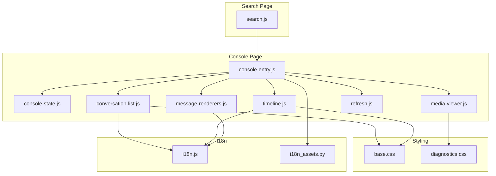

**Diagram sources**
- [console-entry.js](file://backend/app/web/static/console/console-entry.js)
- [console-state.js](file://backend/app/web/static/console/console-state.js)
- [conversation-list.js](file://backend/app/web/static/console/conversation-list.js)
- [timeline.js](file://backend/app/web/static/console/timeline.js)
- [media-viewer.js](file://backend/app/web/static/console/media-viewer.js)
- [message-renderers.js](file://backend/app/web/static/console/message-renderers.js)
- [refresh.js](file://backend/app/web/static/console/refresh.js)
- [search.js](file://backend/app/web/static/search.js)
- [base.css](file://backend/app/web/static/base.css)
- [diagnostics.css](file://backend/app/web/static/diagnostics.css)
- [i18n.js](file://backend/app/assets/i18n.js)
- [i18n_assets.py](file://backend/app/i18n_assets.py)

## Detailed Component Analysis

### API Client Implementation
The API client centralizes HTTP operations, including:
- Request construction with headers and parameters
- Error detection and user-friendly messages
- Retry logic for transient failures
- Response normalization for consistent consumption by UI modules

Extending the API client:
- Add new endpoints by defining typed methods that wrap fetch or XMLHttpRequest
- Implement retry strategies per endpoint if needed (e.g., higher retry for search queries)
- Normalize responses to a common shape with status, data, and error fields

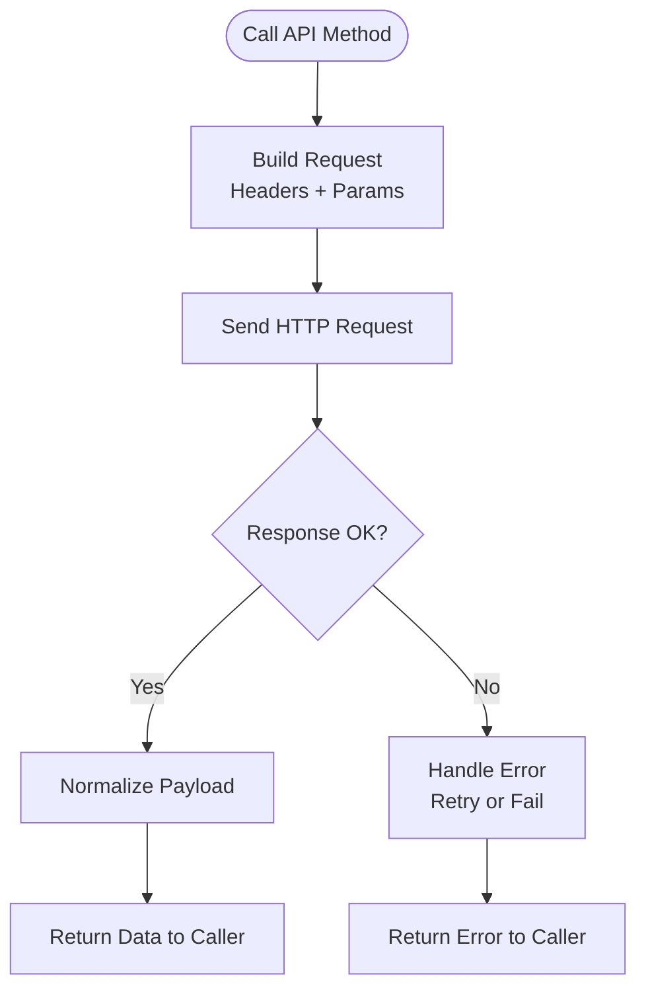

**Diagram sources**
- [api-client.js](file://backend/app/web/static/console/api-client.js)

**Section sources**
- [api-client.js](file://backend/app/web/static/console/api-client.js)

### Application State Management
Application state holds:
- Current conversation ID and metadata
- Message list segments and pagination tokens
- UI flags such as loading states and active filters

Best practices:
- Keep state minimal and immutable where possible
- Provide setters that trigger re-renders only for affected parts
- Persist critical state across sessions using storage APIs when appropriate

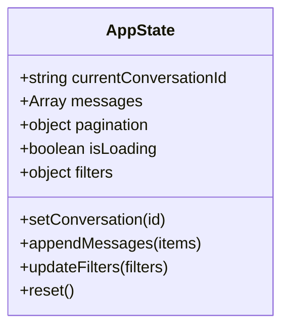

**Diagram sources**
- [console-state.js](file://backend/app/web/static/console/console-state.js)

**Section sources**
- [console-state.js](file://backend/app/web/static/console/console-state.js)

### Conversation List Module
Responsibilities:
- Fetch and render conversation entries
- Handle selection events and propagate to timeline
- Support search and filtering within the list

Integration points:
- Uses API client to retrieve conversation data
- Consumes i18n strings for labels and statuses
- Updates CSS classes for active states and responsive layouts

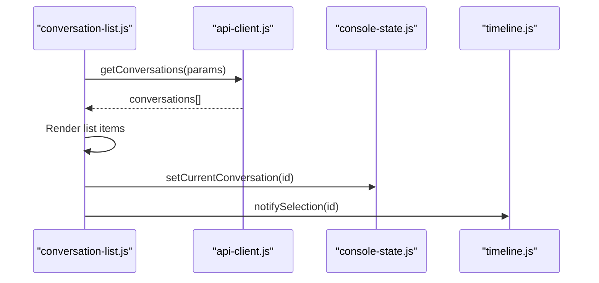

**Diagram sources**
- [conversation-list.js](file://backend/app/web/static/console/conversation-list.js)
- [api-client.js](file://backend/app/web/static/console/api-client.js)
- [console-state.js](file://backend/app/web/static/console/console-state.js)
- [timeline.js](file://backend/app/web/static/console/timeline.js)

**Section sources**
- [conversation-list.js](file://backend/app/web/static/console/conversation-list.js)

### Timeline Module
Responsibilities:
- Load messages for a selected conversation
- Paginate and append new messages
- Coordinate with message renderers to produce DOM fragments

Behavioral flow:
- On selection, clear previous content and start loading
- Fetch initial batch, then schedule incremental loads
- Handle empty states and error states with user feedback

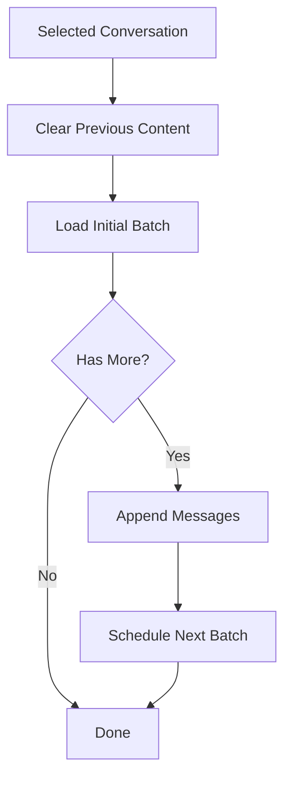

**Diagram sources**
- [timeline.js](file://backend/app/web/static/console/timeline.js)

**Section sources**
- [timeline.js](file://backend/app/web/static/console/timeline.js)

### Message Renderers
Responsibilities:
- Detect message types and render corresponding DOM structures
- Inject localized text and timestamps
- Attach event listeners for media playback and actions

Extension pattern:
- Register new renderers for additional message types
- Ensure accessibility attributes and keyboard navigation
- Use CSS classes scoped to message type for styling

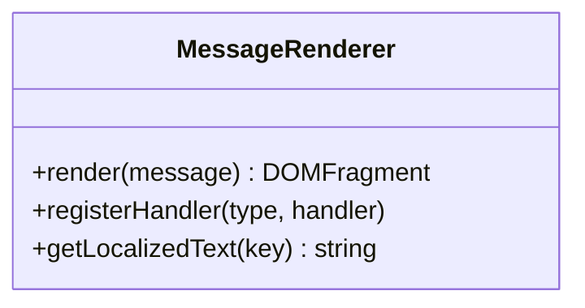

**Diagram sources**
- [message-renderers.js](file://backend/app/web/static/console/message-renderers.js)
- [i18n.js](file://backend/app/assets/i18n.js)

**Section sources**
- [message-renderers.js](file://backend/app/web/static/console/message-renderers.js)
- [i18n.js](file://backend/app/assets/i18n.js)

### Media Viewer
Responsibilities:
- Display images and videos with thumbnails
- Handle lazy loading and fallbacks
- Provide zoom and fullscreen controls

Responsive considerations:
- Adapt layout for mobile screens
- Optimize media sizes based on viewport
- Defer heavy operations until visible

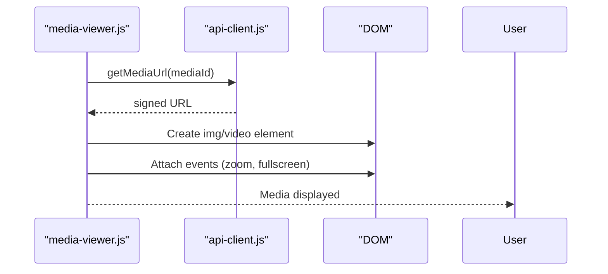

**Diagram sources**
- [media-viewer.js](file://backend/app/web/static/console/media-viewer.js)
- [api-client.js](file://backend/app/web/static/console/api-client.js)

**Section sources**
- [media-viewer.js](file://backend/app/web/static/console/media-viewer.js)

### Refresh Manager
Responsibilities:
- Schedule periodic refreshes for conversations and timelines
- Backoff on errors and pause during inactivity
- Provide manual refresh triggers

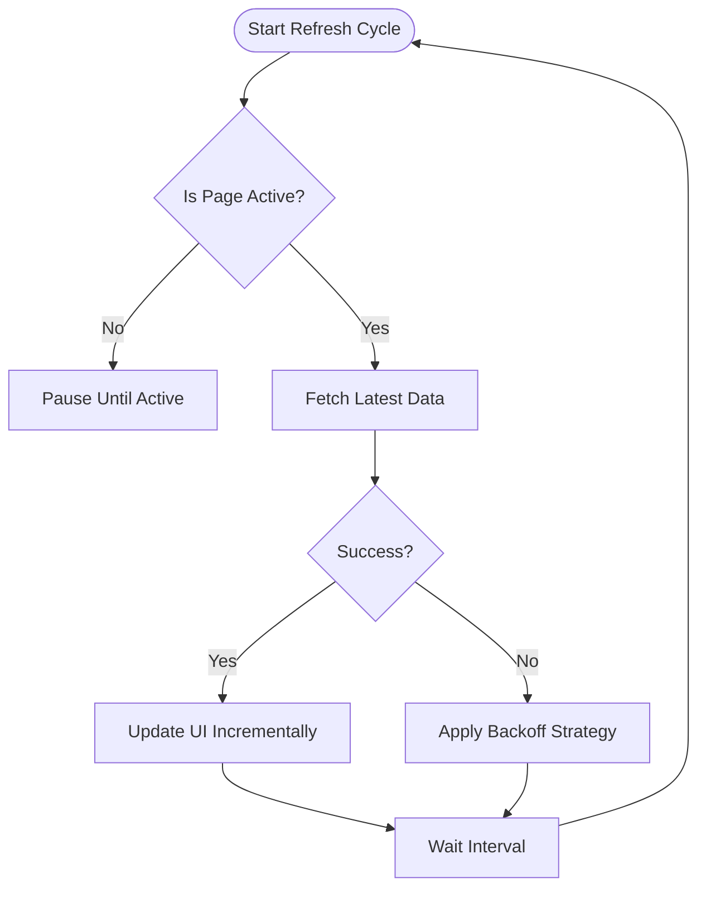

**Diagram sources**
- [refresh.js](file://backend/app/web/static/console/refresh.js)

**Section sources**
- [refresh.js](file://backend/app/web/static/console/refresh.js)

### Search Page
Responsibilities:
- Capture user queries and send them to the backend
- Render results with pagination and filters
- Integrate with i18n for labels and messages

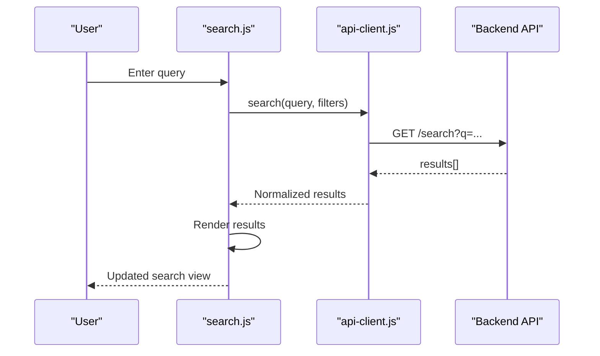

**Diagram sources**
- [search.js](file://backend/app/web/static/search.js)
- [api-client.js](file://backend/app/web/static/console/api-client.js)

**Section sources**
- [search.js](file://backend/app/web/static/search.js)

## Dependency Analysis
The client modules have clear dependencies:
- console-entry.js orchestrates initialization and wiring
- api-client.js is consumed by all data-fetching modules
- console-state.js provides shared state to UI modules
- i18n.js supplies localized strings across modules
- CSS files provide shared styles and responsive utilities

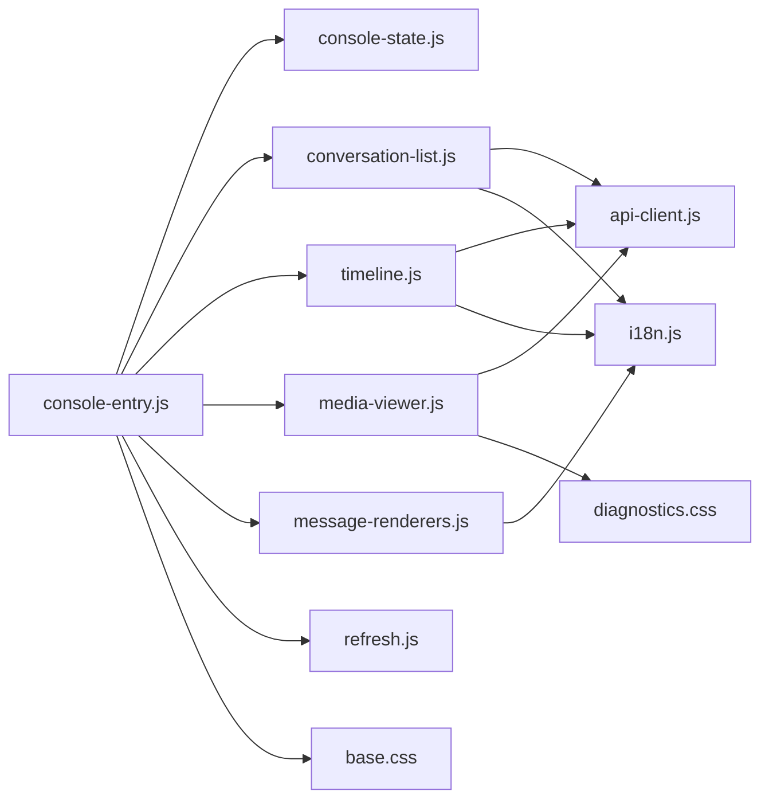

**Diagram sources**
- [console-entry.js](file://backend/app/web/static/console/console-entry.js)
- [console-state.js](file://backend/app/web/static/console/console-state.js)
- [conversation-list.js](file://backend/app/web/static/console/conversation-list.js)
- [timeline.js](file://backend/app/web/static/console/timeline.js)
- [media-viewer.js](file://backend/app/web/static/console/media-viewer.js)
- [message-renderers.js](file://backend/app/web/static/console/message-renderers.js)
- [refresh.js](file://backend/app/web/static/console/refresh.js)
- [api-client.js](file://backend/app/web/static/console/api-client.js)
- [i18n.js](file://backend/app/assets/i18n.js)
- [base.css](file://backend/app/web/static/base.css)
- [diagnostics.css](file://backend/app/web/static/diagnostics.css)

**Section sources**
- [console-entry.js](file://backend/app/web/static/console/console-entry.js)
- [api-client.js](file://backend/app/web/static/console/api-client.js)
- [i18n.js](file://backend/app/assets/i18n.js)
- [base.css](file://backend/app/web/static/base.css)
- [diagnostics.css](file://backend/app/web/static/diagnostics.css)

## Performance Considerations
- Lazy load media and defer non-critical scripts to improve initial paint
- Use pagination and virtual scrolling for large message lists
- Cache frequently accessed data in memory and persist where appropriate
- Debounce user inputs (e.g., search) to reduce network requests
- Apply backoff and retry strategies for resilient network operations

[No sources needed since this section provides general guidance]

## Troubleshooting Guide
Common issues and resolutions:
- Network errors: Inspect API client error handling and retry configuration
- Missing translations: Verify i18n keys and asset loading
- Rendering bugs: Check message renderer registration and CSS class usage
- Memory leaks: Ensure event listeners are removed when components unmount
- Slow performance: Profile DOM updates and optimize re-renders

**Section sources**
- [api-client.js](file://backend/app/web/static/console/api-client.js)
- [i18n.js](file://backend/app/assets/i18n.js)
- [message-renderers.js](file://backend/app/web/static/console/message-renderers.js)

## Conclusion
The client-side architecture is modular and maintainable, with clear separation of concerns between networking, state, UI modules, and styling. The API client standardizes communication with the backend, while i18n and CSS ensure localization and responsive design. Extensibility is straightforward through registered handlers and typed API methods.

[No sources needed since this section summarizes without analyzing specific files]

## Appendices

### Extending the API Client
- Define new endpoint methods with consistent signatures
- Implement retry policies tailored to endpoint characteristics
- Normalize responses to include status, data, and error fields

**Section sources**
- [api-client.js](file://backend/app/web/static/console/api-client.js)

### Implementing New UI Components
- Create a new module under the console directory
- Wire it up in the entrypoint and subscribe to state changes
- Use i18n for labels and follow CSS naming conventions

**Section sources**
- [console-entry.js](file://backend/app/web/static/console/console-entry.js)
- [i18n.js](file://backend/app/assets/i18n.js)
- [base.css](file://backend/app/web/static/base.css)

### Customizing Appearance and Behavior
- Override CSS variables and component classes in diagnostics.css
- Adjust refresh intervals and retry policies in refresh.js
- Extend message renderers for new message types

**Section sources**
- [diagnostics.css](file://backend/app/web/static/diagnostics.css)
- [refresh.js](file://backend/app/web/static/console/refresh.js)
- [message-renderers.js](file://backend/app/web/static/console/message-renderers.js)

### Display Name Resolution System
Display names are resolved by combining contact information from the backend with local overrides. The system ensures consistent labeling across conversations and messages.

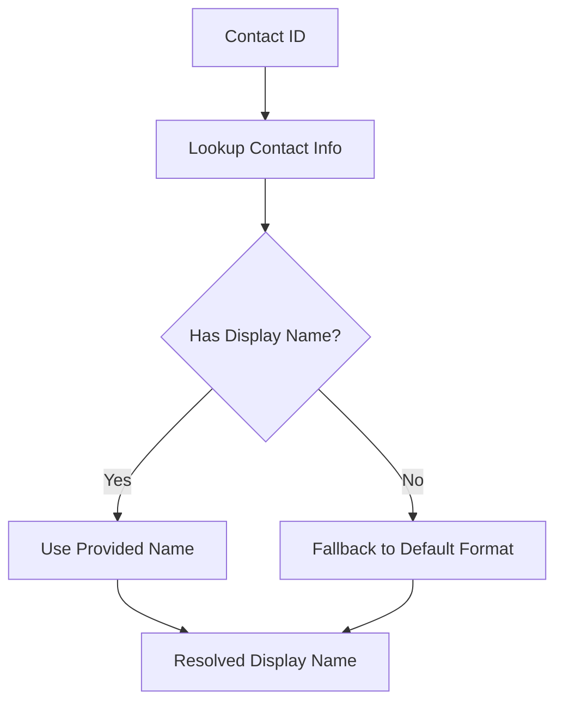

**Diagram sources**
- [display_names.py](file://backend/app/display_names.py)

**Section sources**
- [display_names.py](file://backend/app/display_names.py)

### Internationalization Support and Localization Features
The i18n module provides key-based translation lookups, pluralization, and date formatting. Backend assets supply language packs and locale-specific resources.

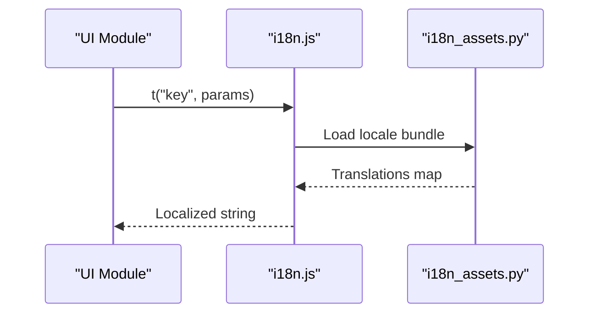

**Diagram sources**
- [i18n.js](file://backend/app/assets/i18n.js)
- [i18n_assets.py](file://backend/app/i18n_assets.py)

**Section sources**
- [i18n.js](file://backend/app/assets/i18n.js)
- [i18n_assets.py](file://backend/app/i18n_assets.py)