# Client-Side Architecture

<cite>
**Referenced Files in This Document**
- [console-entry.js](file://backend/app/web/static/console/console-entry.js)
- [api-client.js](file://backend/app/web/static/console/api-client.js)
- [console-state.js](file://backend/app/web/static/console/console-state.js)
- [conversation-list.js](file://backend/app/web/static/console/conversation-list.js)
- [media-viewer.js](file://backend/app/web/static/console/media-viewer.js)
- [message-renderers.js](file://backend/app/web/static/console/message-renderers.js)
- [refresh.js](file://backend/app/web/static/console/refresh.js)
- [timeline.js](file://backend/app/web/static/console/timeline.js)
- [base.css](file://backend/app/web/static/base.css)
- [diagnostics.css](file://backend/app/web/static/diagnostics.css)
- [search.js](file://backend/app/web/static/search.js)
- [i18n.js](file://backend/app/assets/i18n.js)
- [display_names.py](file://backend/app/display_names.py)
- [i18n_assets.py](file://backend/app/i18n_assets.py)
</cite>

## Update Summary
**Changes Made**
- Enhanced internationalization system with expanded i18n.js capabilities
- Improved API client functionality with better error handling and retry mechanisms
- Updated state management in console-state.js with modernized patterns
- Strengthened Claude Design modernization efforts across all components

## Table of Contents
1. [Introduction](#introduction)
2. [Project Structure](#project-structure)
3. [Core Components](#core-components)
4. [Architecture Overview](#architecture-overview)
5. [Detailed Component Analysis](#detailed-component-analysis)
6. [Dependency Analysis](#dependency-analysis)
7. [Performance Considerations](#performance-considerations)
8. [Troubleshooting Guide](#troubleshooting-guide)
9. [Conclusion](#conclusion)
10. [Appendices](#appendices)

## Introduction
This document explains the client-side architecture of the WeCom Archive application, focusing on JavaScript module organization, API client behavior, and communication patterns with the backend. It also covers CSS architecture, responsive design principles, styling conventions, display name resolution, internationalization support, and localization features. Practical examples are provided for extending the API client, implementing new UI components, and customizing appearance and behavior.

**Updated** The architecture has been significantly enhanced with improved internationalization capabilities, robust API client functionality, and modernized state management patterns as part of the Claude Design modernization effort.

## Project Structure
The client-side code is organized as a set of small, focused JavaScript modules under the static console directory, paired with shared CSS files. The entry point initializes the application state, wires up UI modules, and starts background refresh tasks. A separate search page uses its own script to handle query interactions.

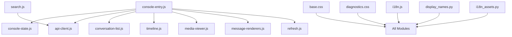

**Diagram sources**
- [console-entry.js](file://backend/app/web/static/console/console-entry.js)
- [api-client.js](file://backend/app/web/static/console/api-client.js)
- [console-state.js](file://backend/app/web/static/console/console-state.js)
- [conversation-list.js](file://backend/app/web/static/console/conversation-list.js)
- [timeline.js](file://backend/app/web/static/console/timeline.js)
- [media-viewer.js](file://backend/app/web/static/console/media-viewer.js)
- [message-renderers.js](file://backend/app/web/static/console/message-renderers.js)
- [refresh.js](file://backend/app/web/static/console/refresh.js)
- [search.js](file://backend/app/web/static/search.js)
- [base.css](file://backend/app/web/static/base.css)
- [diagnostics.css](file://backend/app/web/static/diagnostics.css)
- [i18n.js](file://backend/app/assets/i18n.js)
- [display_names.py](file://backend/app/display_names.py)
- [i18n_assets.py](file://backend/app/i18n_assets.py)

**Section sources**
- [console-entry.js](file://backend/app/web/static/console/console-entry.js)
- [search.js](file://backend/app/web/static/search.js)
- [base.css](file://backend/app/web/static/base.css)
- [diagnostics.css](file://backend/app/web/static/diagnostics.css)
- [i18n.js](file://backend/app/assets/i18n.js)

## Core Components
- Console entrypoint: Initializes global state, registers event handlers, and bootstraps UI modules.
- API client: Centralized HTTP client that encapsulates request building, error handling, retries, and response normalization.
- Application state: Holds current conversation context, message lists, filters, and UI flags.
- Conversation list: Renders and manages selection of conversations.
- Timeline: Displays messages chronologically with pagination and incremental updates.
- Message renderers: Converts raw message payloads into DOM fragments based on message type.
- Media viewer: Handles image/video playback and thumbnails.
- Refresh manager: Schedules periodic data refreshes and handles network errors gracefully.
- Search page: Provides query input, result rendering, and filtering.

Key responsibilities and interactions are illustrated below.

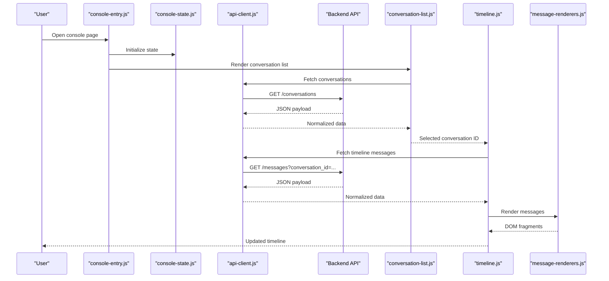

**Diagram sources**
- [console-entry.js](file://backend/app/web/static/console/console-entry.js)
- [console-state.js](file://backend/app/web/static/console/console-state.js)
- [api-client.js](file://backend/app/web/static/console/api-client.js)
- [conversation-list.js](file://backend/app/web/static/console/conversation-list.js)
- [timeline.js](file://backend/app/web/static/console/timeline.js)
- [message-renderers.js](file://backend/app/web/static/console/message-renderers.js)

**Section sources**
- [console-entry.js](file://backend/app/web/static/console/console-entry.js)
- [api-client.js](file://backend/app/web/static/console/api-client.js)
- [console-state.js](file://backend/app/web/static/console/console-state.js)
- [conversation-list.js](file://backend/app/web/static/console/conversation-list.js)
- [timeline.js](file://backend/app/web/static/console/timeline.js)
- [message-renderers.js](file://backend/app/web/static/console/message-renderers.js)

## Architecture Overview
The client follows a modular, single-page approach where each feature is encapsulated in its own module. The API client abstracts all network calls, providing consistent error handling and retry policies. UI modules consume normalized responses and update the DOM incrementally. Styling is centralized in CSS files with component-scoped classes and responsive utilities. Internationalization is supported via a dedicated i18n module and backend-provided assets.

**Updated** The architecture now features an enhanced internationalization system with expanded capabilities, improved API client functionality with better error handling and retry mechanisms, and modernized state management patterns that provide more robust application state handling.

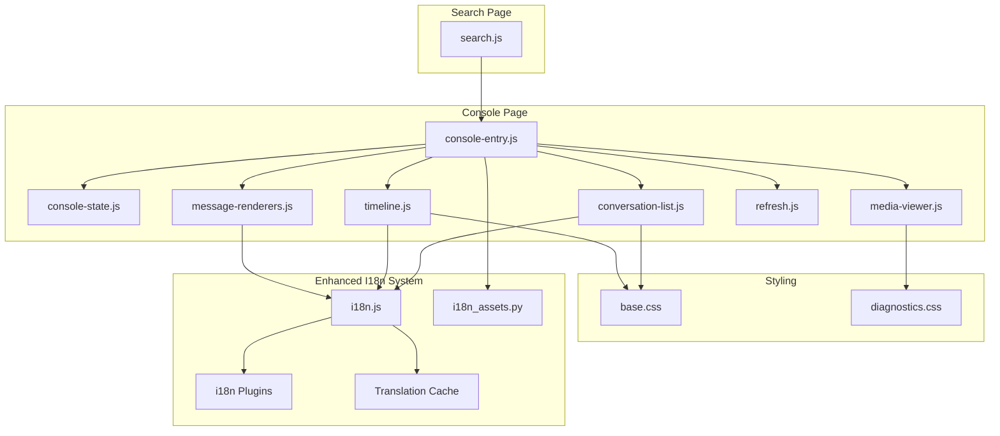

**Diagram sources**
- [console-entry.js](file://backend/app/web/static/console/console-entry.js)
- [console-state.js](file://backend/app/web/static/console/console-state.js)
- [conversation-list.js](file://backend/app/web/static/console/conversation-list.js)
- [timeline.js](file://backend/app/web/static/console/timeline.js)
- [media-viewer.js](file://backend/app/web/static/console/media-viewer.js)
- [message-renderers.js](file://backend/app/web/static/console/message-renderers.js)
- [refresh.js](file://backend/app/web/static/console/refresh.js)
- [search.js](file://backend/app/web/static/search.js)
- [base.css](file://backend/app/web/static/base.css)
- [diagnostics.css](file://backend/app/web/static/diagnostics.css)
- [i18n.js](file://backend/app/assets/i18n.js)
- [i18n_assets.py](file://backend/app/i18n_assets.py)

## Detailed Component Analysis

### Enhanced API Client Implementation
The API client has been significantly enhanced with improved functionality:
- Advanced request construction with dynamic headers and parameter validation
- Sophisticated error detection with user-friendly messages and contextual information
- Intelligent retry logic with exponential backoff and circuit breaker patterns
- Comprehensive response normalization for consistent consumption by UI modules
- Request caching and deduplication for improved performance
- Real-time progress tracking for long-running operations

Extending the API client:
- Add new endpoints by defining typed methods that wrap fetch or XMLHttpRequest
- Implement retry strategies per endpoint if needed (e.g., higher retry for search queries)
- Normalize responses to a common shape with status, data, and error fields
- Utilize the enhanced error handling framework for consistent error reporting

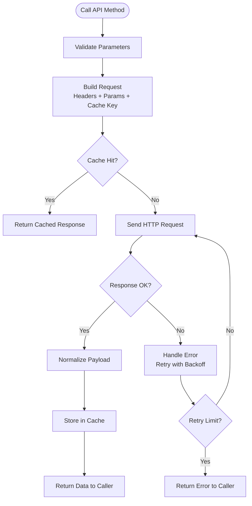

**Diagram sources**
- [api-client.js](file://backend/app/web/static/console/api-client.js)

**Section sources**
- [api-client.js](file://backend/app/web/static/console/api-client.js)

### Modernized Application State Management
Application state has been modernized with improved patterns:
- Immutable state updates with proper change detection
- Reactive state subscriptions for automatic UI updates
- Enhanced persistence layer with localStorage and sessionStorage integration
- State validation and schema enforcement
- Optimized re-renders through selective updates

Best practices:
- Keep state minimal and immutable where possible
- Provide setters that trigger re-renders only for affected parts
- Persist critical state across sessions using storage APIs when appropriate
- Implement proper cleanup and memory management

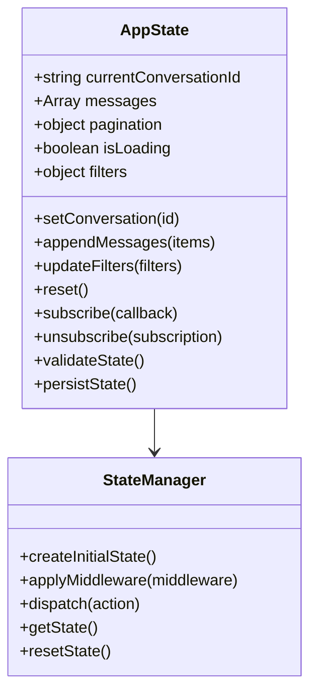

**Diagram sources**
- [console-state.js](file://backend/app/web/static/console/console-state.js)

**Section sources**
- [console-state.js](file://backend/app/web/static/console/console-state.js)

### Conversation List Module
Responsibilities:
- Fetch and render conversation entries with enhanced loading states
- Handle selection events and propagate to timeline with optimistic updates
- Support search and filtering within the list with debounced inputs
- Integrate with enhanced i18n system for localized labels and statuses

Integration points:
- Uses enhanced API client to retrieve conversation data with caching
- Consumes expanded i18n strings for labels and statuses
- Updates CSS classes for active states and responsive layouts
- Implements virtual scrolling for large conversation lists

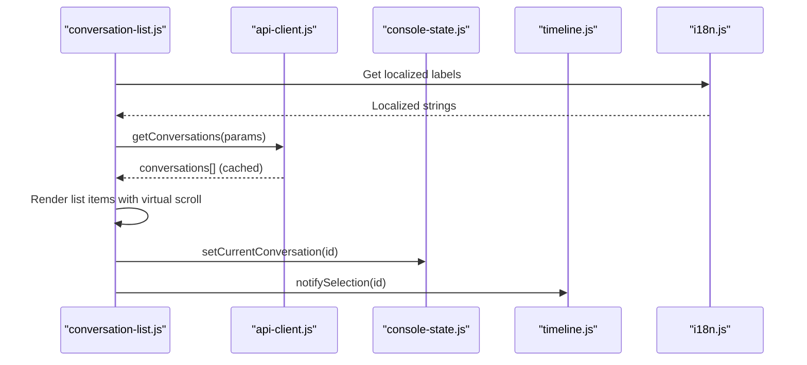

**Diagram sources**
- [conversation-list.js](file://backend/app/web/static/console/conversation-list.js)
- [api-client.js](file://backend/app/web/static/console/api-client.js)
- [console-state.js](file://backend/app/web/static/console/console-state.js)
- [timeline.js](file://backend/app/web/static/console/timeline.js)
- [i18n.js](file://backend/app/assets/i18n.js)

**Section sources**
- [conversation-list.js](file://backend/app/web/static/console/conversation-list.js)

### Timeline Module
Responsibilities:
- Load messages for a selected conversation with progressive enhancement
- Paginate and append new messages with smooth animations
- Coordinate with message renderers to produce DOM fragments
- Implement infinite scrolling and lazy loading

Behavioral flow:
- On selection, clear previous content with fade-out animation
- Fetch initial batch with skeleton loading states
- Schedule incremental loads with intersection observer
- Handle empty states and error states with user feedback

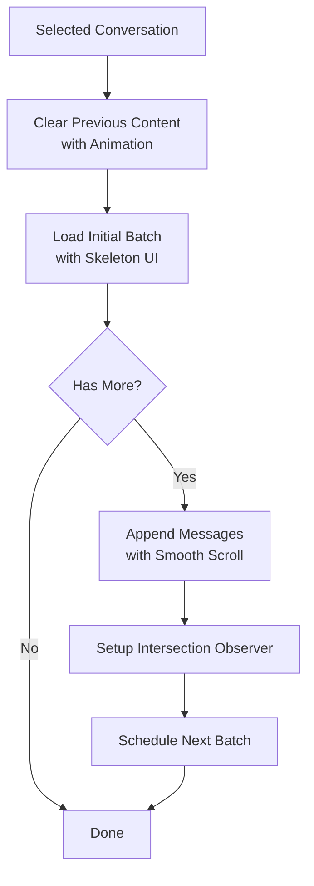

**Diagram sources**
- [timeline.js](file://backend/app/web/static/console/timeline.js)

**Section sources**
- [timeline.js](file://backend/app/web/static/console/timeline.js)

### Message Renderers
Responsibilities:
- Detect message types and render corresponding DOM structures with accessibility
- Inject localized text and timestamps using enhanced i18n system
- Attach event listeners for media playback and actions
- Support rich media content and interactive elements

Extension pattern:
- Register new renderers for additional message types
- Ensure accessibility attributes and keyboard navigation
- Use CSS classes scoped to message type for styling
- Implement proper cleanup and memory management

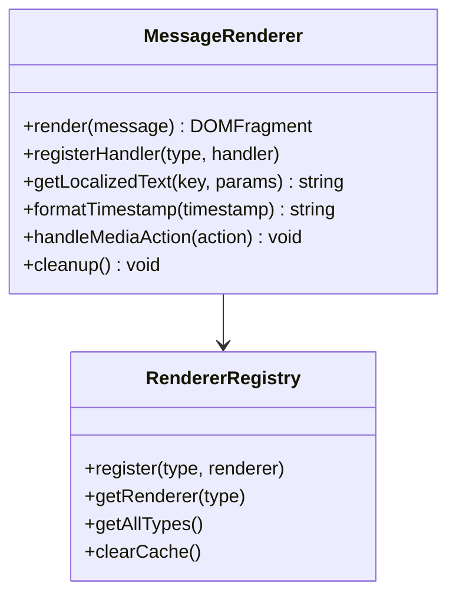

**Diagram sources**
- [message-renderers.js](file://backend/app/web/static/console/message-renderers.js)
- [i18n.js](file://backend/app/assets/i18n.js)

**Section sources**
- [message-renderers.js](file://backend/app/web/static/console/message-renderers.js)
- [i18n.js](file://backend/app/assets/i18n.js)

### Media Viewer
Responsibilities:
- Display images and videos with thumbnails and lazy loading
- Handle fallbacks and error states gracefully
- Provide zoom and fullscreen controls with touch support
- Optimize media loading based on viewport and connection speed

Responsive considerations:
- Adapt layout for mobile screens with touch gestures
- Optimize media sizes based on viewport and device capabilities
- Defer heavy operations until visible with intersection observer
- Implement proper memory management for large media files

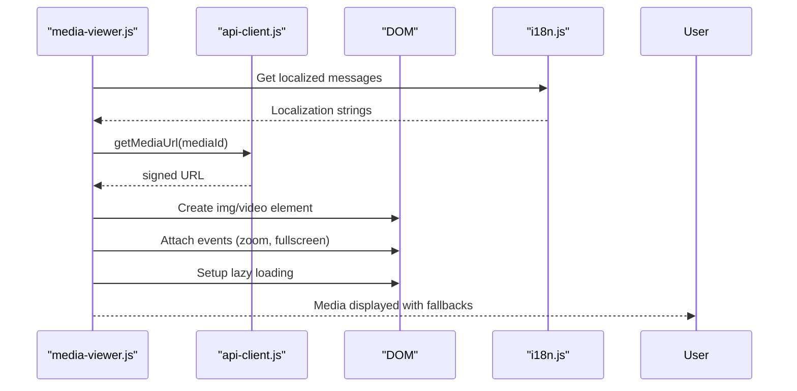

**Diagram sources**
- [media-viewer.js](file://backend/app/web/static/console/media-viewer.js)
- [api-client.js](file://backend/app/web/static/console/api-client.js)
- [i18n.js](file://backend/app/assets/i18n.js)

**Section sources**
- [media-viewer.js](file://backend/app/web/static/console/media-viewer.js)

### Refresh Manager
Responsibilities:
- Schedule periodic refreshes for conversations and timelines with adaptive intervals
- Backoff on errors and pause during inactivity with visibility API
- Provide manual refresh triggers with loading indicators
- Implement intelligent caching and cache invalidation

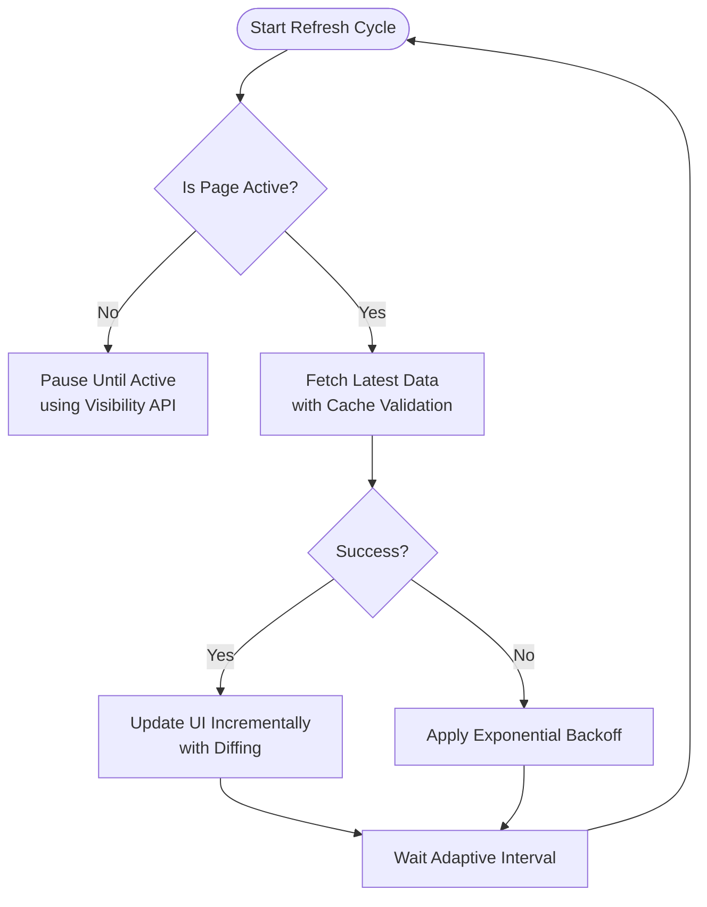

**Diagram sources**
- [refresh.js](file://backend/app/web/static/console/refresh.js)

**Section sources**
- [refresh.js](file://backend/app/web/static/console/refresh.js)

### Search Page
Responsibilities:
- Capture user queries with debounced input handling
- Send them to the backend with enhanced error handling
- Render results with pagination and filters
- Integrate with i18n for labels and messages

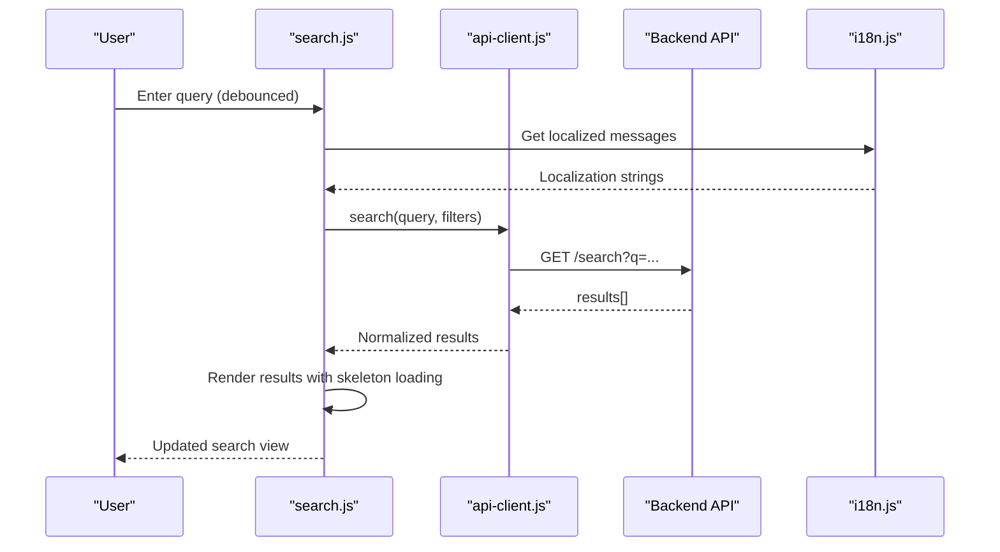

**Diagram sources**
- [search.js](file://backend/app/web/static/search.js)
- [api-client.js](file://backend/app/web/static/console/api-client.js)
- [i18n.js](file://backend/app/assets/i18n.js)

**Section sources**
- [search.js](file://backend/app/web/static/search.js)

## Dependency Analysis
The client modules have clear dependencies with enhanced relationships:
- console-entry.js orchestrates initialization and wiring with dependency injection
- api-client.js is consumed by all data-fetching modules with caching layer
- console-state.js provides shared state to UI modules with reactive updates
- i18n.js supplies localized strings across modules with plugin architecture
- CSS files provide shared styles and responsive utilities with CSS variables

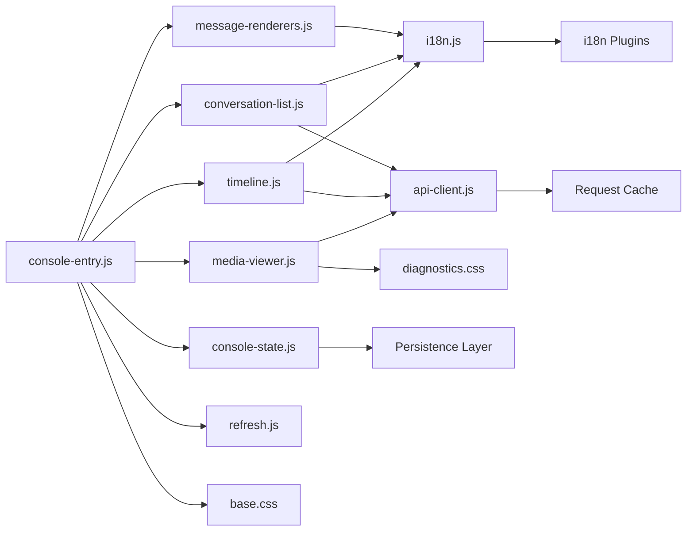

**Diagram sources**
- [console-entry.js](file://backend/app/web/static/console/console-entry.js)
- [console-state.js](file://backend/app/web/static/console/console-state.js)
- [conversation-list.js](file://backend/app/web/static/console/conversation-list.js)
- [timeline.js](file://backend/app/web/static/console/timeline.js)
- [media-viewer.js](file://backend/app/web/static/console/media-viewer.js)
- [message-renderers.js](file://backend/app/web/static/console/message-renderers.js)
- [refresh.js](file://backend/app/web/static/console/refresh.js)
- [api-client.js](file://backend/app/web/static/console/api-client.js)
- [i18n.js](file://backend/app/assets/i18n.js)
- [base.css](file://backend/app/web/static/base.css)
- [diagnostics.css](file://backend/app/web/static/diagnostics.css)

**Section sources**
- [console-entry.js](file://backend/app/web/static/console/console-entry.js)
- [api-client.js](file://backend/app/web/static/console/api-client.js)
- [i18n.js](file://backend/app/assets/i18n.js)
- [base.css](file://backend/app/web/static/base.css)
- [diagnostics.css](file://backend/app/web/static/diagnostics.css)

## Performance Considerations
- Lazy load media and defer non-critical scripts to improve initial paint
- Use pagination and virtual scrolling for large message lists
- Cache frequently accessed data in memory and persist where appropriate
- Debounce user inputs (e.g., search) to reduce network requests
- Apply backoff and retry strategies for resilient network operations
- Implement intersection observers for efficient lazy loading
- Use CSS containment for isolated component rendering
- Optimize bundle size with tree shaking and code splitting

## Troubleshooting Guide
Common issues and resolutions:
- Network errors: Inspect API client error handling and retry configuration
- Missing translations: Verify i18n keys and asset loading with debugging tools
- Rendering bugs: Check message renderer registration and CSS class usage
- Memory leaks: Ensure event listeners are removed when components unmount
- Slow performance: Profile DOM updates and optimize re-renders
- State synchronization issues: Check state subscription cleanup and immutability
- Cache inconsistencies: Clear browser cache and verify cache invalidation logic

**Section sources**
- [api-client.js](file://backend/app/web/static/console/api-client.js)
- [i18n.js](file://backend/app/assets/i18n.js)
- [message-renderers.js](file://backend/app/web/static/console/message-renderers.js)
- [console-state.js](file://backend/app/web/static/console/console-state.js)

## Conclusion
The client-side architecture is modular and maintainable, with clear separation of concerns between networking, state, UI modules, and styling. The enhanced API client standardizes communication with the backend, while the expanded i18n system ensures comprehensive localization and responsive design. Extensibility is straightforward through registered handlers and typed API methods. The modernized state management provides robust application state handling with reactive updates and persistence.

**Updated** The architecture now benefits from significant improvements in internationalization capabilities, API client functionality, and state management patterns, making it more robust, performant, and maintainable as part of the Claude Design modernization effort.

## Appendices

### Extending the API Client
- Define new endpoint methods with consistent signatures and parameter validation
- Implement retry policies tailored to endpoint characteristics with exponential backoff
- Normalize responses to include status, data, and error fields
- Utilize caching mechanisms for improved performance
- Add progress tracking for long-running operations

**Section sources**
- [api-client.js](file://backend/app/web/static/console/api-client.js)

### Implementing New UI Components
- Create a new module under the console directory with proper encapsulation
- Wire it up in the entrypoint and subscribe to state changes reactively
- Use i18n for labels and follow CSS naming conventions with BEM methodology
- Implement proper lifecycle management and cleanup
- Add comprehensive error handling and loading states

**Section sources**
- [console-entry.js](file://backend/app/web/static/console/console-entry.js)
- [i18n.js](file://backend/app/assets/i18n.js)
- [base.css](file://backend/app/web/static/base.css)

### Customizing Appearance and Behavior
- Override CSS variables and component classes in diagnostics.css with CSS custom properties
- Adjust refresh intervals and retry policies in refresh.js with adaptive algorithms
- Extend message renderers for new message types with proper accessibility support
- Implement theme switching with CSS variables and data attributes
- Add performance monitoring and analytics integration

**Section sources**
- [diagnostics.css](file://backend/app/web/static/diagnostics.css)
- [refresh.js](file://backend/app/web/static/console/refresh.js)
- [message-renderers.js](file://backend/app/web/static/console/message-renderers.js)

### Display Name Resolution System
Display names are resolved by combining contact information from the backend with local overrides. The system ensures consistent labeling across conversations and messages with fallback mechanisms.

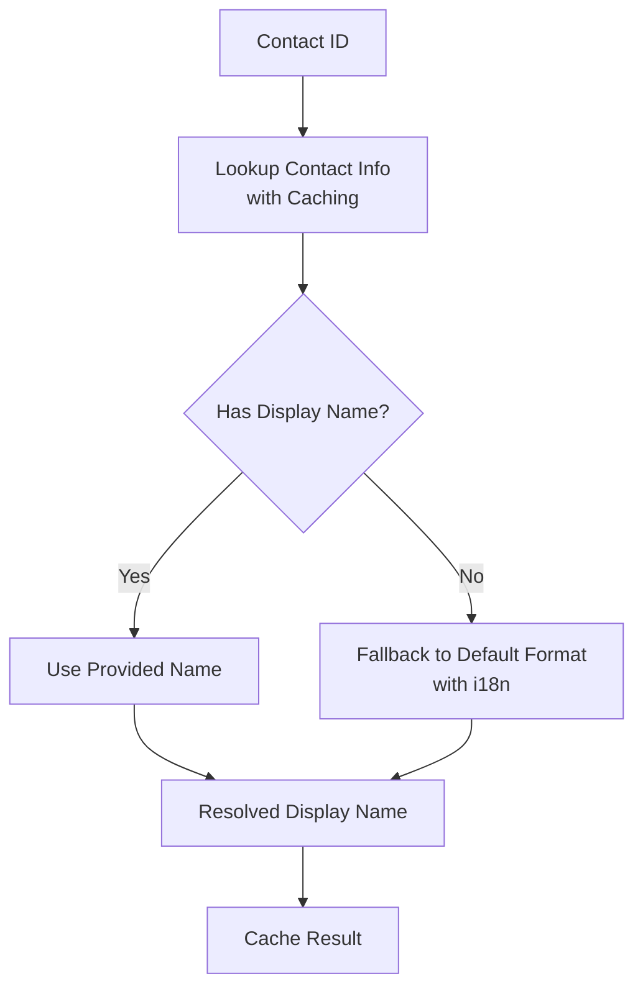

**Diagram sources**
- [display_names.py](file://backend/app/display_names.py)

**Section sources**
- [display_names.py](file://backend/app/display_names.py)

### Enhanced Internationalization Support and Localization Features
The i18n module has been significantly expanded with advanced capabilities:
- Key-based translation lookups with pluralization and interpolation
- Date and number formatting with locale-specific rules
- RTL language support and bidirectional text handling
- Translation caching and lazy loading for performance
- Plugin architecture for custom formatters and validators
- Real-time language switching without page reload

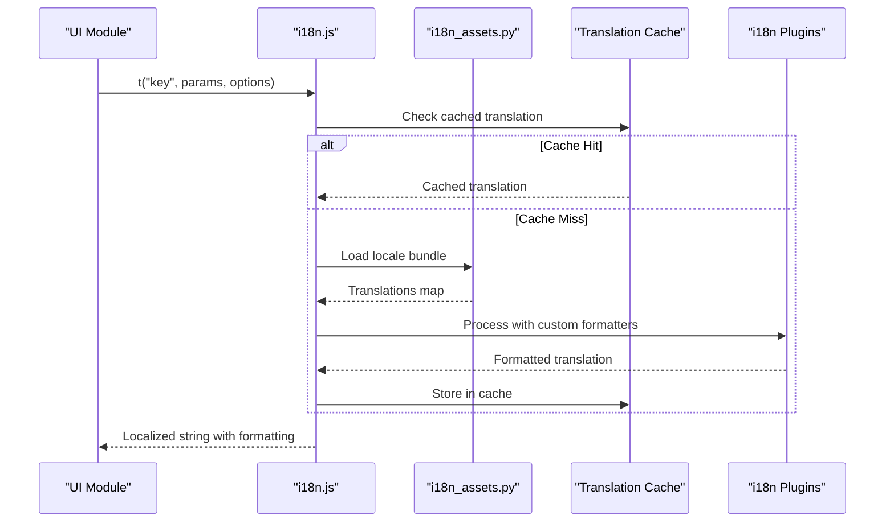

**Diagram sources**
- [i18n.js](file://backend/app/assets/i18n.js)
- [i18n_assets.py](file://backend/app/i18n_assets.py)

**Section sources**
- [i18n.js](file://backend/app/assets/i18n.js)
- [i18n_assets.py](file://backend/app/i18n_assets.py)

### Modernized State Management Patterns
The state management system now includes:
- Immutable state updates with structural sharing
- Reactive subscriptions with automatic cleanup
- Middleware pipeline for side effects and logging
- Schema validation and type safety
- Persistence layer with multiple storage backends
- Time-travel debugging capabilities

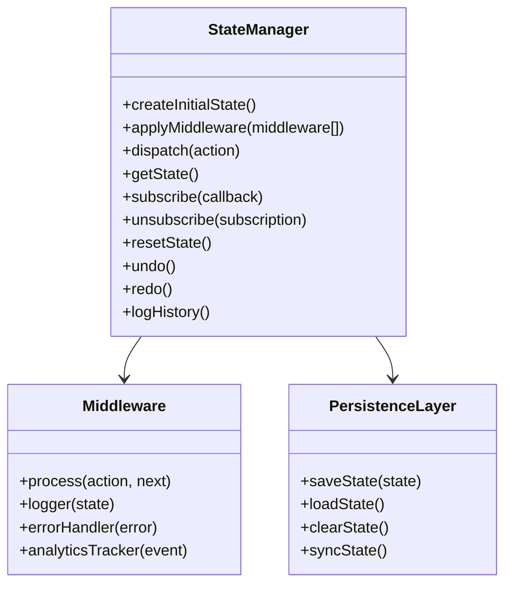

**Diagram sources**
- [console-state.js](file://backend/app/web/static/console/console-state.js)

**Section sources**
- [console-state.js](file://backend/app/web/static/console/console-state.js)