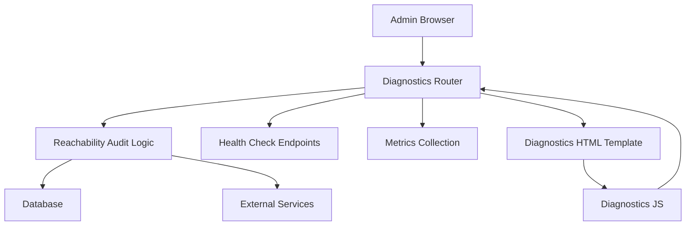
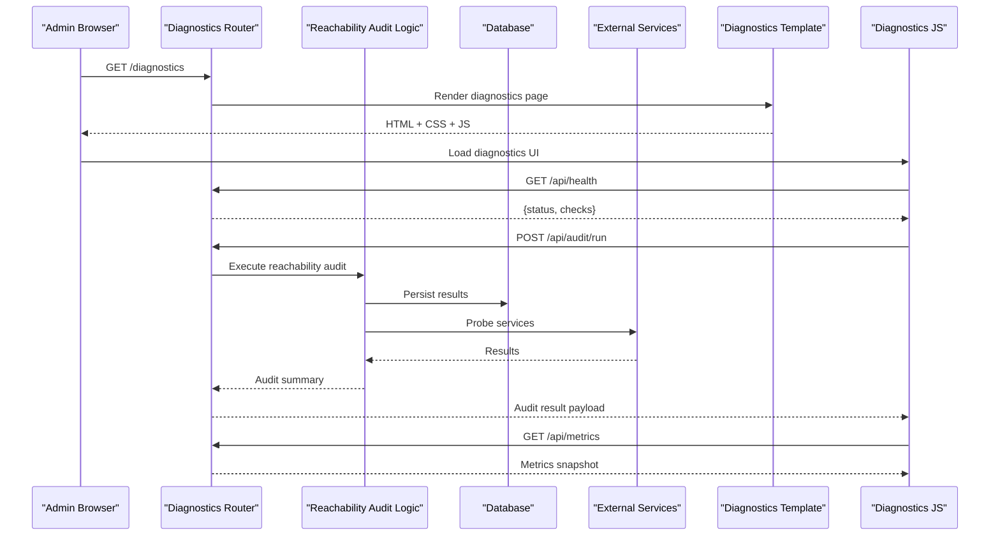
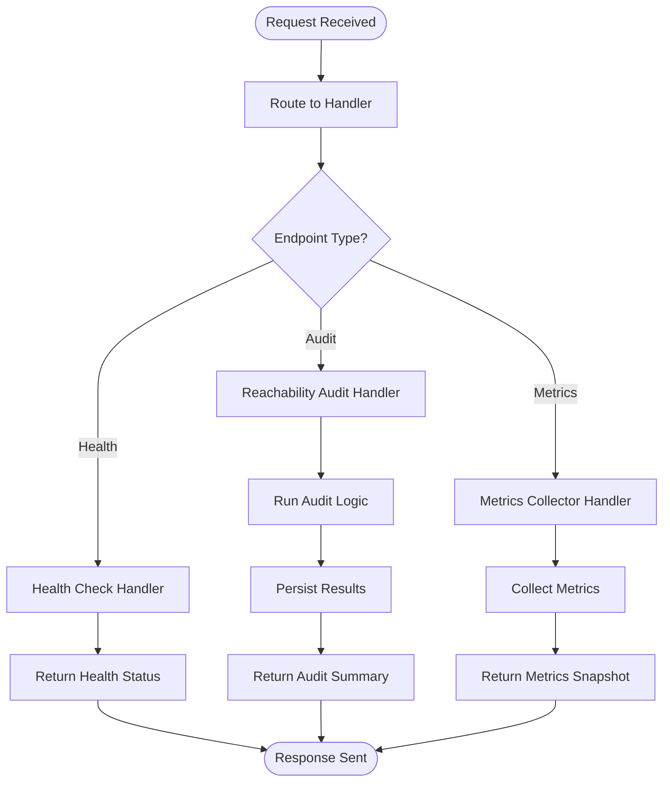
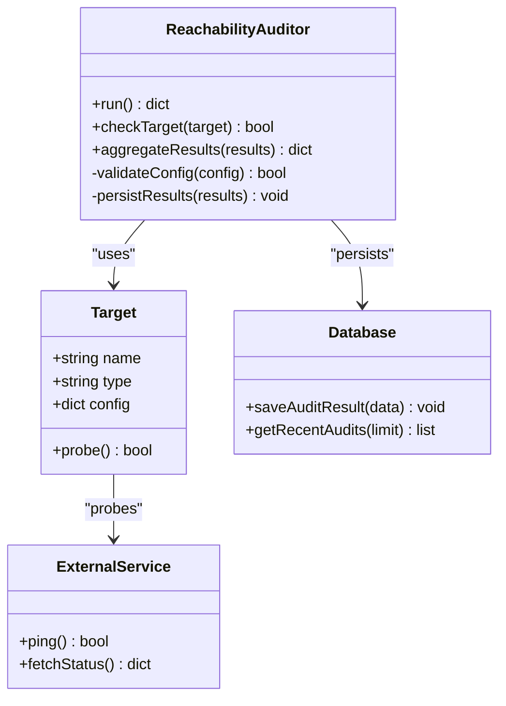
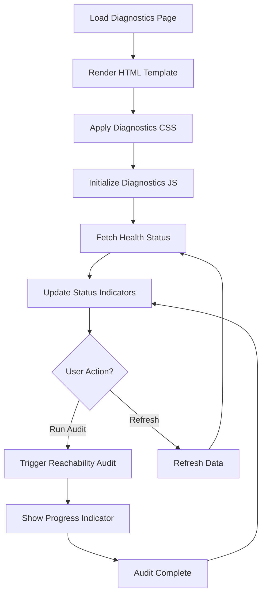
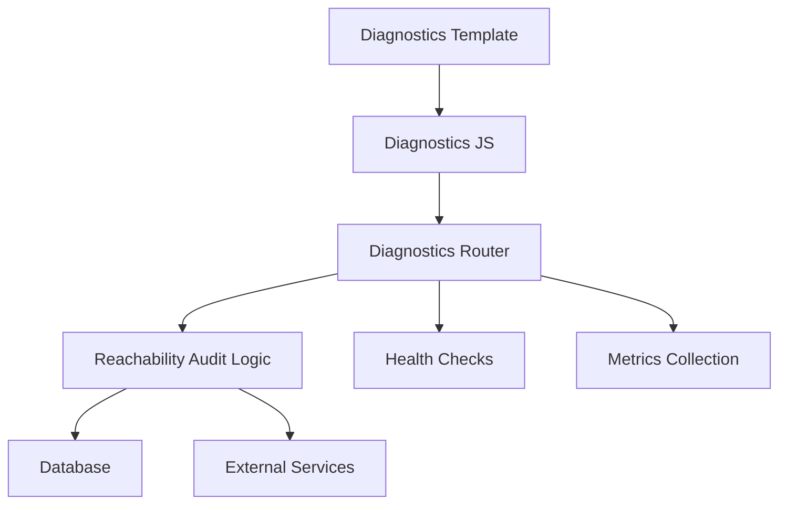

# Diagnostics & Monitoring

<cite>
**Referenced Files in This Document**
- [main.py](file://backend/app/main.py)
- [reachability_audit.py](file://backend/app/reachability_audit.py)
- [reachability_audit.py](file://backend/app/routers/reachability_audit.py)
- [diagnostics.html](file://backend/app/web/templates/diagnostics.html)
- [diagnostics.js](file://backend/app/web/static/diagnostics.js)
- [diagnostics.css](file://backend/app/web/static/diagnostics.css)
- [test_reachability_diagnostics_page.py](file://backend/tests/test_reachability_diagnostics_page.py)
- [test_reachability_diagnostics_render.py](file://backend/tests/test_reachability_diagnostics_render.py)
- [test_readiness_health_endpoint.py](file://backend/tests/test_readiness_health_endpoint.py)
</cite>

## Table of Contents
1. [Introduction](#introduction)
2. [Project Structure](#project-structure)
3. [Core Components](#core-components)
4. [Architecture Overview](#architecture-overview)
5. [Detailed Component Analysis](#detailed-component-analysis)
6. [Dependency Analysis](#dependency-analysis)
7. [Performance Considerations](#performance-considerations)
8. [Troubleshooting Guide](#troubleshooting-guide)
9. [Conclusion](#conclusion)
10. [Appendices](#appendices)

## Introduction
This document explains the diagnostics and monitoring interface for administrators. It covers:
- Reachability audit functionality
- System health checks
- Performance metrics collection
- Diagnostic page layout and real-time status indicators
- Troubleshooting tools and workflows
- Interpreting diagnostic results and common issues
- Extending monitoring capabilities with custom checks and integrations

The goal is to help operators quickly assess system health, identify problems, and maintain reliability using built-in diagnostics and extensible monitoring hooks.

## Project Structure
The diagnostics and monitoring features are implemented across backend routers, application logic, web templates, and static assets. Key areas include:
- Backend router exposing diagnostic endpoints
- Application-level reachability audit logic
- Web template rendering the diagnostics page
- Client-side JavaScript for live updates and interactions
- CSS styling for the diagnostics UI
- Tests validating behavior and rendering

[No sources needed since this diagram shows conceptual workflow, not actual code structure]

**Section sources**
- [main.py](file://backend/app/main.py)
- [reachability_audit.py](file://backend/app/reachability_audit.py)
- [reachability_audit.py](file://backend/app/routers/reachability_audit.py)
- [diagnostics.html](file://backend/app/web/templates/diagnostics.html)
- [diagnostics.js](file://backend/app/web/static/diagnostics.js)
- [diagnostics.css](file://backend/app/web/static/diagnostics.css)

## Core Components
- Diagnostics Router: Exposes endpoints for health checks, reachability audits, and metrics.
- Reachability Audit Logic: Performs connectivity checks against configured services and stores results.
- Diagnostics Page (Template + Static): Renders the admin UI with real-time status indicators and controls.
- Health Checks: Readiness/liveness endpoints used by orchestrators and load balancers.
- Metrics Collection: Aggregates performance data for key subsystems.

These components work together to provide a comprehensive view of system health and operational status.

**Section sources**
- [reachability_audit.py](file://backend/app/reachability_audit.py)
- [reachability_audit.py](file://backend/app/routers/reachability_audit.py)
- [diagnostics.html](file://backend/app/web/templates/diagnostics.html)
- [diagnostics.js](file://backend/app/web/static/diagnostics.js)
- [diagnostics.css](file://backend/app/web/static/diagnostics.css)

## Architecture Overview
The diagnostics architecture follows a clear separation between API endpoints, business logic, and presentation layers. The admin browser interacts with the diagnostics router, which delegates to internal modules for auditing and health checks. The template renders the UI, while client-side JavaScript polls for updates and triggers actions.

**Diagram sources**
- [reachability_audit.py](file://backend/app/reachability_audit.py)
- [reachability_audit.py](file://backend/app/routers/reachability_audit.py)
- [diagnostics.html](file://backend/app/web/templates/diagnostics.html)
- [diagnostics.js](file://backend/app/web/static/diagnostics.js)

## Detailed Component Analysis

### Diagnostics Router
Responsibilities:
- Serve the diagnostics page
- Provide health check endpoints
- Trigger reachability audits
- Return metrics snapshots

Key behaviors:
- Endpoint routing for diagnostics and health
- Request validation and error handling
- Integration with audit logic and metrics collectors

**Diagram sources**
- [reachability_audit.py](file://backend/app/routers/reachability_audit.py)

**Section sources**
- [reachability_audit.py](file://backend/app/routers/reachability_audit.py)

### Reachability Audit Logic
Responsibilities:
- Define and execute connectivity checks
- Aggregate results from multiple targets
- Store audit outcomes for historical analysis

Key behaviors:
- Target discovery and configuration parsing
- Asynchronous probing with timeouts and retries
- Result normalization and persistence

**Diagram sources**
- [reachability_audit.py](file://backend/app/reachability_audit.py)

**Section sources**
- [reachability_audit.py](file://backend/app/reachability_audit.py)

### Diagnostics Page (Template + Static)
Responsibilities:
- Render the diagnostics dashboard
- Display real-time status indicators
- Provide interactive controls for audits and refreshes
- Style the UI consistently

Key behaviors:
- Template variables for dynamic content
- Client-side polling for live updates
- Error states and user feedback

**Diagram sources**
- [diagnostics.html](file://backend/app/web/templates/diagnostics.html)
- [diagnostics.js](file://backend/app/web/static/diagnostics.js)
- [diagnostics.css](file://backend/app/web/static/diagnostics.css)

**Section sources**
- [diagnostics.html](file://backend/app/web/templates/diagnostics.html)
- [diagnostics.js](file://backend/app/web/static/diagnostics.js)
- [diagnostics.css](file://backend/app/web/static/diagnostics.css)

### Health Checks
Responsibilities:
- Provide readiness and liveness endpoints
- Report component-specific health status
- Support orchestration integration

Key behaviors:
- Aggregated health status calculation
- Component-wise failure reporting
- Standardized response format

**Section sources**
- [test_readiness_health_endpoint.py](file://backend/tests/test_readiness_health_endpoint.py)

### Metrics Collection
Responsibilities:
- Gather performance metrics from core subsystems
- Expose metrics via API endpoints
- Support time-series aggregation

Key behaviors:
- Metric definitions and collection intervals
- Error handling and fallback values
- Export formats compatible with monitoring systems

**Section sources**
- [reachability_audit.py](file://backend/app/reachability_audit.py)

## Dependency Analysis
The diagnostics system has clear dependencies between components:
- Router depends on audit logic and metrics collectors
- Audit logic depends on database and external services
- Frontend depends on router endpoints and template rendering

**Diagram sources**
- [reachability_audit.py](file://backend/app/reachability_audit.py)
- [reachability_audit.py](file://backend/app/routers/reachability_audit.py)
- [diagnostics.html](file://backend/app/web/templates/diagnostics.html)
- [diagnostics.js](file://backend/app/web/static/diagnostics.js)

**Section sources**
- [reachability_audit.py](file://backend/app/reachability_audit.py)
- [reachability_audit.py](file://backend/app/routers/reachability_audit.py)

## Performance Considerations
- Asynchronous execution: Use non-blocking operations for external service probes to avoid UI freezes
- Caching: Cache frequently accessed health status to reduce database load
- Pagination: Implement pagination for audit history queries
- Resource limits: Set appropriate timeouts and retry limits for external calls
- Monitoring overhead: Ensure metrics collection doesn't impact application performance

## Troubleshooting Guide
Common issues and resolutions:
- Connectivity failures: Verify network configuration and firewall rules
- Database errors: Check connection strings and permissions
- External service timeouts: Adjust timeout settings and retry policies
- UI loading issues: Clear browser cache and verify asset paths
- Health check failures: Review component-specific error logs

Diagnostic tools available:
- Real-time status indicators for quick visual assessment
- Audit history for trend analysis
- Error logs with detailed stack traces
- Performance metrics for bottleneck identification

**Section sources**
- [test_reachability_diagnostics_page.py](file://backend/tests/test_reachability_diagnostics_page.py)
- [test_reachability_diagnostics_render.py](file://backend/tests/test_reachability_diagnostics_render.py)

## Conclusion
The diagnostics and monitoring interface provides administrators with comprehensive tools for system health assessment and maintenance. By understanding the architecture, interpreting diagnostic results, and extending monitoring capabilities, operators can maintain system reliability and quickly resolve issues.

## Appendices

### Adding Custom Diagnostic Checks
To extend the diagnostics system:
1. Define a new check function that returns status information
2. Register the check with the audit framework
3. Add corresponding UI elements if needed
4. Test the integration thoroughly

### Integrating with External Monitoring Systems
Recommended approaches:
- Export metrics in standard formats (Prometheus, OpenMetrics)
- Implement webhook notifications for critical alerts
- Use structured logging for log aggregation
- Configure health check endpoints for orchestration platforms

### Interpreting Diagnostic Results
Key indicators:
- Green status: All systems healthy
- Yellow status: Degraded performance or warnings
- Red status: Critical failures requiring immediate attention
- Historical trends: Identify recurring issues and capacity planning needs