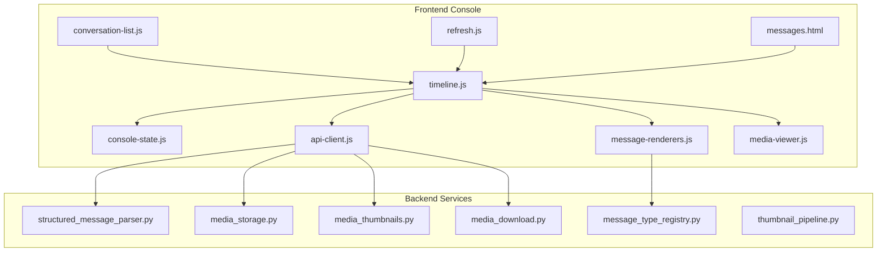
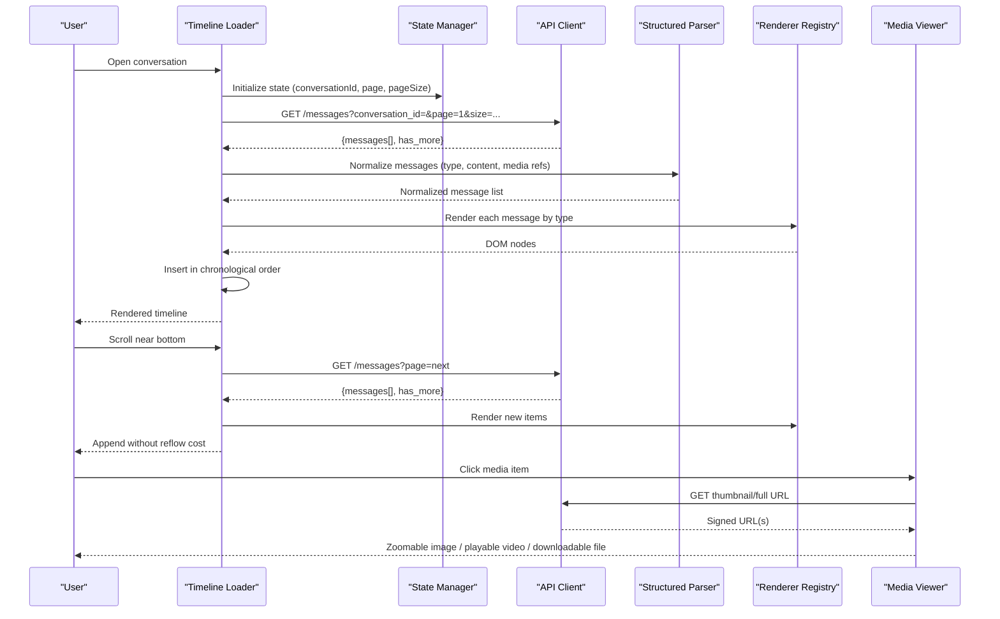
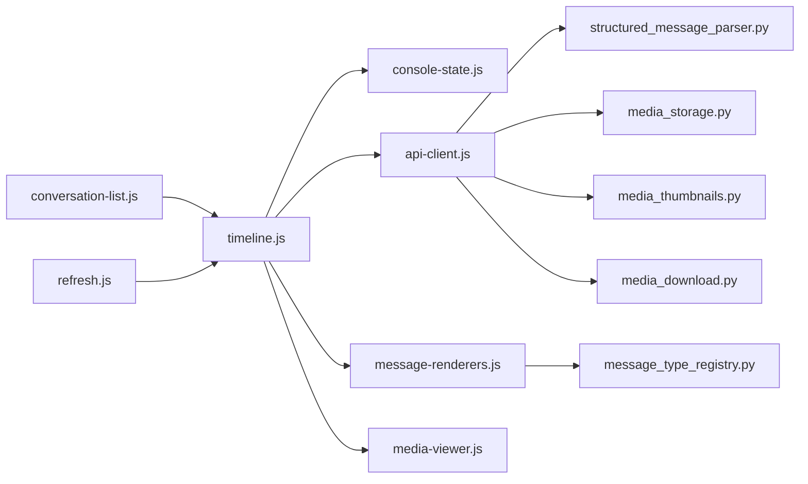

# Message Timeline & Rendering

<cite>
**Referenced Files in This Document**
- [timeline.js](file://backend/app/web/static/console/timeline.js)
- [message-renderers.js](file://backend/app/web/static/console/message-renderers.js)
- [media-viewer.js](file://backend/app/web/static/console/media-viewer.js)
- [console-state.js](file://backend/app/web/static/console/console-state.js)
- [api-client.js](file://backend/app/web/static/console/api-client.js)
- [messages.html](file://backend/app/web/templates/messages.html)
- [conversation-list.js](file://backend/app/web/static/console/conversation-list.js)
- [refresh.js](file://backend/app/web/static/console/refresh.js)
- [structured_message_parser.py](file://backend/app/structured_message_parser.py)
- [message_type_registry.py](file://backend/app/message_type_registry.py)
- [media_storage.py](file://backend/app/media_storage.py)
- [media_download.py](file://backend/app/media_download.py)
- [media_thumbnails.py](file://backend/app/media_thumbnails.py)
- [thumbnail_pipeline.py](file://backend/app/thumbnail_pipeline.py)
</cite>

## Table of Contents
1. [Introduction](#introduction)
2. [Project Structure](#project-structure)
3. [Core Components](#core-components)
4. [Architecture Overview](#architecture-overview)
5. [Detailed Component Analysis](#detailed-component-analysis)
6. [Dependency Analysis](#dependency-analysis)
7. [Performance Considerations](#performance-considerations)
8. [Troubleshooting Guide](#troubleshooting-guide)
9. [Conclusion](#conclusion)
10. [Appendices](#appendices)

## Introduction
This document explains the message timeline component and rendering system used to display WeCom conversation messages. It covers how messages are loaded incrementally, rendered by type, and ordered chronologically. It also documents the renderer architecture, supported message types, custom renderer implementation, and the media viewer for images, videos, and files. Finally, it provides guidance on creating custom renderers, handling rich media content, and optimizing performance for large histories.

## Project Structure
The frontend console is implemented as a set of JavaScript modules under the web static directory, with templates providing the HTML shell. Backend services provide structured parsing, media storage, thumbnails, and download endpoints.

**Diagram sources**
- [timeline.js](file://backend/app/web/static/console/timeline.js)
- [message-renderers.js](file://backend/app/web/static/console/message-renderers.js)
- [media-viewer.js](file://backend/app/web/static/console/media-viewer.js)
- [console-state.js](file://backend/app/web/static/console/console-state.js)
- [api-client.js](file://backend/app/web/static/console/api-client.js)
- [messages.html](file://backend/app/web/templates/messages.html)
- [conversation-list.js](file://backend/app/web/static/console/conversation-list.js)
- [refresh.js](file://backend/app/web/static/console/refresh.js)
- [structured_message_parser.py](file://backend/app/structured_message_parser.py)
- [message_type_registry.py](file://backend/app/message_type_registry.py)
- [media_storage.py](file://backend/app/media_storage.py)
- [media_download.py](file://backend/app/media_download.py)
- [media_thumbnails.py](file://backend/app/media_thumbnails.py)
- [thumbnail_pipeline.py](file://backend/app/thumbnail_pipeline.py)

**Section sources**
- [messages.html](file://backend/app/web/templates/messages.html)
- [timeline.js](file://backend/app/web/static/console/timeline.js)
- [message-renderers.js](file://backend/app/web/static/console/message-renderers.js)
- [media-viewer.js](file://backend/app/web/static/console/media-viewer.js)
- [console-state.js](file://backend/app/web/static/console/console-state.js)
- [api-client.js](file://backend/app/web/static/console/api-client.js)
- [conversation-list.js](file://backend/app/web/static/console/conversation-list.js)
- [refresh.js](file://backend/app/web/static/console/refresh.js)
- [structured_message_parser.py](file://backend/app/structured_message_parser.py)
- [message_type_registry.py](file://backend/app/message_type_registry.py)
- [media_storage.py](file://backend/app/media_storage.py)
- [media_download.py](file://backend/app/media_download.py)
- [media_thumbnails.py](file://backend/app/media_thumbnails.py)
- [thumbnail_pipeline.py](file://backend/app/thumbnail_pipeline.py)

## Core Components
- Timeline loader: Manages incremental loading (pagination), chronological ordering, and DOM updates.
- Renderer registry: Maps message types to renderers; supports default and custom renderers.
- Media viewer: Provides image zoom, video playback, and file download UI and logic.
- State manager: Holds current conversation context, pagination state, and UI flags.
- API client: Encapsulates HTTP calls for fetching messages, thumbnails, and media URLs.

Key responsibilities:
- Incremental load: Fetch next page when near bottom or via explicit action.
- Chronological order: Ensure new items are inserted at correct positions.
- Type-based rendering: Use message type to select appropriate renderer.
- Media handling: Generate thumbnails, serve signed URLs, and handle downloads.

**Section sources**
- [timeline.js](file://backend/app/web/static/console/timeline.js)
- [message-renderers.js](file://backend/app/web/static/console/message-renderers.js)
- [media-viewer.js](file://backend/app/web/static/console/media-viewer.js)
- [console-state.js](file://backend/app/web/static/console/console-state.js)
- [api-client.js](file://backend/app/web/static/console/api-client.js)

## Architecture Overview
The timeline orchestrates data flow between the API client, state manager, renderer registry, and media viewer. Messages are fetched in pages, normalized through structured parsing, then rendered by type-specific renderers. Media assets use thumbnails where available and fall back to full-size previews.

**Diagram sources**
- [timeline.js](file://backend/app/web/static/console/timeline.js)
- [api-client.js](file://backend/app/web/static/console/api-client.js)
- [structured_message_parser.py](file://backend/app/structured_message_parser.py)
- [message-renderers.js](file://backend/app/web/static/console/message-renderers.js)
- [media-viewer.js](file://backend/app/web/static/console/media-viewer.js)

## Detailed Component Analysis

### Timeline Loader
Responsibilities:
- Initialize pagination and scroll listeners.
- Load initial page and subsequent pages on demand.
- Maintain chronological insertion and deduplication.
- Coordinate with state manager for UI flags (loading, error).

Key behaviors:
- Loads first page on conversation open.
- Detects near-bottom scroll to trigger next page.
- Inserts new messages preserving time order.
- Shows loading indicators and handles errors gracefully.

Optimization tips:
- Debounce scroll handlers.
- Batch DOM insertions using DocumentFragment.
- Avoid reflows by measuring off-screen when needed.

**Section sources**
- [timeline.js](file://backend/app/web/static/console/timeline.js)
- [console-state.js](file://backend/app/web/static/console/console-state.js)
- [api-client.js](file://backend/app/web/static/console/api-client.js)

### Message Renderer Registry
Responsibilities:
- Map message types to renderers.
- Provide default renderers for common types.
- Allow registration of custom renderers.

Supported types (examples):
- Text, Image, Video, Audio, File, Link, Card, Location, Group Chat Events, System Notices.

Rendering pipeline:
- Parse structured content into a normalized shape.
- Select renderer by type.
- Render to DOM node with safe HTML and event bindings.
- Attach media preview hooks for rich content.

Custom renderer implementation:
- Register a handler function that accepts normalized message and returns a DOM node.
- Handle edge cases like missing fields and unsupported formats.
- Integrate with media viewer for attachments.

**Section sources**
- [message-renderers.js](file://backend/app/web/static/console/message-renderers.js)
- [structured_message_parser.py](file://backend/app/structured_message_parser.py)
- [message_type_registry.py](file://backend/app/message_type_registry.py)

### Media Viewer
Capabilities:
- Image zoom with pinch-to-zoom and double-tap.
- Video playback with controls and fullscreen.
- File download with progress indication.
- Thumbnail-first loading to reduce bandwidth.

Workflow:
- On click, resolve thumbnail URL if available; otherwise fetch full-size.
- For images, open modal with zoom gestures.
- For videos, embed player with autoplay muted policy compliance.
- For files, initiate download and show status.

Security:
- Use signed URLs for media access.
- Respect CORS and CSP policies.

**Section sources**
- [media-viewer.js](file://backend/app/web/static/console/media-viewer.js)
- [media_storage.py](file://backend/app/media_storage.py)
- [media_download.py](file://backend/app/media_download.py)
- [media_thumbnails.py](file://backend/app/media_thumbnails.py)

### State Manager
Responsibilities:
- Hold conversation ID, pagination parameters, and UI state.
- Emit events for timeline and UI components.
- Persist temporary state across navigation within session.

Integration:
- Timeline reads/writes pagination state.
- Refresh module triggers reload based on state.

**Section sources**
- [console-state.js](file://backend/app/web/static/console/console-state.js)
- [refresh.js](file://backend/app/web/static/console/refresh.js)

### API Client
Responsibilities:
- Encapsulate HTTP requests for messages, thumbnails, and media URLs.
- Handle retries and error responses.
- Cache short-lived resources where appropriate.

Endpoints used:
- Messages listing with pagination.
- Thumbnail generation and retrieval.
- Signed media URLs for secure access.

**Section sources**
- [api-client.js](file://backend/app/web/static/console/api-client.js)
- [media_thumbnails.py](file://backend/app/media_thumbnails.py)
- [media_storage.py](file://backend/app/media_storage.py)

### Conversation List Integration
Responsibilities:
- Navigate to a selected conversation.
- Trigger timeline initialization with conversation context.

Interaction:
- Emits selection event consumed by timeline loader.

**Section sources**
- [conversation-list.js](file://backend/app/web/static/console/conversation-list.js)
- [timeline.js](file://backend/app/web/static/console/timeline.js)

## Dependency Analysis
The following diagram shows key dependencies among frontend modules and backend services involved in timeline rendering and media handling.

**Diagram sources**
- [timeline.js](file://backend/app/web/static/console/timeline.js)
- [console-state.js](file://backend/app/web/static/console/console-state.js)
- [api-client.js](file://backend/app/web/static/console/api-client.js)
- [message-renderers.js](file://backend/app/web/static/console/message-renderers.js)
- [media-viewer.js](file://backend/app/web/static/console/media-viewer.js)
- [conversation-list.js](file://backend/app/web/static/console/conversation-list.js)
- [refresh.js](file://backend/app/web/static/console/refresh.js)
- [structured_message_parser.py](file://backend/app/structured_message_parser.py)
- [message_type_registry.py](file://backend/app/message_type_registry.py)
- [media_storage.py](file://backend/app/media_storage.py)
- [media_thumbnails.py](file://backend/app/media_thumbnails.py)
- [media_download.py](file://backend/app/media_download.py)

**Section sources**
- [timeline.js](file://backend/app/web/static/console/timeline.js)
- [message-renderers.js](file://backend/app/web/static/console/message-renderers.js)
- [media-viewer.js](file://backend/app/web/static/console/media-viewer.js)
- [console-state.js](file://backend/app/web/static/console/console-state.js)
- [api-client.js](file://backend/app/web/static/console/api-client.js)
- [conversation-list.js](file://backend/app/web/static/console/conversation-list.js)
- [refresh.js](file://backend/app/web/static/console/refresh.js)
- [structured_message_parser.py](file://backend/app/structured_message_parser.py)
- [message_type_registry.py](file://backend/app/message_type_registry.py)
- [media_storage.py](file://backend/app/media_storage.py)
- [media_thumbnails.py](file://backend/app/media_thumbnails.py)
- [media_download.py](file://backend/app/media_download.py)

## Performance Considerations
- Virtualization: For very long timelines, consider virtual scrolling to render only visible items.
- Debouncing: Debounce scroll and resize handlers to avoid excessive work.
- Batch DOM updates: Use DocumentFragment or batched mutations to minimize reflows.
- Lazy loading: Defer heavy rendering until items enter viewport.
- Thumbnail-first: Always prefer thumbnails; lazy-load full-size on demand.
- Caching: Cache small payloads and thumbnails in memory; respect expiration.
- Efficient selectors: Avoid expensive queries inside render loops.
- Memory management: Detach event listeners and clear references for removed nodes.

[No sources needed since this section provides general guidance]

## Troubleshooting Guide
Common issues and resolutions:
- Infinite scroll not triggering: Verify scroll listener setup and threshold calculations.
- Duplicate messages: Ensure deduplication by unique IDs and stable ordering keys.
- Missing thumbnails: Check thumbnail pipeline status and fallback to full-size URLs.
- Media access denied: Validate signed URL generation and permissions.
- Slow rendering: Profile renderers; defer non-critical work; implement virtualization.
- Error states: Surface user-friendly messages and allow retry actions.

Operational checks:
- Confirm API responses include expected fields and pagination markers.
- Validate structured parser output matches renderer expectations.
- Inspect network logs for failed media requests and CORS issues.

**Section sources**
- [timeline.js](file://backend/app/web/static/console/timeline.js)
- [api-client.js](file://backend/app/web/static/console/api-client.js)
- [media_thumbnails.py](file://backend/app/media_thumbnails.py)
- [media_storage.py](file://backend/app/media_storage.py)

## Conclusion
The message timeline and rendering system combines incremental loading, type-aware rendering, and robust media handling to deliver a responsive and scalable conversation view. By leveraging a modular renderer registry, efficient state management, and secure media access, the system supports diverse message types and rich media while maintaining performance for large histories. Custom renderers and optimized rendering strategies enable extensibility and responsiveness tailored to specific needs.

[No sources needed since this section summarizes without analyzing specific files]

## Appendices

### Creating a Custom Message Renderer
Steps:
- Define a renderer function that accepts a normalized message and returns a DOM node.
- Register the renderer with the registry under the target message type.
- Integrate with media viewer for any attachments.
- Test with sample payloads covering edge cases.

Best practices:
- Sanitize content to prevent XSS.
- Gracefully handle missing or malformed fields.
- Keep renderers lightweight; defer heavy operations.

**Section sources**
- [message-renderers.js](file://backend/app/web/static/console/message-renderers.js)
- [structured_message_parser.py](file://backend/app/structured_message_parser.py)
- [message_type_registry.py](file://backend/app/message_type_registry.py)

### Handling Rich Media Content
Guidelines:
- Prefer thumbnails for initial display; lazy-load full-size on interaction.
- Use signed URLs for secure access and expiration control.
- Provide fallbacks for unsupported formats and broken links.
- Implement accessibility features (alt text, captions, keyboard navigation).

**Section sources**
- [media-viewer.js](file://backend/app/web/static/console/media-viewer.js)
- [media_storage.py](file://backend/app/media_storage.py)
- [media_download.py](file://backend/app/media_download.py)
- [media_thumbnails.py](file://backend/app/media_thumbnails.py)

### Optimizing Rendering Performance for Large Histories
Recommendations:
- Implement virtual scrolling for timelines exceeding hundreds of messages.
- Batch DOM updates and avoid synchronous layout thrashing.
- Precompute layout metrics off-screen when necessary.
- Use requestIdleCallback for non-critical tasks.
- Monitor memory usage and clean up detached nodes.

[No sources needed since this section provides general guidance]