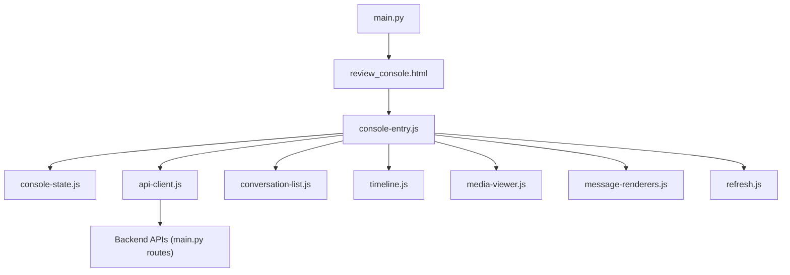
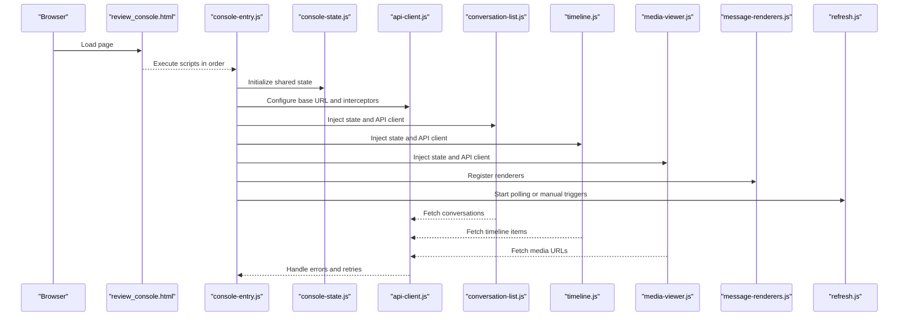
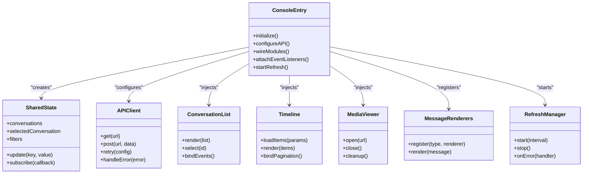
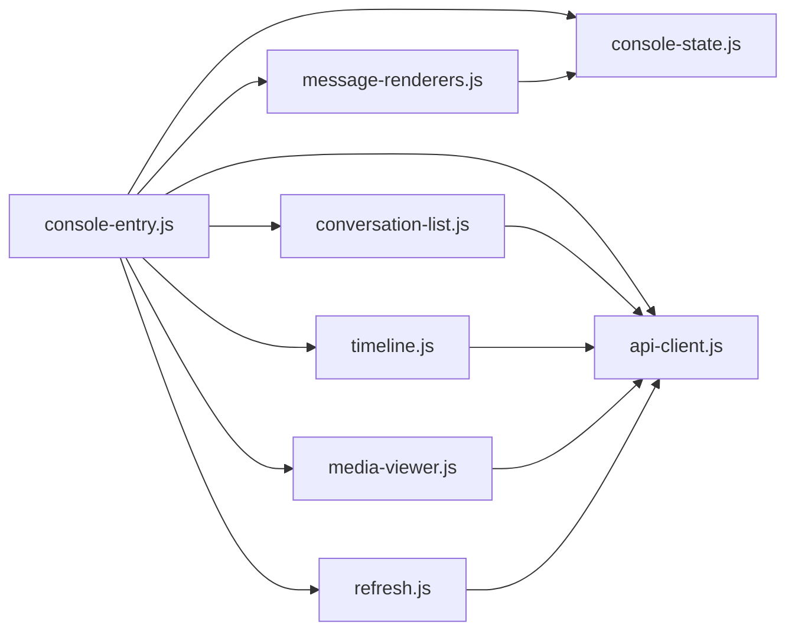

# Console Entry Point

<cite>
**Referenced Files in This Document**
- [console-entry.js](file://backend/app/web/static/console/console-entry.js)
- [console-state.js](file://backend/app/web/static/console/console-state.js)
- [api-client.js](file://backend/app/web/static/console/api-client.js)
- [conversation-list.js](file://backend/app/web/static/console/conversation-list.js)
- [timeline.js](file://backend/app/web/static/console/timeline.js)
- [media-viewer.js](file://backend/app/web/static/console/media-viewer.js)
- [message-renderers.js](file://backend/app/web/static/console/message-renderers.js)
- [refresh.js](file://backend/app/web/static/console/refresh.js)
- [main.py](file://backend/app/main.py)
- [templates/review_console.html](file://backend/app/web/templates/review_console.html)
</cite>

## Table of Contents
1. [Introduction](#introduction)
2. [Project Structure](#project-structure)
3. [Core Components](#core-components)
4. [Architecture Overview](#architecture-overview)
5. [Detailed Component Analysis](#detailed-component-analysis)
6. [Dependency Analysis](#dependency-analysis)
7. [Performance Considerations](#performance-considerations)
8. [Troubleshooting Guide](#troubleshooting-guide)
9. [Conclusion](#conclusion)
10. [Appendices](#appendices)

## Introduction
This document explains the console entry point module that bootstraps the WeCom Archive Review Console. It covers how the application initializes, sets up event listeners, and wires core UI features such as conversation listing, timeline rendering, media viewing, message rendering, and refresh behavior. It also documents initialization sequences, dependency injection patterns used by the frontend modules, error handling strategies, extension points for adding new features, customization hooks for startup behavior, performance considerations during initialization, and memory management best practices.

## Project Structure
The console is a client-side JavaScript application served by the backend web server. The HTML template loads the console scripts in a specific order to ensure dependencies are available when each module executes. The main Python entry point serves the console page and exposes API endpoints consumed by the console’s API client.

**Diagram sources**
- [templates/review_console.html](file://backend/app/web/templates/review_console.html)
- [console-entry.js](file://backend/app/web/static/console/console-entry.js)
- [console-state.js](file://backend/app/web/static/console/console-state.js)
- [api-client.js](file://backend/app/web/static/console/api-client.js)
- [conversation-list.js](file://backend/app/web/static/console/conversation-list.js)
- [timeline.js](file://backend/app/web/static/console/timeline.js)
- [media-viewer.js](file://backend/app/web/static/console/media-viewer.js)
- [message-renderers.js](file://backend/app/web/static/console/message-renderers.js)
- [refresh.js](file://backend/app/web/static/console/refresh.js)
- [main.py](file://backend/app/main.py)

**Section sources**
- [templates/review_console.html](file://backend/app/web/templates/review_console.html)
- [console-entry.js](file://backend/app/web/static/console/console-entry.js)
- [main.py](file://backend/app/main.py)

## Core Components
- console-entry.js: Bootstraps the console, initializes shared state, configures the API client, and starts feature modules.
- console-state.js: Provides a centralized, reactive state store for the console UI and data.
- api-client.js: Encapsulates HTTP requests to backend endpoints with retry and error handling.
- conversation-list.js: Renders and manages the list of conversations and selection state.
- timeline.js: Renders message timelines, handles pagination, and updates the UI incrementally.
- media-viewer.js: Displays media attachments with lazy loading and safe resource cleanup.
- message-renderers.js: Converts structured messages into DOM elements with type-specific renderers.
- refresh.js: Implements auto-refresh and manual refresh triggers with debouncing and backoff.

These components follow a simple dependency injection pattern where console-entry.js constructs and passes shared instances (state, API client) to feature modules at startup.

**Section sources**
- [console-entry.js](file://backend/app/web/static/console/console-entry.js)
- [console-state.js](file://backend/app/web/static/console/console-state.js)
- [api-client.js](file://backend/app/web/static/console/api-client.js)
- [conversation-list.js](file://backend/app/web/static/console/conversation-list.js)
- [timeline.js](file://backend/app/web/static/console/timeline.js)
- [media-viewer.js](file://backend/app/web/static/console/media-viewer.js)
- [message-renderers.js](file://backend/app/web/static/console/message-renderers.js)
- [refresh.js](file://backend/app/web/static/console/refresh.js)

## Architecture Overview
The console follows a modular architecture with a clear separation between UI logic, state management, and network communication. Initialization is orchestrated by the entry script, which wires up modules and attaches event listeners to DOM elements.

**Diagram sources**
- [console-entry.js](file://backend/app/web/static/console/console-entry.js)
- [console-state.js](file://backend/app/web/static/console/console-state.js)
- [api-client.js](file://backend/app/web/static/console/api-client.js)
- [conversation-list.js](file://backend/app/web/static/console/conversation-list.js)
- [timeline.js](file://backend/app/web/static/console/timeline.js)
- [media-viewer.js](file://backend/app/web/static/console/media-viewer.js)
- [message-renderers.js](file://backend/app/web/static/console/message-renderers.js)
- [refresh.js](file://backend/app/web/static/console/refresh.js)

## Detailed Component Analysis

### Console Entry Module (console-entry.js)
Responsibilities:
- Initializes shared state from console-state.js.
- Configures the API client with base URLs, headers, and error handling.
- Wires feature modules by injecting dependencies.
- Attaches global event listeners (e.g., navigation, search, filters).
- Starts refresh mechanisms and error boundary setup.

Initialization sequence:
1. Create and expose a global state instance.
2. Instantiate the API client and attach request/response interceptors.
3. Initialize conversation list, timeline, media viewer, and message renderers.
4. Bind UI events and start background refresh tasks.

Error handling strategy:
- Centralized error logging and user-facing notifications.
- Retry policies for transient failures.
- Graceful degradation when optional features fail to load.

Extension points:
- Register new message renderers via a registry function.
- Add custom refresh behaviors through an extension hook.
- Integrate new API endpoints by extending the API client.

Customization hooks:
- Override default state values before module initialization.
- Provide custom error handlers per endpoint.
- Customize event listener priorities and debounce intervals.

**Section sources**
- [console-entry.js](file://backend/app/web/static/console/console-entry.js)

#### Class Diagram: Dependency Injection Pattern

**Diagram sources**
- [console-entry.js](file://backend/app/web/static/console/console-entry.js)
- [console-state.js](file://backend/app/web/static/console/console-state.js)
- [api-client.js](file://backend/app/web/static/console/api-client.js)
- [conversation-list.js](file://backend/app/web/static/console/conversation-list.js)
- [timeline.js](file://backend/app/web/static/console/timeline.js)
- [media-viewer.js](file://backend/app/web/static/console/media-viewer.js)
- [message-renderers.js](file://backend/app/web/static/console/message-renderers.js)
- [refresh.js](file://backend/app/web/static/console/refresh.js)

### State Management (console-state.js)
Responsibilities:
- Holds global UI and data state.
- Provides update methods and subscription callbacks for reactive UI updates.
- Ensures immutability where appropriate to prevent unintended side effects.

Complexity considerations:
- O(1) updates for keyed fields.
- Subscription callbacks trigger minimal re-renders based on changed keys.

Best practices:
- Avoid deep mutations; use shallow updates.
- Debounce frequent updates to reduce layout thrashing.

**Section sources**
- [console-state.js](file://backend/app/web/static/console/console-state.js)

### API Client (api-client.js)
Responsibilities:
- Wraps fetch calls with consistent error handling and retries.
- Normalizes responses and maps backend errors to user-friendly messages.
- Supports configurable timeouts and abort controllers for cancellation.

Retry policy:
- Exponential backoff for transient errors.
- Immediate retry for specific status codes.

Cancellation:
- Aborts in-flight requests on navigation or component unmount.

**Section sources**
- [api-client.js](file://backend/app/web/static/console/api-client.js)

### Conversation List (conversation-list.js)
Responsibilities:
- Fetches and renders conversation lists.
- Manages selection state and filters.
- Handles keyboard navigation and accessibility.

Performance:
- Virtualizes large lists to avoid heavy DOM operations.
- Debounces filter input to reduce API calls.

**Section sources**
- [conversation-list.js](file://backend/app/web/static/console/conversation-list.js)

### Timeline (timeline.js)
Responsibilities:
- Loads and renders message timelines with pagination.
- Updates UI incrementally as new items arrive.
- Integrates with media viewer for attachment previews.

Pagination strategy:
- Lazy loading with intersection observers.
- Cache-busting for incremental updates.

**Section sources**
- [timeline.js](file://backend/app/web/static/console/timeline.js)

### Media Viewer (media-viewer.js)
Responsibilities:
- Opens media in a modal or overlay.
- Lazily loads images and videos.
- Cleans up resources on close to prevent memory leaks.

Memory management:
- Releases object URLs and event listeners.
- Prevents duplicate loads for the same resource.

**Section sources**
- [media-viewer.js](file://backend/app/web/static/console/media-viewer.js)

### Message Renderers (message-renderers.js)
Responsibilities:
- Maps message types to DOM renderers.
- Sanitizes content and applies styling.
- Supports extensibility via a registration API.

Extensibility:
- New message types can be added without modifying core logic.
- Renderer functions receive normalized message payloads.

**Section sources**
- [message-renderers.js](file://backend/app/web/static/console/message-renderers.js)

### Refresh Manager (refresh.js)
Responsibilities:
- Implements auto-refresh with configurable intervals.
- Supports manual refresh triggers and backoff strategies.
- Integrates with error handling to pause refresh on persistent failures.

Debouncing and throttling:
- Prevents excessive API calls during rapid user interactions.
- Respects user preferences for refresh frequency.

**Section sources**
- [refresh.js](file://backend/app/web/static/console/refresh.js)

## Dependency Analysis
The console modules have clear dependencies and responsibilities. The entry module orchestrates initialization and wiring, while feature modules depend on shared state and the API client.

**Diagram sources**
- [console-entry.js](file://backend/app/web/static/console/console-entry.js)
- [console-state.js](file://backend/app/web/static/console/console-state.js)
- [api-client.js](file://backend/app/web/static/console/api-client.js)
- [conversation-list.js](file://backend/app/web/static/console/conversation-list.js)
- [timeline.js](file://backend/app/web/static/console/timeline.js)
- [media-viewer.js](file://backend/app/web/static/console/media-viewer.js)
- [message-renderers.js](file://backend/app/web/static/console/message-renderers.js)
- [refresh.js](file://backend/app/web/static/console/refresh.js)

**Section sources**
- [console-entry.js](file://backend/app/web/static/console/console-entry.js)
- [api-client.js](file://backend/app/web/static/console/api-client.js)

## Performance Considerations
- Minimize initial payload size by deferring non-critical scripts until after core UI is ready.
- Use virtualization for large lists to reduce DOM overhead.
- Debounce user inputs and API calls to prevent unnecessary work.
- Implement request cancellation to avoid stale updates.
- Clean up event listeners and object URLs to prevent memory leaks.
- Prefer immutable state updates to limit re-renders.
- Profile critical paths using browser dev tools to identify bottlenecks.

[No sources needed since this section provides general guidance]

## Troubleshooting Guide
Common issues and resolutions:
- API errors: Check network tab for failed requests, verify base URL configuration, and inspect retry policies.
- Memory leaks: Ensure media viewer closes and releases resources; monitor heap snapshots.
- Slow initialization: Audit script load order and defer non-essential modules.
- Event listener conflicts: Verify unique IDs and remove listeners before reattaching.
- State inconsistencies: Validate updates go through the central state manager and avoid direct DOM mutations.

**Section sources**
- [api-client.js](file://backend/app/web/static/console/api-client.js)
- [media-viewer.js](file://backend/app/web/static/console/media-viewer.js)
- [console-state.js](file://backend/app/web/static/console/console-state.js)

## Conclusion
The console entry point module orchestrates a modular, dependency-injected architecture that initializes shared state, configures networking, and wires UI features. By following the documented extension points and best practices, developers can add new features, customize startup behavior, and maintain performance and memory hygiene. Proper error handling and refresh strategies ensure a robust user experience under varying network conditions.

[No sources needed since this section summarizes without analyzing specific files]

## Appendices

### Extending the Console with New Features
Steps to add a new feature:
1. Create a new module file under the console static directory.
2. Define initialization and event binding functions.
3. Register any new message renderers or API endpoints.
4. Wire the module in the entry script by injecting shared dependencies.
5. Update the HTML template if additional DOM elements are required.

Example references:
- Adding a new renderer: see message renderers registration pattern.
- Adding a new API call: extend the API client with typed methods.
- Customizing startup: override default state values in the entry script.

**Section sources**
- [message-renderers.js](file://backend/app/web/static/console/message-renderers.js)
- [api-client.js](file://backend/app/web/static/console/api-client.js)
- [console-entry.js](file://backend/app/web/static/console/console-entry.js)

### Customizing Startup Behavior
Options:
- Modify default state values before module initialization.
- Configure API client interceptors for authentication or logging.
- Adjust refresh intervals and backoff strategies.
- Enable or disable optional features via feature flags.

**Section sources**
- [console-state.js](file://backend/app/web/static/console/console-state.js)
- [api-client.js](file://backend/app/web/static/console/api-client.js)
- [refresh.js](file://backend/app/web/static/console/refresh.js)

### Backend Integration Notes
The console interacts with backend endpoints defined in the main application module. Ensure CORS settings, authentication, and rate limiting align with client expectations.

**Section sources**
- [main.py](file://backend/app/main.py)
- [templates/review_console.html](file://backend/app/web/templates/review_console.html)