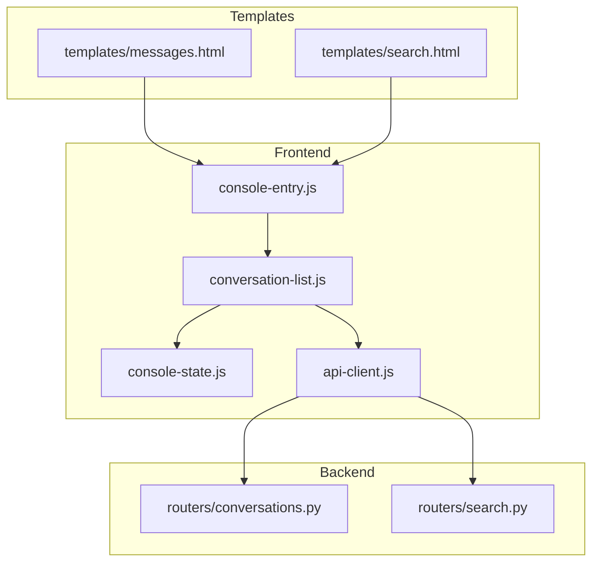
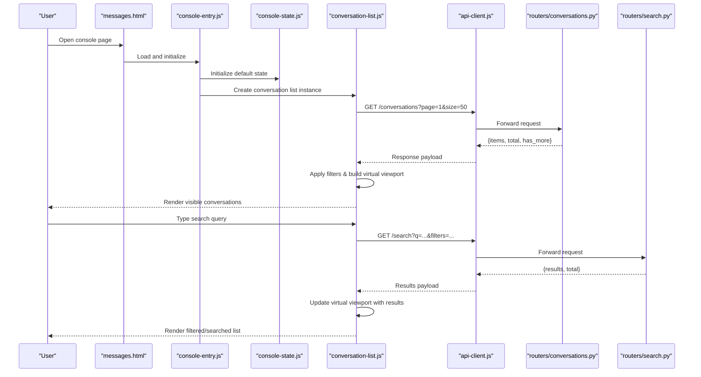
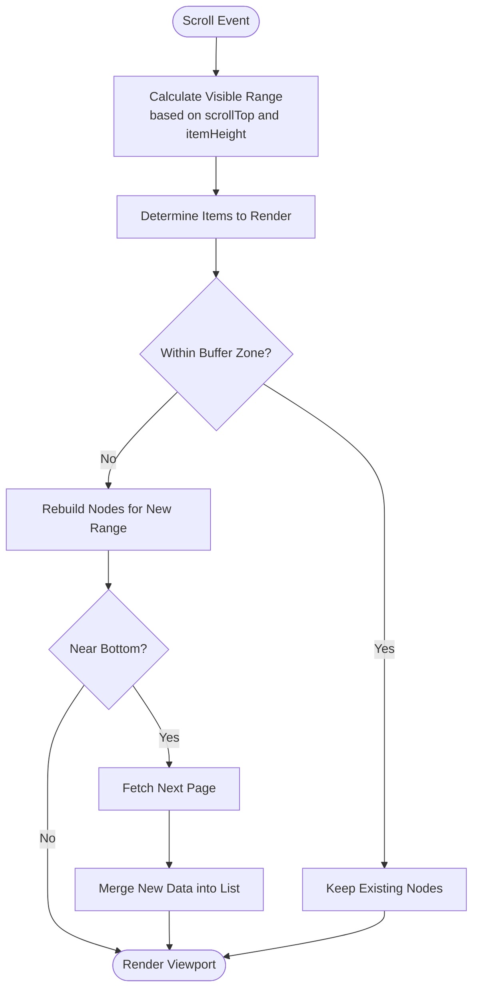
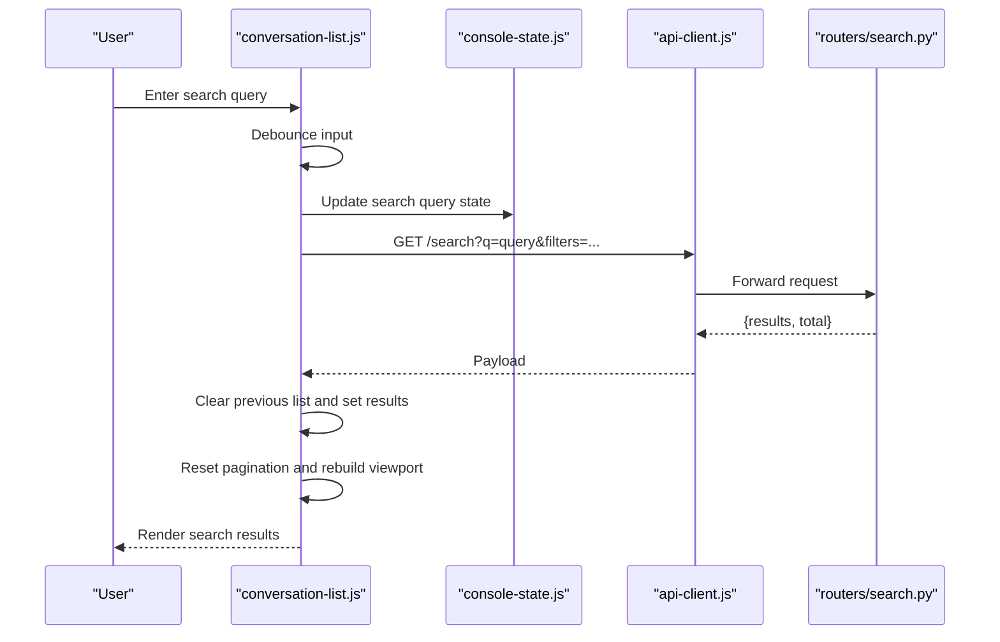
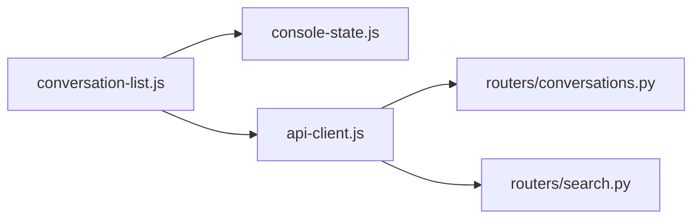

# Conversation List Component

<cite>
**Referenced Files in This Document**
- [conversation-list.js](file://backend/app/web/static/console/conversation-list.js)
- [console-entry.js](file://backend/app/web/static/console/console-entry.js)
- [console-state.js](file://backend/app/web/static/console/console-state.js)
- [api-client.js](file://backend/app/web/static/console/api-client.js)
- [conversations.py](file://backend/app/routers/conversations.py)
- [search.py](file://backend/app/routers/search.py)
- [messages.html](file://backend/app/web/templates/messages.html)
- [search.html](file://backend/app/web/templates/search.html)
</cite>

## Table of Contents
1. [Introduction](#introduction)
2. [Project Structure](#project-structure)
3. [Core Components](#core-components)
4. [Architecture Overview](#architecture-overview)
5. [Detailed Component Analysis](#detailed-component-analysis)
6. [Dependency Analysis](#dependency-analysis)
7. [Performance Considerations](#performance-considerations)
8. [Troubleshooting Guide](#troubleshooting-guide)
9. [Conclusion](#conclusion)
10. [Appendices](#appendices)

## Introduction
This document explains the conversation list component that renders, filters, and searches conversations within the console interface. It covers how data is fetched from the backend, how virtual scrolling is implemented to handle large datasets, pagination strategies, search and filtering behavior, customization points for display formats, accessibility and keyboard navigation, and responsive design patterns. The goal is to help developers understand the end-to-end flow and extend or optimize the component effectively.

## Project Structure
The conversation list feature spans frontend JavaScript modules, server-side routers, and HTML templates:
- Frontend modules:
  - conversation-list.js: Implements rendering, filtering, search, virtual scrolling, and pagination logic for the conversation list.
  - console-entry.js: Bootstraps the console UI and initializes the conversation list module.
  - console-state.js: Centralized state management for the console (e.g., current tenant, filters, search query).
  - api-client.js: HTTP client utilities used by the conversation list to call backend endpoints.
- Backend routers:
  - conversations.py: Provides endpoints for listing conversations with pagination and optional filtering.
  - search.py: Provides search endpoints supporting text queries and filter parameters.
- Templates:
  - messages.html: Hosts the conversation list UI container and includes the necessary scripts.
  - search.html: Hosts the search UI and integrates with the same API client and state.

**Diagram sources**
- [console-entry.js](file://backend/app/web/static/console/console-entry.js)
- [console-state.js](file://backend/app/web/static/console/console-state.js)
- [conversation-list.js](file://backend/app/web/static/console/conversation-list.js)
- [api-client.js](file://backend/app/web/static/console/api-client.js)
- [conversations.py](file://backend/app/routers/conversations.py)
- [search.py](file://backend/app/routers/search.py)
- [messages.html](file://backend/app/web/templates/messages.html)
- [search.html](file://backend/app/web/templates/search.html)

**Section sources**
- [conversation-list.js](file://backend/app/web/static/console/conversation-list.js)
- [console-entry.js](file://backend/app/web/static/console/console-entry.js)
- [console-state.js](file://backend/app/web/static/console/console-state.js)
- [api-client.js](file://backend/app/web/static/console/api-client.js)
- [conversations.py](file://backend/app/routers/conversations.py)
- [search.py](file://backend/app/routers/search.py)
- [messages.html](file://backend/app/web/templates/messages.html)
- [search.html](file://backend/app/web/templates/search.html)

## Core Components
- Conversation List Module (conversation-list.js):
  - Renders a scrollable list of conversations using virtualization to keep DOM nodes minimal.
  - Manages pagination via page size and offset/limit parameters.
  - Applies client-side filters and triggers server-side search when needed.
  - Debounces search input to reduce network requests.
  - Exposes hooks for customizing item rendering and formatting.
- Console State (console-state.js):
  - Holds global settings like selected tenant, active filters, and search query.
  - Emits events to notify components of changes.
- API Client (api-client.js):
  - Encapsulates HTTP calls to /conversations and /search endpoints.
  - Handles error responses and retries where appropriate.
- Backend Routers:
  - conversations.py: Returns paginated conversation lists with optional filters.
  - search.py: Supports full-text search across conversations with filters.

**Section sources**
- [conversation-list.js](file://backend/app/web/static/console/conversation-list.js)
- [console-state.js](file://backend/app/web/static/console/console-state.js)
- [api-client.js](file://backend/app/web/static/console/api-client.js)
- [conversations.py](file://backend/app/routers/conversations.py)
- [search.py](file://backend/app/routers/search.py)

## Architecture Overview
The conversation list follows a modular architecture:
- Template loads entry script which initializes the console state and conversation list.
- Conversation list uses the API client to fetch data from backend routers.
- Virtual scrolling ensures only visible items are rendered.
- Filters and search update state and trigger re-fetching or client-side filtering.

**Diagram sources**
- [messages.html](file://backend/app/web/templates/messages.html)
- [console-entry.js](file://backend/app/web/static/console/console-entry.js)
- [console-state.js](file://backend/app/web/static/console/console-state.js)
- [conversation-list.js](file://backend/app/web/static/console/conversation-list.js)
- [api-client.js](file://backend/app/web/static/console/api-client.js)
- [conversations.py](file://backend/app/routers/conversations.py)
- [search.py](file://backend/app/routers/search.py)

## Detailed Component Analysis

### Conversation List Rendering and Virtual Scrolling
- Rendering strategy:
  - Uses a virtualized viewport that calculates which items are currently visible based on scroll position and item height.
  - Maintains a buffer zone above and below the viewport to minimize re-rendering during scroll.
  - Assigns stable keys to each item to preserve DOM nodes efficiently.
- Performance optimizations:
  - Debounced scroll handlers to avoid excessive calculations.
  - Batched updates for large dataset changes.
  - Lazy loading of heavy content (e.g., thumbnails) within items.
- Pagination:
  - Loads initial page size (e.g., 50 items).
  - Appends next page when user approaches bottom of viewport.
  - Tracks total count and has-more flag to control further loading.

**Diagram sources**
- [conversation-list.js](file://backend/app/web/static/console/conversation-list.js)

**Section sources**
- [conversation-list.js](file://backend/app/web/static/console/conversation-list.js)

### Filtering and Search
- Client-side filtering:
  - Applies filters such as date range, participant, or message type to the loaded dataset.
  - Updates the virtual viewport without re-fetching unless necessary.
- Server-side search:
  - Debounces input to prevent excessive requests.
  - Sends query and filters to /search endpoint.
  - Replaces the current list with search results and manages pagination accordingly.
- Advanced filters:
  - Combines multiple criteria (e.g., status, sender, keywords).
  - Supports saving and restoring filter presets.

**Diagram sources**
- [conversation-list.js](file://backend/app/web/static/console/conversation-list.js)
- [console-state.js](file://backend/app/web/static/console/console-state.js)
- [api-client.js](file://backend/app/web/static/console/api-client.js)
- [search.py](file://backend/app/routers/search.py)

**Section sources**
- [conversation-list.js](file://backend/app/web/static/console/conversation-list.js)
- [console-state.js](file://backend/app/web/static/console/console-state.js)
- [api-client.js](file://backend/app/web/static/console/api-client.js)
- [search.py](file://backend/app/routers/search.py)

### Customizing Conversation Display Formats
- Item renderer hook:
  - Allows overriding default rendering logic per conversation item.
  - Receives conversation data and returns DOM elements or template strings.
- Formatting options:
  - Customize timestamps, participant names, last message preview, and media indicators.
  - Support rich content rendering (e.g., cards, images) with lazy loading.
- Example extension points:
  - Provide a custom formatter function to highlight specific fields.
  - Inject additional metadata (e.g., unread counts, labels).

**Section sources**
- [conversation-list.js](file://backend/app/web/static/console/conversation-list.js)

### Accessibility and Keyboard Navigation
- ARIA attributes:
  - Role="listbox" for the container and role="option" for items.
  - aria-selected and aria-describedby for focus and context.
- Keyboard navigation:
  - Arrow keys move selection up/down.
  - Enter opens the selected conversation.
  - Escape clears search or closes overlays.
- Screen reader support:
  - Live regions announce search results count and loading states.
  - Descriptive labels for filters and actions.

**Section sources**
- [conversation-list.js](file://backend/app/web/static/console/conversation-list.js)

### Responsive Design Patterns
- Adaptive layout:
  - Collapses details on small screens; shows essential info only.
  - Adjusts item height and padding for touch targets.
- Scroll performance:
  - Reduces buffer size on mobile devices.
  - Defers heavy operations until idle time.
- Touch interactions:
  - Swipe gestures to archive or delete conversations.
  - Long press to open context menu.

**Section sources**
- [conversation-list.js](file://backend/app/web/static/console/conversation-list.js)

## Dependency Analysis
The conversation list depends on several modules and backend endpoints:
- Internal dependencies:
  - console-state.js for shared state and events.
  - api-client.js for HTTP communication.
- External dependencies:
  - Backend routers for data retrieval and search.
- Coupling considerations:
  - Loose coupling via event-driven state updates.
  - Clear separation between rendering, data fetching, and business logic.

**Diagram sources**
- [conversation-list.js](file://backend/app/web/static/console/conversation-list.js)
- [console-state.js](file://backend/app/web/static/console/console-state.js)
- [api-client.js](file://backend/app/web/static/console/api-client.js)
- [conversations.py](file://backend/app/routers/conversations.py)
- [search.py](file://backend/app/routers/search.py)

**Section sources**
- [conversation-list.js](file://backend/app/web/static/console/conversation-list.js)
- [console-state.js](file://backend/app/web/static/console/console-state.js)
- [api-client.js](file://backend/app/web/static/console/api-client.js)
- [conversations.py](file://backend/app/routers/conversations.py)
- [search.py](file://backend/app/routers/search.py)

## Performance Considerations
- Virtual scrolling:
  - Minimizes DOM nodes by rendering only visible items.
  - Uses efficient key mapping to reuse nodes.
- Debouncing:
  - Reduces frequent search requests and scroll recalculations.
- Pagination:
  - Limits initial load and fetches more on demand.
- Memory management:
  - Clears references to off-screen items to prevent leaks.
- Network optimization:
  - Caches recent pages to avoid redundant requests.
  - Uses conditional requests where supported.

[No sources needed since this section provides general guidance]

## Troubleshooting Guide
Common issues and resolutions:
- Empty list after search:
  - Verify search query syntax and backend response format.
  - Check debouncing interval and network errors.
- Slow scrolling:
  - Ensure item heights are consistent or use fixed-height mode.
  - Reduce buffer size and disable heavy animations.
- Incorrect pagination:
  - Validate total count and has-more flags from backend.
  - Confirm offset/limit parameters are correctly passed.
- Accessibility problems:
  - Inspect ARIA attributes and keyboard event bindings.
  - Test with screen readers and keyboard-only navigation.

**Section sources**
- [conversation-list.js](file://backend/app/web/static/console/conversation-list.js)
- [api-client.js](file://backend/app/web/static/console/api-client.js)
- [conversations.py](file://backend/app/routers/conversations.py)
- [search.py](file://backend/app/routers/search.py)

## Conclusion
The conversation list component delivers a performant, accessible, and customizable interface for browsing and searching conversations. By leveraging virtual scrolling, pagination, and modular architecture, it scales well to large datasets while maintaining responsiveness. Developers can extend its functionality through provided hooks and integrate advanced filters and search capabilities seamlessly.

[No sources needed since this section summarizes without analyzing specific files]

## Appendices
- API Reference:
  - GET /conversations: Returns paginated conversation list with optional filters.
  - GET /search: Performs full-text search with filters and pagination.
- Configuration Options:
  - Default page size, debounce delay, buffer size, and renderer overrides.
- Testing Tips:
  - Mock backend responses to validate filtering and pagination logic.
  - Use headless browsers to test keyboard navigation and accessibility.

**Section sources**
- [conversations.py](file://backend/app/routers/conversations.py)
- [search.py](file://backend/app/routers/search.py)
- [conversation-list.js](file://backend/app/web/static/console/conversation-list.js)