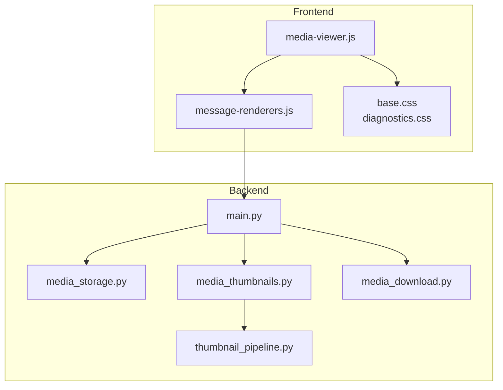
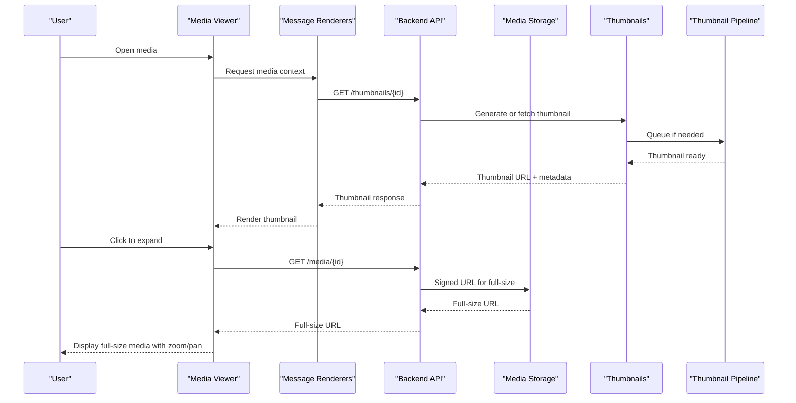
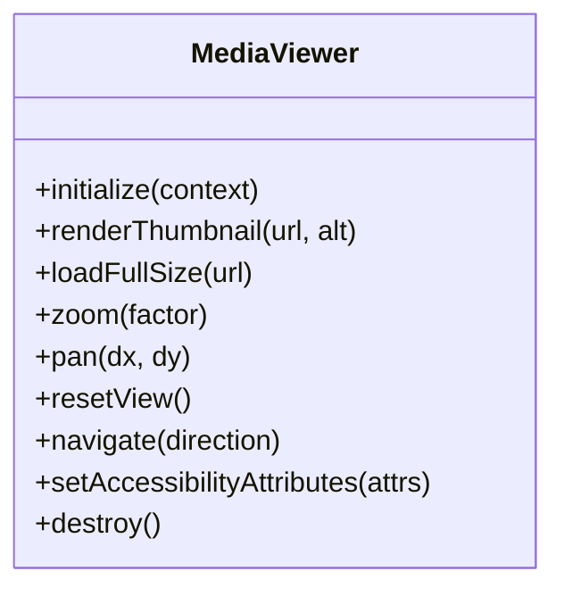
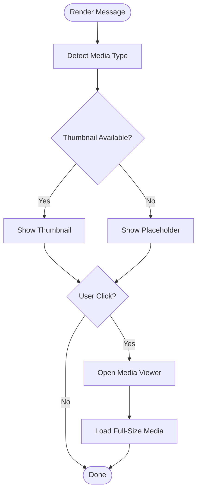
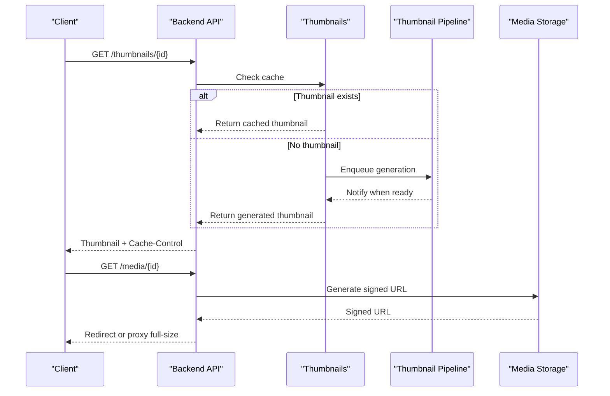
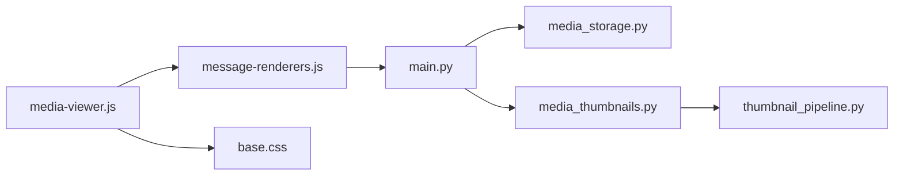

# Media Viewer Component

<cite>
**Referenced Files in This Document**
- [media-viewer.js](file://backend/app/web/static/console/media-viewer.js)
- [message-renderers.js](file://backend/app/web/static/console/message-renderers.js)
- [base.css](file://backend/app/web/static/base.css)
- [diagnostics.css](file://backend/app/web/static/diagnostics.css)
- [media_storage.py](file://backend/app/media_storage.py)
- [media_thumbnails.py](file://backend/app/media_thumbnails.py)
- [thumbnail_pipeline.py](file://backend/app/thumbnail_pipeline.py)
- [media_download.py](file://backend/app/media_download.py)
- [main.py](file://backend/app/main.py)
- [test_media_access_cache_control.py](file://backend/tests/test_media_access_cache_control.py)
- [test_rnd_207_thumbnail_frontend.py](file://backend/tests/test_rnd_207_thumbnail_frontend.py)
</cite>

## Table of Contents
1. [Introduction](#introduction)
2. [Project Structure](#project-structure)
3. [Core Components](#core-components)
4. [Architecture Overview](#architecture-overview)
5. [Detailed Component Analysis](#detailed-component-analysis)
6. [Dependency Analysis](#dependency-analysis)
7. [Performance Considerations](#performance-considerations)
8. [Troubleshooting Guide](#troubleshooting-guide)
9. [Conclusion](#conclusion)
10. [Appendices](#appendices)

## Introduction
This document explains the media viewer component that displays images, videos, and other media files within the application’s web interface. It covers how media is loaded, rendered, zoomed, and navigated; the loading strategies and caching mechanisms used to optimize performance; and guidance for extending support to new media types, implementing custom viewers, and handling large files. Accessibility features, keyboard shortcuts, and responsive design considerations are also documented.

## Project Structure
The media viewer spans both frontend JavaScript and backend services:
- Frontend: A dedicated media viewer module orchestrates rendering, user interactions (zoom, pan, navigation), and integrates with message renderers to display media inline or in a modal view.
- Backend: Media storage, thumbnails, and download pipelines provide optimized assets and signed URLs for secure access. Caching headers and thumbnail generation improve perceived performance.

**Diagram sources**
- [media-viewer.js](file://backend/app/web/static/console/media-viewer.js)
- [message-renderers.js](file://backend/app/web/static/console/message-renderers.js)
- [base.css](file://backend/app/web/static/base.css)
- [diagnostics.css](file://backend/app/web/static/diagnostics.css)
- [main.py](file://backend/app/main.py)
- [media_storage.py](file://backend/app/media_storage.py)
- [media_thumbnails.py](file://backend/app/media_thumbnails.py)
- [thumbnail_pipeline.py](file://backend/app/thumbnail_pipeline.py)
- [media_download.py](file://backend/app/media_download.py)

**Section sources**
- [media-viewer.js](file://backend/app/web/static/console/media-viewer.js)
- [message-renderers.js](file://backend/app/web/static/console/message-renderers.js)
- [base.css](file://backend/app/web/static/base.css)
- [diagnostics.css](file://backend/app/web/static/diagnostics.css)
- [main.py](file://backend/app/main.py)
- [media_storage.py](file://backend/app/media_storage.py)
- [media_thumbnails.py](file://backend/app/media_thumbnails.py)
- [thumbnail_pipeline.py](file://backend/app/thumbnail_pipeline.py)
- [media_download.py](file://backend/app/media_download.py)

## Core Components
- Media Viewer Module: Manages lifecycle of media instances, handles zoom/pan gestures, keyboard navigation, and accessibility attributes. Integrates with message renderers to embed media into conversation views.
- Message Renderers: Detect media types and choose appropriate rendering paths (inline preview vs. modal viewer). They request thumbnails when available and fall back to full-size assets.
- Backend Storage and Thumbnails: Provide secure access via signed URLs, generate thumbnails on demand or via pipeline, and set cache-control headers to optimize repeated loads.
- Download Pipeline: Handles background processing for large media, ensuring reliable ingestion and availability for serving.

Key responsibilities:
- Loading strategy: Prefer thumbnails first, then load full-size media on demand.
- Caching: Leverage browser cache via HTTP headers and reuse previously loaded resources.
- Performance: Lazy-load offscreen media, debounce resize events, and use efficient image formats where possible.
- Accessibility: Ensure proper ARIA roles, labels, focus management, and keyboard shortcuts.

**Section sources**
- [media-viewer.js](file://backend/app/web/static/console/media-viewer.js)
- [message-renderers.js](file://backend/app/web/static/console/message-renderers.js)
- [media_thumbnails.py](file://backend/app/media_thumbnails.py)
- [thumbnail_pipeline.py](file://backend/app/thumbnail_pipeline.py)
- [media_storage.py](file://backend/app/media_storage.py)
- [media_download.py](file://backend/app/media_download.py)

## Architecture Overview
The media viewer follows a layered architecture:
- Presentation Layer: The viewer UI renders thumbnails and full-size media, supports zoom/pan, and provides navigation controls.
- Interaction Layer: Captures user input (mouse, touch, keyboard) and updates viewer state accordingly.
- Data Layer: Requests thumbnails and full-size assets from backend endpoints, which return signed URLs and metadata.
- Processing Layer: Thumbnail generation and media download pipelines ensure optimal asset delivery.

**Diagram sources**
- [media-viewer.js](file://backend/app/web/static/console/media-viewer.js)
- [message-renderers.js](file://backend/app/web/static/console/message-renderers.js)
- [main.py](file://backend/app/main.py)
- [media_storage.py](file://backend/app/media_storage.py)
- [media_thumbnails.py](file://backend/app/media_thumbnails.py)
- [thumbnail_pipeline.py](file://backend/app/thumbnail_pipeline.py)

## Detailed Component Analysis

### Media Viewer Module
Responsibilities:
- Lifecycle management: Initialize, mount, and destroy media instances.
- Rendering: Switch between thumbnail and full-size views; handle errors gracefully.
- Zoom and Pan: Support pinch-to-zoom, mouse wheel, drag-to-pan, and touch gestures.
- Navigation: Keyboard shortcuts for next/previous media, zoom in/out, reset view, and close viewer.
- Accessibility: Manage focus, ARIA labels, and screen reader announcements.

Implementation patterns:
- Event delegation for efficient interaction handling.
- Debounced resize listeners to avoid layout thrashing.
- State machine for viewer modes (idle, loading, error, displayed).

**Diagram sources**
- [media-viewer.js](file://backend/app/web/static/console/media-viewer.js)

**Section sources**
- [media-viewer.js](file://backend/app/web/static/console/media-viewer.js)

### Message Renderers Integration
Responsibilities:
- Detect media type from message payload.
- Choose rendering path: inline thumbnail vs. modal viewer.
- Request thumbnails and attach fallbacks for unsupported types.

Integration points:
- Calls into media viewer to open modal and pass media metadata.
- Uses CSS classes for responsive layouts and styling.

**Diagram sources**
- [message-renderers.js](file://backend/app/web/static/console/message-renderers.js)
- [media-viewer.js](file://backend/app/web/static/console/media-viewer.js)

**Section sources**
- [message-renderers.js](file://backend/app/web/static/console/message-renderers.js)
- [media-viewer.js](file://backend/app/web/static/console/media-viewer.js)

### Backend Thumbnails and Storage
Responsibilities:
- Serve thumbnails via optimized endpoints with cache-control headers.
- Generate thumbnails on-demand or through background pipeline.
- Provide signed URLs for secure full-size media access.

Caching strategy:
- Browser cache enabled via Cache-Control headers.
- ETag or Last-Modified headers for conditional requests.

**Diagram sources**
- [media_thumbnails.py](file://backend/app/media_thumbnails.py)
- [thumbnail_pipeline.py](file://backend/app/thumbnail_pipeline.py)
- [media_storage.py](file://backend/app/media_storage.py)
- [main.py](file://backend/app/main.py)

**Section sources**
- [media_thumbnails.py](file://backend/app/media_thumbnails.py)
- [thumbnail_pipeline.py](file://backend/app/thumbnail_pipeline.py)
- [media_storage.py](file://backend/app/media_storage.py)
- [main.py](file://backend/app/main.py)

### Responsive Design and Styling
- CSS classes control layout, aspect ratios, and overflow behavior for different screen sizes.
- Diagnostics styles assist in debugging layout issues during development.

Best practices:
- Use fluid widths and max-height constraints to prevent overflow.
- Apply media queries for mobile-specific adjustments.
- Ensure touch targets meet accessibility guidelines.

**Section sources**
- [base.css](file://backend/app/web/static/base.css)
- [diagnostics.css](file://backend/app/web/static/diagnostics.css)

## Dependency Analysis
The media viewer depends on:
- Message renderers for context and triggering viewer actions.
- Backend APIs for thumbnails and full-size media.
- CSS for styling and responsive behavior.

**Diagram sources**
- [media-viewer.js](file://backend/app/web/static/console/media-viewer.js)
- [message-renderers.js](file://backend/app/web/static/console/message-renderers.js)
- [base.css](file://backend/app/web/static/base.css)
- [main.py](file://backend/app/main.py)
- [media_storage.py](file://backend/app/media_storage.py)
- [media_thumbnails.py](file://backend/app/media_thumbnails.py)
- [thumbnail_pipeline.py](file://backend/app/thumbnail_pipeline.py)

**Section sources**
- [media-viewer.js](file://backend/app/web/static/console/media-viewer.js)
- [message-renderers.js](file://backend/app/web/static/console/message-renderers.js)
- [base.css](file://backend/app/web/static/base.css)
- [main.py](file://backend/app/main.py)
- [media_storage.py](file://backend/app/media_storage.py)
- [media_thumbnails.py](file://backend/app/media_thumbnails.py)
- [thumbnail_pipeline.py](file://backend/app/thumbnail_pipeline.py)

## Performance Considerations
- Lazy loading: Defer loading full-size media until user explicitly requests it.
- Thumbnail-first strategy: Always show a lightweight thumbnail initially.
- Caching: Rely on browser cache and server-side ETags/Cache-Control headers.
- Debouncing: Throttle resize and scroll events to reduce reflows.
- Memory management: Destroy unused media instances and release references.

Testing insights:
- Cache-control behavior validated by tests to ensure efficient repeated loads.
- Thumbnail frontend integration verified to confirm correct rendering and fallbacks.

**Section sources**
- [test_media_access_cache_control.py](file://backend/tests/test_media_access_cache_control.py)
- [test_rnd_207_thumbnail_frontend.py](file://backend/tests/test_rnd_207_thumbnail_frontend.py)

## Troubleshooting Guide
Common issues and resolutions:
- Thumbnail not loading: Verify backend thumbnail endpoint and pipeline status. Check network tab for 4xx/5xx errors.
- Full-size media fails to load: Confirm signed URL validity and expiration. Inspect CORS policies if cross-origin.
- Zoom/pan unresponsive: Ensure event listeners are attached and not blocked by overlays.
- Accessibility problems: Validate ARIA attributes and keyboard navigation using screen readers.

Debugging tips:
- Use diagnostics CSS to highlight layout boundaries.
- Log viewer state transitions to identify failure points.
- Test on multiple devices and browsers for responsiveness.

**Section sources**
- [diagnostics.css](file://backend/app/web/static/diagnostics.css)
- [media-viewer.js](file://backend/app/web/static/console/media-viewer.js)

## Conclusion
The media viewer component provides a robust, accessible, and performant solution for displaying and interacting with media content. By leveraging thumbnails, caching, and responsive design, it ensures a smooth user experience across devices. Extending support for new media types involves integrating additional renderers and backend handlers while maintaining consistent accessibility and performance standards.

## Appendices

### Adding Support for New Media Types
Steps:
1. Extend message renderers to detect the new media type.
2. Implement a renderer that returns a thumbnail URL and fallback placeholder.
3. Update the media viewer to handle the new type’s zoom/pan behaviors if applicable.
4. Add backend endpoints for thumbnails and full-size media if needed.
5. Write tests to validate rendering and caching behavior.

### Implementing Custom Viewers
Approach:
- Create a custom viewer class that implements the same interface as the default viewer.
- Register the custom viewer with the message renderers for specific media types.
- Ensure keyboard shortcuts and accessibility attributes are supported.

### Handling Large Media Files
Strategies:
- Stream large files instead of loading entirely into memory.
- Use range requests for progressive loading.
- Provide low-resolution previews and allow users to opt-in for high-resolution versions.
- Monitor memory usage and implement cleanup routines.