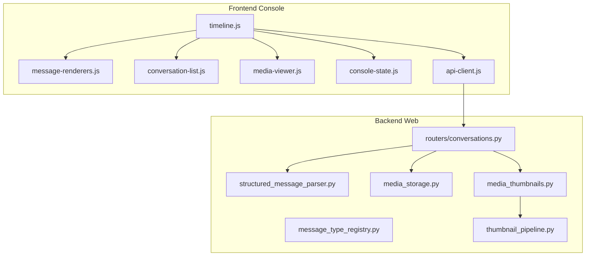
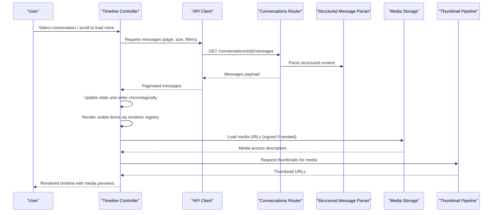
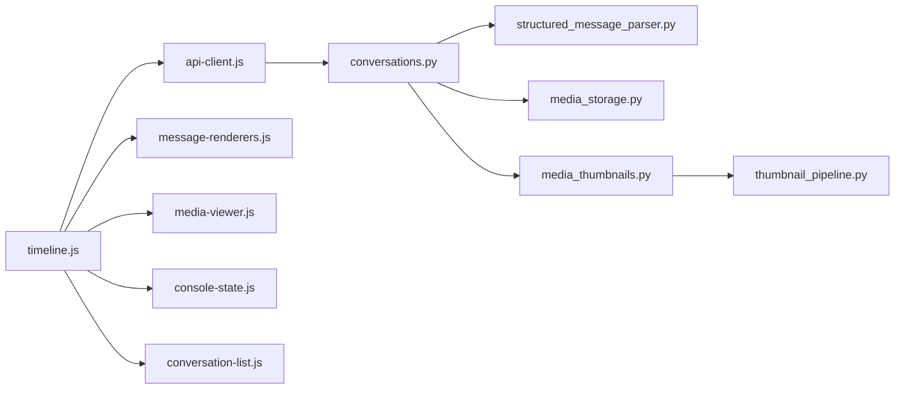

# Message Timeline Interface

<cite>
**Referenced Files in This Document**
- [timeline.js](file://backend/app/web/static/console/timeline.js)
- [message-renderers.js](file://backend/app/web/static/console/message-renderers.js)
- [messages.html](file://backend/app/web/templates/messages.html)
- [conversation-list.js](file://backend/app/web/static/console/conversation-list.js)
- [media-viewer.js](file://backend/app/web/static/console/media-viewer.js)
- [console-state.js](file://backend/app/web/static/console/console-state.js)
- [api-client.js](file://backend/app/web/static/console/api-client.js)
- [structured_message_parser.py](file://backend/app/structured_message_parser.py)
- [message_type_registry.py](file://backend/app/message_type_registry.py)
- [media_storage.py](file://backend/app/media_storage.py)
- [media_thumbnails.py](file://backend/app/media_thumbnails.py)
- [thumbnail_pipeline.py](file://backend/app/thumbnail_pipeline.py)
- [conversations.py](file://backend/app/routers/conversations.py)
</cite>

## Table of Contents
1. [Introduction](#introduction)
2. [Project Structure](#project-structure)
3. [Core Components](#core-components)
4. [Architecture Overview](#architecture-overview)
5. [Detailed Component Analysis](#detailed-component-analysis)
6. [Dependency Analysis](#dependency-analysis)
7. [Performance Considerations](#performance-considerations)
8. [Troubleshooting Guide](#troubleshooting-guide)
9. [Conclusion](#conclusion)
10. [Appendices](#appendices)

## Introduction
This document explains the message timeline interface used to display conversation messages chronologically, with support for multiple message types and media. It covers how messages are rendered by a pluggable renderer system, how users navigate and select messages, and how interactions (actions) are handled. It also documents custom message type support, media handling, and performance strategies for large histories.

## Project Structure
The timeline is implemented primarily on the frontend using JavaScript modules under the console assets, backed by server-side routers and utilities for structured message parsing, media storage, and thumbnails.

**Diagram sources**
- [timeline.js](file://backend/app/web/static/console/timeline.js)
- [message-renderers.js](file://backend/app/web/static/console/message-renderers.js)
- [conversation-list.js](file://backend/app/web/static/console/conversation-list.js)
- [media-viewer.js](file://backend/app/web/static/console/media-viewer.js)
- [console-state.js](file://backend/app/web/static/console/console-state.js)
- [api-client.js](file://backend/app/web/static/console/api-client.js)
- [conversations.py](file://backend/app/routers/conversations.py)
- [structured_message_parser.py](file://backend/app/structured_message_parser.py)
- [message_type_registry.py](file://backend/app/message_type_registry.py)
- [media_storage.py](file://backend/app/media_storage.py)
- [media_thumbnails.py](file://backend/app/media_thumbnails.py)
- [thumbnail_pipeline.py](file://backend/app/thumbnail_pipeline.py)

**Section sources**
- [timeline.js](file://backend/app/web/static/console/timeline.js)
- [message-renderers.js](file://backend/app/web/static/console/message-renderers.js)
- [messages.html](file://backend/app/web/templates/messages.html)
- [conversation-list.js](file://backend/app/web/static/console/conversation-list.js)
- [media-viewer.js](file://backend/app/web/static/console/media-viewer.js)
- [console-state.js](file://backend/app/web/static/console/console-state.js)
- [api-client.js](file://backend/app/web/static/console/api-client.js)
- [conversations.py](file://backend/app/routers/conversations.py)
- [structured_message_parser.py](file://backend/app/structured_message_parser.py)
- [message_type_registry.py](file://backend/app/message_type_registry.py)
- [media_storage.py](file://backend/app/media_storage.py)
- [media_thumbnails.py](file://backend/app/media_thumbnails.py)
- [thumbnail_pipeline.py](file://backend/app/thumbnail_pipeline.py)

## Core Components
- Timeline controller: orchestrates loading, rendering, navigation, selection, and actions for messages.
- Renderer registry: maps message types to renderers that produce DOM nodes or HTML fragments.
- Media viewer: handles preview and playback of images, videos, and other media attachments.
- Conversation list integration: selects conversations and triggers timeline updates.
- State management: holds current conversation, page state, filters, and selection.
- API client: fetches paginated messages and metadata from backend endpoints.

Key responsibilities:
- Chronological ordering and pagination of messages.
- Rendering different message types via specialized renderers.
- Handling user interactions such as selecting, expanding, and invoking actions.
- Loading and displaying media with thumbnails and lazy loading.

**Section sources**
- [timeline.js](file://backend/app/web/static/console/timeline.js)
- [message-renderers.js](file://backend/app/web/static/console/message-renderers.js)
- [media-viewer.js](file://backend/app/web/static/console/media-viewer.js)
- [conversation-list.js](file://backend/app/web/static/console/conversation-list.js)
- [console-state.js](file://backend/app/web/static/console/console-state.js)
- [api-client.js](file://backend/app/web/static/console/api-client.js)

## Architecture Overview
The timeline follows a modular architecture where the controller coordinates data fetching, state updates, and rendering through a registry of message-type-specific renderers. Media is served via optimized endpoints with thumbnail generation and caching.

**Diagram sources**
- [timeline.js](file://backend/app/web/static/console/timeline.js)
- [api-client.js](file://backend/app/web/static/console/api-client.js)
- [conversations.py](file://backend/app/routers/conversations.py)
- [structured_message_parser.py](file://backend/app/structured_message_parser.py)
- [media_storage.py](file://backend/app/media_storage.py)
- [media_thumbnails.py](file://backend/app/media_thumbnails.py)
- [thumbnail_pipeline.py](file://backend/app/thumbnail_pipeline.py)

## Detailed Component Analysis

### Timeline Controller
Responsibilities:
- Initialize timeline for a selected conversation.
- Fetch and paginate messages chronologically.
- Maintain selection state and focus behavior.
- Dispatch rendering tasks to the renderer registry.
- Handle user interactions like scrolling, keyboard navigation, and action invocations.

Interaction patterns:
- Infinite scroll or explicit “load more” triggers additional pages.
- Selection highlights the active message and may open details or actions.
- Keyboard shortcuts for navigating between messages and triggering actions.

**Section sources**
- [timeline.js](file://backend/app/web/static/console/timeline.js)
- [console-state.js](file://backend/app/web/static/console/console-state.js)
- [api-client.js](file://backend/app/web/static/console/api-client.js)

### Message Renderer Registry
Design:
- A registry maps message type identifiers to renderer functions.
- Each renderer receives normalized message data and returns a DOM node or HTML fragment.
- Default renderers cover common types; custom types can be registered at runtime.

Custom message type support:
- Register a new renderer by associating a type string with a renderer function.
- Ensure the renderer handles all expected fields and gracefully degrades for unknown fields.
- Use consistent styling and accessibility attributes across renderers.

Example pattern:
- Define a renderer function that inspects message fields and constructs appropriate UI elements.
- Register it with the registry before rendering begins.

**Section sources**
- [message-renderers.js](file://backend/app/web/static/console/message-renderers.js)

### Media Handling and Viewer
Capabilities:
- Detects media types from message payloads.
- Resolves secure URLs for media access.
- Generates and caches thumbnails for faster previews.
- Provides a viewer modal for full-size images or video playback.

Flow:
- Timeline requests media URLs and thumbnails when rendering a message.
- Media viewer opens on user interaction (click), supporting zoom, play/pause, and download.

**Section sources**
- [media-viewer.js](file://backend/app/web/static/console/media-viewer.js)
- [media_storage.py](file://backend/app/media_storage.py)
- [media_thumbnails.py](file://backend/app/media_thumbnails.py)
- [thumbnail_pipeline.py](file://backend/app/thumbnail_pipeline.py)

### Conversation List Integration
Integration points:
- Selecting a conversation triggers timeline initialization and first page load.
- Filters applied in the conversation list propagate to timeline queries.
- Real-time updates refresh the timeline when new messages arrive.

**Section sources**
- [conversation-list.js](file://backend/app/web/static/console/conversation-list.js)
- [timeline.js](file://backend/app/web/static/console/timeline.js)

### Backend Support for Structured Messages
Parsing and typing:
- The structured message parser normalizes incoming message content into a consistent schema.
- The message type registry on the backend categorizes messages for routing and processing.

**Section sources**
- [structured_message_parser.py](file://backend/app/structured_message_parser.py)
- [message_type_registry.py](file://backend/app/message_type_registry.py)

### Template Entry Point
The messages template wires the console scripts and provides the container for the timeline UI.

**Section sources**
- [messages.html](file://backend/app/web/templates/messages.html)

## Dependency Analysis
The timeline depends on several modules for data, rendering, and media. The following diagram shows key dependencies and their relationships.

**Diagram sources**
- [timeline.js](file://backend/app/web/static/console/timeline.js)
- [api-client.js](file://backend/app/web/static/console/api-client.js)
- [message-renderers.js](file://backend/app/web/static/console/message-renderers.js)
- [media-viewer.js](file://backend/app/web/static/console/media-viewer.js)
- [console-state.js](file://backend/app/web/static/console/console-state.js)
- [conversation-list.js](file://backend/app/web/static/console/conversation-list.js)
- [conversations.py](file://backend/app/routers/conversations.py)
- [structured_message_parser.py](file://backend/app/structured_message_parser.py)
- [media_storage.py](file://backend/app/media_storage.py)
- [media_thumbnails.py](file://backend/app/media_thumbnails.py)
- [thumbnail_pipeline.py](file://backend/app/thumbnail_pipeline.py)

**Section sources**
- [timeline.js](file://backend/app/web/static/console/timeline.js)
- [api-client.js](file://backend/app/web/static/console/api-client.js)
- [message-renderers.js](file://backend/app/web/static/console/message-renderers.js)
- [media-viewer.js](file://backend/app/web/static/console/media-viewer.js)
- [console-state.js](file://backend/app/web/static/console/console-state.js)
- [conversation-list.js](file://backend/app/web/static/console/conversation-list.js)
- [conversations.py](file://backend/app/routers/conversations.py)
- [structured_message_parser.py](file://backend/app/structured_message_parser.py)
- [media_storage.py](file://backend/app/media_storage.py)
- [media_thumbnails.py](file://backend/app/media_thumbnails.py)
- [thumbnail_pipeline.py](file://backend/app/thumbnail_pipeline.py)

## Performance Considerations
Strategies for large message histories:
- Virtualization: Render only visible messages within the viewport to reduce DOM size.
- Lazy loading: Defer heavy operations (e.g., media decoding) until the element enters view.
- Pagination: Fetch messages in chunks and append incrementally.
- Debounce scroll events: Avoid excessive re-renders during rapid scrolling.
- Image optimization: Use thumbnails and responsive image sizes; cache aggressively.
- Memoization: Cache computed renderer outputs for identical message payloads.
- Background prefetch: Preload next page data while the user reads current content.
- Efficient selection: Track selection indices rather than full objects to minimize memory usage.

[No sources needed since this section provides general guidance]

## Troubleshooting Guide
Common issues and resolutions:
- Missing renderers: If a message type does not render, ensure the renderer is registered before timeline initialization.
- Media failures: Verify signed URL generation and storage permissions; check thumbnail pipeline status.
- Slow loading: Inspect pagination size and network latency; consider reducing page size or enabling prefetch.
- Incorrect ordering: Confirm chronological sorting keys and timezone handling in both frontend and backend.
- Selection glitches: Validate state synchronization between timeline and conversation list.

**Section sources**
- [timeline.js](file://backend/app/web/static/console/timeline.js)
- [message-renderers.js](file://backend/app/web/static/console/message-renderers.js)
- [media-viewer.js](file://backend/app/web/static/console/media-viewer.js)
- [media_storage.py](file://backend/app/media_storage.py)
- [media_thumbnails.py](file://backend/app/media_thumbnails.py)
- [thumbnail_pipeline.py](file://backend/app/thumbnail_pipeline.py)

## Conclusion
The message timeline interface combines a flexible renderer registry, robust media handling, and efficient pagination to deliver a smooth chronological browsing experience. By adhering to the patterns outlined here—registering custom renderers, optimizing media delivery, and applying virtualization—you can extend and scale the timeline effectively.

[No sources needed since this section summarizes without analyzing specific files]

## Appendices

### Creating Custom Message Renderers
Steps:
- Implement a renderer function that accepts normalized message data and returns a DOM node or HTML fragment.
- Register the renderer with the registry using the message type identifier.
- Ensure consistent styling and accessibility attributes.
- Test with sample payloads covering edge cases.

**Section sources**
- [message-renderers.js](file://backend/app/web/static/console/message-renderers.js)

### Implementing Message Actions
Patterns:
- Attach event handlers to interactive elements within rendered messages.
- Use the timeline’s action dispatcher to trigger backend operations or UI changes.
- Provide feedback (loading states, success/error notifications).

**Section sources**
- [timeline.js](file://backend/app/web/static/console/timeline.js)

### Optimizing Timeline Performance
Recommendations:
- Enable virtualization for long lists.
- Limit initial render to visible area plus small buffer.
- Use requestAnimationFrame for smooth updates.
- Cache renderer outputs keyed by message ID.
- Monitor memory usage and garbage collection pauses.

[No sources needed since this section provides general guidance]