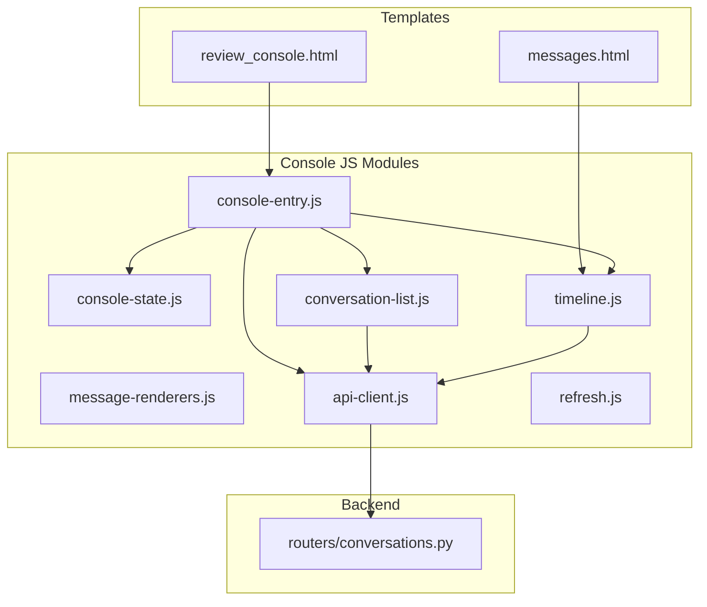
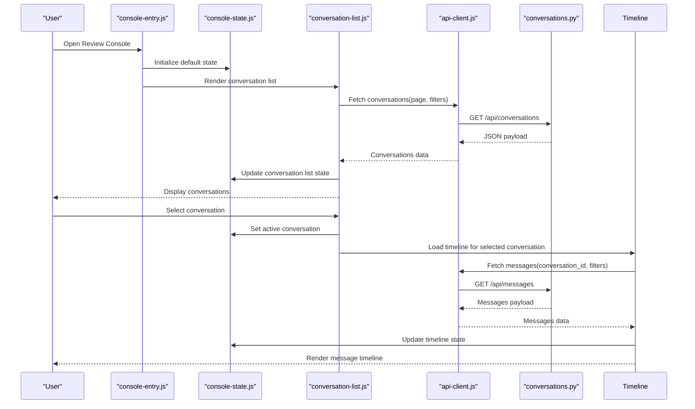
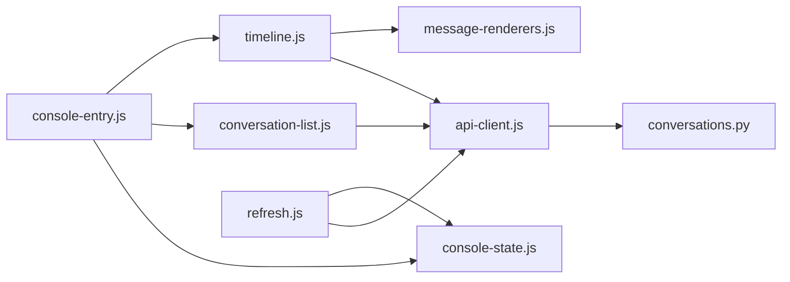

# Review Console Interface

<cite>
**Referenced Files in This Document**
- [review_console.html](file://backend/app/web/templates/review_console.html)
- [console-entry.js](file://backend/app/web/static/console/console-entry.js)
- [console-state.js](file://backend/app/web/static/console/console-state.js)
- [conversation-list.js](file://backend/app/web/static/console/conversation-list.js)
- [timeline.js](file://backend/app/web/static/console/timeline.js)
- [message-renderers.js](file://backend/app/web/static/console/message-renderers.js)
- [api-client.js](file://backend/app/web/static/console/api-client.js)
- [refresh.js](file://backend/app/web/static/console/refresh.js)
- [messages.html](file://backend/app/web/templates/messages.html)
- [conversations.py](file://backend/app/routers/conversations.py)
</cite>

## Table of Contents
1. [Introduction](#introduction)
2. [Project Structure](#project-structure)
3. [Core Components](#core-components)
4. [Architecture Overview](#architecture-overview)
5. [Detailed Component Analysis](#detailed-component-analysis)
6. [Dependency Analysis](#dependency-analysis)
7. [Performance Considerations](#performance-considerations)
8. [Troubleshooting Guide](#troubleshooting-guide)
9. [Conclusion](#conclusion)

## Introduction
This document provides comprehensive documentation for the Review Console interface, focusing on the main console entry point, state management architecture, and conversation list functionality. It explains how users navigate through conversations, filter messages, and interact with the message timeline. It also covers client-side state management patterns, data binding mechanisms, real-time updates, customization options, and performance considerations for large datasets.

## Project Structure
The Review Console is a client-side application served by the backend web layer. The primary HTML template renders the console shell, while JavaScript modules handle state, UI rendering, API interactions, and real-time refresh behavior.

**Diagram sources**
- [review_console.html](file://backend/app/web/templates/review_console.html)
- [console-entry.js](file://backend/app/web/static/console/console-entry.js)
- [console-state.js](file://backend/app/web/static/console/console-state.js)
- [conversation-list.js](file://backend/app/web/static/console/conversation-list.js)
- [timeline.js](file://backend/app/web/static/console/timeline.js)
- [message-renderers.js](file://backend/app/web/static/console/message-renderers.js)
- [api-client.js](file://backend/app/web/static/console/api-client.js)
- [refresh.js](file://backend/app/web/static/console/refresh.js)
- [conversations.py](file://backend/app/routers/conversations.py)

**Section sources**
- [review_console.html](file://backend/app/web/templates/review_console.html)
- [console-entry.js](file://backend/app/web/static/console/console-entry.js)
- [messages.html](file://backend/app/web/templates/messages.html)

## Core Components
- Main console entry point: Initializes the console shell, wires up navigation, and bootstraps state and modules.
- State management: Centralized store for current conversation, filters, pagination, and UI flags; exposes reactive updates to consumers.
- Conversation list: Renders paginated conversations, supports selection and search/filtering, and coordinates with the API client.
- Message timeline: Displays messages within a selected conversation, supports filtering, virtualization (if implemented), and media handling.
- API client: Encapsulates HTTP requests to backend endpoints for conversations and messages.
- Real-time refresh: Periodic or event-driven polling to keep the UI consistent with server state.

Key responsibilities and interactions are detailed in subsequent sections.

**Section sources**
- [console-entry.js](file://backend/app/web/static/console/console-entry.js)
- [console-state.js](file://backend/app/web/static/console/console-state.js)
- [conversation-list.js](file://backend/app/web/static/console/conversation-list.js)
- [timeline.js](file://backend/app/web/static/console/timeline.js)
- [api-client.js](file://backend/app/web/static/console/api-client.js)
- [refresh.js](file://backend/app/web/static/console/refresh.js)

## Architecture Overview
The console follows a modular client-side architecture:
- A single-page entry initializes modules and binds events.
- A centralized state object holds UI and data state, emitting updates when mutated.
- UI modules subscribe to state changes and re-render relevant parts.
- An API client abstracts network calls to backend routers.
- A refresh mechanism periodically syncs data or reacts to events.

**Diagram sources**
- [console-entry.js](file://backend/app/web/static/console/console-entry.js)
- [console-state.js](file://backend/app/web/static/console/console-state.js)
- [conversation-list.js](file://backend/app/web/static/console/conversation-list.js)
- [timeline.js](file://backend/app/web/static/console/timeline.js)
- [api-client.js](file://backend/app/web/static/console/api-client.js)
- [conversations.py](file://backend/app/routers/conversations.py)

## Detailed Component Analysis

### Main Console Entry Point
- Bootstraps the console shell and initializes global state.
- Wires up navigation between conversation list and message timeline views.
- Sets up event listeners for user actions (e.g., selecting a conversation, applying filters).
- Integrates refresh logic to keep UI synchronized with server data.

Implementation highlights:
- Module initialization order ensures dependencies are available before use.
- Event delegation minimizes overhead for dynamic lists.
- Error boundaries prevent partial failures from breaking the entire UI.

**Section sources**
- [console-entry.js](file://backend/app/web/static/console/console-entry.js)

### State Management Architecture
Centralized state encapsulates:
- Active conversation identifier and metadata.
- Conversation list data and pagination info.
- Message timeline data, including filters and sorting.
- UI flags such as loading states, error messages, and visibility toggles.

Patterns:
- Immutable updates: State mutations produce new objects to trigger re-renders efficiently.
- Subscribers: UI components subscribe to state slices and update only affected DOM regions.
- Throttled updates: Debounce rapid changes (e.g., typing in search) to reduce re-renders.

Data binding:
- One-way data flow from state to UI; user actions mutate state via actions.
- Reactive bindings ensure minimal DOM churn and consistent rendering.

Real-time updates:
- Polling intervals or event-driven hooks refresh state slices without full page reloads.
- Conflict resolution strategies avoid overwriting newer data with stale responses.

**Section sources**
- [console-state.js](file://backend/app/web/static/console/console-state.js)

### Conversation List Functionality
Responsibilities:
- Fetches and displays a paginated list of conversations.
- Supports search and filtering by attributes like participants, date ranges, or keywords.
- Handles selection transitions to the message timeline view.
- Manages loading indicators and error states.

User interactions:
- Click to select a conversation and load its timeline.
- Type to filter results; debounced input reduces API calls.
- Pagination controls to navigate through pages.

Customization:
- Pluggable renderers allow customizing conversation item display (e.g., adding badges or labels).
- Filter pipelines can be extended with new criteria and validators.

**Section sources**
- [conversation-list.js](file://backend/app/web/static/console/conversation-list.js)
- [api-client.js](file://backend/app/web/static/console/api-client.js)

### Message Timeline Interaction
Responsibilities:
- Loads messages for the selected conversation with optional filters and sorting.
- Renders message bubbles with support for various content types via renderers.
- Provides navigation within the timeline (e.g., jump to first/last, scroll to specific ID).
- Handles media assets and thumbnails where applicable.

Filtering and search:
- Filters by message type, sender, timestamp range, and keyword search.
- Combines multiple filters with logical operators.

Real-time updates:
- Auto-refresh at configurable intervals to show new messages.
- Incremental updates append new items without reloading the entire timeline.

**Section sources**
- [timeline.js](file://backend/app/web/static/console/timeline.js)
- [message-renderers.js](file://backend/app/web/static/console/message-renderers.js)
- [messages.html](file://backend/app/web/templates/messages.html)

### API Client and Backend Integration
Responsibilities:
- Encapsulates HTTP requests for conversations and messages.
- Handles authentication headers, error responses, and retries.
- Normalizes payloads into a consistent shape for state consumption.

Integration points:
- Endpoints for listing conversations and fetching messages.
- Query parameters for pagination, filtering, and sorting.

Error handling:
- Network errors surface as user-friendly messages.
- Retry logic with exponential backoff for transient failures.

**Section sources**
- [api-client.js](file://backend/app/web/static/console/api-client.js)
- [conversations.py](file://backend/app/routers/conversations.py)

### Real-Time Refresh Mechanism
Responsibilities:
- Periodically polls for updates to conversations and timelines.
- Supports manual refresh triggers.
- Optimizes refresh by targeting only changed resources.

Configuration:
- Adjustable intervals and conditions (e.g., pause during inactive tabs).
- Backoff strategies to avoid overwhelming the server.

**Section sources**
- [refresh.js](file://backend/app/web/static/console/refresh.js)

## Dependency Analysis
Module relationships and coupling:
- Entry depends on state, conversation list, timeline, and API client.
- Conversation list and timeline depend on state and API client.
- Renderers are consumed by timeline for message display.
- Refresh module interacts with API client and state to update data.

Potential circular dependencies:
- Avoided by keeping modules focused and using explicit subscriptions to state slices.

External dependencies:
- Backend routers provide REST endpoints for data retrieval.
- Browser APIs used for timers, storage, and DOM manipulation.

**Diagram sources**
- [console-entry.js](file://backend/app/web/static/console/console-entry.js)
- [console-state.js](file://backend/app/web/static/console/console-state.js)
- [conversation-list.js](file://backend/app/web/static/console/conversation-list.js)
- [timeline.js](file://backend/app/web/static/console/timeline.js)
- [message-renderers.js](file://backend/app/web/static/console/message-renderers.js)
- [api-client.js](file://backend/app/web/static/console/api-client.js)
- [refresh.js](file://backend/app/web/static/console/refresh.js)
- [conversations.py](file://backend/app/routers/conversations.py)

**Section sources**
- [console-entry.js](file://backend/app/web/static/console/console-entry.js)
- [api-client.js](file://backend/app/web/static/console/api-client.js)
- [conversations.py](file://backend/app/routers/conversations.py)

## Performance Considerations
Optimization techniques:
- Virtualization for large conversation lists and timelines to limit DOM nodes.
- Debouncing and throttling for search inputs and frequent state updates.
- Pagination and lazy loading to reduce initial payload sizes.
- Caching of frequently accessed resources in memory or browser storage.
- Efficient diffing and selective re-renders based on state changes.

Memory optimization:
- Clear references to removed items to aid garbage collection.
- Limit history size for timelines to prevent unbounded growth.
- Use lightweight data structures for filters and indices.

Network efficiency:
- Batch requests where possible.
- Implement conditional requests and ETags to minimize bandwidth.
- Pause background refreshes when the tab is inactive.

[No sources needed since this section provides general guidance]

## Troubleshooting Guide
Common issues and resolutions:
- API errors: Inspect network tab for status codes and response bodies; verify authentication headers.
- Stale data: Check refresh intervals and ensure no conflicting updates overwrite newer data.
- Rendering glitches: Validate state consistency and ensure subscribers are correctly bound.
- Memory leaks: Monitor heap snapshots and clear unused references after navigation.

Debugging utilities:
- Logging levels to capture critical events without excessive noise.
- Diagnostic endpoints to inspect server state and logs.

**Section sources**
- [api-client.js](file://backend/app/web/static/console/api-client.js)
- [refresh.js](file://backend/app/web/static/console/refresh.js)

## Conclusion
The Review Console interface is built with a modular, state-driven architecture that separates concerns across entry initialization, centralized state, UI modules, and API integration. By leveraging reactive state updates, efficient rendering, and robust error handling, it delivers a responsive experience even with large datasets. Customization points enable flexible display and filtering behaviors, while performance strategies ensure scalability and reliability.

[No sources needed since this section summarizes without analyzing specific files]