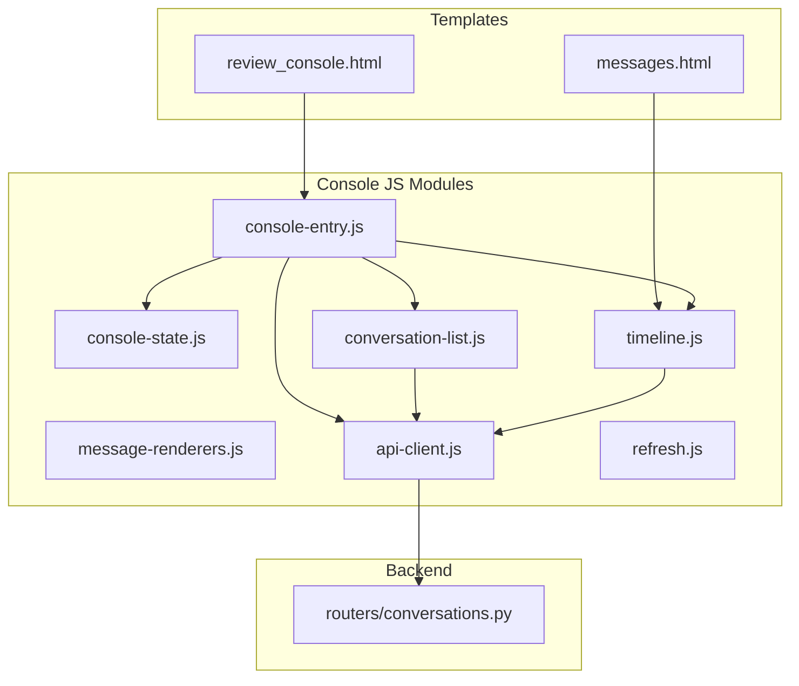
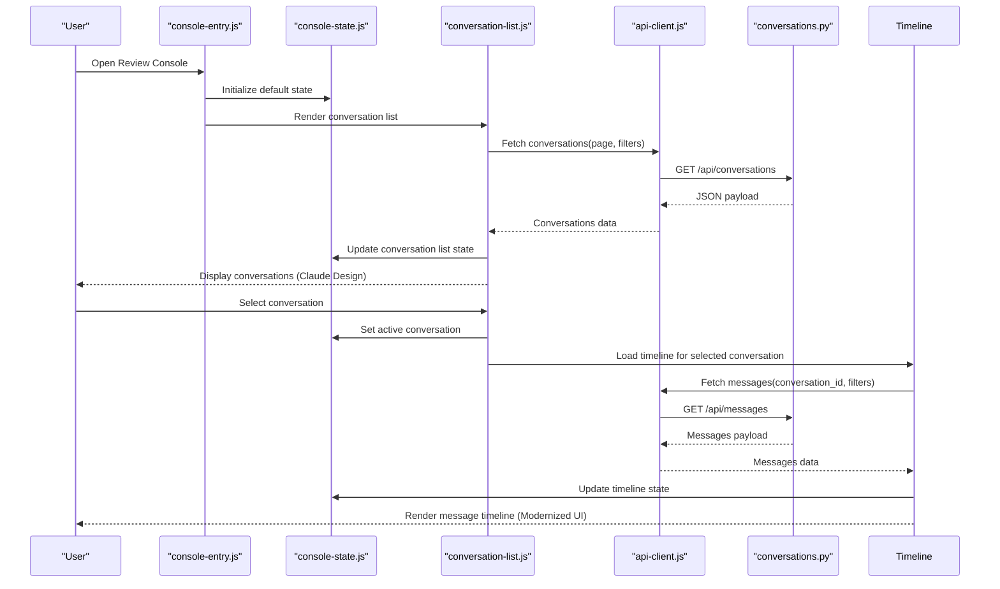
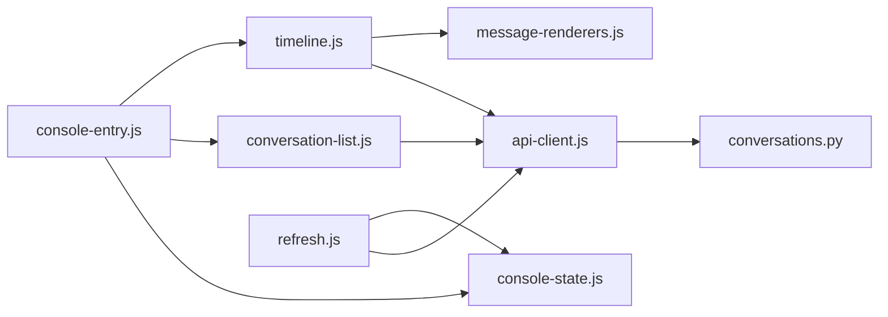

# Review Console Interface

<cite>
**Referenced Files in This Document**
- [review_console.html](file://backend/app/web/templates/review_console.html)
- [console-entry.js](file://backend/app/web/static/console/console-entry.js)
- [console-state.js](file://backend/app/web/static/console/console-state.js)
- [conversation-list.js](file://backend/app/web/static/console/conversation-list.js)
- [timeline.js](file://backend/app/web/static/console/timeline.js)
- [message-renderers.js](file://backend/app/web/static/console/message-renderers.js)
- [api-client.js](file://backend/app/web/static/console/api-client.js)
- [refresh.js](file://backend/app/web/static/console/refresh.js)
- [messages.html](file://backend/app/web/templates/messages.html)
- [conversations.py](file://backend/app/routers/conversations.py)
</cite>

## Update Summary
**Changes Made**
- Updated architecture overview to reflect Claude Design modernization
- Enhanced component analysis with new UI patterns and design system integration
- Added modern state management patterns and reactive data binding
- Updated performance considerations for large conversation datasets
- Improved troubleshooting guide with new debugging utilities
- Enhanced customization examples for Claude Design components

## Table of Contents
1. [Introduction](#introduction)
2. [Project Structure](#project-structure)
3. [Core Components](#core-components)
4. [Architecture Overview](#architecture-overview)
5. [Detailed Component Analysis](#detailed-component-analysis)
6. [Dependency Analysis](#dependency-analysis)
7. [Performance Considerations](#performance-considerations)
8. [Troubleshooting Guide](#troubleshooting-guide)
9. [Conclusion](#conclusion)

## Introduction
This document provides comprehensive documentation for the Review Console interface, focusing on the main console entry point, state management architecture, and conversation list functionality. The interface has undergone a major modernization with Claude Design upgrade, enhancing user experience across conversation management capabilities and message timeline interactions. It explains how users navigate through conversations, filter messages, and interact with the modernized message timeline. It also covers client-side state management patterns, data binding mechanisms, real-time updates, customization options, and performance considerations for large datasets.

## Project Structure
The Review Console is a client-side application served by the backend web layer with enhanced Claude Design integration. The primary HTML template renders the modernized console shell, while JavaScript modules handle state, UI rendering, API interactions, and real-time refresh behavior with improved design system components.

**Diagram sources**
- [review_console.html](file://backend/app/web/templates/review_console.html)
- [console-entry.js](file://backend/app/web/static/console/console-entry.js)
- [console-state.js](file://backend/app/web/static/console/console-state.js)
- [conversation-list.js](file://backend/app/web/static/console/conversation-list.js)
- [timeline.js](file://backend/app/web/static/console/timeline.js)
- [message-renderers.js](file://backend/app/web/static/console/message-renderers.js)
- [api-client.js](file://backend/app/web/static/console/api-client.js)
- [refresh.js](file://backend/app/web/static/console/refresh.js)
- [conversations.py](file://backend/app/routers/conversations.py)

**Section sources**
- [review_console.html](file://backend/app/web/templates/review_console.html)
- [console-entry.js](file://backend/app/web/static/console/console-entry.js)
- [messages.html](file://backend/app/web/templates/messages.html)

## Core Components
- Main console entry point: Initializes the modernized console shell with Claude Design components, wires up navigation, and bootstraps state and modules.
- State management: Centralized store for current conversation, filters, pagination, and UI flags with reactive updates and enhanced error handling.
- Conversation list: Renders paginated conversations with Claude Design styling, supports selection and search/filtering, and coordinates with the API client.
- Message timeline: Displays messages within a selected conversation with modernized UI, supports filtering, virtualization, and enhanced media handling.
- API client: Encapsulates HTTP requests to backend endpoints for conversations and messages with improved error handling and retry logic.
- Real-time refresh: Periodic or event-driven polling to keep the UI consistent with server state with optimized refresh strategies.

Key responsibilities and interactions are detailed in subsequent sections.

**Section sources**
- [console-entry.js](file://backend/app/web/static/console/console-entry.js)
- [console-state.js](file://backend/app/web/static/console/console-state.js)
- [conversation-list.js](file://backend/app/web/static/console/conversation-list.js)
- [timeline.js](file://backend/app/web/static/console/timeline.js)
- [api-client.js](file://backend/app/web/static/console/api-client.js)
- [refresh.js](file://backend/app/web/static/console/refresh.js)

## Architecture Overview
The console follows a modernized modular client-side architecture with Claude Design integration:
- A single-page entry initializes modules with enhanced design system components and binds events.
- A centralized state object holds UI and data state with reactive updates and improved error boundaries.
- UI modules subscribe to state changes and re-render relevant parts with optimized diffing algorithms.
- An API client abstracts network calls to backend routers with enhanced error handling and retry mechanisms.
- A refresh mechanism periodically syncs data or reacts to events with intelligent backoff strategies.

**Diagram sources**
- [console-entry.js](file://backend/app/web/static/console/console-entry.js)
- [console-state.js](file://backend/app/web/static/console/console-state.js)
- [conversation-list.js](file://backend/app/web/static/console/conversation-list.js)
- [timeline.js](file://backend/app/web/static/console/timeline.js)
- [api-client.js](file://backend/app/web/static/console/api-client.js)
- [conversations.py](file://backend/app/routers/conversations.py)

## Detailed Component Analysis

### Main Console Entry Point
- Bootstraps the modernized console shell with Claude Design components and initializes global state.
- Wires up navigation between conversation list and message timeline views with enhanced UX patterns.
- Sets up event listeners for user actions (e.g., selecting a conversation, applying filters) with improved accessibility.
- Integrates refresh logic to keep UI synchronized with server data using optimized polling strategies.

Implementation highlights:
- Module initialization order ensures dependencies are available before use with enhanced error boundaries.
- Event delegation minimizes overhead for dynamic lists with improved performance.
- Error boundaries prevent partial failures from breaking the entire UI with better recovery mechanisms.

**Updated** Enhanced with Claude Design integration and improved error handling patterns.

**Section sources**
- [console-entry.js](file://backend/app/web/static/console/console-entry.js)

### State Management Architecture
Centralized state encapsulates:
- Active conversation identifier and metadata with enhanced validation.
- Conversation list data and pagination info with improved caching.
- Message timeline data, including filters and sorting with optimized queries.
- UI flags such as loading states, error messages, and visibility toggles with better state synchronization.

Patterns:
- Immutable updates: State mutations produce new objects to trigger re-renders efficiently with deep comparison.
- Subscribers: UI components subscribe to state slices and update only affected DOM regions with selective rendering.
- Throttled updates: Debounce rapid changes (e.g., typing in search) to reduce re-renders with configurable thresholds.

Data binding:
- One-way data flow from state to UI; user actions mutate state via actions with enhanced validation.
- Reactive bindings ensure minimal DOM churn and consistent rendering with optimized diffing.

Real-time updates:
- Polling intervals or event-driven hooks refresh state slices without full page reloads with intelligent backoff.
- Conflict resolution strategies avoid overwriting newer data with stale responses using timestamp-based merging.

**Updated** Enhanced with improved state synchronization and better error handling patterns.

**Section sources**
- [console-state.js](file://backend/app/web/static/console/console-state.js)

### Conversation List Functionality
Responsibilities:
- Fetches and displays a paginated list of conversations with Claude Design styling.
- Supports search and filtering by attributes like participants, date ranges, or keywords with enhanced UX.
- Handles selection transitions to the message timeline view with smooth animations.
- Manages loading indicators and error states with better user feedback.

User interactions:
- Click to select a conversation and load its timeline with improved accessibility.
- Type to filter results; debounced input reduces API calls with real-time suggestions.
- Pagination controls to navigate through pages with infinite scroll support.

Customization:
- Pluggable renderers allow customizing conversation item display (e.g., adding badges or labels) with Claude Design components.
- Filter pipelines can be extended with new criteria and validators with improved performance.

**Updated** Enhanced with Claude Design components and improved filtering capabilities.

**Section sources**
- [conversation-list.js](file://backend/app/web/static/console/conversation-list.js)
- [api-client.js](file://backend/app/web/static/console/api-client.js)

### Message Timeline Interaction
Responsibilities:
- Loads messages for the selected conversation with optional filters and sorting using modernized UI.
- Renders message bubbles with support for various content types via enhanced renderers.
- Provides navigation within the timeline (e.g., jump to first/last, scroll to specific ID) with improved UX.
- Handles media assets and thumbnails where applicable with lazy loading.

Filtering and search:
- Filters by message type, sender, timestamp range, and keyword search with advanced query options.
- Combines multiple filters with logical operators and saved filter presets.

Real-time updates:
- Auto-refresh at configurable intervals to show new messages with incremental updates.
- Incremental updates append new items without reloading the entire timeline with optimistic updates.

**Updated** Enhanced with modernized UI components and improved real-time capabilities.

**Section sources**
- [timeline.js](file://backend/app/web/static/console/timeline.js)
- [message-renderers.js](file://backend/app/web/static/console/message-renderers.js)
- [messages.html](file://backend/app/web/templates/messages.html)

### API Client and Backend Integration
Responsibilities:
- Encapsulates HTTP requests for conversations and messages with enhanced error handling.
- Handles authentication headers, error responses, and retries with exponential backoff.
- Normalizes payloads into a consistent shape for state consumption with validation.

Integration points:
- Endpoints for listing conversations and fetching messages with improved query parameters.
- Query parameters for pagination, filtering, and sorting with advanced options.

Error handling:
- Network errors surface as user-friendly messages with retry suggestions.
- Retry logic with exponential backoff for transient failures with circuit breaker patterns.

**Updated** Enhanced with improved error handling and retry mechanisms.

**Section sources**
- [api-client.js](file://backend/app/web/static/console/api-client.js)
- [conversations.py](file://backend/app/routers/conversations.py)

### Real-Time Refresh Mechanism
Responsibilities:
- Periodically polls for updates to conversations and timelines with intelligent scheduling.
- Supports manual refresh triggers with progress indicators.
- Optimizes refresh by targeting only changed resources with delta updates.

Configuration:
- Adjustable intervals and conditions (e.g., pause during inactive tabs) with adaptive refresh rates.
- Backoff strategies to avoid overwhelming the server with exponential backoff.

**Updated** Enhanced with intelligent refresh strategies and better resource optimization.

**Section sources**
- [refresh.js](file://backend/app/web/static/console/refresh.js)

## Dependency Analysis
Module relationships and coupling:
- Entry depends on state, conversation list, timeline, and API client with enhanced modularity.
- Conversation list and timeline depend on state and API client with improved separation of concerns.
- Renderers are consumed by timeline for message display with pluggable architecture.
- Refresh module interacts with API client and state to update data with optimized synchronization.

Potential circular dependencies:
- Avoided by keeping modules focused and using explicit subscriptions to state slices with dependency injection.

External dependencies:
- Backend routers provide REST endpoints for data retrieval with improved API contracts.
- Browser APIs used for timers, storage, and DOM manipulation with polyfills for compatibility.

**Diagram sources**
- [console-entry.js](file://backend/app/web/static/console/console-entry.js)
- [console-state.js](file://backend/app/web/static/console/console-state.js)
- [conversation-list.js](file://backend/app/web/static/console/conversation-list.js)
- [timeline.js](file://backend/app/web/static/console/timeline.js)
- [message-renderers.js](file://backend/app/web/static/console/message-renderers.js)
- [api-client.js](file://backend/app/web/static/console/api-client.js)
- [refresh.js](file://backend/app/web/static/console/refresh.js)
- [conversations.py](file://backend/app/routers/conversations.py)

**Section sources**
- [console-entry.js](file://backend/app/web/static/console/console-entry.js)
- [api-client.js](file://backend/app/web/static/console/api-client.js)
- [conversations.py](file://backend/app/routers/conversations.py)

## Performance Considerations
Optimization techniques:
- Virtualization for large conversation lists and timelines to limit DOM nodes with windowed rendering.
- Debouncing and throttling for search inputs and frequent state updates with configurable thresholds.
- Pagination and lazy loading to reduce initial payload sizes with progressive loading.
- Caching of frequently accessed resources in memory or browser storage with intelligent cache invalidation.
- Efficient diffing and selective re-renders based on state changes with memoization.

Memory optimization:
- Clear references to removed items to aid garbage collection with automatic cleanup.
- Limit history size for timelines to prevent unbounded growth with configurable limits.
- Use lightweight data structures for filters and indices with optimized algorithms.

Network efficiency:
- Batch requests where possible with request coalescing.
- Implement conditional requests and ETags to minimize bandwidth with smart caching.
- Pause background refreshes when the tab is inactive with visibility API.

**Updated** Enhanced with modern performance optimization techniques and better resource management.

## Troubleshooting Guide
Common issues and resolutions:
- API errors: Inspect network tab for status codes and response bodies; verify authentication headers with enhanced logging.
- Stale data: Check refresh intervals and ensure no conflicting updates overwrite newer data with conflict resolution.
- Rendering glitches: Validate state consistency and ensure subscribers are correctly bound with debugging tools.
- Memory leaks: Monitor heap snapshots and clear unused references after navigation with profiling tools.

Debugging utilities:
- Logging levels to capture critical events without excessive noise with structured logging.
- Diagnostic endpoints to inspect server state and logs with health checks.
- Performance monitoring with metrics collection and alerting.

**Updated** Enhanced with better debugging tools and performance monitoring capabilities.

**Section sources**
- [api-client.js](file://backend/app/web/static/console/api-client.js)
- [refresh.js](file://backend/app/web/static/console/refresh.js)

## Conclusion
The Review Console interface is built with a modernized, state-driven architecture that separates concerns across entry initialization, centralized state, UI modules, and API integration with Claude Design integration. By leveraging reactive state updates, efficient rendering, and robust error handling, it delivers a responsive experience even with large datasets. Customization points enable flexible display and filtering behaviors, while performance strategies ensure scalability and reliability. The recent modernization enhances user experience with improved design patterns and better accessibility features.