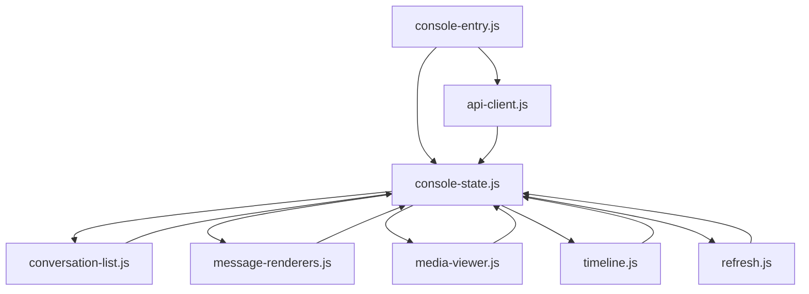
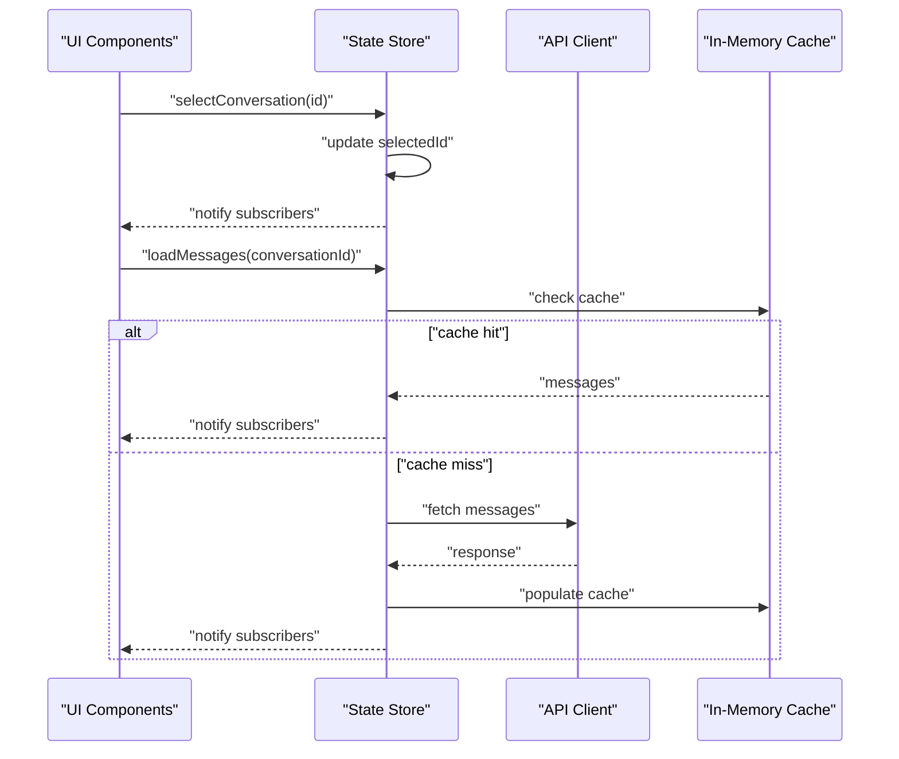
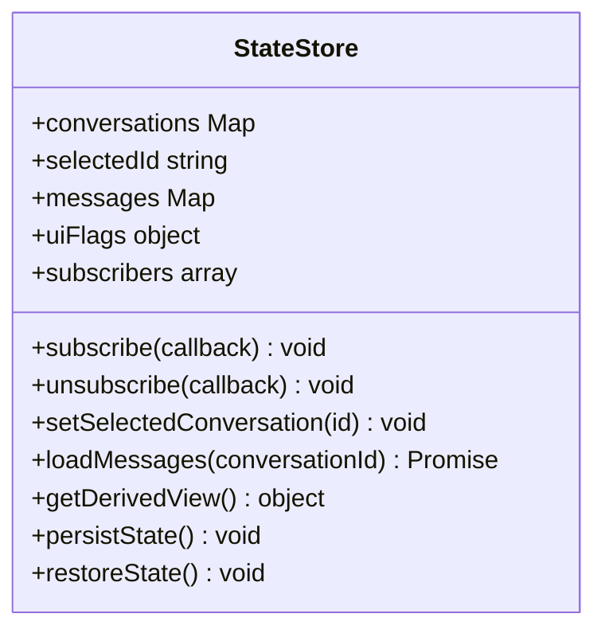
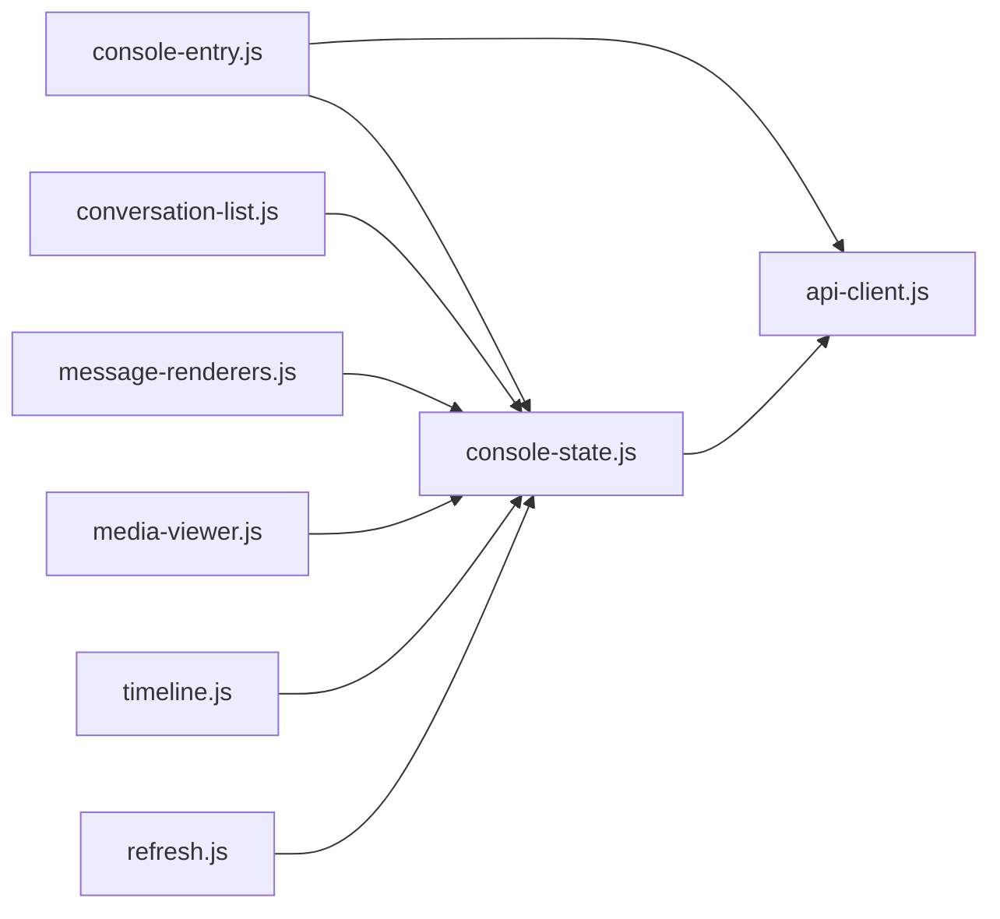

# State Management Architecture

<cite>
**Referenced Files in This Document**
- [console-state.js](file://backend/app/web/static/console/console-state.js)
- [console-entry.js](file://backend/app/web/static/console/console-entry.js)
- [conversation-list.js](file://backend/app/web/static/console/conversation-list.js)
- [message-renderers.js](file://backend/app/web/static/console/message-renderers.js)
- [media-viewer.js](file://backend/app/web/static/console/media-viewer.js)
- [timeline.js](file://backend/app/web/static/console/timeline.js)
- [refresh.js](file://backend/app/web/static/console/refresh.js)
- [api-client.js](file://backend/app/web/static/console/api-client.js)
</cite>

## Table of Contents
1. [Introduction](#introduction)
2. [Project Structure](#project-structure)
3. [Core Components](#core-components)
4. [Architecture Overview](#architecture-overview)
5. [Detailed Component Analysis](#detailed-component-analysis)
6. [Dependency Analysis](#dependency-analysis)
7. [Performance Considerations](#performance-considerations)
8. [Troubleshooting Guide](#troubleshooting-guide)
9. [Conclusion](#conclusion)
10. [Appendices](#appendices)

## Introduction
This document explains the client-side state management system used by the web console. It covers how conversations, messages, and UI states are modeled, bound to the UI, and updated reactively. It also documents persistence strategies, caching mechanisms, performance optimizations, and practical guidance for extending state, adding watchers, handling asynchronous updates, and debugging common issues.

## Project Structure
The client-side code resides under backend/app/web/static/console. The key modules include:
- Entry point bootstrapping the application and wiring up state
- Centralized state store with reactive updates
- Conversation list management and selection
- Message rendering pipeline
- Media viewer state and lifecycle
- Timeline navigation and pagination
- Refresh and polling utilities
- API client for server communication

**Diagram sources**
- [console-entry.js](file://backend/app/web/static/console/console-entry.js)
- [console-state.js](file://backend/app/web/static/console/console-state.js)
- [conversation-list.js](file://backend/app/web/static/console/conversation-list.js)
- [message-renderers.js](file://backend/app/web/static/console/message-renderers.js)
- [media-viewer.js](file://backend/app/web/static/console/media-viewer.js)
- [timeline.js](file://backend/app/web/static/console/timeline.js)
- [refresh.js](file://backend/app/web/static/console/refresh.js)
- [api-client.js](file://backend/app/web/static/console/api-client.js)

**Section sources**
- [console-entry.js](file://backend/app/web/static/console/console-entry.js)
- [console-state.js](file://backend/app/web/static/console/console-state.js)
- [conversation-list.js](file://backend/app/web/static/console/conversation-list.js)
- [message-renderers.js](file://backend/app/web/static/console/message-renderers.js)
- [media-viewer.js](file://backend/app/web/static/console/media-viewer.js)
- [timeline.js](file://backend/app/web/static/console/timeline.js)
- [refresh.js](file://backend/app/web/static/console/refresh.js)
- [api-client.js](file://backend/app/web/static/console/api-client.js)

## Core Components
- Centralized state store: Holds conversations, selected conversation, message lists, UI flags (loading, error), and derived views. Provides methods to update state and notify subscribers.
- Reactive bindings: Subscribers register callbacks that run when relevant state changes; components re-render only affected parts.
- Data binding: UI elements bind to state properties; mutations trigger updates through the store’s publish mechanism.
- Asynchronous updates: API calls return promises; success/failure handlers dispatch state updates atomically.
- Persistence and caching: Local storage or session storage is used to persist selections and preferences; in-memory caches reduce redundant network requests.

Key responsibilities:
- Maintain a single source of truth for conversation and message data
- Provide safe mutation APIs to avoid inconsistent state
- Expose reactive getters for computed UI state
- Coordinate loading and error states across features

**Section sources**
- [console-state.js](file://backend/app/web/static/console/console-state.js)
- [api-client.js](file://backend/app/web/static/console/api-client.js)

## Architecture Overview
The state architecture follows a unidirectional data flow:
- UI actions call store methods
- Store validates and updates internal state
- Store notifies subscribers
- UI components re-render based on new state

**Diagram sources**
- [console-state.js](file://backend/app/web/static/console/console-state.js)
- [api-client.js](file://backend/app/web/static/console/api-client.js)

## Detailed Component Analysis

### State Store (console-state.js)
Responsibilities:
- Define initial state shape including conversations, selected conversation, messages, UI flags, and derived views
- Implement setters and batched updates to maintain consistency
- Provide subscribe/unsubscribe for reactive updates
- Manage in-memory caches for conversations and messages
- Persist critical UI state to storage (e.g., selected conversation, filters)

Reactive pattern:
- Subscribers receive minimal diffs or full snapshots depending on scope
- Derived state is recomputed lazily to avoid unnecessary work

Persistence strategy:
- Use local/session storage for non-sensitive UI preferences
- Debounced writes to reduce I/O overhead
- Migration logic to handle schema changes over time

Caching strategy:
- In-memory maps keyed by IDs for fast lookups
- TTL-based invalidation for stale data
- Prefetching related resources on demand

**Diagram sources**
- [console-state.js](file://backend/app/web/static/console/console-state.js)

**Section sources**
- [console-state.js](file://backend/app/web/static/console/console-state.js)

### API Client (api-client.js)
Responsibilities:
- Encapsulate HTTP requests with retries and timeouts
- Normalize responses into consistent shapes
- Handle authentication headers and error codes
- Provide typed helpers for endpoints (e.g., fetch conversations, fetch messages)

Error handling:
- Network errors mapped to user-friendly messages
- Retry policies for transient failures
- Cancellation support for long-running requests

Integration with state:
- Returns promises consumed by store methods
- Emits events for progress and completion

**Section sources**
- [api-client.js](file://backend/app/web/static/console/api-client.js)

### Conversation List (conversation-list.js)
Responsibilities:
- Render and filter the conversation list
- Handle search and sorting
- Sync selection with store
- Lazy-load previews for conversations

Reactive updates:
- Subscribes to conversation list changes
- Updates DOM efficiently using virtualization where applicable

**Section sources**
- [conversation-list.js](file://backend/app/web/static/console/conversation-list.js)

### Message Renderers (message-renderers.js)
Responsibilities:
- Convert raw message payloads into renderable structures
- Support multiple message types and rich content
- Optimize rendering via memoization and chunking

Performance:
- Avoid re-rendering unchanged nodes
- Defer heavy computations off the main thread if possible

**Section sources**
- [message-renderers.js](file://backend/app/web/static/console/message-renderers.js)

### Media Viewer (media-viewer.js)
Responsibilities:
- Manage media preview state (open/close, current index)
- Handle download and thumbnail generation
- Integrate with message context for quick access

User experience:
- Keyboard navigation and accessibility
- Error fallbacks for unsupported formats

**Section sources**
- [media-viewer.js](file://backend/app/web/static/console/media-viewer.js)

### Timeline (timeline.js)
Responsibilities:
- Paginate and navigate message timelines
- Load older/newer messages on scroll or button clicks
- Maintain cursor position during updates

Optimization:
- Virtual scrolling for large timelines
- Deduplication of loaded message ranges

**Section sources**
- [timeline.js](file://backend/app/web/static/console/timeline.js)

### Refresh Utilities (refresh.js)
Responsibilities:
- Polling and manual refresh triggers
- Debounce rapid refreshes
- Coordinate background sync without blocking UI

Reliability:
- Backoff strategies for repeated failures
- Graceful degradation when offline

**Section sources**
- [refresh.js](file://backend/app/web/static/console/refresh.js)

### Application Entry (console-entry.js)
Responsibilities:
- Initialize store, API client, and feature modules
- Bind global event listeners
- Restore persisted state on startup
- Wire up error boundaries and logging

Startup sequence:
- Create store instance
- Restore persisted preferences
- Load initial data (e.g., recent conversations)
- Mount UI components

**Section sources**
- [console-entry.js](file://backend/app/web/static/console/console-entry.js)

## Dependency Analysis
Module relationships:
- Entry depends on store, API client, and feature modules
- Store depends on API client for data fetching
- Feature modules depend on store for reading/updating state
- Shared utilities (refresh, timeline) coordinate with store and API client

**Diagram sources**
- [console-entry.js](file://backend/app/web/static/console/console-entry.js)
- [console-state.js](file://backend/app/web/static/console/console-state.js)
- [api-client.js](file://backend/app/web/static/console/api-client.js)
- [conversation-list.js](file://backend/app/web/static/console/conversation-list.js)
- [message-renderers.js](file://backend/app/web/static/console/message-renderers.js)
- [media-viewer.js](file://backend/app/web/static/console/media-viewer.js)
- [timeline.js](file://backend/app/web/static/console/timeline.js)
- [refresh.js](file://backend/app/web/static/console/refresh.js)

**Section sources**
- [console-entry.js](file://backend/app/web/static/console/console-entry.js)
- [console-state.js](file://backend/app/web/static/console/console-state.js)
- [api-client.js](file://backend/app/web/static/console/api-client.js)
- [conversation-list.js](file://backend/app/web/static/console/conversation-list.js)
- [message-renderers.js](file://backend/app/web/static/console/message-renderers.js)
- [media-viewer.js](file://backend/app/web/static/console/media-viewer.js)
- [timeline.js](file://backend/app/web/static/console/timeline.js)
- [refresh.js](file://backend/app/web/static/console/refresh.js)

## Performance Considerations
- Minimize re-renders by subscribing to specific state slices
- Use virtualization for large lists and timelines
- Debounce input and frequent updates
- Cache API responses with appropriate TTLs
- Prefetch likely next resources (e.g., next page of messages)
- Batch state updates to reduce subscriber churn
- Offload heavy parsing to Web Workers where feasible

[No sources needed since this section provides general guidance]

## Troubleshooting Guide
Common issues and resolutions:
- Stale data: Clear in-memory cache and force reload from server
- Duplicate messages: Verify deduplication keys and idempotent updates
- Memory leaks: Ensure unsubscribe on component teardown
- Slow rendering: Profile re-renders and optimize subscriptions
- Network errors: Inspect retry/backoff logs and error normalization
- Persistence conflicts: Validate schema migrations and version checks

Debugging techniques:
- Log state transitions around critical operations
- Snapshot state before and after mutations
- Use browser dev tools to monitor network and storage
- Add feature flags to toggle verbose logging in production

**Section sources**
- [console-state.js](file://backend/app/web/static/console/console-state.js)
- [api-client.js](file://backend/app/web/static/console/api-client.js)

## Conclusion
The client-side state management system centers around a reactive store that coordinates data flow between UI components, API interactions, and caching layers. By adhering to unidirectional updates, careful subscription scoping, and robust persistence/caching strategies, the system delivers responsive and reliable user experiences. Extending state should follow established patterns for immutability, batching, and derived views to maintain performance and correctness.

[No sources needed since this section summarizes without analyzing specific files]

## Appendices

### Adding New State Properties
Steps:
- Extend the initial state shape with the new property
- Provide setter methods that validate inputs and batch updates
- Subscribe relevant components to the new property
- Update persistence logic to include the new field
- Add tests for mutation and derived view behavior

[No sources needed since this section provides general guidance]

### Implementing State Watchers
Approach:
- Register watchers for specific state slices
- Use debouncing for expensive operations
- Unwatch on component teardown to prevent leaks
- Prefer granular subscriptions to minimize re-renders

[No sources needed since this section provides general guidance]

### Handling Asynchronous State Updates
Pattern:
- Start loading state before async operation
- On success, merge response into state and clear loading
- On failure, set error state and optionally retry
- Cancel in-flight requests when navigating away

[No sources needed since this section provides general guidance]

### Common Patterns
- Single source of truth with immutable updates
- Derived state computed on demand
- Event-driven notifications for decoupled updates
- Cache-first strategy with fallback to network

[No sources needed since this section provides general guidance]