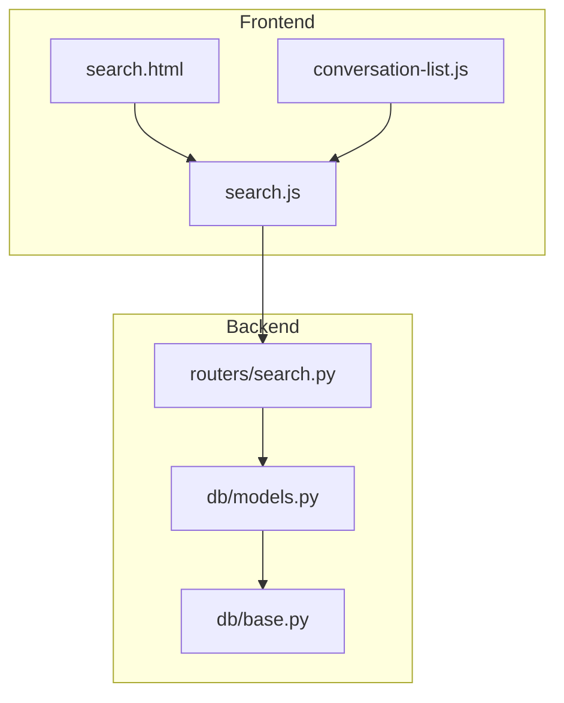
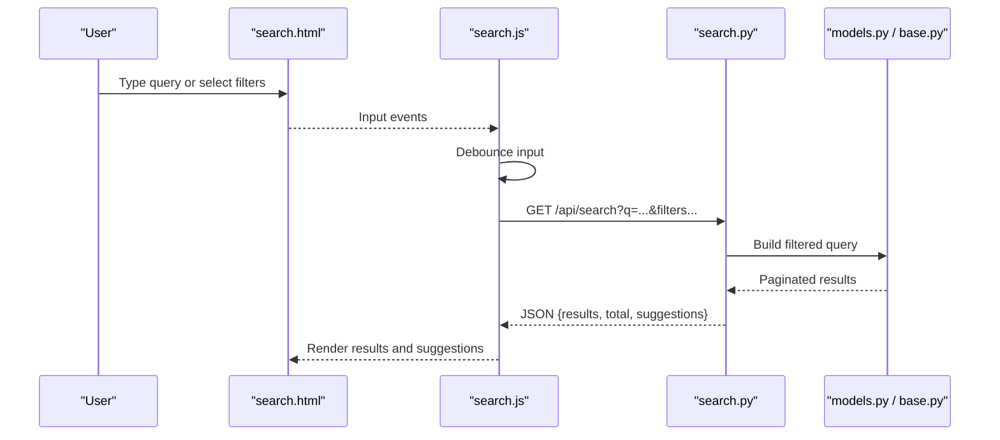
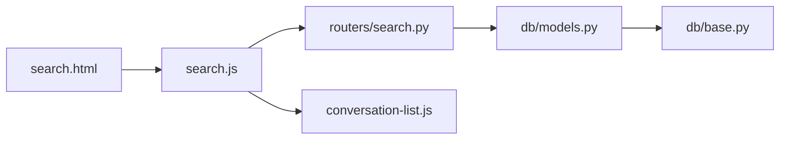

# Search Interface & Filters

<cite>
**Referenced Files in This Document**
- [search.py](file://backend/app/routers/search.py)
- [search.js](file://backend/app/web/static/console/search.js)
- [search.html](file://backend/app/web/templates/search.html)
- [test_search_api.py](file://backend/tests/test_search_api.py)
- [test_rnd_230_search_filters.py](file://backend/tests/test_rnd_230_search_filters.py)
- [test_rnd_230_search_page_participants_js.py](file://backend/tests/test_rnd_230_search_page_participants_js.py)
- [test_rnd_228_search_scalability.py](file://backend/tests/test_rnd_228_search_scalability.py)
- [models.py](file://backend/app/db/models.py)
- [base.py](file://backend/app/db/base.py)
- [messages.html](file://backend/app/web/templates/messages.html)
- [conversation-list.js](file://backend/app/web/static/console/conversation-list.js)
</cite>

## Table of Contents
1. [Introduction](#introduction)
2. [Project Structure](#project-structure)
3. [Core Components](#core-components)
4. [Architecture Overview](#architecture-overview)
5. [Detailed Component Analysis](#detailed-component-analysis)
6. [Dependency Analysis](#dependency-analysis)
7. [Performance Considerations](#performance-considerations)
8. [Troubleshooting Guide](#troubleshooting-guide)
9. [Conclusion](#conclusion)
10. [Appendices](#appendices)

## Introduction
This document explains the search interface and filtering capabilities for message archives. It covers:
- Client-side search behavior, including debouncing and real-time suggestions
- Server-side search API endpoints, query parameters, and response format
- Available filters (date range, participant, message type), and how they are applied
- Result presentation on the UI
- Query optimization and indexing strategies used by the backend
- Guidance for implementing custom filters, extending search functionality, and optimizing performance for large archives

## Project Structure
Search-related code is split between a FastAPI router that exposes the search API and a client-side JavaScript module that powers the search page and suggestions. Templates render the search UI and integrate with the JS logic. Tests validate both API contracts and frontend behaviors.

**Diagram sources**
- [search.html](file://backend/app/web/templates/search.html)
- [search.js](file://backend/app/web/static/console/search.js)
- [conversation-list.js](file://backend/app/web/static/console/conversation-list.js)
- [search.py](file://backend/app/routers/search.py)
- [models.py](file://backend/app/db/models.py)
- [base.py](file://backend/app/db/base.py)

**Section sources**
- [search.py](file://backend/app/routers/search.py)
- [search.js](file://backend/app/web/static/console/search.js)
- [search.html](file://backend/app/web/templates/search.html)

## Core Components
- Search API router: defines endpoints for querying messages and fetching suggestion data.
- Client-side search module: handles input events, debounces queries, renders results, and manages filters.
- Search template: provides the UI shell and integrates with the search module.
- Data models and DB base: define ORM models and session handling used by the search queries.

Key responsibilities:
- Parse and validate query parameters (text, date range, participants, message types).
- Build efficient database queries using filters and pagination.
- Return structured JSON responses suitable for UI rendering.
- Provide suggestion endpoints to support real-time autocomplete.

**Section sources**
- [search.py](file://backend/app/routers/search.py)
- [search.js](file://backend/app/web/static/console/search.js)
- [search.html](file://backend/app/web/templates/search.html)
- [models.py](file://backend/app/db/models.py)
- [base.py](file://backend/app/db/base.py)

## Architecture Overview
The search flow combines a responsive client with an optimized server:

**Diagram sources**
- [search.js](file://backend/app/web/static/console/search.js)
- [search.py](file://backend/app/routers/search.py)
- [models.py](file://backend/app/db/models.py)
- [base.py](file://backend/app/db/base.py)

## Detailed Component Analysis

### Search API (Server-Side)
Responsibilities:
- Accept query parameters for text search and filters (date range, participant, message type).
- Validate inputs and enforce tenant isolation where applicable.
- Construct database queries with appropriate joins and conditions.
- Apply pagination and return consistent JSON structure.
- Provide suggestion endpoints for real-time autocomplete.

Typical endpoint contract:
- GET /api/search
  - Query parameters: q (text), start_date, end_date, participant, msg_type, page, page_size
  - Response fields: results (list of messages), total (count), suggestions (autocomplete list)

Filter semantics:
- Date range: inclusive boundaries; defaults to no filter if omitted.
- Participant: supports exact match or partial matching depending on implementation.
- Message type: single or multiple values; supported types are enumerated by the system.

Query optimization:
- Use indexed columns for common filters (e.g., timestamps, participant IDs, message types).
- Limit result sets via pagination to reduce payload size.
- Avoid N+1 queries by eager loading related entities when necessary.

Suggestion strategy:
- Lightweight queries against frequently accessed fields (e.g., participant names, message prefixes).
- Cache hot suggestions at the application layer if needed.

Error handling:
- Return clear error codes for invalid parameters.
- Gracefully handle empty results without errors.

**Section sources**
- [search.py](file://backend/app/routers/search.py)
- [test_search_api.py](file://backend/tests/test_search_api.py)
- [models.py](file://backend/app/db/models.py)
- [base.py](file://backend/app/db/base.py)

### Client-Side Search (Debouncing & Real-Time Suggestions)
Responsibilities:
- Listen to input changes and apply debounce to avoid excessive requests.
- Assemble query parameters from user input and selected filters.
- Render paginated results and update UI state.
- Fetch and display suggestions while typing.

Debouncing strategy:
- Delay execution until user pauses typing for a configured interval.
- Cancel pending requests if new input arrives before debounce timeout.

Real-time suggestions:
- Trigger lightweight suggestion queries on keystroke after debounce threshold.
- Update dropdown or inline suggestions without blocking main search.

Result presentation:
- Show message snippets, timestamps, sender/participant info, and message type labels.
- Support keyboard navigation and focus management.

Accessibility and UX:
- Ensure ARIA attributes for dynamic content updates.
- Provide clear feedback during loading and error states.

**Section sources**
- [search.js](file://backend/app/web/static/console/search.js)
- [search.html](file://backend/app/web/templates/search.html)
- [test_rnd_230_search_page_participants_js.py](file://backend/tests/test_rnd_230_search_page_participants_js.py)

### Search Template and Integration
Responsibilities:
- Provide the search form, filter controls, and result container.
- Initialize the search module and bind event handlers.
- Integrate with conversation list interactions for context-aware searches.

Integration points:
- Load static assets and i18n resources.
- Wire up participant selection and message type toggles.
- Handle pagination controls and refresh actions.

**Section sources**
- [search.html](file://backend/app/web/templates/search.html)
- [conversation-list.js](file://backend/app/web/static/console/conversation-list.js)

### Data Models and Database Layer
Responsibilities:
- Define ORM models for messages, participants, conversations, and related metadata.
- Provide session configuration and connection management.
- Expose methods or relationships used by search queries.

Indexing considerations:
- Index timestamp fields for date range queries.
- Index participant identifiers for join/filter efficiency.
- Index message type fields for fast filtering.

Pagination and limits:
- Enforce maximum page sizes to prevent oversized responses.
- Use offset/limit or cursor-based pagination depending on dataset size.

**Section sources**
- [models.py](file://backend/app/db/models.py)
- [base.py](file://backend/app/db/base.py)

## Dependency Analysis
The search feature depends on:
- FastAPI router for HTTP endpoints
- ORM models for data access
- Frontend templates and JS modules for UI
- Test suites validating API contracts and frontend behaviors

**Diagram sources**
- [search.html](file://backend/app/web/templates/search.html)
- [search.js](file://backend/app/web/static/console/search.js)
- [search.py](file://backend/app/routers/search.py)
- [models.py](file://backend/app/db/models.py)
- [base.py](file://backend/app/db/base.py)
- [conversation-list.js](file://backend/app/web/static/console/conversation-list.js)

**Section sources**
- [search.py](file://backend/app/routers/search.py)
- [search.js](file://backend/app/web/static/console/search.js)
- [search.html](file://backend/app/web/templates/search.html)
- [models.py](file://backend/app/db/models.py)
- [base.py](file://backend/app/db/base.py)
- [conversation-list.js](file://backend/app/web/static/console/conversation-list.js)

## Performance Considerations
- Debounce intervals should balance responsiveness and request volume; typical ranges are 200–500ms.
- Prefer server-side pagination over client-side slicing for large datasets.
- Use database indexes on frequently filtered columns (timestamps, participant IDs, message types).
- Minimize payload size by selecting only required fields and avoiding unnecessary joins.
- Implement caching for frequent suggestion queries if latency becomes a concern.
- Monitor query execution plans and adjust indexes based on actual usage patterns.

[No sources needed since this section provides general guidance]

## Troubleshooting Guide
Common issues and resolutions:
- Empty results despite valid query: verify filter values and date ranges; ensure indices exist for queried columns.
- Slow search performance: check query plan, add missing indexes, reduce page size, or implement cursor-based pagination.
- Suggestions not updating: confirm debounce settings and network requests; inspect console for errors.
- Pagination anomalies: validate page_size limits and offset calculations; ensure total count accuracy.

Validation references:
- API contract tests ensure parameter validation and response structure.
- Frontend tests verify debounce behavior and participant integration.

**Section sources**
- [test_search_api.py](file://backend/tests/test_search_api.py)
- [test_rnd_230_search_filters.py](file://backend/tests/test_rnd_230_search_filters.py)
- [test_rnd_230_search_page_participants_js.py](file://backend/tests/test_rnd_230_search_page_participants_js.py)
- [test_rnd_228_search_scalability.py](file://backend/tests/test_rnd_228_search_scalability.py)

## Conclusion
The search interface combines a responsive client with an optimized server to deliver fast, filterable message retrieval. Debouncing and real-time suggestions enhance usability, while server-side filtering and indexing ensure scalability. Extending search functionality involves adding new filters, updating both API and UI layers, and validating performance with targeted tests.

[No sources needed since this section summarizes without analyzing specific files]

## Appendices

### Example: Implementing a Custom Filter
Steps:
- Add a new query parameter to the search endpoint.
- Validate and normalize the parameter value.
- Extend the database query with the new condition.
- Update the UI to expose the filter control.
- Add tests to cover validation and query behavior.

References:
- Endpoint definition and parameter handling
- Model relationships and query construction
- Frontend filter binding and debounce integration

**Section sources**
- [search.py](file://backend/app/routers/search.py)
- [models.py](file://backend/app/db/models.py)
- [search.js](file://backend/app/web/static/console/search.js)

### Example: Optimizing Search for Large Archives
Recommendations:
- Partition or archive older messages to separate tables or databases.
- Use materialized views or search indexes for complex full-text queries.
- Implement cursor-based pagination for stable ordering across large datasets.
- Profile and monitor slow queries; adjust indexes and query structures accordingly.

References:
- Scalability tests and baseline metrics
- Database model definitions and indexing strategy

**Section sources**
- [test_rnd_228_search_scalability.py](file://backend/tests/test_rnd_228_search_scalability.py)
- [models.py](file://backend/app/db/models.py)