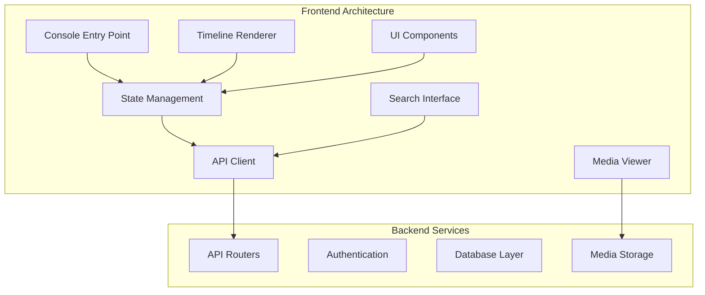
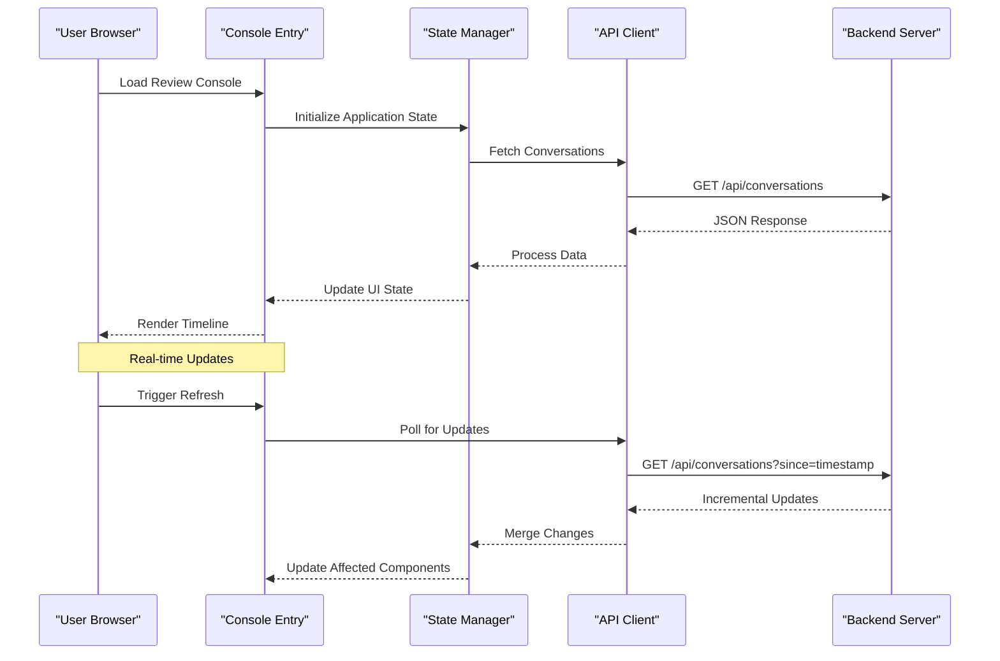
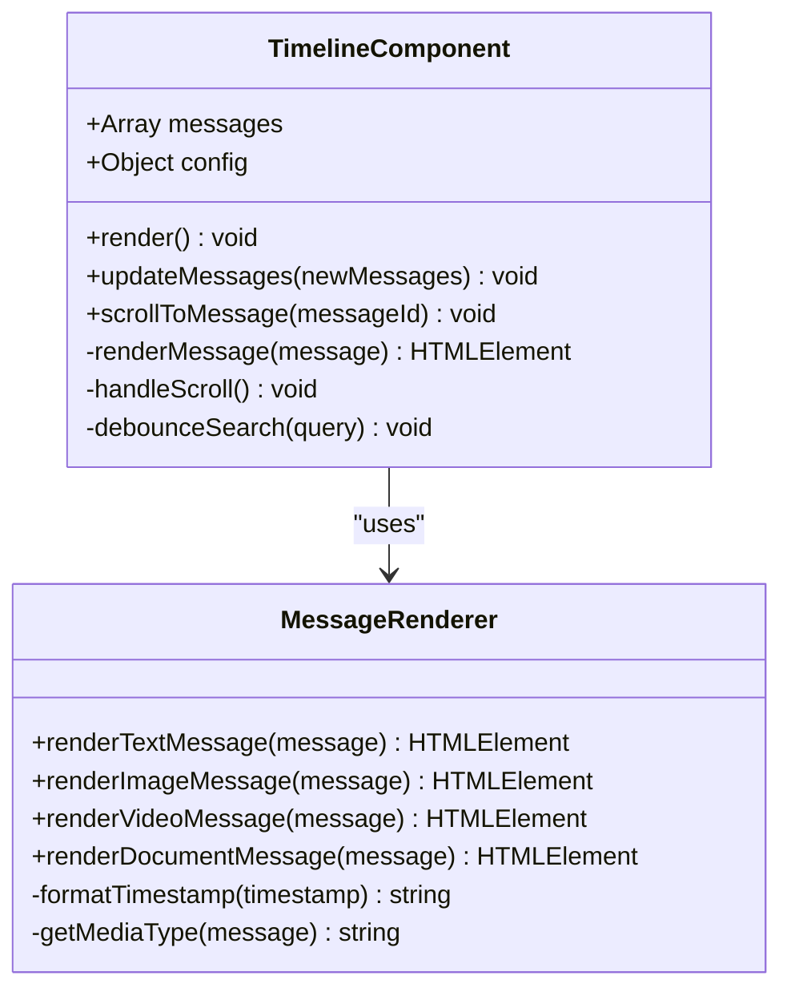
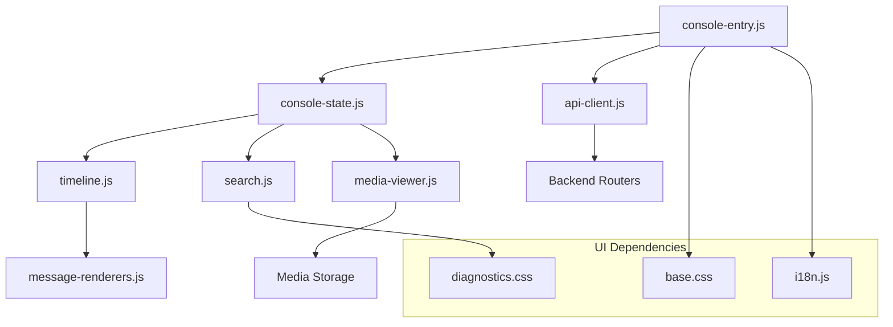

# Web Application

<cite>
**Referenced Files in This Document**
- [main.py](file://backend/app/main.py)
- [review_console.html](file://backend/app/web/templates/review_console.html)
- [messages.html](file://backend/app/web/templates/messages.html)
- [search.html](file://backend/app/web/templates/search.html)
- [console-entry.js](file://backend/app/web/static/console/console-entry.js)
- [console-state.js](file://backend/app/web/static/console/console-state.js)
- [api-client.js](file://backend/app/web/static/console/api-client.js)
- [timeline.js](file://backend/app/web/static/console/timeline.js)
- [conversation-list.js](file://backend/app/web/static/console/conversation-list.js)
- [media-viewer.js](file://backend/app/web/static/console/media-viewer.js)
- [message-renderers.js](file://backend/app/web/static/console/message-renderers.js)
- [refresh.js](file://backend/app/web/static/console/refresh.js)
- [search.js](file://backend/app/web/static/search.js)
- [base.css](file://backend/app/web/static/base.css)
- [diagnostics.css](file://backend/app/web/static/diagnostics.css)
- [i18n.js](file://backend/app/assets/i18n.js)
- [conversations.py](file://backend/app/routers/conversations.py)
- [search.py](file://backend/app/routers/search.py)
- [auth.py](file://backend/app/routers/auth.py)
</cite>

## Table of Contents
1. [Introduction](#introduction)
2. [Project Structure](#project-structure)
3. [Core Components](#core-components)
4. [Architecture Overview](#architecture-overview)
5. [Detailed Component Analysis](#detailed-component-analysis)
6. [Dependency Analysis](#dependency-analysis)
7. [Performance Considerations](#performance-considerations)
8. [Troubleshooting Guide](#troubleshooting-guide)
9. [Conclusion](#conclusion)

## Introduction

The WeCom Archive Web Application provides a comprehensive review console for browsing, searching, and analyzing archived WeCom messages and conversations. The application features a modern single-page interface with real-time updates, advanced search capabilities, and media viewing functionality. It supports conversation analysis, timeline visualization, and collaborative review workflows for compliance and auditing purposes.

## Project Structure

The web application follows a modular architecture with clear separation between server-side routing, client-side JavaScript modules, and template rendering. The frontend is built using vanilla JavaScript with a component-based approach, while the backend serves both API endpoints and HTML templates.

**Diagram sources**
- [console-entry.js:1-50](file://backend/app/web/static/console/console-entry.js#L1-L50)
- [console-state.js:1-100](file://backend/app/web/static/console/console-state.js#L1-L100)
- [api-client.js:1-80](file://backend/app/web/static/console/api-client.js#L1-L80)

**Section sources**
- [main.py:1-100](file://backend/app/main.py#L1-L100)
- [review_console.html:1-200](file://backend/app/web/templates/review_console.html#L1-L200)

## Core Components

### Review Console Interface

The review console serves as the primary interface for message browsing and conversation analysis. It provides a unified view of archived WeCom data with filtering, sorting, and real-time updates.

#### Key Features:
- **Message Timeline View**: Chronological display of messages with rich content support
- **Conversation Grouping**: Organizes messages by conversation threads
- **Advanced Search**: Full-text search with filters for date ranges, senders, and message types
- **Media Viewer**: Integrated image, video, and document preview capabilities
- **Real-time Updates**: Automatic refresh and incremental loading

#### User Interface Components:

**Message Timeline View**
- Vertical timeline layout with message bubbles
- Timestamp formatting and relative time indicators
- Message status indicators (sent, received, revoked)
- Participant avatars and names in group conversations

**Media Viewer**
- Modal overlay for full-screen media viewing
- Zoom and pan capabilities for images
- Video playback controls
- Download options for media files
- Thumbnail generation and lazy loading

**Search Filters**
- Text search with autocomplete
- Date range picker
- Sender/recipient filters
- Message type filters (text, image, video, documents)
- Conversation filters

**Section sources**
- [review_console.html:1-300](file://backend/app/web/templates/review_console.html#L1-L300)
- [console-entry.js:1-150](file://backend/app/web/static/console/console-entry.js#L1-L150)

### Client-Side JavaScript Architecture

The frontend follows a modular architecture pattern with clear separation of concerns:

#### State Management System
Centralized state management handles application data, user preferences, and UI state synchronization.

#### API Integration Layer
Dedicated API client manages HTTP requests, error handling, and response caching.

#### Component-Based Rendering
Modular JavaScript components handle specific UI responsibilities like timeline rendering, search interface, and media viewing.

**Section sources**
- [console-state.js:1-200](file://backend/app/web/static/console/console-state.js#L1-L200)
- [api-client.js:1-150](file://backend/app/web/static/console/api-client.js#L1-L150)

## Architecture Overview

The application implements a modern single-page application architecture with progressive enhancement:

**Diagram sources**
- [console-entry.js:50-150](file://backend/app/web/static/console/console-entry.js#L50-L150)
- [console-state.js:100-250](file://backend/app/web/static/console/console-state.js#L100-L250)
- [api-client.js:80-200](file://backend/app/web/static/console/api-client.js#L80-L200)

### Data Flow Patterns

The application implements several key data flow patterns:

1. **Unidirectional Data Flow**: State changes propagate through the system predictably
2. **Event-Driven Architecture**: Components communicate through custom events
3. **Lazy Loading**: Data and components load on demand
4. **Caching Strategy**: Multiple layers of caching for optimal performance

**Section sources**
- [timeline.js:1-200](file://backend/app/web/static/console/timeline.js#L1-L200)
- [conversation-list.js:1-150](file://backend/app/web/static/console/conversation-list.js#L1-L150)

## Detailed Component Analysis

### Timeline Component

The timeline component renders the chronological view of messages with sophisticated rendering logic:

#### Features:
- Virtual scrolling for large message lists
- Rich message type support (text, images, videos, documents)
- Interactive message actions (reply, forward, delete)
- Responsive design for mobile devices

#### Implementation Details:
- Uses Intersection Observer for efficient DOM manipulation
- Implements debounced search within timeline
- Supports keyboard navigation and accessibility

**Diagram sources**
- [timeline.js:1-300](file://backend/app/web/static/console/timeline.js#L1-L300)
- [message-renderers.js:1-200](file://backend/app/web/static/console/message-renderers.js#L1-L200)

### Search Interface

The search component provides powerful search capabilities across all archived content:

#### Capabilities:
- Full-text search with highlighting
- Advanced filters (date range, sender, message type)
- Search result pagination
- Recent searches history
- Saved search queries

#### Performance Optimizations:
- Debounced input handling
- Server-side search with pagination
- Result caching
- Progressive result loading

**Section sources**
- [search.js:1-250](file://backend/app/web/static/search.js#L1-L250)
- [search.html:1-200](file://backend/app/web/templates/search.html#L1-L200)

### Media Viewer

The media viewer component handles all media-related functionality:

#### Supported Formats:
- Images (JPEG, PNG, GIF, WebP)
- Videos (MP4, WebM, MOV)
- Documents (PDF, DOC, XLS, PPT)
- Audio files (MP3, WAV, AAC)

#### Features:
- Full-screen modal viewing
- Zoom and pan controls
- Keyboard navigation
- Download functionality
- Thumbnail generation

**Section sources**
- [media-viewer.js:1-300](file://backend/app/web/static/console/media-viewer.js#L1-L300)

### State Management

The state management system provides centralized application state:

#### State Categories:
- **Application State**: UI configuration, theme settings, language preferences
- **Data State**: Conversations, messages, search results
- **User State**: Authentication, permissions, user preferences
- **Cache State**: Cached API responses, media thumbnails

#### State Operations:
- Immutable state updates
- Action dispatching
- State persistence
- Cross-component synchronization

**Section sources**
- [console-state.js:1-400](file://backend/app/web/static/console/console-state.js#L1-L400)

## Dependency Analysis

The application has well-defined dependencies between components:

**Diagram sources**
- [console-entry.js:1-100](file://backend/app/web/static/console/console-entry.js#L1-L100)
- [base.css:1-200](file://backend/app/web/static/base.css#L1-L200)
- [i18n.js:1-150](file://backend/app/assets/i18n.js#L1-L150)

**Section sources**
- [api-client.js:1-200](file://backend/app/web/static/console/api-client.js#L1-L200)
- [conversations.py:1-150](file://backend/app/routers/conversations.py#L1-L150)
- [search.py:1-200](file://backend/app/routers/search.py#L1-L200)

## Performance Considerations

### Lazy Loading Strategies
- **Component Lazy Loading**: JavaScript modules load only when needed
- **Image Lazy Loading**: Thumbnails load as users scroll through timelines
- **Data Pagination**: Large datasets loaded in chunks to prevent memory issues

### Caching Strategies
- **Browser Cache**: HTTP caching headers for static assets
- **Application Cache**: In-memory caching for frequently accessed data
- **Service Worker**: Optional offline support for critical resources

### Memory Management
- **Virtual Scrolling**: Only visible messages rendered in DOM
- **Event Listener Cleanup**: Proper cleanup of event listeners on component destroy
- **Memory Leak Prevention**: Regular garbage collection optimization

### Optimization Techniques
- **Code Splitting**: Separate bundles for different features
- **Asset Optimization**: Minified CSS and JavaScript files
- **Database Query Optimization**: Efficient database queries with proper indexing

**Section sources**
- [refresh.js:1-150](file://backend/app/web/static/console/refresh.js#L1-L150)
- [diagnostics.css:1-100](file://backend/app/web/static/diagnostics.css#L1-L100)

## Troubleshooting Guide

### Common Issues and Solutions

**Performance Problems**
- Check browser developer tools for memory leaks
- Verify network requests are properly cached
- Monitor DOM size and element count

**Search Functionality**
- Ensure search indexes are up-to-date
- Check network connectivity for server-side search
- Verify search query syntax and filters

**Media Loading Issues**
- Validate media file formats and sizes
- Check CORS policies for external media
- Verify storage backend connectivity

**State Synchronization**
- Monitor state consistency across components
- Check for race conditions in async operations
- Verify proper error handling in API calls

### Debugging Tools
- Built-in diagnostics page for system health checks
- Network request monitoring and logging
- State inspection tools for development
- Error tracking and reporting

**Section sources**
- [diagnostics.js:1-200](file://backend/app/web/static/diagnostics.js#L1-L200)
- [auth.py:1-100](file://backend/app/routers/auth.py#L1-L100)

## Conclusion

The WeCom Archive Web Application provides a robust and feature-rich interface for reviewing and analyzing archived messages. The modular architecture ensures maintainability and scalability, while the comprehensive feature set supports various use cases from compliance auditing to team collaboration. The application's emphasis on performance, accessibility, and responsive design makes it suitable for diverse deployment scenarios and user needs.

Key strengths include the sophisticated state management system, efficient media handling, and comprehensive search capabilities. The progressive enhancement approach ensures broad browser compatibility while providing an optimal experience for modern browsers.