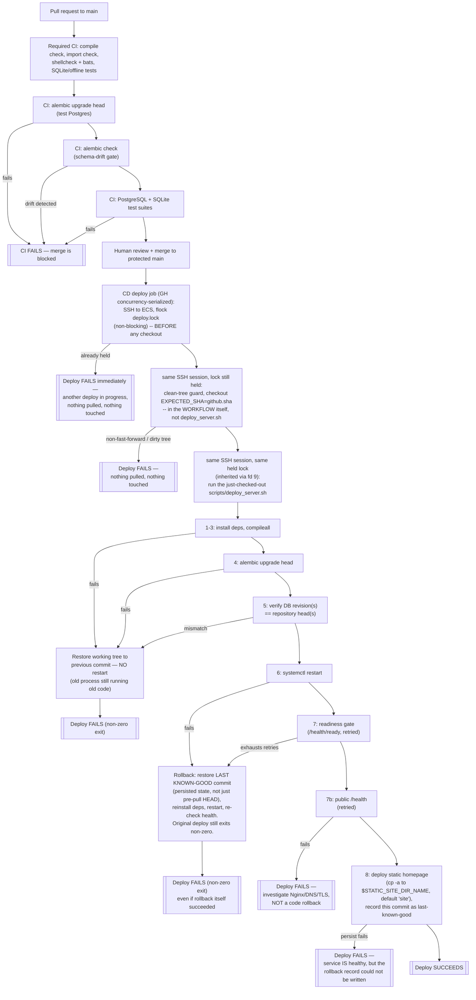

# Deployment Guide — Crowntime WeCom Archive

This document separates:

- what is versioned in this repository
- what must still be supplied by the operator

That boundary matters: the repo contains worker/media timer units and a deploy
script, but not every production asset.

---

## 1. Repo-Owned Deployment Assets

Versioned in this repository:

| Asset | Path | Purpose |
|------|------|---------|
| Deploy script | `scripts/deploy_server.sh` | Pull latest code, install deps, run+verify Alembic migration, restart app service, gate on readiness, auto-rollback on failure (see §7) |
| Revision verification | `backend/scripts/verify_alembic_head.py` | Non-interactive DB-revision-vs-repo-head check used by the deploy script and independently testable |
| Deploy integration tests | `scripts/tests/deploy_server.bats` | Mocked end-to-end coverage of the deploy script's ordering and rollback behavior |
| Scheduled-workload manifest (GH-104) | `deploy/systemd/WORKLOAD_MANIFEST` | The one authoritative classification (required/deferred/manual-oneshot/deprecated/static-helper/template/out-of-scope) for every unit below; `MANAGED_UNITS` is a mechanical view of it — see [operations/scheduled-workload-manifest.md](operations/scheduled-workload-manifest.md) |
| Scheduled-workload assertion (GH-104) | `scripts/assert_scheduled_workloads.sh` (+ `scripts/tests/assert_scheduled_workloads.bats`) | Repo-mode: manifest/MANAGED_UNITS/ExecStart consistency (CI-safe). `--server` mode: real installed/enabled/active state — run on the host post-deploy |
| Worker unit | `deploy/systemd/wecom-archive-worker.service` | One-shot sync + decrypt |
| Worker timer | `deploy/systemd/wecom-archive-worker.timer` | Callback-primary archive reconciliation every 30 minutes by default (`:00`, `:30`) |
| External-contact refresh unit | `deploy/systemd/wecom-external-contact-refresh.service` | Small, durable event-driven metadata refresh worker |
| External-contact refresh path/timer | `deploy/systemd/wecom-external-contact-refresh.{path,timer}` | Immediate identifier-free wake-up plus retryable task recovery |
| External-contact daily unit/timer | `deploy/systemd/wecom-external-contact-reconcile.{service,timer}` | Full customer metadata reconciliation once daily at 04:15 |
| Reachability reconciliation unit | `deploy/systemd/wecom-archive-reachability-check.service` | One-shot daily full visibility reconciliation |
| Reachability reconciliation timer | `deploy/systemd/wecom-archive-reachability-check.timer` | Runs reconciliation daily at 04:30 local time |
| Media event unit | `deploy/systemd/wecom-archive-media-event.service` | Archive-complete event service; invokes the existing generic media worker |
| Media event path | `deploy/systemd/wecom-archive-media-event.path` | Coalescing mtime-only wake-up signal watcher (no task payload) |
| Media unit | `deploy/systemd/wecom-archive-media-download.service` | One-shot generic media worker (image/voice/video/file/emotion/nested media) |
| Media timer | `deploy/systemd/wecom-archive-media-download.timer` | Pending/retryable reconciliation every 30 minutes by default (`:15`, `:45`) |
| Export worker unit/timer | `deploy/systemd/wecom-export-jobs.{service,timer}` | Generate queued ZIPs, retry email delivery, and delete seven-day artifacts every five minutes |
| Billing notification unit/timer | `deploy/systemd/wecom-billing-notifications.{service,timer}` | Schedule and retry lifecycle, payment-activation and refund-anomaly notices every five minutes |
| Billing lifecycle unit/timer | `deploy/systemd/wecom-billing-lifecycle.{service,timer}` | Advance grace/expired/frozen projections for commercial tenants (row-locked, idempotent, failure-isolated) every five minutes (RND-402) |
| Payment recovery/reconciliation unit/timers | `deploy/systemd/wecom-payment-{recovery,reconciliation}.{service,timer}` | Bounded recovery every five minutes and T+1 reconciliation at 02:30 UTC; neither unit enables new payment creation (RND-390) |
| AI KB reindex unit/timer | `deploy/systemd/wecom-ai-kb-reindex.{service,timer}` | Rebuild the AI support knowledge-base index from `backend/app/ai_kb/manifest.json` hourly (`:15`); no-op if `AI_SUPPORT_ENABLED` is unset (RND-356) |
| AI KB eval unit/timer | `deploy/systemd/wecom-ai-kb-eval.{service,timer}` | Daily (05:00) retrieval-quality launch gate against the fixed eval set; records `ai_eval_runs`, exits non-zero on a blocked run (RND-359) |
| AI KB gap report unit/timer | `deploy/systemd/wecom-ai-kb-gap-report.{service,timer}` | Weekly (Mon 06:00) Markdown candidate-improvement report under `docs/ai/reports/` — never creates, changes, or closes GitHub Issues (RND-359) |
| AI retention sweep unit/timer | `deploy/systemd/wecom-ai-retention-sweep.{service,timer}` | Daily (03:30) deletes AI chat sessions/messages past `AI_RETENTION_DAYS` (default 90) (RND-359) |
| Backup unit/timer | `deploy/systemd/wecom-backup.{service,timer}` | Daily (03:17) encrypted DB + media backup (RND-193); listed in `MANAGED_UNITS` as of GH-104 — cadence/retention/encryption unchanged, closes a "required but unmanaged" drift only; #105 owns off-host/offsite DR |
| Disk/resource usage check unit/timer | `deploy/systemd/wecom-disk-usage-check.{service,timer}` | Every 15 minutes (`:9/15`) capacity/webhook alerting (RND-193); listed in `MANAGED_UNITS` as of GH-104, cadence unchanged |
| Job-failure alert unit (templated) | `deploy/systemd/wecom-job-failure-alert@.service` | `OnFailure=` target for the seven critical one-shot units below; POSTs through the existing `notify.sh`/`ALERT_WEBHOOK_URL` contract (GH-107, see [operations/alerting.md](operations/alerting.md)) |
| GitHub Actions CI | `.github/workflows/ci.yml` + `.github/workflows/test.yml` | Required PR/merge-queue compile, migration, schema-drift, script-safety, and test gates |
| GitHub Actions CD | `.github/workflows/deploy.yml` | Deploys the merged `main` SHA without repeating the full CI suite (see §7) |
| GitHub Actions external uptime check | `.github/workflows/uptime-check.yml` | Runs outside the production ECS on a 10-minute schedule; checks the public endpoint and `/health/ready` and alerts on failure (GH-107, see [operations/alerting.md](operations/alerting.md)) |
| Controlled non-production deployment | `.github/workflows/deploy-nonprod.yml`, `scripts/deploy_nonprod.sh`, `deploy/systemd/wecom-archive-365-nonprod.service` | Manually deploys an exact `main` SHA only to the isolated staging instance; see [operations/nonproduction-deployment.md](operations/nonproduction-deployment.md) |

Not versioned in this repository:

| Asset | Status |
|------|--------|
| Main web service unit (`wecom-archive-365.service`) | Operator-managed |
| Reverse proxy config (Nginx / equivalent) | Operator-managed |
| TLS certificates | Operator-managed |
| `STATIC_SITE_DIR_NAME` env var | Operator-set in `backend/.env`; must match the `root` in the operator-managed Nginx config for the static homepage (see `static_site/company_homepage/README.md`), or step 8 below silently syncs to a directory Nginx never serves |
| Wildcard SSL renewal (`qiniu-ssl-renew-wildcard.{service,timer}` + `renew-wildcard.sh`) | Server-only, never committed — a tracked GH-104 reproducibility gap, not an intentional exclusion; see [operations/scheduled-workload-manifest.md](operations/scheduled-workload-manifest.md#wildcard-ssl-renewal-known-gap) |
| `qiniu-telegram-relay.service` | Deprecated stale server artifact, never versioned here; see [operations/scheduled-workload-manifest.md](operations/scheduled-workload-manifest.md#telegram-relay) |

---

## 2. Local / New-Server Bootstrap

Run from `backend/` after creating `.env`:

```bash
python3 -m venv .venv
source .venv/bin/activate
python -m pip install -r requirements.txt
# For an existing virtual environment, rerun the command above after pulling
# dependency changes so its pinned tooling (including Ruff) is synchronized.
alembic upgrade head
python scripts/bootstrap_default_tenant.py
```

Why both init steps are required:

- `alembic upgrade head` creates the schema
- `bootstrap_default_tenant.py` creates the default tenant and tenant config rows required by auth and sync paths

Without the bootstrap step, password-mode login and tenant-scoped APIs will not
work.

**Qiniu Kodo storage (RND-174, optional).** `requirements.txt` pins the
`qiniu` SDK, so a normal `pip install -r requirements.txt` (including on
an upgrade — re-run it before enabling Qiniu on an existing deployment)
is sufficient; nothing extra to install. Qiniu is only used if
`MEDIA_STORAGE_PROVIDER=qiniu_kodo` is set (for new writes) or an
existing `media_files` row has `storage_backend=qiniu_kodo` (for reads) —
local-only deployments never need `QINIU_*` configured. See
`.env.example` for the required variables (`QINIU_ACCESS_KEY`,
`QINIU_SECRET_KEY`, `QINIU_BUCKET`, `QINIU_DOMAIN` — must be a full
`https://` URL) and
[research/rnd_174_qiniu_kodo_provider.md](research/rnd_174_qiniu_kodo_provider.md)
for the per-row storage model and rollback behavior.

---

## 3. Required Environment Variables

The current source of truth is [../.env.example](../.env.example).

Deployment configuration is parsed as data, never sourced as shell code. Keep one
`KEY=value` assignment per line; encode PEM line breaks as literal `\n` characters.
Do not paste raw multi-line PEM blocks into `.env`: CD ignores their continuation
lines to prevent secret-bearing configuration from being executed as shell commands,
and the application will fail closed if an enabled credential is incomplete.

Minimum local app bring-up:

- `DATABASE_URL`
- `AUTH_MODE=password`
- `ADMIN_USERNAME`
- `ADMIN_PASSWORD_HASH`
- `WECOM_CORP_ID`
- `WECOM_AGENT_ID`
- `WECOM_OAUTH_SECRET`

Additional variables are required for:

- WeCom OAuth: `ADMIN_DOMAIN`
- Sync/decrypt/media scripts: `WECOM_SDK_LIB_PATH`, `WECOM_ARCHIVE_SECRET`, `WECOM_PRIVATE_KEY_PATH`, `WECOM_PUBLIC_KEY_VERSION`
- Media serving/download, local-backed rows only: `STORAGE_LOCAL_PATH`
- Media serving/download, Qiniu-backed rows only (optional — see below): `QINIU_ACCESS_KEY`, `QINIU_SECRET_KEY`, `QINIU_BUCKET`, `QINIU_DOMAIN` (full `https://` URL), `QINIU_REGION` (optional)
- WeChat Pay annual purchase/refund (optional until production approval): set `WECHAT_PAY_ENABLED=true` plus `WECHAT_PAY_APP_ID`, `WECHAT_PAY_MCH_ID`, `WECHAT_PAY_MERCHANT_SERIAL_NO`, `WECHAT_PAY_MERCHANT_PRIVATE_KEY`, `WECHAT_PAY_API_V3_KEY`, `WECHAT_PAY_PUBLIC_KEY_ID`, `WECHAT_PAY_PUBLIC_KEY`, and the exact public HTTPS `WECHAT_PAY_NOTIFY_URL` and `WECHAT_PAY_REFUND_NOTIFY_URL`. The app fails startup when enabled configuration is incomplete or malformed.
- Alipay PC cashier (optional until independent production approval): set `ALIPAY_ENABLED=true` plus `ALIPAY_APP_ID`, `ALIPAY_SELLER_ID`, `ALIPAY_MERCHANT_PRIVATE_KEY`, `ALIPAY_PUBLIC_KEY`, and the exact public HTTPS `ALIPAY_NOTIFY_URL` (`/api/payments/alipay/notify`) and `ALIPAY_RETURN_URL` (`/admin/billing`). The merchant key and Alipay public key/certificate are read only from the deployment secret environment; incomplete or malformed enabled configuration fails app startup. Alipay is preferred for new orders when enabled, but existing orders are always queried through their persisted provider.

The reverse proxy must expose `POST /api/payments/wechat/notify`,
`POST /api/refunds/wechat/notify`, and `POST /api/payments/alipay/notify` at the
exact HTTPS URLs configured above without browser/session authentication. Do
not cache or rewrite a callback body: WeChat verification uses raw bytes and
Alipay verification uses the submitted form fields. The remaining
`/admin/billing` and `/api/billing/*` routes retain normal owner-session
authentication. Refund creation and active reconciliation live only under
`/api/platform/operations/*` and require platform-administrator authentication;
there is no tenant Owner refund endpoint. Enabling production payments or
issuing a real refund remains a separate RND-390 operational gate; committing
this implementation authorizes neither live merchant traffic nor a real
money movement.

**Capacity enforcement (RND-385).** After migration `0044`, every production
media-worker invocation enforces the active subscription's storage quota before
writing to either local storage or Qiniu. A denied payload is recorded as
`quota_blocked` plus a `media_quota_blocks` fact and is retried by normal timer
runs; operators do not need to add `--retry`. Do not bypass the versioned
`download_wecom_media_once.py` entrypoint with direct internal calls. Monitor
`quota_blocked` counts in worker output and use the owner billing page or
`GET /api/billing/capacity` for the same server-measured state. Missing or
inactive subscription fails closed by design.

---

## 4. Main Web Service

The repository does **not** contain the production `wecom-archive-365.service`
unit file. Whatever service manager you use must run the FastAPI app with an
equivalent working directory and environment to the local command:

```bash
cd /srv/apps/wecom-archive-365/current/backend
source .venv/bin/activate
uvicorn app.main:app --host 127.0.0.1 --port 8035
```

Production typically omits `--reload`.

Health endpoints (RND-227):

- `GET /health/live` — liveness only. Never touches the database; returns
  `200 {"status":"ok"}` whenever the process can respond at all.
- `GET /health/ready` — readiness: `SELECT 1` against the database plus a
  comparison of the database's current Alembic revision(s) against this
  checkout's migration head(s) (`app/db/schema_check.py`). `200
  {"status":"ok"}` when healthy, `503 {"status":"unavailable"}` otherwise.
  Never returns a stack trace, exception text, or connection string.
- `GET /health` — kept as an alias of `/health/ready` (not liveness) for
  backward compatibility with every existing caller (this script, uptime
  monitoring). It is **not** a static "ok" — see §7 below for why that
  used to be a real production gap.
- internal, for the deploy gate: `http://127.0.0.1:8035/health/ready`

---

## 5. Worker / Timer Installation

See [operations/scheduled-workload-manifest.md](operations/scheduled-workload-manifest.md)
for the canonical classification (required / deferred / manual-oneshot /
deprecated / static-helper / template / out-of-scope) of every unit below,
and `deploy/systemd/WORKLOAD_MANIFEST` for its machine-checkable form
(GH-104). `MANAGED_UNITS`, described next, is a mechanical view of that
manifest's `auto_install=true` rows.

**Units listed in `deploy/systemd/MANAGED_UNITS` are now installed and
enabled automatically by `scripts/deploy_server.sh` on every deploy to
main** — see that script's step 10. This closes the gap where a *new* unit
committed to `deploy/systemd/` (e.g. the external-contact reconcile timer
below, added for RND-371 avatar sync) sat in the repo but was never
actually installed on the host, because CD only ever restarted the main
app service; installing a new systemd unit had always been this separate,
easy-to-forget manual step. It needs a one-time sudoers grant (see the
"Server (sudo) Prerequisites" comment at the top of `deploy_server.sh`) —
without it, step 10 logs a WARN per unit and the deploy still succeeds, it
just does not self-heal the missing unit. Only add a unit to
`MANAGED_UNITS` when you want it kept in sync and enabled automatically on
every future deploy; templated (`@`) and manual/one-off units must stay
out of that file and keep using the manual steps below.

Archive worker service/timer are both listed in `MANAGED_UNITS`. On an approved
controlled deployment, step 10 updates the existing same-named unit files,
performs one `daemon-reload` only when a file changed, and re-arms only
`wecom-archive-worker.timer`; it never enables the oneshot service directly or
creates a second timer. The versioned timer preserves the existing five-minute
cadence (`OnCalendar=*:0/5`). The versioned service invokes the worker through
`env -u WECOM_CORP_ID -u WECOM_ARCHIVE_SECRET`, so its normal timer process
enters all-active-tenants mode even while the shared EnvironmentFile retains
the pair for transition compatibility. Do not use a manual `cp`/`enable`
workflow for this pair; production deployment, reload, enable/restart, and
verification remain separately approved operations. Do not remove the #77
operator drop-in until Ops has verified the deployed effective unit, archive
cycles, callback, media, and external-contact reconciliation.

External-contact refresh (`.service`/`.path`/`.timer`) and daily
reconciliation (`.service`/`.timer`) — the daily job that also drives
internal/external contact **avatar sync** (RND-371) — are all listed in
`deploy/systemd/MANAGED_UNITS` (GH-104), so `scripts/deploy_server.sh`
installs and enables all five automatically; no manual `cp`/
`enable --now` step is needed for either once the step-10 sudoers grant
exists. Do not use a manual `cp`/`enable` workflow for these units;
production deployment, reload, enable/restart, and verification remain
separately approved operations. See
[operations/scheduled-workload-manifest.md](operations/scheduled-workload-manifest.md)
for why the `.path` is the primary trigger and the `.timer` is a
retry/recovery fallback only, never the other way around.

The five-minute archive timer continues to sync/decrypt messages; it no longer
calls the full external-contact API. Callback events and direct inbound
external messages only persist a coalesced task, so neither the HTTP request
nor archive worker waits for contact metadata network I/O.

Reachability reconciliation (RND-339; operator action only):

```bash
sudo cp deploy/systemd/wecom-archive-reachability-check.{service,timer} /etc/systemd/system/
sudo systemctl daemon-reload
sudo systemctl enable --now wecom-archive-reachability-check.timer
sudo systemctl status wecom-archive-reachability-check.timer --no-pager
```

It is a best-effort diagnostic: its failure never changes a successful archive
worker's outcome. See [reachability_automation_runbook.md](reachability_automation_runbook.md)
for manual invocation, journal inspection, lock behavior, and rollback. To
roll back, an operator disables this timer before reverting the corresponding
code and reviewed migration.

Media event wake-up and reconciliation worker (GH-104: all four units are
listed in `MANAGED_UNITS` — no manual `cp`/`enable` step needed once the
step-10 sudoers grant exists):

- `wecom-archive-media-event.service`/`.path` — the primary, low-latency
  archive-complete trigger.
- `wecom-archive-media-download.service`/`.timer` — the 30-minute
  fallback/recovery cadence (RND-343 canonical design). GH-104's managed
  sync also overwrites any stale server copy still polling every 5
  minutes without `--retry`/`--trigger-source timer`.

See
[operations/scheduled-workload-manifest.md](operations/scheduled-workload-manifest.md)
for why these two triggers cannot create duplicate media records.

Export generation and seven-day cleanup (RND-360; GH-104: listed in
`MANAGED_UNITS`, no manual `cp`/`enable` step needed):

Before this unit is deployed/updated, apply Alembic migrations through `0050`, set a
public HTTPS `ADMIN_DOMAIN`, and configure real SMTP delivery (`SMTP_HOST` and
`SMTP_FROM`; plus credentials where the relay requires them). Export requests
are rejected when either the requesting Owner email or SMTP transport is not
configured. `EXPORT_JOB_BATCH_SIZE` defaults to `1` and is capped at `5`; keep
it at `1` on the supported 2C2G host. Full-media ZIP jobs require the Qiniu
provider and a bucket region supported by Qiniu `qhash`: the worker verifies
each source's size and SHA-256 through the small server-side `qhash/sha256`
response, writes only a private index and manifest, then asks Qiniu Dora to
assemble the ZIP in the bucket. It never stages the final ZIP or its source
media on the application host.

Before deploying GH-104, inspect `systemctl cat wecom-export-jobs.service`
and remove any worker-only `MEDIA_STORAGE_PROVIDER=local` override left by the
RND-360 incident mitigation. The effective worker environment must select
`qiniu_kodo`; otherwise new media-export jobs fail closed instead of creating a
local final ZIP. This is a manual Ops step: `scripts/deploy_server.sh` step 10
only synchronizes the base `wecom-export-jobs.service` file content — it
never touches a `wecom-export-jobs.service.d/*.conf` drop-in layered on top,
so a stale override survives a GH-104 deploy unless removed explicitly. See
[operations/scheduled-workload-manifest.md](operations/scheduled-workload-manifest.md#export-jobs-storage).

Payment and billing runtime (GH-106): the lifecycle, notification, WeChat
recovery, and WeChat T+1 reconciliation service/timer pairs are all listed in
`MANAGED_UNITS`. On an approved deploy, step 10 installs the versioned files
and enables the four timers; do not use a separate manual `cp`/`enable`
procedure that can recreate deployment drift. The deploy's non-fatal sudoers
warning means a green web deploy alone is not execution evidence.

These jobs have different safety prerequisites and provider scope. Lifecycle
scans only tenants that already have a Subscription; legacy tenants are never
reprojected. The recovery jobs query existing **WeChat** orders and never
create checkout, but still require valid WeChat credentials even when new
checkout is disabled. Automatic Alipay recovery/reconciliation is not yet
implemented and must not be inferred from these units. Apply the migration
head before enabling the notification executor; notification delivery also
requires a public HTTPS `ADMIN_DOMAIN`, SMTP transport, and a valid recipient.

The canonical state machines, bounded retries/leases/idempotency guarantees,
production aggregate assessment, successful-run evidence, and disable/rollback
procedure are in [operations/payment-billing-runtime.md](operations/payment-billing-runtime.md).
Do not put payment credentials, order references, customer data, or raw
provider payloads in deployment evidence.


RND-343 defaults are intentionally staggered: archive reconciliation at
`:00/:30`, generic media reconciliation at `:15/:45`. Callback → archive
worker is the low-latency primary path; after a successful archive commit it
non-blockingly touches a coalescing systemd-path signal only if pending media
exists. That path starts the existing generic media worker in its own service.
The two versioned 5-minute rollback drop-ins and the backup-first
operator procedure are documented in the runbooks below.

Detailed operational behavior lives in:

- [wecom_archive_worker_runbook.md](wecom_archive_worker_runbook.md)
- [wecom_archive_media_download_runbook.md](wecom_archive_media_download_runbook.md)

---

## 6. Reverse Proxy

The repo currently assumes a reverse proxy in front of the app for production
HTTP/TLS, but no Nginx config is versioned here.

Whatever proxy you use must route:

- public HTTPS traffic to the FastAPI app on `127.0.0.1:8035`
- `/health` to the same backend

For `AUTH_MODE=wecom`, the externally reachable admin domain must exactly match
the trusted domain configured in WeCom Admin.

---

## 7. Deployment Flow (RND-227)

### 7.0 Background: the schema-drift bug this closes

Before RND-227, `deploy_server.sh` never ran `alembic upgrade head` and
`/health` always returned a static `{"status":"ok"}`. The failure mode
this produced:

```
new code deployed → service restarted (schema NOT migrated)
  → ORM references a column the database doesn't have yet
  → UndefinedColumn / HTTP 500 in production
  → /health still says "ok" (it never checked the database)
```

Every piece below exists to make that sequence impossible: migration now
runs *before* restart, its result is independently re-verified, restart
is gated on a readiness check that actually queries the database, and a
failure at any of those points automatically protects (or restores) the
previously-working deployment.

### 7.1 End-to-end flow



**Why the checkout happens in the workflow, not only in
`deploy_server.sh`.** A self-pulling deploy script has an inherent
bootstrap problem: if the checkout logic lives entirely *inside*
`deploy_server.sh`, then whatever copy is *already on the server* from
the previous release is what actually runs — a change to that script's
own logic (e.g. adding SHA pinning in the first place) would only take
effect starting with the *next* deploy after the one that shipped it.
This is closed by moving the fetch/checkout step into the GitHub Actions
workflow's inline SSH script instead (`.github/workflows/deploy.yml`):
a `push`-triggered workflow is always evaluated from the commit that
triggered it, so that inline script is *always* the fresh version —
including on the very deploy that changes it. The checkout and the
`bash scripts/deploy_server.sh` invocation run in the **same** SSH
session/script block (not two separate steps) specifically so the
`PREV_SHA` captured before the checkout stays in that shell's
environment for `deploy_server.sh` to use, since two separate SSH
connections would not share state. `deploy_server.sh` still carries its
own EXPECTED_SHA-aware fetch/checkout as a fallback for direct/manual
invocation (§7.2), and its own clean-tree guard runs regardless of
which path reached it. The same session also takes the concurrency
lock (§7.2 "Concurrency protection") *before* the checkout, not after —
see that section for why the ordering matters.

### 7.2 Where migration runs

`alembic upgrade head` runs **on the ECS host**, inside
`scripts/deploy_server.sh`, using the exact same `backend/.venv` and the
same `DATABASE_URL` (sourced from `backend/.env`, never echoed) as the
`wecom-archive-365.service` process — step **4 of 8**, after
dependencies are installed and the code compiles, and strictly *before*
the service is ever restarted.

CI separately runs `alembic upgrade head` against a disposable test
Postgres (`.github/workflows/test.yml`, called by `.github/workflows/ci.yml`).
This is a required **pre-merge gate** on the pull request or merge-group
candidate: it proves that the migration applies cleanly and that ORM metadata
matches it. It is not a substitute for the production run, and production data
is never touched by CI.

**Deploying the exact merged SHA.** Required PR/merge-group CI validates the
candidate that is allowed to enter protected `main`. After merge, the `deploy`
job passes
`EXPECTED_SHA=${{ github.sha }}` into the SSH step's script (§7.1), which
checks out that exact commit (fast-forward only — refuses and exits
non-zero otherwise) instead of a floating `git pull --ff-only origin
main`, then invokes the just-checked-out `deploy_server.sh` in the same
session. This closes a real race: without SHA pinning, if a second push
lands on `main` while this deploy's SSH step is still starting up,
`git pull` would silently deploy that second commit instead of the one that
triggered this CD run. `deploy_server.sh` also carries its own EXPECTED_SHA-aware
fetch/checkout, reached only for direct/manual invocation (when
`EXPECTED_SHA` is set but the caller has not already checked it out) —
`EXPECTED_SHA` unset entirely (e.g. the documented manual first-run with
no pinning at all) falls back to the original floating pull.

**Concurrency protection.** Two layers, matching the two ways a second
invocation could start:

1. The `deploy` job declares `concurrency: {group: production-deploy,
   cancel-in-progress: false}` — a second workflow run (e.g. two pushes
   in quick succession) queues behind the one already running instead of
   overlapping it. This is the primary guarantee for every CI-triggered
   deploy.
2. A non-blocking `flock` on `$DEPLOY_STATE_DIR/deploy.lock` is
   defense-in-depth for anything GitHub Actions' own concurrency group
   cannot see — a manual SSH run overlapping a CD-triggered one, for
   example. **The lock is acquired before the checkout, not inside
   `deploy_server.sh` after it**: the workflow's inline SSH script (§7.1)
   takes this same lock itself, on fd 9, *before* its own clean-tree
   guard and `git checkout`, and holds it for the checkout AND the
   `bash scripts/deploy_server.sh` invocation that follows in the same
   session (the child process inherits the open, locked fd 9
   automatically). `deploy_server.sh` is told not to re-acquire it via
   `DEPLOY_LOCK_ALREADY_HELD=1` — attempting a second, distinct `flock`
   on the same path from the same session would self-deadlock against
   the lock its own caller is still holding. Only a direct/manual
   invocation (no wrapper, `DEPLOY_LOCK_ALREADY_HELD` unset) takes the
   lock inside `deploy_server.sh` itself, and does so before any
   guard/checkout there too — an earlier version of this mechanism took
   the lock only inside `deploy_server.sh`, which left the CI-driven
   path's checkout unprotected (a concurrent manual deploy could still
   have its working tree swapped out from under it before either side
   noticed the lock was held); this ordering closes that gap.

### 7.3 Migration failure behavior

If `alembic upgrade head` fails on the server:

- the deploy script exits non-zero immediately;
- `systemctl restart` is **never called** — the previously running
  process keeps serving traffic on the old code, untouched;
- the on-disk working tree is restored to the previous commit
  (`git checkout -B main <previous-sha>`) so the server isn't left
  holding a half-pulled, half-migrated checkout;
- static homepage deployment and the health gate are **never reached**.

The database itself is left exactly as `alembic upgrade head` left it
(mid-migration state depends on what failed and where — each migration
file is written to be safe to re-run). No automatic `alembic downgrade`
ever runs — see §7.6.

### 7.4 Revision verification

`alembic upgrade head` exiting `0` is necessary but not sufficient proof
that the database is actually on the repository's migration head.
Step **5 of 8** runs `backend/scripts/verify_alembic_head.py`, which
independently compares:

- the database's current revision(s), read via Alembic's
  `MigrationContext.get_current_heads()`;
- the repository's migration head(s), read via Alembic's
  `ScriptDirectory.get_heads()` from `backend/alembic/versions/` on disk.

The two sets must be **exactly equal** — this covers the normal
single-head case, a deliberate multi-head branch (both heads must be
present), and a database that was never migrated at all (empty set never
matches). Any mismatch exits non-zero and is treated exactly like a
migration failure (§7.3) — no restart, working tree restored.

The comparison logic lives in `backend/app/db/schema_check.py` and is
shared with the `/health/ready` endpoint (§7.5), so the two can never
silently disagree about what "the schema is up to date" means. It is
unit- and integration-tested in
`backend/tests/test_verify_alembic_head.py` without needing a real
production database.

### 7.5 Readiness gate

Step **7 of 8**. The internal check hits `http://127.0.0.1:8035/health/ready`
directly (bypassing Nginx) — this is the endpoint that actually decides
whether the restart succeeded, gates before static-site deployment, and
triggers the rollback in §7.6 on failure. It performs, per request:

1. `SELECT 1` — proves the database is reachable at all;
2. the same revision comparison as §7.4 — proves the running process's
   schema expectations match what's actually in the database.

`200 {"status":"ok"}` only when both pass; `503 {"status":"unavailable"}`
otherwise, with no exception text, stack trace, or connection string in
the response body (defends against exactly the "status ok but DB is
actually down" failure mode this ticket exists to close). `/health/live`
is a separate, dependency-free liveness probe (process-only) — it is
**not** used to gate deploys, since a DB outage must not look like "the
process is dead."

Every readiness check (internal, public, and the post-rollback
re-check) is retried — up to `HEALTH_RETRIES` attempts,
`HEALTH_RETRY_INTERVAL_SECONDS` apart, each capped at
`HEALTH_CURL_TIMEOUT_SECONDS` — so a single warm-up tick, DNS blip, or
TLS handshake hiccup can't fail an otherwise-healthy deploy. All three
are script variables (defaults: 10 retries, 2s apart, 5s timeout), not
hardcoded per call site.

After the internal check passes, the script also retries the **public**
URL (`https://archive.example.com/health`, through Nginx/DNS/TLS) as an
end-to-end confirmation. If the internal check passed but the public
check still fails, the application itself is proven healthy — that
points at the reverse proxy / DNS / TLS layer, which a code rollback
cannot fix, so **no rollback is triggered**; the deploy still fails
loudly so an operator investigates Nginx/DNS/TLS on the host.

### 7.6 Code rollback

Triggered only when a *verified* migration (§7.3, §7.4 both passed) is
followed by a `systemctl restart` or internal readiness failure (§7.5).
Steps **6-7 of 8** in the diagram above:

1. `git checkout -B main <rollback-target>` — restores the working tree.
2. Reinstall dependencies (`pip install -r requirements.txt`) for the
   restored commit.
3. `systemctl restart` the service again, now running the old code.
4. Re-run the same readiness gate as §7.5 against the rolled-back
   service.
5. Print an explicit `ROLLBACK RESULT: SUCCEEDED` or
   `ROLLBACK RESULT: FAILED` line either way, and on success, record
   `<rollback-target>` as the new last-known-good commit (§7.6.1).
6. **Regardless of whether the rollback itself succeeded, the original
   `deploy_server.sh` invocation exits non-zero.** A rollback recovering
   the service does not turn a failed deploy into a successful one — it
   only limits the blast radius while an operator investigates.

If the rollback's own `git checkout`, dependency install, restart, or
readiness re-check fails, the script prints
`ROLLBACK RESULT: FAILED — ... Manual intervention required immediately.`
and still exits non-zero — there is no second automatic attempt.

Covered end-to-end (mocked git/systemctl/curl/python/flock/mv, no real
server) in `scripts/tests/deploy_server.bats` — all four required
scenarios (migration success, migration failure, revision mismatch,
readiness failure + rollback) plus the public-only-failure,
rollback-also-fails, SHA-pinning, lock-ordering, and
last-known-good-durability edge cases (26 tests total; re-run
`bats scripts/tests/deploy_server.bats` after any change to this file
or its test suite, since this count drifts).

### 7.6.1 Rollback target: last-known-good, not just "whatever HEAD was a moment ago"

The rollback target (`<rollback-target>` above) is read from
`$DEPLOY_STATE_DIR/last_known_good_sha` (default
`/srv/apps/wecom-archive-365/shared/deploy_state/last_known_good_sha` —
deliberately **outside** the git working tree, so it can never trip the
clean-tree guard in step 1), **not** simply the commit captured right
before this run's `git pull`/checkout (call that `PREV_SHA`).

Why the distinction matters: `PREV_SHA` is only trustworthy as "known
good" if the *previous* deploy attempt fully succeeded, or its own
rollback fully succeeded. If a previous attempt's rollback itself
failed (`ROLLBACK RESULT: FAILED` — "manual intervention required") and
someone re-triggers a deploy without that manual intervention, blindly
trusting `PREV_SHA` again could aim the next rollback at a commit that
was never actually proven healthy. `last_known_good_sha` is only ever
written after this script has itself verified a commit is healthy
(full forward success at the end of step 8, or a successful rollback's
own re-check) — see `_record_known_good()` in `scripts/deploy_server.sh`.

`PREV_SHA` is still used for the *pre-restart* failure path (§7.3) —
restoring the working tree to match whatever is actually running right
now, which is correct there regardless of whether that running process
is itself known-good, since nothing has been touched yet at that point.

Falls back to `PREV_SHA` when no state file exists yet (the first
deploy after adopting RND-227, or a fresh server bootstrap).

**Durability of the record itself.** On the forward-success path (end
of step 8), failing to persist `last_known_good_sha` is treated as a
**deploy failure** (non-zero exit), even though the service is actually
healthy at that point — a deploy that cannot durably record its own
rollback point has not actually delivered the guarantee this mechanism
exists for, since the *next* deploy's rollback would have nothing
trustworthy to fall back on. This is deliberately stricter than the
health check itself: an operator seeing this failure should treat it as
"the app is fine, but go find out why `$DEPLOY_STATE_DIR` couldn't be
written to" (disk full, permissions drift), not as an application bug.
On the rollback path (§7.6), a persist failure is logged but does not
change the outcome, since the overall deploy already exits non-zero
there regardless of this file.

The write itself is checked at every step — creating `$DEPLOY_STATE_DIR`,
writing the temp file, **and** the final atomic `mv` that publishes it —
not just the first two; an earlier version checked only those and
treated the rename's own exit status as irrelevant, which could report
"Deploy complete" on a write that never actually completed.

### 7.6.2 Code Rollback vs Database Rollback — read this before touching a migration

**Code rollback is not database rollback.** `git checkout -B main
<rollback-target>` only ever moves *files on disk* backward. It never runs
`alembic downgrade`, and RND-227 deliberately does not implement one:

- After a rollback, the database can be sitting on a schema **newer**
  than the code now running against it (e.g. a migration added a
  nullable column, then restart/readiness failed for an unrelated
  reason — the column stays, the code reverts).
- This is only safe because **every migration is required to be
  backward-compatible**: additive (new nullable columns / tables),
  never a same-deploy rename-or-drop of something the previous code
  version still reads or writes. The old code must be able to run
  unmodified against the new schema.
- A **destructive** migration (drop column/table, tighten a constraint
  the old code doesn't satisfy, non-additive rename) must **never** ship
  in the same deploy as the code that depends on it, precisely because
  this automatic code rollback cannot be paired with an automatic DB
  rollback. Sequence destructive changes as: (1) deploy code that stops
  using the old shape while still tolerating it, (2) once that's been
  running safely, ship a separate migration that removes the old shape.
  Any genuinely destructive migration requires manual operator approval
  and a manual runbook (see `docs/rnd-207-migration-runbook.md` for the
  shape such a runbook takes) — it must not rely on this script's
  automatic rollback as a safety net.
- General database-downgrade tooling (a reusable `alembic downgrade`
  automation, point-in-time restore, etc.) is explicitly **out of
  scope** for RND-227. If a migration ever does need undoing, that is a
  deliberate, manual, per-migration operator decision.

### 7.7 CI schema-drift gate

`.github/workflows/test.yml`, called by `.github/workflows/ci.yml`, runs against
its disposable `postgres:16` service container (never production):

1. `alembic upgrade head` — fails the build if a migration doesn't apply
   cleanly against a fresh database.
2. `alembic check` — fails the build if the SQLAlchemy ORM models
   (`app/db/models.py`) describe a schema that doesn't match what the
   migrations actually produce (a model change with no accompanying
   migration, or vice versa). Runs *after* step 1 so a "pending
   migration" failure and a "ORM/DB drift" failure are never conflated.
3. `shellcheck` + `scripts/tests/deploy_server.bats` — the deploy
   script's own ordering/rollback/SHA-pinning behavior (§7.1-§7.6) is
   gated in CI too, mocked end-to-end, no real server involved.
4. The existing SQLite-compatible and PostgreSQL-specific test rounds
   run as before, plus `tests/test_verify_alembic_head.py` and
   `tests/test_readiness_health_endpoint.py`'s live-Postgres cases.

The maintainer treats the CI result as a required merge condition. The CD
workflow then runs only for the merged `main` push and intentionally does not
repeat the full CI suite. On the current private-repository plan this is a
single-maintainer operational control, not a platform-enforced branch rule;
direct pushes are prohibited. Enable enforced branch protection before adding
another maintainer. Deployment-specific compile, production migration,
revision verification, readiness, public health, serialization, and rollback
gates remain in `deploy_server.sh`.

### 7.8 Operational troubleshooting

Run from `/srv/apps/wecom-archive-365/current/backend`, as the
`wecomarchive` user, with the venv activated. None of these print
`DATABASE_URL` or its password — do not add `env`/`printenv`/`cat .env`
to this list without redacting.

```bash
# Current DB revision vs. repository head (read-only, safe on production)
python scripts/verify_alembic_head.py; echo "exit: $?"

# Same thing via raw Alembic (verbose, includes INFO logging)
alembic current
alembic heads

# Is the service actually up right now?
curl -fsS http://127.0.0.1:8035/health/ready; echo
sudo systemctl status wecom-archive-365.service --no-pager

# Manually re-run the full guarded deploy sequence (idempotent; safe to
# re-run after fixing whatever the last failure reported)
sudo -u wecomarchive bash scripts/deploy_server.sh

# Inspect what a deploy would restore to if it rolled back right now
# (the actual rollback target -- see §7.6.1 -- not just current HEAD)
cat /srv/apps/wecom-archive-365/shared/deploy_state/last_known_good_sha
git -C /srv/apps/wecom-archive-365/current log -1 --format='%H %s'
```

If `deploy_server.sh` exits non-zero, its own output already states
which of §7.3 / §7.5 / §7.6 fired and, for a rollback, whether it
succeeded — start there before reaching for any command above.

---

### 7.9 Controlled non-production self-service validation (RND-392)

Third-party self-service authorization must be validated on the isolated
non-production instance before any production configuration or entry point is
considered. The manual `deploy-nonprod.yml` workflow has a separate GitHub
Environment, SSH credentials, host path, service, lock and health port; it
never receives application runtime secrets. The non-production service loads
only its protected host EnvironmentFile and fails before startup if its
ownership, `0600` mode, isolation marker or safety policy is wrong.

Follow [operations/nonproduction-deployment.md](operations/nonproduction-deployment.md)
for the fixed resource names, allowed configuration channel, GitHub Environment
rules, initial setup, validation and rollback. Do not use production
`deploy.yml`, production `.env`, production workers, or production credentials
as a shortcut for this verification.

## 8. Known Gaps

These are documentation truths, not hidden assumptions:

- the main web service unit is not stored in this repo
- reverse-proxy config is not stored in this repo
- live production state cannot be proven from git alone
- there is no automatic **database** rollback (`alembic downgrade`) —
  RND-227 only automates a **code** rollback; see §7.6.2 for why that
  distinction is load-bearing and what it requires of every migration
- destructive migrations still require a manual runbook and operator
  approval — they are not, and must not become, something this script
  drives automatically
- the static homepage sync (step 8) never fails the deploy if
  `STATIC_SITE_DIR_NAME` doesn't match the Nginx `root` — the sync
  reports a WARN (never a hard fail) when the webroot copy cannot be
  performed, and the deploy still succeeds with the homepage staged at
  `shared/www/$STATIC_SITE_DIR_NAME`. There is no automated check that
  the two are consistent; confirm manually on the host if the live
  homepage stops matching `main`
- production's wildcard `*.crowntime.cn` SSL renewal (`qiniu-ssl-renew-wildcard.{service,timer}`
  plus a server-only `renew-wildcard.sh`) has never been committed to this
  repository — a real, tracked GH-104 gap, not an oversight. See
  [operations/scheduled-workload-manifest.md](operations/scheduled-workload-manifest.md#wildcard-ssl-renewal-known-gap)

Keep this document honest if that boundary changes.

---

## 9. Static Homepage Webroot — One-Time Fix (runbook)

**Symptom:** every deploy logs `WARN: could not publish the homepage to
/var/www/crowntime`, and the live homepage stays on old content even
though `shared/www/crowntime/` is fresh.

**Why:** the runtime user `wecomarchive` has no plain write access to
`/var/www/crowntime` (root-owned), and the sudoers whitelist
(`/etc/sudoers.d/wecomarchive`) matches `cp` only as an exactly-two-
argument form — `sudo -n cp -a src/. dst/` does not match, so the
webroot copy degrades to the WARN path by design.

**One-time fix (as root, on the ECS host):**

```bash
# 1. Back up the current (old) webroot — it may contain hand-placed
#    verification files that must be preserved (see step 3).
mv /var/www/crowntime /var/www/crowntime.bak.$(date +%Y%m%d)

# 2. Point the webroot at the deploy-managed tree. The deploy's step 9
#    then sees source and destination as the same directory (Tier-0
#    same-path check) and treats it as already-published — no sudo, and
#    no `cp` error. (Before Tier-0 existed, `cp -a src/. dst/` on an
#    identical pair exited 1 with "are identical (not copied)", and the
#    old code swallowed that as a false "nginx root OK".)
ln -s /srv/apps/wecom-archive-365/shared/www/crowntime /var/www/crowntime

# 3. Re-home any files that lived ONLY in the old webroot (e.g. Tencent
#    domain-verification tokens like WW_verify_*.txt).
cp -a /var/www/crowntime.bak.*/WW_verify_*.txt \
      /srv/apps/wecom-archive-365/shared/www/crowntime/ 2>/dev/null || true

# 4. Verify nginx can serve through the symlink (SELinux/nginx user must
#    be able to traverse /srv/apps — usually fine since the archive app
#    is already served from there; if not, adjust the nginx user or ACL).
curl -sI https://crowntime.cn/ | head -3
```

**After the fix:** the next deploy's step 9 logs `nginx root OK` instead
of the WARN, and the live homepage matches `main` again. The symlink
survives deploys (step 9's Tier-0 same-path check short-circuits and
writes nothing — it cannot remove the symlink, and nothing else does).

**If you ever need to undo:** remove the symlink and restore the backup
(`mv /var/www/crowntime.bak.* /var/www/crowntime`).

---

### §9.1 Deployed webroot is 0640 → homepage HTTP 403 (RND-263, 2026-08-03)

**Symptom:** the deploy's step 9 logs `nginx root OK`, `shared/www/...`
is fresh, but `https://crowntime.cn/` returns **403** with nginx error
log entries like:

```
[crit] stat() "/var/www/crowntime/index.html" failed (13: Permission denied)
```

**Why:** the webroot copy (`cp -a`) preserves the source tree's mode.
The static source is checked out under the runtime user's umask — 027 on
this host — which turns git-tracked `100644` files into `0640` owned by
`wecomarchive`. Nginx's worker runs as user `nginx`, which is **not** a
member of `wecomarchive`'s group, so a 0640 webroot cannot be read at
all → 403 for the entire homepage, not just one asset. This is
orthogonal to §9 above: §9 is the *webroot not writable* WARN path;
§9.1 is the *copy succeeded but the result is not servable* case.

**Fix (shipped in the deploy script, RND-263):** step 9 now runs
`chmod -R o+rX "$NGINX_DST"` after a successful `_publish_static_dir`,
so the deployed webroot is world-readable (files) and world-searchable
(directories). The chmod is part of the success condition — a copy that
cannot be made servable is reported as WARN, never as `nginx root OK`.

**Emergency one-off (no deploy available):** on the host, as root,

```bash
chmod -R o+rX /var/www/crowntime
```

**After the fix:** a fresh deploy leaves the webroot at `0644/0755`
servable by Nginx; the next deploy re-applies the chmod, so it cannot
regress from a future `cp -a`.
