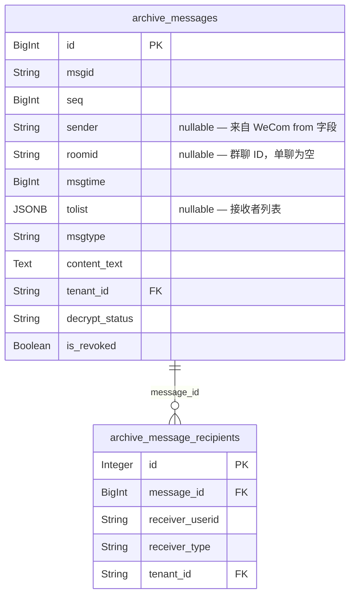
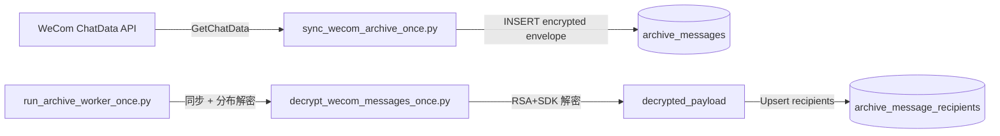
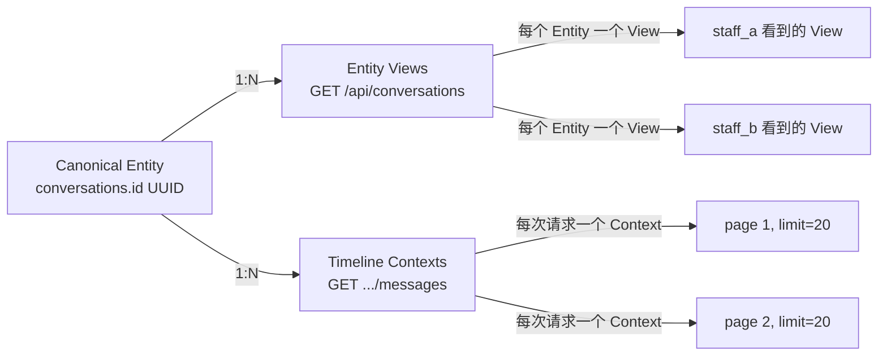
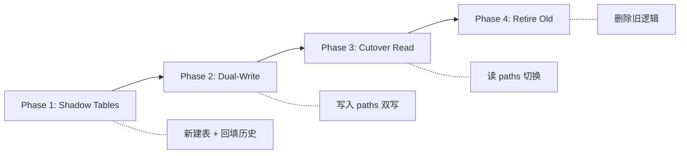

# ADR-0001: 会话领域模型架构评估

**状态**：已评审通过（v7，2026-07-21）  
**日期**：2026-07-21  
**作者**：架构分析  
**评审人**：Samuel  
**关联任务**：RND-209（本 ADR）

## 变更记录

| 版本 | 日期 | 变更内容 |
|------|------|----------|
| v1 | 2026-07-21 | 初始草案，9 章初稿 |
| v2 | 2026-07-21 | 修复 6 个阻塞：多接收者全员 canon_id、conversation_messages、复合 FK、非破坏 API、迁移可执行性、附录 |
| v3 | 2026-07-21 | 修复 6 个遗留：hash-based canon_id、旧 ID 1:N legacy alias、双写幂等、message 侧复合 FK、API 匹配 Pydantic、observed-participant |
| v4 | 2026-07-21 | 修复 5 个硬阻塞：完整 SHA-256 canon_id、Legacy Facade 方向、回填群聊 participants + 聚合回填、双写 FK 顺序 + savepoint、API 事实校正 |
| v5 | 2026-07-21 | 修复 4 个实现级阻塞：NULL 比较用 COALESCE、群聊 participants 实际 SQL 收集、成员 ON CONFLICT DO UPDATE + NULL msgtime 规范化、Legacy Facade 完整契约 |
| v6 | 2026-07-21 | 修复 4 个遗留：400 仅限 group+direct collision、Media 404 安全契约、Pass 2 COALESCE 聚合、first_seen_time LEAST 更新 |
| v7 | 2026-07-21 | 修复 1 个硬阻塞：alias_type 落库 + schema 去默认值 + CHECK 约束；非阻塞清理：SAVEPOINT 语法、API 表补 conversation_type、性能描述、风险措辞 |

---

## 目录

1. [当前会话架构](#1-当前会话架构)
2. [当前数据流](#2-当前数据流)
3. [会话身份模型](#3-会话身份模型方案建议)
4. [会话成员关系模型](#4-会话成员关系模型方案建议)
5. [三层概念切分](#5-三层概念切分方案建议)
6. [API 契约方案](#6-api-契约方案)
7. [迁移策略](#7-迁移策略)
8. [渐进式上线计划](#8-渐进式上线计划)
9. [风险与兼容性](#9-风险与兼容性)

---

## 1. 当前会话架构

### 1.1 表结构

当前系统**没有**独立的 `conversations` 表或 `conversation_members` 表。会话概念完全从消息级表中实时计算。

#### `archive_messages`（`backend/app/db/models.py:225`）



关键字段（来自 WeCom 解密后的 payload）：
- `sender`（`String(64)`）：消息发送者 userid，可为 `None`/`""`
- `roomid`（`String(64)`）：非空时为群聊 roomid；单聊时为 `None`/`""`
- `tolist`（`JSONB`）：接收者 userid 数组
- `msgtime`（`BigInteger`）：毫秒级时间戳，来自 WeCom ChatData
- `tenant_id`（`String(36)`, FK → `tenants.id`）: 租户隔离键

#### `archive_message_recipients`（`backend/app/db/models.py:321`）

单条消息的收件人拆分表，一行 = 一个 (message, receiver) 对：
- `message_id`（`BigInteger`, FK → `archive_messages.id`）
- `receiver_userid`（`String(64)`）：接收者身份
- `receiver_type`（`String(32)`）：通常为 `"user"`
- `tenant_id`（`String(36)`, FK → `tenants.id`）

该表在 `decrypt_wecom_messages_once.py:594` 解密阶段写入，按 `(message_id, receiver_userid, tenant_id)` 去重。

### 1.2 conversation_id 生成规则

`conversation_id` **不是**持久化存的，而是在查询时由 Python 函数动态拼接。

**单聊**（`_direct_conv_id`, `conversations.py:261`）：
```python
def _direct_conv_id(uid_a: str, uid_b: str) -> str:
    a, b = sorted([uid_a, uid_b])
    return f"direct__{a}___{b}"
```
- 两个 userid 排序后，以固定分隔符 `___` (三个下划线) 连接
- 前缀 `direct__` 后跟 `<sorted_uid_a>___<sorted_uid_b>`
- 单向情况（一个参与者）：`direct__<token>`（无 `___`）

**群聊**（`_derive_conversation_membership`, `conversations.py:1255`）：
```python
if roomid:
    return roomid, "group", staff_set, contact_set
```
- `conversation_id = roomid`，即 WeCom 原样 roomid 字符串
- 群聊 roomid 与 `direct__` 前缀**共享同一标识符空间**

**核心问题**：没有类型前缀区分，`roomid` 可以恰好等于 `direct__<a>___<b>` 格式的字符串，导致单聊 key 和群聊 roomid **碰撞**。

### 1.3 代码分层现状

| 层 | 当前状态 |
|---|---|
| **路由/控制器** | `backend/app/routers/conversations.py` — 单文件 158KB / ~3300 行 |
| **Service 层** | **不存在** — 所有业务逻辑内联在 route handler 和 `_fetch*` / `_build*` 私有函数中 |
| **Repository 层** | **不存在** — SQLAlchemy query 直接嵌入路由逻辑中 |
| **Domain 模型** | **不存在** — 无 `Conversation` / `ConversationMember` ORM 模型或 dataclass |
| **测试** | 混合了路由集成测试和纯函数单元测试，同文件 `test_staff_seats.py`，大量 collision / null-sender / entity 路径覆盖 |

**决策**：当前会话概念完全存在于查询时计算层面，缺少持久化领域实体。任何使会话演进为第一类实体（如审核状态、AI 摘要、标签、置顶）的功能，都需要先在数据模型中建立 `conversations` 实体。

---

## 2. 当前数据流

### 2.1 消息存储流



**三步流水线**（每个脚本独立进程，由 cron/scheduler 驱动）：

1. **拉取加密消息** (`sync_wecom_archive_once.py`)
   - 调用 `GetChatData(seq, limit=500)` 拉取一批加密消息
   - 插入 `archive_messages`，字段包括 `raw_encrypted_payload`, `encrypt_random_key`, `encrypt_chat_msg`
   - `decrypt_status = "pending"`
   - 按 `(tenant_id, msgid)` 去重（幂等）

2. **解密** (`decrypt_wecom_messages_once.py`)
   - 扫描 `decrypt_status IN ("pending", "failed")` 的记录
   - RSA 解密 `encrypt_random_key` → C SDK `DecryptData` → JSON
   - `_normalise_fields()` 提取 `sender`, `roomid`, `msgtime`, `tolist`, `msgtype`, `content_text`, `sdkfileid`
   - 更新 `archive_messages` 对应列，`decrypt_status = "success"`
   - **非致命调用** `_upsert_recipients()` 写入 `archive_message_recipients`
   - `repair_missing_recipients()` 恢复历史上因 transient 错误漏写的 recipient 行

3. **后续处理**（独立 worker，不影响会话模型）：
   - `run_archive_worker_once.py` — 协调/分配解密任务
   - Media download pipeline — `media_files` 表
   - Revoke reconciliation — `message_revocations` 表

**关键观察**：`sender`/`roomid`/`tolist` 完全来自 WeCom 解密后的 JSON。历史异常数据（`sender = None`/`""`, `tolist = []`）来自于：(a) WeCom 本身返回的畸形数据；(b) 早期版本未做 defensive normalization。

### 2.2 会话列表生成流

```mermaid
flowchart TD
    R[GET /api/conversations?mode=staff&staff_id=X] --> G[get_conversations]
    G --> A[_fetch_compact_messages_for_entity]
    A --> B[_entity_seed_ids: sender=X or recipient=X]
    B -->|seed_ids| C[Expand to full group room messages]
    C --> D[Compact projection: id, sender, roomid, msgtime, content_text]
    D --> E[_load_recipients_map_compact]
    E --> F[_build_conversation_list]
    F --> H[Python reduce: conv_id → bucket]
    H --> I[Sort: last_message_time DESC, conv_id DESC]
    I --> J[Return list[ConversationOut]]
```

**关键路径**（全部在 `conversations.py` 中）：

1. **种子 ID**（`_entity_seed_ids:993`）：查询 `archive_messages` + `archive_message_recipients` 中参与 entity 的所有消息 ID
2. **群聊扩展**：对种子消息中的 `roomid`，拉取该群聊的所有其他消息（确保群聊会话包含完整消息集）
3. **紧凑投影**（`_fetch_compact_messages_for_entity:1104`）：只选 id/sender/roomid/msgtime/content_text，避免 ORM 物化大字段（`raw_encrypted_payload`, `encrypt_*`, `decrypted_payload`, `structured_content` 等）
4. **Python reduce**（`_build_conversation_list:1269`）：遍历消息列表，按 `conversation_id` 分组到 dict bucket，累积 `monitored_account_ids`/`contact_ids`/`msgs`
5. **碰撞处理**（见 1.2）：group 永远赢过 direct（顺序无关）
6. **排序**：按 `(last_message_time, conversation_id)` 降序

**性能特征**：实时计算、无预聚合缓存。在消息量大（10 万+）的租户上，每个请求都需扫描大量行。

### 2.3 时间线查询流

```mermaid
flowchart TD
    R[GET /api/conversations/{id}/messages?before=cursor&limit=20] --> G[get_conversation_messages]
    G --> A[_fetch_conversation_messages]
    A -->|direct__ prefix| B[6-step resolution]
    A -->|plain roomid| C[_fetch_group_room_messages]
    B --> S1[Step 1: 查 roomid 是否存在]
    S1 --> S2[Step 2: collision merge]
    S2 --> S3[Step 3: pure group]
    S3 --> S4[Step 4: standard direct pair]
    S4 --> S5[Step 5: null-sender / orphan]
    S5 --> S6[Step 6: 400 invalid ID]
    C --> F[All messages for roomid]
    S2 --> G[cursor-based pagination]
    G --> H[msgtime:id composite cursor]
    H --> I[Response with media URLs]
```

**6 步解析流程**（`_fetch_conversation_messages:2030`，仅针对 `direct__` 前缀的 conversation_id）：

| Step | 条件 | 行为 |
|------|------|------|
| 1 | 无条件 | 先查 `roomid == conversation_id`（该字符串是否恰好是群聊 roomid） |
| 2 | Step 1 有结果 + 剩余部分可解析为 uid_a___uid_b + 有对应的 direct 消息 | collision merge（union，按 id 去重） |
| 3 | Step 1 有结果但无对应 direct pair | pure group，只返回群聊消息 |
| 4 | Step 1 无结果 + 可解析为 uid_a___uid_b | 标准 direct 路径（`_fetch_direct_pair_messages` + null-sender gap fix） |
| 5 | Step 1 无结果 + 不可解析为 pair | null-sender/orphan 候选验证路径（`_fetch_null_sender_candidate_messages` + `_derive_conversation_membership` re-verify） |
| 6 | 以上全无 | 400 Bad Request |

**游标分页**：
- 复合游标：`msgtime:id`（`conversations.py:2300` 的 `before` 参数）
- 明文 `msgtime:id` 格式传给前端
- `msgtime DESC, id DESC` 顺序，先拿最新的 N 条
- 分页边界：`limit` ∈ [1, 100]
- **性能约束**：当前实现会加载完整结果集后在 Python 中排序分页（`conversations.py:2430`），而非 SQL 层分页。消息量大时是性能瓶颈——新模型通过 `conversation_messages` 表的 SQL 游标分页消除此约束

**空 sender 处理**（`_fetch_null_sender_candidate_messages:1885`）：
- 当 `sender IS NULL/""` 时，消息只能通过 `archive_message_recipients` 匹配到会话
- `require_null_sender=True` 模式：收窄候选范围到 `sender IS NULL/""` 消息，仅匹配 recipient 列
- `require_null_sender=False`（默认）：同时匹配 sender 和 recipient（用于 one-sided/orphan 分支）
- Candidate-then-verify 模式：候选查询 → 用 `_derive_conversation_membership` 重算 conv_id → 只保留匹配的

**决策**：当前数据流完全依赖 Python 层实时计算和 SQL 动态查询。会话没有任何持久化状态，每次列表/时间线请求都要重新计算所有内容。这是引入预计算/缓存会话实体模型的核心动机。

---

## 3. 会话身份模型（方案建议）

### 3.1 现状分析

**问题 1：无类型前缀区分，标识符空间冲突**

```
direct__contact_zhangsan___staff_yingzi  ← 单聊 key（代码生成）
direct__contact_zhangsan___staff_yingzi  ← 群聊 roomid（WeCom 反回，恰好相等）
```

当 WeCom 群聊 roomid 本身恰好等于 `_direct_conv_id(some_a, some_b)` 的返回值时，两条不同结构的消息（一条有 roomid + 群聊成员、一条无 roomid + 两方参与者）会被 `_build_conversation_list` 合并到同一个 bucket。当前通过 "group always wins" 协议处理，但这只是权宜之计——bucket 内的 `conversation_type` 变为 "group"，但桶内混杂两种消息类型。

**问题 2：lossy canonicalization（`_derive_conversation_membership`）**

当消息有  ≥ 3 个参与者时（如多接收者 postman-type 消息），`_derive_conversation_membership` 只取排序后的前两个参与者生成 `direct__<a>___<b>`——第三个参与者的身份信息在 conversation_id 的文本表示中丢失。这意味着：
- 一个 3 人参与的消息会被归入一个只有 2 人名字的 bucket
- 另外 2 人参与的、第三个不同的消息也可能被归入同一个 bucket
- conversation_id 不能可靠地映射回所有真实参与者

**问题 3：单向/幽灵会话**

`direct__<single_token>`（无 `___`）用于只有 sender 无 recipient 或反之的情况——这些会话在列表中出现但在 `_derive_conversation_membership` 中无法与其他正常会话区分含义。

### 3.2 方案：类型前缀 + 内容哈希 + UUID 主键

**core insight**：原始 userid 直接拼接不安全——userid 本身可能包含分隔符（`___`），导致 `["a", "b___c"]` 和 `["a___b", "c"]` 产生相同拼接结果。因此 **canonical ID 必须基于内容哈希**，不能基于原始 ID 拼接。

**选定方案**：UUID 内部主键 + `canon_id` 基于 SHA256 内容哈希。

```python
import hashlib

def is_group_roomid(roomid: str | None) -> bool:
    """共享规范化：匹配 conversations.py:781 行为。
    roomid 非空（含纯空白）= 群聊。不用 trim()，避免回填/双写不一致。"""
    return bool(roomid)  # None 和 "" → False; "  " → True

def compute_canon_id(conversation_type: str, participants: list[str] | None, roomid: str | None) -> str:
    if conversation_type == "group":
        return f"gr_{roomid}"
    # direct: 参与者去重排序后用 \x00 连接，完整 SHA-256 hex 作为 ID
    sorted_parts = sorted(set(p for p in participants if p))
    joined = "\x00".join(sorted_parts)
    hash_hex = hashlib.sha256(joined.encode("utf-8")).hexdigest()  # 64 字符
    return f"dc_{hash_hex}"
```

**Canonical conversation ID 定义**：
- **Direct**: `dc_<full_sha256_hex>` — 完整 64 字符 hex，基于 SHA256(sorted_participants joined by `\x00`)
  - 2 人单聊: `dc_a1b2c3d4e5f6a7b8c9d0e1f2a3b4c5d6e7f8a9b0c1d2e3f4a5b6c7d8e9f0a1b2`
  - 3 人消息: `dc_f9e8d7c6...`（全员参与，不同组合自然产生不同 hash）
- **Group**: `gr_<roomid>` — WeCom roomid，不做任何变换
- **空间隔离保证**：`dc_` 和 `gr_` 前缀互斥；`\x00` 不能出现在 WeCom userid 中，因此拼接唯一
- **碰撞保证**：使用完整 SHA-256（256 bit），在 participant set 数量级上碰撞概率工程上可忽略。不截断。`participants_hash` 与 canon_id 主体相同，不能用于检测碰撞；发生疑似碰撞时应比较存储的完整 `participants` JSON 列确认。

**conversations 表新字段**：
```sql
CREATE TABLE conversations (
    id UUID PRIMARY KEY DEFAULT gen_random_uuid(),
    tenant_id VARCHAR(36) NOT NULL REFERENCES tenants(id),
    canon_id VARCHAR(256) NOT NULL,                  -- dc_<full_sha256_hex> (67 chars) 或 gr_<roomid>
    conversation_type VARCHAR(16) NOT NULL CHECK (conversation_type IN ('direct', 'group')),
    raw_roomid VARCHAR(64),                          -- 仅 group，保留原始 WeCom roomid
    participants JSONB,                              -- 仅 direct：排序去重后的 participant 列表
    participants_hash VARCHAR(64),                   -- 仅 direct：完整 SHA256 hex（与 canon_id 主体相同，冗余存储便于索引）
    display_name VARCHAR(512),
    last_message_time BIGINT,
    last_message_text TEXT,
    last_message_id BIGINT,                          -- 最新消息的 archive_messages.id，用于同 msgtime tiebreak
    message_count INTEGER DEFAULT 0,
    created_at TIMESTAMPTZ DEFAULT NOW(),
    updated_at TIMESTAMPTZ DEFAULT NOW(),
    UNIQUE(tenant_id, canon_id),
    UNIQUE(tenant_id, id)  -- 复合键，供 FK 引用
);
```

### 3.3 Legacy compatibility：旧 ID 1:N 映射

**问题**：旧代码将 3 人消息的前两人编码为 `direct__<a>___<b>`，因此同一个旧 conversation_id 可能对应**多个**新 canon_id：
```
旧: direct__contact_first___staff_a
新: dc_<hash([contact_first, staff_a])>
新: dc_<hash([contact_first, contact_second, staff_a])>
```

这不是 1:1 前缀替换能处理的。

**方案：Legacy Alias 兼容视图**

新增 `conversation_aliases` 表记录旧 ID → 新 canon_id 的多对多关系：
```sql
CREATE TABLE conversation_aliases (
    id BIGINT PRIMARY KEY GENERATED ALWAYS AS IDENTITY,
    tenant_id VARCHAR(36) NOT NULL,
    legacy_id VARCHAR(256) NOT NULL,                 -- 旧格式 conversation_id
    canon_id VARCHAR(256) NOT NULL,                  -- 对应的新 canon_id
    alias_type VARCHAR(16) NOT NULL CHECK (alias_type IN ('direct', 'group')),
    created_at TIMESTAMPTZ DEFAULT NOW(),
    FOREIGN KEY (tenant_id, canon_id) REFERENCES conversations(tenant_id, canon_id),
    UNIQUE(tenant_id, legacy_id, canon_id)
);
CREATE INDEX ix_ca_tenant_legacy ON conversation_aliases(tenant_id, legacy_id);
```

**API 解析规则**（`/api/conversations/{id}/messages` 输入处理）：
```
输入 conversation_id:
├── dc_ / gr_ 前缀 → 新格式，直接查 conversations
├── direct__ 前缀 → 旧格式:
│   ├── 查 conversation_aliases WHERE legacy_id = input
│   │   ├── 1 条映射 → 直接使用该 canon_id（无歧义）
│   │   └── N 条映射 (N>1) → Legacy Facade 模式:
│   │       v1 API: UNION 查询所有 alias 对应的 conversation_messages
│   │              → 合并结果，保持与旧 6 步解析相同的输出行为
│   │              → 400/200 规则见 §6.4（纯 direct 返回 200，group+direct 无 context 返回 400）
│   │       v2 API: 返回拆分后的 canonical entities 列表
│   │              → canonical_conversation_ids 字段（复数）
│   ├── 0 条映射 → 400（未知旧 ID，已失效）
│   └── 同时若输入引用了存在的 group roomid → 加入 alias 候选
└── 其他（纯 roomid）→ gr_<roomid>
```

**关键设计**：entity context（staff_id / contact_id）**不能**消歧——因为 2 人会话 `[staff_a, contact_first]` 和 3 人会话 `[staff_a, contact_first, contact_second]` 都包含 `staff_a` 和 `contact_first`。因此 v1 采用 **Legacy Facade**：对旧 ID 对应的所有 canonical conversations 执行 UNION 查询，输出合并后的消息列表，与当前 6 步解析的合并行为完全一致。v2 端点返回拆分后的 canonical entities。

**API 字段**：`canonical_conversation_id`（单数，可能为 null）用于无歧义场景；`canonical_conversation_ids`（复数，list）用于多 alias 场景。前端可渐进迁移到复数字段。

### 3.4 优缺点比较

| 方案 | 优点 | 缺点 |
|---|---|---|
| **A. 保持现状** | 改动最小 | 永远不能根除 collision |
| **B. 拼接 + 前缀** (v2) | 人类可读 | 分隔符注入风险；旧 ID 1:N 无法映射 |
| **C. 内容哈希 + UUID**（选定） | 防注入；1:N legacy alias 明确；完整 SHA-256 碰撞概率工程上可忽略 | canon_id 不可读（67 字符 hex） |

**决策**：采用方案 C — `dc_<full_sha256_hex>`（完整 64 字符）+ `gr_<roomid>`。participant set 通过 `\x00` 连接后完整 SHA-256 哈希，消除分隔符注入风险且碰撞概率工程上可忽略。旧 ID 1:N 映射通过 `conversation_aliases` 表 + Legacy Facade（UNION 查询）处理，v1 保持合并行为，v2 返回拆分 entities。

---

## 4. 会话成员关系模型（方案建议）

### 4.1 现状分析

**无显式成员表**：当前系统没有 `conversation_members` 表。成员关系通过以下方式反推：

1. **群聊**：消息属于 `roomid` → 从 `archive_message_recipients` 中收集该 roomid 下所有曾经出现过的接收者
2. **单聊**：从 `_direct_conv_id` 生成的 key 中解析出两个 userid，或从消息的 sender/recipient 推断

**问题**：
- 每次查询需扫描大量 `archive_message_recipients` 行来推断成员关系
- 成员离开/加入无记录——无法知道某人是否还 "在当前会话" 中
- 历史成员无法与当前成员区分
- 不可直接回答 "这个会话有哪些参与者" 而不做数据库扫描

### 4.2 方案：显式 `conversation_members` 表

```sql
-- conversations 完整定义见 §3.2；此处仅示 FK 相关列
CREATE TABLE conversations (
    id UUID PRIMARY KEY DEFAULT gen_random_uuid(),
    tenant_id VARCHAR(36) NOT NULL REFERENCES tenants(id),
    canon_id VARCHAR(256) NOT NULL,
    conversation_type VARCHAR(16) NOT NULL CHECK (conversation_type IN ('direct', 'group')),
    -- ... 其余列见 §3.2 (participants, display_name, last_message_time 等)
    UNIQUE(tenant_id, canon_id),
    UNIQUE(tenant_id, id)
);

CREATE TABLE conversation_members (
    id BIGINT PRIMARY KEY GENERATED ALWAYS AS IDENTITY,
    tenant_id VARCHAR(36) NOT NULL,
    conversation_id UUID NOT NULL,
    member_userid VARCHAR(64) NOT NULL,
    member_type VARCHAR(16) NOT NULL CHECK (member_type IN ('staff', 'contact', 'unknown')),
    first_seen_time BIGINT NOT NULL,
    last_seen_time BIGINT NOT NULL DEFAULT 0,
    membership_state VARCHAR(16) NOT NULL DEFAULT 'unknown'
        CHECK (membership_state IN ('unknown', 'active', 'left')),
    join_source VARCHAR(32) DEFAULT 'inferred',
    created_at TIMESTAMPTZ DEFAULT NOW(),
    updated_at TIMESTAMPTZ DEFAULT NOW(),
    -- 复合外键：防止跨租户错误引用
    FOREIGN KEY (tenant_id, conversation_id) REFERENCES conversations(tenant_id, id) ON DELETE CASCADE,
    UNIQUE(tenant_id, conversation_id, member_userid)
);

CREATE INDEX ix_cm_tenant_member ON conversation_members(tenant_id, member_userid);
CREATE INDEX ix_cm_tenant_conv ON conversation_members(tenant_id, conversation_id);
```

**字段说明**（"观察到的参与者" 模型）：
- `first_seen_time` / `last_seen_time`：用 `msgtime`（毫秒时间戳）标记该 userid 在消息中出现的时间窗口
- `membership_state`（`unknown`/`active`/`left`）：真实的加入/退出状态。**默认 `unknown`**——"在消息中出现过"不等于"仍在该会话中"
- `member_type`：在首次 observed 时根据 `tenant_id` 下的 staff/contact 分类确定
- `join_source`：`'inferred'`（从消息流推断）| `'wecom_event'`（仅未来有可靠事件时设置）

### 4.3 观察者生命周期

```
┌──────────┐    新消息出现该 userid     ┌──────────┐
│ Pending  │ ──────────────────────────→ │ Observed │
│ (不存在)  │   INSERT (first_seen=now)   │          │
└──────────┘                             └────┬─────┘
                                              │
                     后续消息出现该 userid        │
                      UPDATE last_seen_time     │
                                              ↓
                                         ┌──────────┐
                                         │ Observed │
                                         │ (更新过)  │
                                         └──────────┘
```

- **创建**：当某 userid 首次作为 sender 或 recipient 出现在消息中 → INSERT，`membership_state = 'unknown'`
- **更新**：每次该 userid 再出现 → UPDATE `last_seen_time`
- **从不自动标记** `left`：离开事件需可靠来源（未来 wecom_event），不可从"无消息"推断
- **从不删除**：观察记录永久保留用于审计和统计

**决策**：模型明确命名为"observed participant"——区分"在消息中出现过"与"真实成员状态"。`membership_state` 默认 `unknown`，仅可靠事件可设置为 `active` 或 `left`。这避免了用 30 天无消息就标记 `inactive` 的错误语义。复合外键 `(tenant_id, conversation_id)` 保证数据库层面阻止跨租户错误引用。

### 4.4 消息归属：`conversation_messages` 关联表

当前消息查询完全依赖 6 步解析动态计算 "消息属于哪个会话"。新模型需建立持久化的 message → conversation 关联，使得时间线查询、搜索、未读计数、导出和分析等能力能可靠回答 "这条消息属于哪个规范会话"。

```sql
CREATE TABLE conversation_messages (
    id BIGINT PRIMARY KEY GENERATED ALWAYS AS IDENTITY,
    tenant_id VARCHAR(36) NOT NULL,
    conversation_id UUID NOT NULL,
    message_id BIGINT NOT NULL,
    created_at TIMESTAMPTZ DEFAULT NOW(),
    -- 复合外键：双侧均防止跨租户错误引用
    FOREIGN KEY (tenant_id, conversation_id) REFERENCES conversations(tenant_id, id) ON DELETE CASCADE,
    FOREIGN KEY (tenant_id, message_id) REFERENCES archive_messages(tenant_id, id) ON DELETE CASCADE,
    UNIQUE(tenant_id, message_id)  -- 一条消息只属于一个会话
);

CREATE INDEX ix_cmsg_tenant_conv ON conversation_messages(tenant_id, conversation_id);
CREATE INDEX ix_cmsg_tenant_msg ON conversation_messages(tenant_id, message_id);
```

**设计理由**：
- **不修改 `archive_messages`**：该表存储 WeCom 原始数据，保持不可变
- **一条消息一个会话**：`UNIQUE(tenant_id, message_id)` 确保确定性归属
- **双侧复合 FK**：`(tenant_id, conversation_id)` → `conversations` + `(tenant_id, message_id)` → `archive_messages`，数据库层面阻止跨租户错误引用
- `archive_messages` 已有复合唯一约束 `UNIQUE(tenant_id, id)`（`models.py:252`）支持此 FK

**填充时机**：
- Phase 2（双写）：解密后计算消息的 canon_id → `INSERT ... ON CONFLICT DO NOTHING`
- Phase 1（回填）：一次性扫 `archive_messages`，对每条消息计算 participant set，分组后批量 INSERT

**影响**：
- `GET /api/conversations/{id}/messages` 改为：`canon_id → conversations.id → conversation_messages.message_id → archive_messages.*`
- 不再依赖旧的 6 步碰撞解析来定位消息归属
- 支撑后续搜索、未读、导出等能力的查询基础

---

## 5. 三层概念切分（方案建议）

### 5.1 三层定义

当前代码的 "会话" 概念模糊，同一个词在不同上下文中指不同的东西。将其拆分为三层：

```
┌──────────────────────────────────────────────────────────┐
│  Layer 1: Canonical Conversation Entity                  │
│  (持久化在 conversations 表中)                             │
│  - canon_id: "dc_<sha256_hex>", "gr_wrQkLwCgAA..."        │
│  - 全局唯一、租户隔离、系统内部标识                         │
│  - 直接映射到 1 个 conversation row（UUID PK）             │
├──────────────────────────────────────────────────────────┤
│  Layer 2: Entity-Scoped Conversation View                │
│  (在 API 响应中、不含持久化)                               │
│  - 按 staff_id / contact_id 过滤后的视图                  │
│  - 包含: display_name, monitored_account_ids,            │
│    contact_ids, last_message_time, message_count          │
│  - 同一个 Canonical Entity → 不同 Entity 看到不同 View    │
├──────────────────────────────────────────────────────────┤
│  Layer 3: Timeline Navigation Context                    │
│  (纯 API 参数层、无持久化)                                 │
│  - cursor (opaque msgtime:id token)                      │
│  - limit, mode, staff_id/contact_id                      │
│  - conversation_type (用于一致性校验)                       │
│  - 仅用于分页/排序/导航                                    │
└──────────────────────────────────────────────────────────┘
```

### 5.2 映射关系



### 5.3 代码层映射（建议实现位置）

| 层 | 实现位置 | 职责 |
|---|---|---|
| Canonical Entity | `backend/app/models/conversation.py` — SQLAlchemy ORM model | 持久化、唯一标识 |
| Entity-Scoped View | `backend/app/services/conversation_service.py` — `build_entity_view()` | 按 entity 过滤、排序、组装响应 |
| Timeline Context | `backend/app/services/message_service.py` — `fetch_timeline()` | 分页、游标、解析 |

**决策**：三层概念必须明确分离。规范会话实体（Layer 1）是数据库中的一行，通过 `canon_id` 唯一标识。Entity-Scoped View（Layer 2）是 API 响应体，同一个 Entity 可能在不同请求者眼中呈现不同内容（display_name、参与者状态）。Timeline Context（Layer 3）纯属 API 参数，不应混入 domain 模型。

---

## 6. API 契约方案

### 6.1 现状端点

| 方法 | 路径 | 功能 | 查询参数 |
|------|------|------|----------|
| GET | `/api/conversations` | 会话列表 | `mode` (staff/contact), `staff_id`, `contact_id` |
| GET | `/api/conversations/{id}/messages` | 时间线 | `limit`, `before` (cursor), `mode`, `staff_id`, `contact_id`, `conversation_type` |
| GET | `/api/conversations/{id}/messages/{msgid}/media` | 媒体下载 | `mode`, `staff_id`, `contact_id`, `conversation_type` |
| GET | `/api/conversations/{id}/messages/{msgid}/nested-media/{item_path}` | 嵌套媒体（结构化消息内嵌） | `mode`, `staff_id`, `contact_id`, `conversation_type` |
| GET | `/api/monitored-accounts` | 被监控账号列表 | — |
| GET | `/api/contacts` | 联系人列表 | — |

### 6.2 稳定后 API 契约

**核心约束**：API 响应结构不做破坏性变更。所有新增字段为**加法式追加**，不删除或改名任何现有字段。

**Pydantic 2 注意**：项目使用 Pydantic 2.13.4。前导下划线字段（如 `_canon_id`）不会被 Pydantic 序列化到响应中。所有增量字段必须使用普通名称。

**GET /api/conversations**

响应（200）— 保持数组格式，匹配实际 `ConversationOut` 结构：
```json
[
  {
    "conversation_id": "direct__contact_bob___staff_alice",
    "canonical_conversation_id": "dc_a1b2c3d4...",
    "canonical_conversation_ids": ["dc_a1b2c3d4..."],
    "conversation_type": "direct",
    "display_name": "Bob",
    "raw_id": "contact_bob",
    "roomid": null,
    "monitored_account_ids": ["staff_alice"],
    "monitored_account_raw_ids": ["staff_alice"],
    "monitored_account_display_names": ["Alice"],
    "contact_ids": ["contact_bob"],
    "contact_raw_ids": ["contact_bob"],
    "contact_display_names": ["Bob"],
    "room_display_name": null,
    "room_raw_id": null,
    "last_message_time": 1750924800000,
    "last_message_text": "好的，明天见",
    "message_count": 153,
    "latest_sender_id": "contact_bob",
    "latest_sender_raw_id": "contact_bob",
    "latest_sender_display_name": "Bob",
    "review_status": null,
    "ai_status": null,
    "ai_summary": null
  }
]
```

**变更说明**：
- 响应仍是 `list[ConversationOut]` — 前端 `forEach` 不改
- **所有现有字段完整保留**（含 raw_ids / display_names / roomid / review_status / ai_* 等）
- `raw_id`：当前实现对 direct conversation 使用首个 contact/staff 的 raw ID（`conversations.py:1363`），不是拼接值——示例已更正
- **新增字段**：
  - `canonical_conversation_id`（str | null）— 无歧义时为新格式 `dc_`/`gr_`；多 alias 时为 null
  - `canonical_conversation_ids`（list[str]）— 旧 ID 1:N 映射时的全部 canonical ID 列表
- `conversation_id` 保持旧格式（前端兼容）；前端可渐进迁移到 `canonical_conversation_ids`

**GET /api/conversations/{id}/messages**

响应（200）— 匹配实际 `ConversationMessagesOut` 结构（`TimelineMessageOut` 完整字段见 `conversations.py`，此处仅示代表性字段）：
```json
{
  "messages": [
    {
      "msgid": "msg_abc123",
      "action": null,
      "sender": "contact_bob",
      "sender_display_name": "Bob",
      "sender_raw_id": "contact_bob",
      "recipients": ["staff_alice"],
      "recipient_display_names": ["Alice"],
      "recipient_raw_ids": ["staff_alice"],
      "msgtime": 1750924800000,
      "msgtype": "text",
      "content_text": "好的，明天见",
      "roomid": null,
      "decrypt_status": "success",
      "media_type": "none",
      "media_status": null,
      "unsupported_reason": null,
      "media_url": null,
      "canonical_conversation_id": "dc_a1b2c3d4..."
    }
  ],
  "pagination": {
    "has_older": true,
    "next_before": "1750924800000:12345"
  }
}
```

**变更说明**：
- **所有现有 `TimelineMessageOut` 字段完整保留**——完整字段列表见 `conversations.py` 中的 Pydantic model 定义（含 `action`, `media_*`, `unsupported_reason`, `decrypt_status` 等）
- `pagination.next_before` 是**明文** `msgtime:id` 格式（`conversations.py:1633`），不是 Base64——示例已更正
- `pagination.has_older` + `pagination.next_before` 字段名不变
- **新增字段**：`canonical_conversation_id` — 每条消息回显其归属的规范会话 ID
- 查询逻辑从旧 6 步碰撞解析改为：`canonical_conversation_id → conversations.id → conversation_messages.message_id → archive_messages.*`
- **当前性能约束**：现有实现会加载完整结果后在 Python 中排序分页（`conversations.py:2430`），新模型通过 `conversation_messages` 表的 SQL 分页消除此约束

### 6.3 向下兼容策略

```
┌─────────────────────────────────────────────────────────────┐
│              API Router — conversation_id 输入解析            │
│                                                              │
│  输入 conversation_id                                        │
│    ├── 以 "dc_" / "gr_" 开头 → 新格式，直接查 conversations   │
│    ├── 以 "direct__" 开头 → 旧格式，查 conversation_aliases   │
│    │   │  legacy_id = input                                  │
│    │   ├── 1 条映射 → 使用该 canon_id（无歧义）               │
│    │   ├── N 条映射 (N>1) → Legacy Facade (详见 §6.4):          │
│    │   │   v1: 纯 direct alias → UNION 返回 200                 │
│    │   │       group+direct alias 无 entity context → 400       │
│    │   │       有 entity context → 逐消息过滤后 UNION            │
│    │   │   v2: 返回拆分的 canonical entities 列表               │
│    │   ├── 0 条映射 + 查 conversations(roomid) →              │
│    │   │   命中 → gr_（群聊 roomid 以 direct__ 开头）         │
│    │   └── 0 条映射 + 无 roomid → 400（无效旧 ID）            │
│    └── 其他（纯 roomid）→ gr_<roomid>                        │
│                                                              │
│  输出 canonical_conversation_id (单数|null) +                │
│        canonical_conversation_ids (复数|list)                │
└─────────────────────────────────────────────────────────────┘
```

**兼容保证**：旧 `direct__<a>___<b>` 不再按前缀映射。`conversation_aliases` 表在回填时一次性生成所有旧 ID → 新 canon_id 的映射，精确覆盖 1:N 情况。entity context（staff_id / contact_id）**不能**消歧——2 人和 3 人会话可共享同一 entity。因此 v1 采用 Legacy Facade：UNION 查询所有 alias 对应的会话消息，合并后返回，与旧 6 步解析的合并行为完全一致。v2 返回拆分后的 canonical entities。

**决策**：API 响应结构不做破坏性变更——保持数组格式、完整保留所有现有 Pydantic 字段、保留 `pagination.has_older` 等字段名不变。`conversation_id` 保持旧格式值（前端兼容），新增 `canonical_conversation_id`（单数，可 null）和 `canonical_conversation_ids`（复数，list）字段。旧 ID 1:N 映射通过 `conversation_aliases` 表 + **Legacy Facade**（v1 UNION 查询保持合并行为）处理，v2 返回拆分 entities。entity context 不能消歧（2 人和 3 人会话可共享同一 entity），因此 v1 不做消歧而是合并查询。

### 6.4 Legacy Facade 完整契约

v1 API 在 Phase 3 切读后必须保持与当前 6 步解析完全等价的行为。以下逐路由定义 Facade 规则：

#### GET /api/conversations（会话列表）

**当前行为**：`_build_conversation_list` 按 entity context 过滤消息后 Python reduce 聚合，collision 时 group wins。

**Facade 规则**：
1. 查询 `conversation_aliases` 获取旧 legacy_id 对应的全部 canonical conversations
2. 对每个 canonical conversation，通过 `conversation_members` 过滤出包含当前 entity（staff_id 或 contact_id）的会话
3. **entity-scoped 聚合**：对每个 canonical conversation，仅统计该 entity 实际参与的消息（通过 `conversation_messages` JOIN `archive_messages` 的 sender/recipient 过滤），而非 conversation 全部消息
4. **legacy row 合并**：当多个 canonical conversations 共享同一 legacy_id 时，合并为一个 legacy row：
   - `message_count` = 各 canonical conversation 的 entity-scoped count 之和
   - `last_message_time` / `last_message_text` = 各 canonical conversation 中 entity-scoped 最新消息的全局最新
   - `monitored_account_ids` / `contact_ids` = 各 canonical conversation 的并集
5. **collision 行为保留**：当旧 ID 同时映射到 group 和 direct canonical conversations 时，group wins（与当前 `_build_conversation_list` 行为一致）

#### GET /api/conversations/{id}/messages（时间线）

**当前行为**：6 步解析，entity context 逐消息过滤 direct/group 两侧。400 **仅在 group+direct collision 且无 entity context 时返回**（`conversations.py:2231`）；纯 direct 多 alias 返回 200 + 全部消息（`conversations.py:2251`）。

**Facade 规则**：
1. 输入旧 ID → 查 `conversation_aliases`
2. **纯 direct alias（1 个或多个，无 group）**：UNION 查询全部 direct canonical conversations 的消息 → 返回 **200**（与当前 `conversations.py:2251` 行为一致）
3. **同时存在 direct 和 group alias + 无 entity context**：返回 **400 Bad Request**（与 `conversations.py:2231` 行为一致，测试 `test_staff_seats.py:2960` 锁定）
4. **有 entity context（任意 alias 组合）**：UNION 查询所有 alias canonical conversations 的消息，**逐消息按 entity context 过滤**（sender = entity OR entity IN recipients），合并后按 `(COALESCE(msgtime, 0) DESC, id DESC)` 排序 + 游标分页
5. **1:1 alias**：直接查该 canonical conversation，仍按 entity context 过滤
6. **group + direct collision + 有 entity context**：当前 6 步解析 Step 2 做 collision merge（union，按 id 去重）——Facade 通过 alias 表同时查到 group 和 direct canonical conversations 后 UNION 去重，行为等价

#### alias_type 处理

`conversation_aliases.alias_type` 列在回填和双写中必须显式写入正确值（`'direct'` 或 `'group'`），不能依赖默认值。群聊 alias 若被默认标记为 `'direct'`，会导致上述 400 规则误判。

**替代方案**：删除 `alias_type` 冗余列，始终 JOIN `conversations.conversation_type` 判断类型。本 ADR 采用**显式写入**方案，避免每次查询都 JOIN conversations 表。

#### GET /api/conversations/{id}/messages/{msgid}/media 和 nested-media

**当前行为**：通过 conversation_id 定位消息归属 + entity context 授权检查。**授权失败统一返回 404**（不泄露消息是否存在，`conversations.py:2738`）；`conversation_type` 不一致返回 400（`conversations.py:2761`）。

**Facade 规则**（保持安全契约）：
1. 输入旧 ID → 同时间线 Facade 解析到 canonical conversation(s)
2. 验证 msgid 属于这些 canonical conversations 之一（`conversation_messages` 表）→ 不属于则 **404**
3. 验证 entity context 对该消息有访问权（sender = entity OR entity IN recipients）→ 无权则 **404**（非 403，不泄露消息存在）
4. 验证 `conversation_type` 参数与实际消息类型一致 → 不一致则 **400**
5. group+direct 歧义且无 entity context → **400**
6. 通过则返回媒体

**安全原则**：404 用于所有"不存在/无权"场景，400 仅用于"参数语义错误"（类型不一致、歧义无 context）。

#### 性能考虑

Legacy Facade 的 UNION + entity-scoped 过滤在 alias 数量多时可能较慢。优化策略：
- `conversation_members(tenant_id, member_userid)` 索引支持 entity 过滤
- `conversation_messages(tenant_id, conversation_id)` 索引支持消息查询
- Phase 3 Batch 0 验证 P99 延迟 ≤ 旧路径 1.5x（Facade 有额外 JOIN 开销）
- 若性能不可接受，Phase 3 可回退到旧 6 步解析路径（flag 控制）

---

## 7. 迁移策略

### 7.1 四阶段迁移概览



### 7.2 Phase 1: Shadow Tables（影子表）

**目标**：新建 `conversations` + `conversation_members` + `conversation_messages` + `conversation_aliases` 四张表，从历史数据回填。

**步骤**：
1. 创建 Alembic migration，包含四张表（字段见 §3.2, §4.2, §4.4, §3.3）
2. 编写一次性回填脚本 `scripts/backfill_conversations_once.py`：
   - 按 `tenant_id` 分批处理
   - 对每个 tenant，**按消息的 participant set 直接分组**——不依赖 `_fetch_compact_messages_for_entity`（该函数需要 entity_id 输入，而回填需要覆盖所有 entity）
   - 回填算法伪代码：
     ```
     FOR each tenant_id:
       -- Pass 1: 创建 conversation shells + message links + members + aliases
       -- 按消息逐条处理（不预收集整个房间历史，避免成员时间错误）
       SELECT id, sender, roomid, tolist, msgtime, content_text FROM archive_messages
         WHERE tenant_id = ? AND decrypt_status = 'success'
         ORDER BY msgtime ASC NULLS FIRST, id ASC
       FOR each message:
         -- NULL msgtime 规范化（ArchiveMessage.msgtime 可为 NULL，models.py:299）
         norm_msgtime = COALESCE(msgtime, 0)

         -- roomid 规范化：使用共享函数 is_group_roomid(roomid)
         -- 匹配当前 conversations.py:781 行为：roomid 非空（含纯空白）= 群聊
         -- 不用 trim()，避免回填和双写对同一数据产生不同判定
         IF is_group_roomid(roomid):
           canon_id = "gr_" + roomid
           conversation_type = "group"
           -- 群聊 participants 从本消息的 sender + recipients 提取（非整个房间历史）
           raw_parts = [sender] + (tolist or [])
           participants = sorted(set(p for p in raw_parts if p))
         ELSE:
           conversation_type = "direct"
           raw_parts = [sender] + (tolist or [])
           participants = sorted(set(p for p in raw_parts if p))
           IF not participants:
             -- 空 sender + 空 tolist：跳过 conversation_members
             canon_id = "dc_orphan_" + str(message_id)
             participants = []
           ELSE:
             participants_hash = sha256("\x00".join(participants)).hexdigest()
             canon_id = "dc_" + participants_hash

         -- Step A: 创建/获取 conversation shell（FK 依赖顺序：先有 conversation）
         conv = INSERT INTO conversations (tenant_id, canon_id, conversation_type, participants, ...)
                  VALUES (...)
                  ON CONFLICT (tenant_id, canon_id) DO NOTHING
                  RETURNING id
         IF conv IS NULL:
           conv = SELECT id FROM conversations WHERE tenant_id=? AND canon_id=?

         -- Step B: 插入 message link（幂等）
         INSERT INTO conversation_messages (tenant_id, conversation_id, message_id)
           VALUES (?, conv.id, ?) ON CONFLICT (tenant_id, message_id) DO NOTHING

         -- Step C: 插入/更新 members（ON CONFLICT DO UPDATE 同时更新 first_seen 和 last_seen）
         -- 解密按 ArchiveMessage.id 处理（非 msgtime），补洞/重试可能后写更早的历史消息
         -- 因此 first_seen_time 必须用 LEAST 更新，last_seen_time 用 GREATEST
         FOR each p IN participants:
           INSERT INTO conversation_members (tenant_id, conversation_id, member_userid,
                                              first_seen_time, last_seen_time, ...)
             VALUES (?, conv.id, ?, norm_msgtime, norm_msgtime, ...)
             ON CONFLICT (tenant_id, conversation_id, member_userid) DO UPDATE SET
               first_seen_time = LEAST(conversation_members.first_seen_time, EXCLUDED.first_seen_time),
               last_seen_time = GREATEST(conversation_members.last_seen_time, EXCLUDED.last_seen_time)

         -- Step D: 写入 legacy alias
         -- legacy_id 使用现有 _derive_conversation_membership / _direct_conv_id 算法（仅用于 alias 生成）
         legacy_id = compute_legacy_conv_id(message)
         INSERT INTO conversation_aliases (tenant_id, legacy_id, canon_id, alias_type)
           VALUES (?, legacy_id, canon_id, conversation_type)
           ON CONFLICT (tenant_id, legacy_id, canon_id)
           DO UPDATE SET alias_type = EXCLUDED.alias_type

       -- Pass 2: 回填聚合（message_count, last_message_time, last_message_text, last_message_id）
       UPDATE conversations c SET
         message_count = sub.cnt,
         last_message_time = sub.max_time,
         last_message_text = sub.last_text,
         last_message_id = sub.last_id
       FROM (
         SELECT cm.conversation_id,
                COUNT(*) as cnt,
                -- 用 COALESCE 统一 NULL msgtime，与双写 norm_msgtime 语义一致
                -- 避免 PostgreSQL DESC 默认 NULL-first 导致 last_text/last_id 来自错误消息
                MAX(COALESCE(am.msgtime, 0)) as max_time,
                (SELECT content_text FROM archive_messages am2
                 JOIN conversation_messages cm2 ON cm2.message_id = am2.id
                 WHERE cm2.conversation_id = cm.conversation_id
                 ORDER BY COALESCE(am2.msgtime, 0) DESC, am2.id DESC LIMIT 1) as last_text,
                (SELECT am2.id FROM archive_messages am2
                 JOIN conversation_messages cm2 ON cm2.message_id = am2.id
                 WHERE cm2.conversation_id = cm.conversation_id
                 ORDER BY COALESCE(am2.msgtime, 0) DESC, am2.id DESC LIMIT 1) as last_id
         FROM conversation_messages cm
         JOIN archive_messages am ON am.id = cm.message_id
         GROUP BY cm.conversation_id
       ) sub
       WHERE c.id = sub.conversation_id
     ```
   - 幂等保证：所有 INSERT 使用 `ON CONFLICT DO NOTHING`，脚本可随时中断重跑
   - 不调用 `_build_conversation_list`（该函数输出 entity-scoped view，不等价于 canonical entity 列表）
3. 验证：
   - `conversations.canon_id` 无重复（UNIQUE 约束自动保证）
   - `conversation_messages.message_id` 覆盖所有已解密消息
   - `conversation_members` 覆盖每条消息的 sender + 所有 recipients（群聊从 recipients 表收集）
   - `conversation_aliases.legacy_id` 与旧 `_direct_conv_id` / `roomid` 输出一致
   - `conversations.message_count` = 对应 `conversation_messages` 行数
4. **不切换任何读/写路径**——新表纯影子状态

**可回滚性**：`DROP TABLE conversation_messages, conversation_members, conversation_aliases, conversations` — 完全独立。

### 7.3 Phase 2: Dual-Write（双写）

**目标**：消息入库时，同时写入四张新表。旧表仍是唯一读写源。

**步骤**：
1. 在 `decrypt_wecom_messages_once.py` 解密完成后，添加 `_sync_conversation_state()` 调用
2. `_sync_conversation_state()` 逻辑（每条消息，严格幂等，原子化）：
   ```python
   # 整个操作在 SAVEPOINT 中执行，失败时回滚到 savepoint，
   # 不影响消息解密主事务（避免 SQLAlchemy session 进入 aborted 状态）
   # SQLAlchemy: session.begin_nested()  (等价于 PostgreSQL SAVEPOINT)
   SAVEPOINT conv_sync;

   # NULL msgtime 规范化：ArchiveMessage.msgtime 可为 NULL（models.py:299），
   # first_seen_time/last_seen_time NOT NULL，因此用 COALESCE 兜底
   norm_msgtime = COALESCE(msgtime, 0)  # 0 = 未知时间，早于一切真实时间戳

   # Step 1: 计算 canon_id 和 participants
   if is_group_roomid(roomid):  # 共享规范化函数，匹配 conversations.py:781
       canon_id = f"gr_{roomid}"
       conversation_type = "group"
       # 群聊 participants 从本消息的 sender + recipients 实际收集（非空列表）
       raw_parts = [sender] + (tolist or [])
       participants = sorted(set(p for p in raw_parts if p))
   else:
       conversation_type = "direct"
       raw_parts = [sender] + (tolist or [])
       participants = sorted(set(p for p in raw_parts if p))
       if not participants:
           canon_id = f"dc_orphan_{message_id}"
       else:
           canon_id = f"dc_{sha256('\x00'.join(participants)).hexdigest()}"

   # Step 2: 创建/获取 conversation shell（FK 依赖：先有 conversation 才能写 link）
   conv_id = INSERT INTO conversations (tenant_id, canon_id, conversation_type, participants, ...)
               VALUES (...)
               ON CONFLICT (tenant_id, canon_id) DO NOTHING
               RETURNING id
   IF conv_id IS NULL:
       conv_id = SELECT id FROM conversations WHERE tenant_id=? AND canon_id=?

   # Step 3: 插入 message link（幂等关键！判断是否首次）
   link_inserted = INSERT INTO conversation_messages (tenant_id, conversation_id, message_id)
                     VALUES (?, conv_id, ?)
                     ON CONFLICT (tenant_id, message_id) DO NOTHING
                     RETURNING id  -- NULL = 已存在（幂等：跳过聚合递增）

   # Step 4: 仅在 link 首次插入时才更新 conversations 聚合
   # 用 COALESCE 处理首条消息时 conversations.last_message_time IS NULL 的情况
   # (NULL > NULL 不为 true，会导致首条消息聚合永远写不进去)
   IF link_inserted:
       INSERT INTO conversations (tenant_id, canon_id, last_message_time, last_message_text,
                                   last_message_id, message_count, ...)
         VALUES (..., norm_msgtime, content_text, message_id, 1, ...)
         ON CONFLICT (tenant_id, canon_id) DO UPDATE SET
           message_count = conversations.message_count + 1,
           -- 用 (COALESCE(new_time,-1), new_id) > (COALESCE(old_time,-1), COALESCE(old_id,-1))
           -- 的 tuple 比较统一处理 NULL，避免 CASE 嵌套
           last_message_time = CASE
               WHEN (COALESCE(EXCLUDED.last_message_time, -1), EXCLUDED.last_message_id)
                  > (COALESCE(conversations.last_message_time, -1), COALESCE(conversations.last_message_id, -1))
               THEN EXCLUDED.last_message_time
               ELSE conversations.last_message_time END,
           last_message_text = CASE
               WHEN (COALESCE(EXCLUDED.last_message_time, -1), EXCLUDED.last_message_id)
                  > (COALESCE(conversations.last_message_time, -1), COALESCE(conversations.last_message_id, -1))
               THEN EXCLUDED.last_message_text
               ELSE conversations.last_message_text END,
           last_message_id = CASE
               WHEN (COALESCE(EXCLUDED.last_message_time, -1), EXCLUDED.last_message_id)
                  > (COALESCE(conversations.last_message_time, -1), COALESCE(conversations.last_message_id, -1))
               THEN EXCLUDED.last_message_id
               ELSE conversations.last_message_id END,
           updated_at = NOW()

   # Step 5: Upsert members（始终执行，幂等——ON CONFLICT DO UPDATE 同时更新 first_seen 和 last_seen）
   # 群聊和直流都按本消息的 sender + recipients 写入，不预收集整个房间历史
   # 解密按 id 处理（非 msgtime），补洞/重试可能后写更早消息，因此 first_seen 用 LEAST
   FOR each p IN participants:
       INSERT INTO conversation_members (tenant_id, conversation_id, member_userid,
                                          first_seen_time, last_seen_time, ...)
         VALUES (?, conv_id, ?, norm_msgtime, norm_msgtime, ...)
         ON CONFLICT (tenant_id, conversation_id, member_userid) DO UPDATE SET
           first_seen_time = LEAST(conversation_members.first_seen_time, EXCLUDED.first_seen_time),
           last_seen_time = GREATEST(conversation_members.last_seen_time, EXCLUDED.last_seen_time)

   # Step 6: 写入 legacy alias（Phase 2 新消息也需要，保持 v1 兼容）
   # alias_type 必须显式写入（schema 无默认值，NOT NULL + CHECK 约束）
   legacy_id = compute_legacy_conv_id(message)  # 复用现有 _derive_conversation_membership
   INSERT INTO conversation_aliases (tenant_id, legacy_id, canon_id, alias_type)
     VALUES (?, legacy_id, canon_id, conversation_type)
     ON CONFLICT (tenant_id, legacy_id, canon_id)
     DO UPDATE SET alias_type = EXCLUDED.alias_type

   RELEASE SAVEPOINT conv_sync;  # SQLAlchemy: session.commit() on nested transaction
   # 如果以上任何步骤失败 → ROLLBACK TO SAVEPOINT conv_sync;
   # 消息解密主事务不受影响，reconciliation job 会补写
   ```
3. **双写失败不阻断消息解密**（非致命，通过 SAVEPOINT 隔离）
4. **Reconciliation job**：定期扫描以下不一致：
   - `archive_messages` 中缺少 `conversation_messages` 行 → 补写全部步骤
   - `conversation_messages` 存在但 `conversation_members` 缺失 → 补写 members
   - `conversation_messages` 存在但 `conversations.message_count` drift → 重算聚合
   - 该 job 与解密失败重试机制独立运行
5. 指标：双写失败计数、延迟 P50/P99、reconciliation drift

**幂等处理**：
- **message_count 仅首次递增**：`INSERT message_link → RETURNING id → IF inserted THEN incr`
- **同 msgtime tiebreak**：用 `EXCLUDED.last_message_id`（消息 ID）比较，不是 `EXCLUDED.id`（会话 UUID）
- **conversation 行先于 message link 创建**：满足 FK 依赖顺序
- **SAVEPOINT 隔离**：部分写入失败不会污染主事务 session
- **并发**：PostgreSQL 行级锁在 `ON CONFLICT` 唯一索引上序列化冲突 write

**可回滚性**：删除 `_sync_conversation_state()` 调用 + truncate 四张新表。

### 7.4 Phase 3: Cutover Read（切读）

**目标**：将只读路径（会话列表、时间线）切换到新表，写路径仍双写。

**步骤**：
1. 在 `get_conversations` 和 `get_conversation_messages` 中添加 feature flag 开关 `read_from_new: bool`
2. 当 flag 开启时：
   - `GET /api/conversations` → 通过 `conversations` + `conversation_members` + `conversation_messages` + `archive_messages`（sender/recipient）联合查询实现 Legacy Facade（§6.4），替代 `_build_conversation_list` 的 Python reduce
   - `GET /api/conversations/{id}/messages` → `canon_id → conversations.id → conversation_messages.message_id → archive_messages.*`，**不再依赖 6 步碰撞解析**
3. 初始化 Repository 层：
   ```python
   class ConversationRepository:
       def find_by_canon_id(tenant_id: str, canon_id: str) -> Optional[Conversation]
       def find_by_entity(tenant_id: str, entity_id: str) -> list[Conversation]
       def find_members(tenant_id: str, conversation_id: UUID) -> list[ConversationMember]
       def find_message_ids(tenant_id: str, conversation_id: UUID,
                            before_cursor: tuple, limit: int) -> list[int]
   ```
4. 数据一致性对比（新旧路径并跑，非 byte-for-byte）：
   - 由于新模型修复了多接收者 bucket 碰撞，新旧输出**不再要求 byte-for-byte 等价**——差异是预期行为
   - 一致性检查重点：消息 ID 集合完整性、conversation 条目不遗漏、成员关系覆盖
   - 先在 internal testing 租户验证 7 天，再推 EBP 14 天，再全量

**可回滚性**：关闭 `read_from_new` flag → 即时恢复旧查询路径。

### 7.5 Phase 4: Retire Old（弃旧）

**目标**：确认稳定后，让新表成为唯一读写路径。旧查询逻辑保留为 fallback。

**步骤**：
1. 确认 Phase 3 全量运行 ≥ 30 天，零错误率回归
2. 将双写升级为**唯一写路径**（`_sync_conversation_state()` 不再是 "双"，是主写）
3. 删除 6 步碰撞解析中的 `conversation_id` 动态拼接部分——时间线查询改为走 `conversation_messages` 表
4. 删除 `_build_conversation_list` 中的 Python reduce 逻辑——会话列表改为从 `conversations` 表查询
5. **保留** `_derive_conversation_membership()` **仅用于 legacy alias 生成**——该函数输出旧 lossy `direct__...` ID（`conversations.py:1258`），不能用于新 canon_id 计算。新写路径使用独立的 `compute_canon_id()` 函数（§3.2）
6. **保留旧代码不动，只移除 active 调用**：旧的 `_build_conversation_list` 和 6 步解析代码以 `_legacy_*` 前缀重命名并保留，作为终极 fallback，但不参与 active 请求流程

**Phase 4「删除」vs「保留 60 天」的区分**：
- Phase 4 **删除的**：新表读写路径中的旧逻辑分支（如 6 步解析、Python reduce collision 处理）
- Phase 4 **保留 60 天的**：旧逻辑的完整代码（重命名保留），通过 flag 可随时恢复
- 60 天后：删除保留的旧代码，仅保留 `_derive_conversation_membership()`（仅用于 legacy alias 生成，非 canon_id 计算）和 `compute_canon_id()`（新路径主用）

**可回滚性**：flag `read_from_new: false` 恢复到旧路径（旧代码保留完整）。

**决策**：四阶段渐进迁移，每步独立可回滚。回填直接从 archive_messages 计算 participant set，不依赖 entity-scoped 函数。双写所有操作幂等（ON CONFLICT + GREATEST + 原子递增）。Phase 3 对比验证不要求 byte-for-byte（新模型修复碰撞后输出天然不同），改为消息完整性和覆盖度验证。Phase 4 删除 active 调用路径，旧代码重命名保留 60 天后才删除。

---

## 8. 渐进式上线计划

### 8.1 Feature Flag 层级

```
conversation_new_model_v2:
  ├── shadow_tables: bool         # Phase 1 完成后 = true
  ├── dual_write: bool            # Phase 2 完成后 = true
  ├── read_from_new: bool         # Phase 3 核心开关
  │   ├── internal_testing: bool  #   → 内部测试租户
  │   ├── ebp_customers: bool     #   → EBP 客户
  │   └── all_tenants: bool       #   → 全量
  └── retire_old: bool            # Phase 4 = true
```

**Flag 管理方式**：
- 推荐：`tenant_wecom_configs` 表增加 `feature_flags` JSONB 列，按租户粒度控制
- 备选：环境变量 `CONVERSATION_NEW_MODEL_TENANTS=tenant_a,tenant_b`（简单但**需要进程重启**才能生效，不满足"60 秒低延迟切换"要求，仅适合不可变配置场景）
- 不应：硬编码 if/else → 任何上线/回滚都需要重新部署

### 8.2 分批上线节奏

| Batch | 租户范围 | 持续时间 | 验证标准 |
|-------|----------|----------|----------|
| **Batch 0** | 内部测试 (`TENANT_INTERNAL_TEST`) | 7 天 | Phase 1-2 数据一致性 100%；双写 latency < 5ms P99 |
| **Batch 1** | EBP 客户 (≤ 3 个租户) | 14 天 | API 响应正确率 100%；P99 延迟 ≤ 旧路径 1.2x；零 500 错误 |
| **Batch 2** | 全量 | — | 错误率与旧路径持平或更低；P99 延迟改善（新表查询应比旧路径更快） |

### 8.3 每批验证标准

```
Batch N 验证清单:
├── 数据完整性
│   ├── conversations 表 canon_id 不重复（UNIQUE 约束验证）
│   ├── 新路径 conversation 条目数检查（不应遗漏任何 participant set）
│   ├── conversation_messages 覆盖所有已解密消息（count 对账）
│   ├── conversation_members 覆盖每条消息的 sender + 所有 recipients
│   └── 跨租户隔离：tenant A 的 API 不返回 tenant B 的 conversation
├── 数据正确性（与旧路径对比，注意差异是预期行为）
│   ├── 同一 entity 视角下，新旧路径消息 ID 集合等价
│   ├── 新路径中 collision 桶被正确拆分（之前归并的会话现在分开）
│   └── 多接收者消息归属使用全员 participant set（不再是 2-party lossy）
├── 性能
│   ├── GET /api/conversations P99 < 旧路径 P99 × 1.2（≤ 300ms）
│   ├── GET /api/conversations/{id}/messages P99 < 旧路径 P99 × 1.2
│   └── 双写对 sync throughput 影响 < 5%
├── 错误率
│   ├── 5xx 错误率 = 0（或 ≤ 旧路径基线）
│   └── 4xx 错误率无意外增长
└── 回滚验证
    └── 关闭 feature flag 后即时恢复到旧路径输出
```

**决策**：按 Batch 0 → 1 → 2 三批逐步放开。每批至少观察 7-14 天。所有 flag 开关必须低延迟生效（读取配置变更 < 60s），禁止需要 restart 才能切换的方案。

---

## 9. 风险与兼容性

### 9.1 历史脏数据

| 脏数据类型 | 表现 | 当前处理 | 新模型处理 |
|---|---|---|---|
| **空 sender** (`None`/`""`) | 消息无发送者，只能通过 recipient 匹配 | `_fetch_null_sender_candidate_messages` + candidate-then-verify | 新表 member 通过 recipient 推断，`first_seen` 记录 sender 缺失 |
| **多接收者** (postman-type, ≥ 3 recipients) | `_derive_conversation_membership` 只取前 2 个，lossy canonicalization | 不同三人组归到同一 2 人 bucket | canon_id 包含全员 participant set → 不同组合天然分离为不同会话；`conversation_members` 全量保留 |
| **多接收者边界** | canon_id 过长（极端情况 ≥ 10 参与者） | 不存在 | canon_id 使用完整 SHA-256（64 hex + `dc_` 前缀 = 67 字符），VARCHAR(256) 足够；无需截断，碰撞概率工程上可忽略 |
| **白空间 roomid** (`"  "`) | `_is_valid_roomid` 视为 true（群聊），但实际是脏数据 | 当作普通群聊处理 | 使用共享 `is_group_roomid()` 函数统一处理（匹配当前 `conversations.py:781` 行为：空白=群聊），回填和双写保持一致 |
| **重复 tolist 条目** | 同一 receiver 出现两次 | `_upsert_recipients` 去重 | `conversation_members` UNIQUE 约束本身防重复 |

### 9.2 性能影响

**双写开销**：
- 每条消息解密后增加多次 SQL 操作：upsert `conversations`（1 次）+ insert `conversation_messages`（1 次）+ upsert `conversation_members`（N 次，N = participant 数）+ upsert `conversation_aliases`（1 次）。典型 2 人消息约 5 次 SQL，3 人约 6 次
- 预计 overhead: 每条消息 < 5ms（充分索引，轻量 upsert）
- 对 sync throughput 影响：< 5%（解密 + 结构化解析本身每条约 15-30ms）

**回填时间估算**：
- 假设 100 万条消息
- 回填 ≈ 全扫 `archive_messages` 一次 + 按 participant set 分组 + 批量 INSERT
- 预计 5-30 分钟（取决于消息量），可分批按 tenant 执行

**新表查询性能预期**：
- `GET /api/conversations`：当前是 Python reduce over N 条消息 → 新方案是 `SELECT * FROM conversations WHERE tenant_id = ? AND <entity filter>`，预期大幅改善
- `GET /api/conversations/{id}/messages`：消息查询不变（仍从 `archive_messages`），只是 conversation 定位更快

### 9.3 租户隔离

**当前状态**：所有查询都带 `tenant_id` 过滤。`_fetch_conversation_messages`, `_build_conversation_list`, `_fetch_compact_messages_for_entity` 等全部在函数签名中接收 `tenant_id` 参数。

**新表隔离要求**：
- `conversations.tenant_id NOT NULL` — 不允许跨租户 conversation
- `conversation_members.tenant_id NOT NULL` — 成员必须属于同一租户
- 所有 repository 方法签名强制要求 `tenant_id` 参数
- 不在代码中使用 implicit tenant context（如 thread-local）

**测试验证**：`test_tenant_isolation.py` 和 `test_staff_seats.py:test_cross_tenant_equal_timestamp_collision_isolation` 已有跨租户碰撞隔离测试，新表上线前必须通过相同的跨租户隔离测试。

### 9.4 回滚方案

```
回滚路径:
├── Phase 1-2 期间回滚: 简单 — 停止回填脚本/删除双写代码
│   ├── DROP TABLE conversation_messages, conversation_members, conversation_aliases, conversations
│   └── 零影响于生产流量
├── Phase 3 期间回滚: 关闭 feature flag
│   ├── read_from_new: false → 即时切回旧路径
│   ├── conversations 表数据保留（用于双写，读路径不再使用）
│   └── 无数据丢失 — 旧路径完全不变
├── Phase 4 期间（部分）回滚:
│   ├── 删除的代码通过 git revert 恢复
│   ├── conversations 表数据完整（从未删除）
│   └── 恢复旧查询路径 + 删除新表数据
└── Phase 4 后已在生产运行中发现重大缺陷:
    ├── 最坏情况：conversations 表数据损坏
    ├── 恢复：关闭 flag，返回旧 Python reduce 路径
    ├── conversations 数据从 archive_messages 通过回填脚本重建
    └── 旧路径始终保留为终极 fallback，直到 Phase 4 确认后 ≥ 60 天
```

**硬性要求**：
1. Phase 3 Batch 1（EBP 客户）必须运行 ≥ 14 天且验证新路径消息完整性和 member 覆盖度后，才能推进到 Batch 2（全量）
2. 旧 Python reduce + 6 步解析代码**以 `_legacy_*` 重命名保留**，Phase 4 完成后 60 天才允许物理删除
3. 回填脚本必须幂等（全部使用 `ON CONFLICT DO NOTHING`），可在任何时候重新运行重建新表数据
4. 旧代码删除前，必须保留 flag `read_from_new: false` 一键切回旧路径的能力

**决策**：多接收者历史脏数据通过"全员 participant set 纳入 canon_id"从根源消除 collision，不再有 lossy canonicalization。双写性能开销可控（< 5% throughput）。租户隔离通过复合外键 + `tenant_id NOT NULL` 数据库层面强制保证。Phase 4 后旧代码以 `_legacy_*` 保留 60 天作为终极 fallback，届时物理删除。

---

## 附录：后续重构任务依赖

本 ADR 为后端重构提供了领域模型基础。相关任务按以下章节指导：

| ADR 章节 | 指导方向 | 相关 Linear 任务 |
|----------|----------|-----------------|
| §3-4 数据模型 | `conversations` + `conversation_members` + `conversation_messages` 表设计 | Alembic migration 任务 |
| §6 API 契约 | 非破坏性响应结构、加法式字段追加、旧 ID 兼容规则 | Router 拆分 / Service 层实现 |
| §7 迁移策略 | 四阶段流程、幂等双写、回填伪代码 | 回填脚本、双写逻辑、切读 flag |
| §8 上线计划 | 三批推进、per-tenant feature flag、验证清单 | Feature flag 基础设施、监控告警 |
| §9 风险 | 脏数据处理、复合 FK、性能基线 | 测试补充、性能验证 |

**注意**：附录仅说明 ADR 与后续任务的方向性对应关系。各 Linear 任务的实际标题和范围以 Linear 平台记录为准，不在此 ADR 中硬编码。
