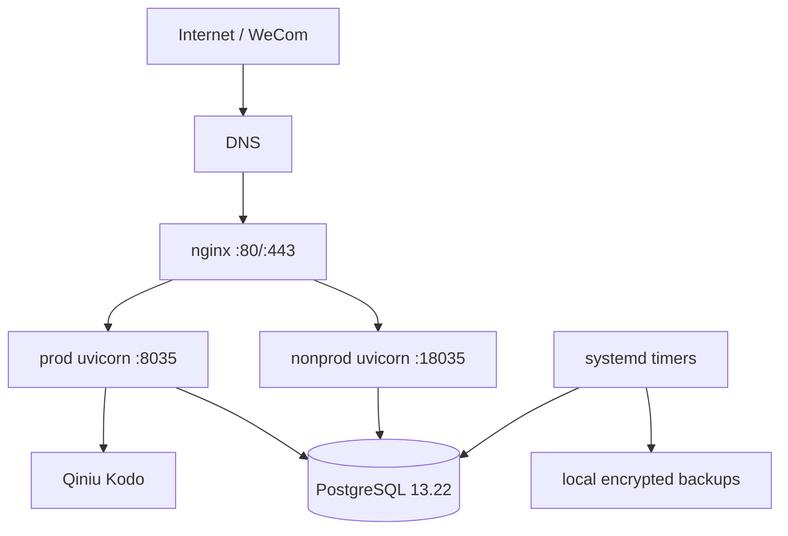

# Server Infrastructure Baseline

> 调查日期：2026-08-28 | 调查人：Ops Agent（只读审计，零写操作）
> 证据标准：每条关键判断标注 Verified / Inferred / Unknown
> 目标服务器：`ali-xy-qw`（47.115.58.45，阿里云 ECS）

## Executive Summary

- 单台阿里云 ECS（2C2G）承载 wecom-archive-365 生产 + 非生产，以及多个同机静态站和中继服务。
- 生产 web：`wecom-archive-365.service`，uvicorn `127.0.0.1:8035`，nginx 暴露 `archive.crowntime.cn`。
- 非生产 web：`wecom-archive-365-nonprod.service`，uvicorn `127.0.0.1:18035`，域名 `staging-archive.crowntime.cn`。
- 生产/非生产在用户、进程、端口、配置、数据库、凭据、存储层隔离，但共享同一主机和 PostgreSQL 实例。
- PostgreSQL 13.22 本地单实例：`wecom_archive`（约 435MB）与 `wecom_archive_nonprod`（约 13MB），均在 Alembic 0072。
- 生产媒体走七牛 Kodo；非生产走本地文件。
- 部署链为 GitHub Actions → SSH → 服务器直接 git checkout → `deploy_server.sh`，无 releases 目录；失败时回退 `last_known_good_sha`。
- 生产运行 commit：`bbb8525`。GitHub main `e5bb34a` 相对它只包含 `tasks/RND-420-*.md` 文档变更，因此生产 runtime 不落后。
- 仓库声明的多组 systemd service/timer/path 未安装到服务器，尤其 external-contact-refresh、billing、payment recovery/reconciliation 等运行单元。
- `external_contact_refresh_tasks` 存在 99 条 pending，增量消费者未安装；每日全量 reconcile 可部分兜底。
- billing/payment 相关 timer 未安装，需要确认 intended state 与真实业务影响。
- 每日 03:17 有加密本地备份，7 天保留；2026-07-27 做过一次恢复演练。备份与生产位于同一主机，无异地副本。
- 资源监控每 15 分钟执行，但 `ALERT_WEBHOOK_URL` 未配置；无外部 uptime monitor。
- journald 中存在大量完整 `access_token` URL 记录，需要作为 secret-safe logging 问题处理。
- 当前资源无明显压力；结构性瓶颈是 2C2G 同机承载 PostgreSQL + prod/nonprod 双实例及其他工作负载。

## Architecture

## Host

| Item | Value |
|---|---|
| OS | Alibaba Cloud Linux 3 |
| Kernel | 5.10.134-16.1.al8.x86_64 |
| Arch | x86_64 |
| CPU | 2 vCPU |
| RAM | 1.8 GiB |
| Swap | 4 GiB |
| Timezone | Asia/Shanghai |
| Cloud | Alibaba Cloud ECS |
| Public IP | 47.115.58.45 |

## Storage

- Root disk: 40G, ~36% used at audit time.
- Production code: `/srv/apps/wecom-archive-365/current`.
- Production runtime config: `current/backend/.env` (gitignored, but physically inside checkout).
- Persistent data: `/srv/apps/wecom-archive-365/shared/` including media, backups, keys, certs, deploy state.
- Non-production: `/srv/apps/wecom-archive-365-nonprod`.
- Backups occupy ~1.4G and are the largest predictable growth source.

## Runtime Components

| Component | Runtime | Port / Trigger | State |
|---|---|---|---|
| Production web | systemd + uvicorn | 127.0.0.1:8035 | active |
| Non-production web | systemd + uvicorn | 127.0.0.1:18035 | active |
| PostgreSQL | systemd | 127.0.0.1:5432 | active |
| nginx | systemd | 0.0.0.0:80/443 | active |
| Archive worker | systemd timer | every 5 min | active |
| Media download | systemd timer | every 5 min | active |
| Export jobs | systemd timer | every 5 min | active |
| External contact reconcile | systemd timer | daily 04:15 | active |
| Backup | systemd timer | daily 03:17 | active |
| Resource check | systemd timer | every 15 min | active |
| AI KB jobs | systemd timers | scheduled | active |

No Docker or Kubernetes is installed for this project.

## systemd Ground Truth

Important distinction:

1. unit file exists in repository under `deploy/systemd/`;
2. unit is included in deployment management / allowlist (`MANAGED_UNITS`);
3. unit is actually installed/enabled/active on server.

These three sets are not currently identical.

Observed missing server units include:

- `wecom-ai-public-retention-sweep.service/.timer`
- `wecom-archive-media-event.service/.path`
- `wecom-archive-reachability-check.service/.timer` (partially superseded by worker logic)
- `wecom-billing-lifecycle.service/.timer`
- `wecom-billing-notifications.service/.timer`
- `wecom-payment-recovery.service/.timer`
- `wecom-payment-reconciliation.service/.timer`
- `wecom-message-purge.service/.timer`
- `wecom-message-cleanup.service/.timer`
- `wecom-external-contact-refresh.service/.timer/.path`

Observed server-side drift:

- media-download service is older than repository version and lacks newer retry/trigger-source arguments.
- export-jobs has a server-only drop-in forcing local media storage.

## Deployment Architecture

- `/srv/apps/wecom-archive-365/current` is a direct git checkout, not a release symlink.
- Production deploy runs from GitHub Actions on `main` pushes (subject to path filters), connects by SSH, checks clean-tree state, fetches and checks out the expected SHA, then runs `scripts/deploy_server.sh`.
- Deployment performs dependency install, migration, restart, internal/public health gates and rollback to `shared/deploy_state/last_known_good_sha` on failure.
- Non-production deploy is a separate manually dispatched workflow guarded by GitHub Environment `non-production`.
- Production runtime secrets live server-side in `backend/.env`; non-production runtime secrets live in `/etc/wecom-archive-365/nonprod.env`.

## Production vs Non-production

| Layer | Production | Non-production | Isolated? |
|---|---|---|---|
| Domain | archive.crowntime.cn | staging-archive.crowntime.cn | yes |
| Process | wecom-archive-365.service | wecom-archive-365-nonprod.service | yes |
| Port | 8035 | 18035 | yes |
| OS user | wecomarchive | wecomarchive-nonprod | yes |
| Runtime config | backend/.env | /etc/wecom-archive-365/nonprod.env | yes |
| Database | wecom_archive | wecom_archive_nonprod | yes, same PG instance |
| Media storage | Qiniu Kodo | local | yes |
| WeCom credentials | production | independent test suite | yes |
| Payment | enabled/configured | disabled | yes |
| Host | same ECS | same ECS | **no** |

Conclusion: staging is a real second application instance with strong logical/data/credential isolation, but not an independent failure domain.

## Network / Nginx / TLS

- Public exposure: SSH 22, nginx 80/443. App ports and PostgreSQL bind only to localhost.
- `archive.crowntime.cn` → production :8035.
- `staging-archive.crowntime.cn` → non-production :18035.
- `qwhhcd.crowntime.cn` has nginx config pointing to production but no DNS record at audit time.
- Wildcard `*.crowntime.cn` Let's Encrypt certificate expires 2026-10-19 and is renewed via acme.sh/systemd scheduling.
- Server-side firewalld is not active; effective public filtering depends on Alibaba Cloud security groups, which were not verifiable from the host-only audit.

## Database

- PostgreSQL 13.22, localhost-only.
- Production DB: `wecom_archive`, app role `wecomarchive_app`.
- Non-production DB: `wecom_archive_nonprod`, app role `wecomarchive_nonprod_app`.
- Both are at migration revision 0072.
- Databases and roles are separate; PostgreSQL instance and physical host are shared.

## Media Storage

- Production provider: Qiniu Kodo, bucket `365-wecom-media`, region z2, domain `media-origin.crowntime.cn`.
- Non-production provider: local filesystem.
- Production and non-production storage are not shared.

## Configuration Sources

| Category | Source |
|---|---|
| Production runtime | `/srv/apps/wecom-archive-365/current/backend/.env` |
| Non-production runtime | `/etc/wecom-archive-365/nonprod.env` |
| Backup encryption config | `shared/backup.env` |
| TLS renewal config | `/etc/qiniu-ssl-renew/...env` |
| Deployment SSH credentials | GitHub Actions secrets |

## Logs / Security Observation

- Application/worker logs use journald; nginx and PostgreSQL use their own log paths/rotation.
- At audit time journald held ~538MB with a configured ~500MB/14-day policy.
- A material security finding: external-contact reconcile/httpx INFO logs include complete URLs containing `access_token`; roughly 11k occurrences were observed in 24h. Future remediation should prevent token-bearing URLs from entering normal logs and consider retention of existing sensitive logs.

## Backup / Recovery

- Daily 03:17 PostgreSQL custom-format dump + local media tar.
- AES256/GPG encryption.
- 7-day local retention.
- Latest observed backup on 2026-08-28 succeeded.
- A restore drill passed on 2026-07-27.
- No off-host/offsite copy exists, so host/disk loss can remove both production and its only backup set.

## Monitoring

- `/health` and `/health/ready` exist.
- Deployment performs health checks.
- Resource checks run every 15 minutes.
- `ALERT_WEBHOOK_URL` is not configured, so alerts only reach journal.
- No independent external uptime monitor is configured.

Operational implication: a production outage may only become visible when a user reports it.

## Resource Usage

At audit time:

- load ~0.23/0.16/0.11;
- ~1.0 GiB memory available;
- ~83 MiB swap used of 4 GiB;
- root disk ~36% used.

No immediate resource saturation was observed. The structural constraint is a single 2C2G host running PostgreSQL, two uvicorn instances and several additional workloads.

## Primary Failure Domains

- ECS host loss: production, non-production, PostgreSQL, local backups and co-hosted sites all fail.
- PostgreSQL loss: both prod/nonprod unavailable.
- nginx loss: all HTTP(S) sites unavailable.
- Monitoring/alerting loss is already present: system checks exist but no outbound alert destination.
- Missing billing/payment scheduled workloads can create correctness gaps even while web health remains green.

## Key Drift / Risks

### High priority

1. Repository-declared scheduled workloads are not consistently installed/managed on production.
2. External-contact incremental refresh has pending work but no installed consumer path/timer; daily full reconcile partially compensates.
3. Billing/payment lifecycle/recovery/reconciliation units are not installed; intended production behavior must be confirmed against the payment architecture and real orders.
4. `access_token` appears in routine logs.
5. Production has no actionable external alert path.
6. Backups are co-located with the production failure domain.

### Medium priority

- Production/non-production share the same physical host despite prior documentation indicating otherwise; current logical isolation is strong, but blast radius is shared.
- Production `.env` is physically located inside the git checkout.
- Several server-side systemd overrides/version differences are not represented canonically in the repository.
- Restore testing has only been observed once.

## Unknowns

- Alibaba Cloud security-group rule details.
- Whether each missing billing/payment unit is intentionally disabled or omitted during deployment.
- Exact business impact of the 99 pending external-contact refresh tasks.
- Intended lifecycle of `qwhhcd.crowntime.cn`.
- Current GitHub Environment reviewer configuration details.
- Ownership/deployment details of unrelated co-hosted static sites.

## Ground Truth Summary

| Question | Answer | Confidence |
|---|---|---|
| Production location | Alibaba Cloud ECS 47.115.58.45, `/srv/apps/wecom-archive-365`, archive.crowntime.cn | Verified |
| Non-production location | Same ECS, separate app tree/service, staging-archive.crowntime.cn | Verified |
| Two application instances? | Yes | Verified |
| Shared database? | Separate DBs/roles; shared PostgreSQL instance | Verified |
| Shared media storage? | No | Verified |
| Production commit | `bbb8525` | Verified |
| Main newer runtime code? | No; `e5bb34a` delta is docs/tasks only | Verified by GitHub compare |
| App startup | systemd | Verified |
| Background jobs | systemd timers/paths; declared and installed sets differ | Verified |
| Deployment | GitHub Actions → SSH → git checkout → deploy script | Verified |
| Runtime secrets | prod backend/.env; nonprod /etc env file | Verified |
| Backup exists | Yes, daily encrypted local backup | Verified |
| Restore verified | Yes, once on 2026-07-27 | Verified |
| Major structural risk | single-host failure domain + off-host backup absent | Verified |
| Major runtime risk | scheduled workload drift, especially billing/payment and external-contact refresh | Verified |

## Audit Constraint

The source audit was strict read-only. No files, services, deployments, migrations or infrastructure settings were modified during evidence collection.
